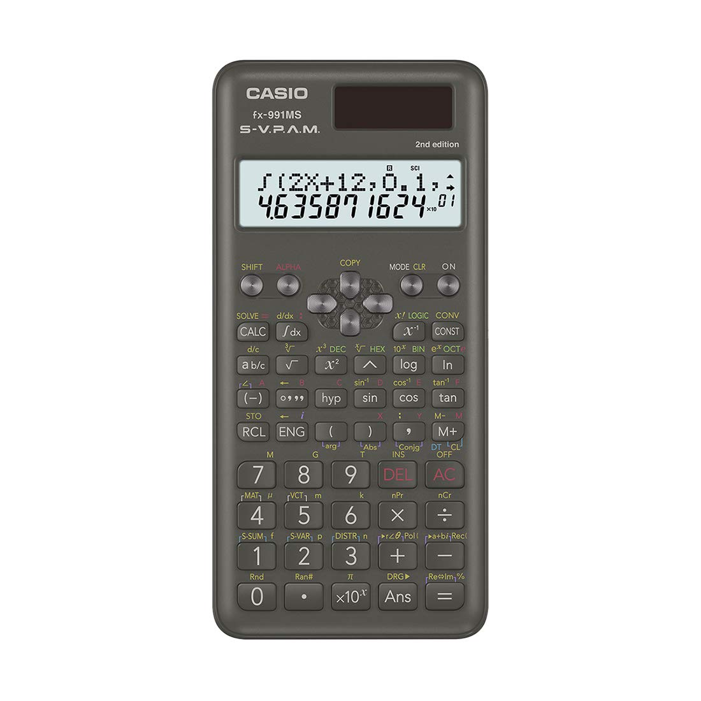
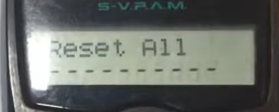
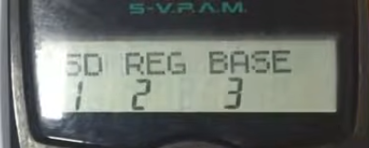
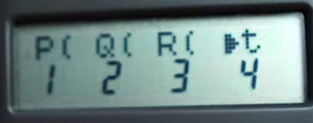

# [CASIO fx-991 MS Scientific Calculator (Non-Programmable)](https://www.amazon.in/Casio-Non-Programmable-Scientific-Calculator-Functions/dp/B07TTGZWS1) (Advanced How-to)

### Basic Keys

Key(s)           | Function
---------------- | ----------
ON               | Turn on
OFF (Shift + AC) | Turn off

### Clear Memory

* Press *Shift + MODE* to clear - now it shows this screen, asking what to clear in memory:

* Modes shown are 1. Scl 2. Mode  3. All . Press *3*.

* Above 2 reset all screens appear (in order). Press *=* twice to complete reset. 
  Now start screen of calculator shows again (just shows a *0*):

### Choose Mode

Press *ON* (or *AC*), [Clear Memory](#clear-memory), then:

* Pressing *MODE* key first time shows these options (press 1/2): 1. COMP 2. COMPLX

* Pressing *MODE* key second time shows these options (press 1/2/3): 1. SD 2. REG 3. BASE

### Enter Multiple Numbers

* Type 1st number, say 65, then press `M+` -- this shows `n=1` to indicate 1 number entered so far.
* Repeat for all numbers.

## Calculate p-value from Z Score

Source: [Video Tutorial](https://www.youtube.com/watch?v=uqx2dgosuN0)

* [Choose Mode](#choose-mode): choose *SD* by pressing *MODE MODE 1*.
* Press *DISTR* (Shift + 3) which shows below screen:

* Options are: 1. `P(` 2. `Q(` 3. `R(` 4. `t`. Select 1 for `P(`.
* Enter Z Score (eg. 1.305) and press *=*. 
  This gives **left-tailed Z p-value** $P(z \le 1.305)$ in Standard Normal Distribution.

## Mean, Population Standard Deviation, Sample Standard Deviation

(difference between population, sample is denominator: N for population, N-1 for sample)

Example Data: 65, 55, 54

* [Choose Mode](#choose-mode): choose *STD* by pressing *MODE MODE 1*.
* [Enter Multiple Numbers](#enter-multiple-numbers): press *Shift+2* at end to see menu: 1 for mean, 2 for population std, 3 for sample std
* Enter 1 / 2 / 3 to find which one you want, and then press *=*.
* Now to go back and find next value (eg. first found mean, now standard deviation), press *Shift+2* to bring back menu, and repeat above step.

## Linear Regression: slope, intercept, correlation coefficient

Source: [Video Tutorial](https://www.youtube.com/watch?v=Hb4mk_WPPeE)

x  | y
-- | ---
20 | 250
25 | 300
30 | 340
35 | 370

Do Linear Regression for this example data:

* [Choose Mode](#choose-mode): choose *REG* by pressing *MODE MODE 2*.
* [Enter Multiple Numbers](#enter-multiple-numbers)

TODO: Remaining Steps, write from video tutorial above.