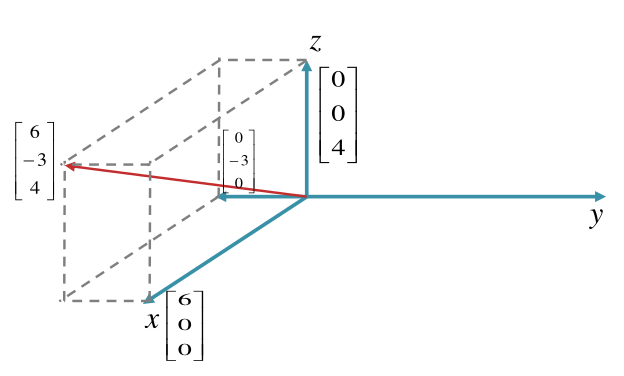

# Linear Algebra

**Faculty**: Prof Ramakrishna Pasumarthy &lt; ramkrishna@study.iitm.ac.in &gt; (his email is copied from first slide of 0th Intro lecture PDF)

Common unofficial P2P Colab Notebook shared by Samuel (classmate): Linear Algebra: https://colab.research.google.com/drive/1Ka_REmcYf0RYliDglSsrnbkWQXHkfU74#scrollTo=V5HgLa5q9Crh

Each heading here is a title of a lecture PDF. Under that are my notes on it.

<strong>Mid Sem:</strong>

## THEORY DONE, GIVEN EXERCISES TODO: Introduction: Linear Algebra for Data Science

- Solution types: Consistent (unique, infinite), Inconsistent (no solution)
- Elimination (High school method)
- Graphical Method (plot 2 equation lines, point where they meet is solution)
- **Geometry of Linear Equations**: 3 ways of viewing System of Linear Equations:
    - Matrix Form $A \mathbf{x} = \mathbf{b}$
        where $A$ is coefficient matrix, $\mathbf{x}$ is vector of unknown variables, $\mathbf{b}$ is vector of RHS values.
    - Row Picture - viewing one equation at a time. Each equation is a line (2D) / plane (3D) / hyperplane (n-D). 2 3D equations/planes meet at a 2D line/equation. In graph common inyeresection is equation solution point(s) if any.
    - Column Picture - view as one vector equation in terms of column vectors of $A$:
If $A = \mathbf{a}_1 \ \mathbf{a}_2 \ \dots \ \mathbf{a}_n$ and x vector has x1, x2 .. xn scalars then:

$$
A x = b \quad \text{translates to} \quad x_1 \mathbf{a}_1 + x_2 \mathbf{a}_2 + \dots + x_n \mathbf{a}_n = \mathbf{b}.

$$

- *Order of Matrix* is $m \times n$ (rows, columns) - $m$ equations, $n$ unknowns (rectangular matrix). Becomes square matrix if $m = n$.
- *Singular* coefficient matrix is not invertible, so either no (all dont interesect at any common line, though 2 of them might - eg. triangle 3 arms dont interesct at single common point) or infinite solutions (all interesect at common points), depending on RHS $\mathbf{b}$.

**Plot columns view**: we can write eq as: $x_1 \mathbf{a_1} + x_2 \mathbf{a_2} + \cdots + x_n \mathbf{a_n} = \mathbf{b}$ ie. b is vector addition of scaled columns of A.
 ie b is written using column vectors of A as basis vectors.

So plot the n column vectors (basis) and how they add up to produce $\mathbf{b}$ as in image below:

**Rank-Nullity Theorem / Dimension Theorem**: Rank (size of range $R(T)$) + Nullity (size of null space $N(T)$) = Columns $n$ (no. of variables)

## THEORY DONE, GIVEN EXERCISES TODO: Linear Algebra 1: Vector Space, Norms, Metric Spaces

**4 Fundamental Matrix Subspaces** are column space, row space, null space, left null space.

### Vector Space

Vector Space $(V, \mathbb{F})$ is a set of vectors $V$, and a field of scalar $\mathbb{F}$, having these binary operations:
- closed under vector addition, ie $\mathbf{x} + \mathbf{y}$ also in same vector space.
- closed under scalar multiplication, ie $c \mathbf{x}$ also in same vector space.

Additionally it must satisfy these 8 properties:
- exists unique zero vector such that $\mathbf{x} + 0 = \mathbf{x}$
- Commutative: $\mathbf{x} + \mathbf{y} = \mathbf{y} + \mathbf{x}$
- Associative: $(\mathbf{x} + \mathbf{y}) + \mathbf{z} = \mathbf{x} + (\mathbf{y} + \mathbf{z})$
- Negative vector: exists unique so that $\mathbf{x} + (\mathbf{-x}) = 0$
- Identity with scalar mutliply: $1 \mathbf{x} = \mathbf{x}$
- Associativity with 2 scalars: $(c_1 c_2) \mathbf{x} = c_1 (c_2 \mathbf{x})$
- Distributivity with scalar factor: $c (\mathbf{x} + \mathbf{y}) = c \mathbf{x} + c \mathbf{y}$
- Distributivity with vector factor: $(c_1 + c_2) \mathbf{x} = c_1 \mathbf{x} + c_2 \mathbf{x}$

Examples of both: vector spaces, and not vector spaces, in below image:

**Inner Product Vector Space** is a vector space in which inner product exists $\mathbf{x} \cdot \mathbf{y} = c$

**Normed Vector Space** is an Inner Product Vector space in which a norm exists. **Norm** function converts any vector in vector space to a positive scalar length.
*p-Norm Vector Space* is a normed vector space in which p-norm $\| \mathbf{x} \|_p = p(\mathbf{x})$ exists.

### Vector Norm

Vector Norm is basically magnitude of a vector. Properties:
- non-zero vector -> non-zero positive scalar norm: $\| \mathbf{x} \| \gt 0$
- zero vector -> zero norm $\| \mathbf{x} \| = 0$ iff $\mathbf{x} = 0$
- scalar multiply: $\| c \mathbf{x} \| = c \| \mathbf{x} \|$
- triangular inequality: $\| \mathbf{x} \| + \| \mathbf{y} \| \le \| \mathbf{x} + \mathbf{y} \|$

Important Norms:
- 0-norm: count of vector dimensions
- 1-norm: sum of vector components
- 2-norm (Euclidean): $\sqrt{\| \mathbf{x}^2 + \mathbf{y}^2 \|}$
- general $p$-norm: $\| \mathbf{x}^p + \mathbf{y}^p \| ^ {1/p}$
- Infinity $\inf$-norm is maximum axis value of $\mathbf{x}$

#### Equivalence of Norms 

2 norms $\| . \|_a$ and $\| . \|_b$ are equivalent if one norm can be bounded wrt other norm: 

$$\exists \alpha, \beta \in \mathbb{R}^n, \alpha \| \mathbf{x} \|_a \le \| \mathbf{x} |_b \le \beta \| \mathbf{x} \|_a$$

### Metric Spaces

Metric Space $X$ is a set where **distance metric function between 2 vectors** exists: $d: X -> X -> \mathbb{R}^+$.
*Normed vector space is a Metric space, but a Metric space need not be a Normed vector space.*

Properties of metric:
- positive: $d(\mathbf{x}, \mathbf{y}) \ge 0$
- zero distance if equal: $d(\mathbf{x}, \mathbf{y}) = 0$ iff $\mathbf{x} = \mathbf{y}$
- commutative args: $d(\mathbf{x}, \mathbf{y}) = d(\mathbf{y}, \mathbf{x})$
- triangular inequality: $d(\mathbf{x}, \mathbf{z}) \le d(\mathbf{x}, \mathbf{y}) + d(\mathbf{y}, \mathbf{z})$

#### Euclidean Space
- *Euclidean Norm* is 2-norm
- *Euclidean distance* $d(\mathbf{x}, \mathbf{y}) = \| \mathbf{x} - \mathbf{y} \|$ using any vector norm $\| . \|$.
- Euclidean Space uses Euclidean distance.

## THEORY DONE, GIVEN EXERCISES TODO: Linear Algebra 2: Span, Basis, Vector Subspace

*Linear Independence of Vectors*: In vector space $(v, \mathbb{F})$, non-zero vectors $\mathbf{v_1}, \mathbf{v_2} \cdots \mathbf{v_n} \in V$ are dependent iff
exist scalars $k_1, k_2 \cdots k_n$ (at least one non-zero) such that:

$$k_1 \mathbf{v_1} + k_2 \mathbf{v_2} + \cdots + k_n \mathbf{v_n} = 0$$

Otherwise (if this is only possible if all scalars are 0) vectors are linearly independent.

**Orthogonal vectors are independent, but independent vectors need not be orthogonal.**
That is (example of independent vectors):
- 2D plane: 2 vectors are independent iff they DON'T lie along same line/direction.
- 3D space: 3 vectors are independent iff 3rd vector does NOT lie on plane formed by first 2 vectors.
- nD space: independent iff each new vector adds a new dimension, does not lie on hyper-plane formed by previous vectors.

### Span and Basis

Let $V$ be vector space, $S$ be its subset. $S$ **spans** $V$ if every vector in $V$ can be written as a linear combination of vectors in $S$.

**Basis** is minimal span with additional condition that all its vectors must be linearly independent.
Any vector in space can be written using basis vectors and *coordinate representation / coordinate vector* $k_1, k_2 \cdots k_n$:

$$k_1 \mathbf{v_1} + k_2 \mathbf{v_2} + \cdots + k_n \mathbf{v_n}$$

NOTE: span and basis vectors DO NOT need to be orthogonal!

**Dimension of vector space** is number of basis vectors.

**Orthonormal basis vectors**: basis vectors that are mutually orthogonal and all of unit length.
Coordinates of vector v wrt orthonormal basis vectors b1,b2 .. bn are found by simply taking dot products with basis: $\mathbf{v} \cdot \mathbf{b_i}$
* but this method of coordinates is NOT TRUE for general basis vectors (NOT orthonormal).

**Span vs Basis**:
Practically this means that unlike span, it can't have any "redundant" vectors.
$\mathbb{R}^n$ has exactly $n$ basis vectors, but span can have any number of vectors $\ge n$.

Example of span vs basis for $\mathbb{R}^2$$:
- ${(1,0), (0,1)}$ (standard unit/orthonormal basis vectors in 2D) - this set is both a span and a basis (linearly independent).
- ${(1,0), (0,1), (3,-5)}$ is still a span but not a basis - due to addition of "extra" vector $(3,-5)$, now set is no longer linearly independent.

**Testing for span and basis**:
- span: row-reduce matrix (where vectors are columns), now if rank = n (dimension of vector space eg. $\mathbb{R}^n$),
        then column space/vectors span $\mathbb{R}^n$. 
        NOTE: span can have more vectors than required, so row-reduced can have all 0 rows as long as non-zero rows number equals n.
- basis: same as span, but linear independent so can't have any 0 rows in row-reduced form.

### Vector Subspace

$(U, \mathbb{F})$ is a subset of linear vector space $(V, \mathbb{F})$ iff subset $U \subseteq V$ satsifies *subspace conditions*:
- contains zero vector: $0 \in U$ (so empty set is never a subspace)
- closed under vector addition: $\mathbf{x} + \mathbf{y} \in U$
- closed under multiplication with scalar: $c \mathbf{x} \in U$

## THEORY DONE, GIVEN EXERCISES TODO: Linear Algebra 3: Linear Transforms, Rank, Nullity

### Linear Transformation / Map

Transform / Map $f: U -> V$ from **domain / inputs space** $U$ to **co-domain / output space** $V$ is linear if it satisfies conditions:
- **Homogenous** (multiplication with scalar): $f(c \mathbf{x}) = c f(\mathbf{x})$ (so can be linear combination of coordinates only, no constant otherwise this would fail)
- **Additive**: $f(\mathbf{x}) + f(\mathbf{y}) = f(\mathbf{x} + \mathbf{y})$ (so can't have any multiplication or powers of coords, else this would fail)
- **Superposition**: $f(c_1 \mathbf{x_1} + c_2 \mathbf{x_2} + \cdots + c_n \mathbf{x_n}) = c_1 f(\mathbf{x_1}) + c_2 f(\mathbf{x_2}) + \cdots + c_n f(\mathbf{x_n})$
    - i.e., f(polynomial(vectors)) = polynomial(f(vectors))
    - basically it's fancy Distributive property only, once you consider that f(vec x) = A x (ie multiply by transform matrix A)

(Lecture states this "superposition" seperately but I don't see why it's needed since IMO implied by first 2 conditions of Homogenous and Additive).

Examples of Linear Transforms are:
- Identity transform: $f(\mathbf{x}) = \mathbf{x}$
- Zero transform: $f(\mathbf{x}) = 0$
- Multiplication with scalar $c$: $f(\mathbf{x}) = c \mathbf{x}$
- Inner Product with vector $\mathbf{v}$: $f(\mathbf{x}) = \mathbf{x} \cdot \mathbf{v}$

**Image / Range** is set of output vectors on applying transformation on input vectors in domain: $Im(f) = \{ y | y = f(\mathbf{x}), x \in U, y \in V \}$

Depending on the transformation, actual range/image may be subset (not all) of declared co-domain.

**Kernel / Null Space** is set of all non-trivial vectors for which $f(\mathbf{x}) = 0$.
It is either:
- a set with single zero vector $\{0\}$ (zero is always in null space) iff **transform matrix** $A$ has indepenent column vectors, OR
- infinite set of vectors if $T$ has dependent column vectors.

System of linear equations $A \mathbf{x} = \mathbf{b}$ has:
- *unique solution* if $b \in Im(f)$ and kernel only has zero $Ker(f) = \{0\}$
- *infinite solution* if $b \in Im(f)$ and kernel is non-trivial (so it's infinite)
- *no solution* if $b \notin Im(f)$

**Linear Space of Transforms**: $\mathcal{L}(U,V)$ set of all $U -> V$ linear transforms is itself a linear space as it satisfies space properties:
- zero transform is zero element
- closure under addition
- closure under scalar multiplication

### Matrices as Linear Maps

basically linear transformations are impl using **Transformation Matrix** multiplicaiton: $A \mathbf{x}$

TODO: exercise: coordinates wrt basis vectors.
      for simple case (vector wrt transform's unit input orthonormal basis vectors, answer is dot products of vec with basis vecs).
      for anything more complicated (eg. non-ortho basis, coords wrt output and/or basis) multiply with change of basis matrix $C^{-1} B \mathbf{x}$.

## THEORY ALMOST DONE (2 minor decompose SKIPPED), GIVEN EXERCISES TODO: Eigen Values and Eigen Vectors, Symmetric Matrix, SVD Matrix Decomposition, [TODO Spectral Theorem for symmetric matrix decomposition]

- $A \mathbf{x} = \lambda \mathbf{x}$ => **Characterstic Polynomial** $(A - \lambda I) \mathbf{x}$, equate to 0 gives **Characterstic Equation**.
- $\lambda = 0$ eigen value is allowed => $A$ is square matrix, $A \mathbf{x} = 0$ so eigen vectors are null space of $A$.
- Product of eigen values of $AB$ = Product of all eigen values of $A$, $B$.
- Identity Matrix has eigen value 1, all vectors are its eigen vectors.
- Sum of Eigen Values = *Trace* = Sum of main diagonal elements, Product of Eigen Values = Determinant

### Symmetric Matrix

real square matrix where $A = A^T$ . Properties:
- need not be invertible (eg. 0 is symmetric matrix)
- has real eigen values
- eigen vectors of distinct eigen values are orthogonal to each other
- is *orthogonally diagonalizable*, i.e., can be factored into $A = Q D Q^T$ (orthogonal) (diagonal) (orthogonal) (**spectral theorem**) --- SKIP (NOTE: in lecture instead of D some weird symbol was there maybe greek?)

### Matrix Decomposition using Eigen (multiple techniques)

1. **Singular Value Decomposition (SVD)** of input matrix $A (m \times n)$: $A = U \Sigma V^T$ = (orthogonal) (diagonal) (orthogonal)
    - $U (m \times m)$ has columns as eigen vectors of $A A^T$ (**left singular vectors**)
    - $V (n \times n)$ has columns as eigen vectors of $A^T A$ (**right singular vectors**)
    - $\Sigma (m \times n)$ is diagonal matrix - $\sigma_i = sqrt{eigenvalues(A^T A)}$ (**singular values**) in diagonal upto rank $r$ of $A$ - rest of the matrix is 0.
        - **Non-singular singular values** (confusing name!) = non-zero diagonal values $\sigma_i$ - *correspond to dimensions where $A$ preserves information*.
        - Rest **Singular singular values** (zero entries on diagonal) correspond to dimensions where $A$ collapses axes (ie doesn't preserve their info in output)
    
    TODO - SKIP FOR NOW:
    - [SVD Tutorial Jupyter Notebook](tutorial-questions/Tutorial%204.2%20-%20Linear%20Algebra%20SVD.ipynb), 
    - understand SVD physical meaning (rotate,compress,etc.): https://gregorygundersen.com/blog/2018/12/10/svd/

2. 2 more Decomposisitions shown besides SVD --- SKIP FOR NOW (i think SVD was most important case which I have covered already)

## THEORY ALMOST DONE, GIVEN EXERCISES TODO: Linear Systems Theory: Diagonalize (aka PDP Decompose), [WIP Block Matrix, Jordan Normal/Cannonical Matrix]

Diagonal Matrix (non-zero only in main diagonal, elsewhere 0) Properties:
- Its rank is no. of non-zero elems in diagonal
- Its eigen values are non-zero elems in diagonal
- If A,B are diagonal, AB also diagonal and commutative $AB = BA$
- $A^n$ is also diagonal with entries $a_{ii}^n$ - this includes inverse $A^{-1}$ which has diagonal entries inversed $1 / a_{ii}$.

Square matrix $A$ is **diagonalizable**  if there exists a diagonal matrix $B$ that $A$ is similar to.

How to check if $A (n \times n)$ is Diagonalizable, i.e., $A = P D P^{-1}$ (so also called **PDP Decompose**):
- Find eigen values $\lambda_1$, $\lambda_2$... and eigen vectors.
- *If no. of independent eigen vector (irrespective of constant multiply) = n, then Diagonalizable else not*. 
    - NOTE: check no. of eigen vectors only not values (that can be less)
    - eigen value 0 is ok
- If diagonalizable, then D = diag([$\lambda_1$, $\lambda_2$ ...]). NOTE: if an eigen value has say 2 eigen vectors, then write the eigen value 2 times.
- IMPORTANT: order of eigen values in D must correspond to order of their respective 

Defective Matrix, Generalized Eigen Vector:
- **Algebraic Multiplicity** = no. of eigen values (equals matrix rank). NOTE: better is, highest power in eigen characterstic polynomial (because eigen vals can repeat as single can have multiple corresponding eigen vectors).
- **Geometric Multiplicity** = no. of unique independent eigen vectors (accounting for multiplicity - ie not just multiplied by common factor) (which are basis of **eigenspace**)
- Defective Matrix has algebraic multiplicity less than geometric multiplicity - i.e., n x n matrix has less than n independent eigen vectors.
- so problem: how to get basis for R^n having eigen vectors of A?? solution: use **generalized eigen vectors**.

**Generalized Eigen Vectors** solve equation: $(A - \lambda I)^p \mathbf{x} = 0$ where power upto algebraic multiplicity:
    - $p \in [1, k_\lambda]$ , $k_\lambda$ is the algebraic multiplicity.
HOW TO SOLVE:
- start with normal eigen vectors (ie. p=1) - say one of them is $\mathbf{v_1}$.
- now calc for p=2 using: $\mathbf{v_2} = (A - \lambda I) \mathbf{v_1}$
- now do it for p=3 using $\mathbf{v_2}$ -- keep going till $k_\lambda$ until solution found, ie, number of independent eigen vectors exactly n.

**Block Matrix** is matrix of smaller submatrices called blocks. Blocks along diagonal are called diagonal blocks. Block matrix multiply similar to normal, just elems are submatrices.

TODO: Block Matrix properties, Jordan Block properties

Blocks can be of any shape as long as consistent with overall matrix shape. Blocks can be rectangular, but Jordan Blocks are always square.

**Jordan Cannonical Form Matrix** is diagonal block matrix - has Jordan Block submatrices on diagonal, 0 elsewhere. 
Jordan Blocks all are of form (based on an eigenvalue $\lambda$): 

\lambda 1       0
0       \lambda 1
0       0       \lambda

ie Jordan blocks have main diagonal equals all \lambda , next diagonal (towards up and right) has all 1, rest all 0. 

There are as many Jordan blocks as power of characterstic polynomial (i.e. each block has its own eigen value \lambda, eigen value repeats if it  has multiple eigen vectors).

*Normal diagonal matrices are special case of Jordan Matrix with all block sizes 1*.

How to find Jordan matrix (only simplest case, rest TODO):
- find all eigen values
- mk diag([lambda 1, lambda 2 ..]) - this is a diagonal matrix, it's Jordan normal form with block size 1

## THEORY DONE, GIVEN EXERCISES TODO: Linear Algebra 5: Change of Basis / Coordinate Matrix, Similar Matrix Decomposistion

From basis $B$ to $C$ (both are matrices with column vectors being required basis vectors):
- $B \mathbf{x^B} = C \mathbf{x^C}$ => $\mathbf{x^C} = \mathbf{C^{-1}} B \mathbf{x}$ - here $P = C^{-1} B$ is the **change of basis or coordinates matrix**

**Similar Matrices and Similarity**: A, B are similar matrices if exists a non-singular matrix P such that $A = P B P^{-1}$

**2 matrices are considered similar** if they represent same linear transform in a different base, 
ie. we can decompose $A = P B P^{-1}$, where $P$ is the **change of basis matrix**. Same P is called **modal matrix** when checking matrix similarity.

A matrix is similar to itself with P = I>

To check if A, B are similar matrices:
- method 1: solve equation $A P = P B$ (vals of $P$ are unknowns). A,B,P are $n \times n$, so $n^2 \times n^2$ equations, variables.
  Found $P$ should have $det(P) \neq 0$.
  **Can get complicated very fast due to $n^2$ variables!**
- method 2: check if **Jordan Cannonical form (upto Block Order)** is equal - then similar else not.
 
Other properties that must be equal if similar (necessary but not sufficient conditions) - should be useful in test:
- Trace = sum of diagonal values
- Determinants
- Eigen Values (with multiplicity - ie. one set of r eigens could be scaled up by same factor)
- Eigen Values Characterstic Polyynomial

## THEORY ALMOST DONEVEN EXERCISES TODO: Tutorial 5: Least Squares linear regression, Orthogonality, Grahm-Schmidt (pseudo-inverse?)

TODO: Also I think Professor covered Projection in lecture but it wasn't in TA session?

(I guess A^-1 exist but still A^-1 b undefined as b not in Im(A) ? TODO)

LEAST SQUARES
The best approximate solution is called the least squares solution to the inconsistent system of equations.

least square solution has |Ax_pred - b| <= |Ax_actual - b| (this is a strong claim!) ie Sum of Squared Errors (SSE) [ sum((ypred - yactual)^2) ] is minimized

[So NOT APPLiCable on depdendent A ? - TODO]
Ax = b is inconsistent (NOTE: A itself has independent columns, inconsistency due to b), but:
A^T Ax = A^T b has consistent solution, gives xpred ! (quite strange, why?! TODO)
SO xpred = (A^T A)^-1 A^T b -- GENERAL REGRESSION! (eg. multi-variable linear, quadratic etc. !)

NOTE: both linear, quadratic case, Ax = b has diff "x" than inputs! inputs go in A, slope,intercept,coeffs in x ! confusing

general linear: y = m0 (c) + m1 x1 + m2 x2 + ... 
solve for coeffs in "x" = m0, m1, m2 ....

for 2D specific case: x pred vec = (m,c) [get from solving above!] [TODO: revise 2d specific formulae also, use correlation coefficient]

residual = error [TODO: revise 2d specific residual plot]

Quadratic Regression using least squares:  
y = ax2 + bx + c, solve for coeffs in "x": a,b,c
"A" = [[xi^2, xi, xi^0 = 1] for xi in given points x coords]
"b" = given  yi coords

ORTHOGONALITY & ORTHONORMAL BASIS
[this i already know] u . v = 0 -> orthogonal, 
in orthonormal basis all vecs ortho and unit vec

in general change of basis: solve for c vec, Bc = v => c = B^-1 v (v is given vec coords in standard basis, c is new vec coords to be found in new basis, B = [b1,b2...bn] is matrix where each column is basis vector)

orthonormal basis simplifies calculation so always preferred:

since ortho basis matrix (eg. [e1,e2..en]) has B^-1 = B^T,
so c = B^T v  --> much simpler (equiv to dot product of v with every basis vec)

Geometrically, each found coeff/coord ci is length of projection of v along ui

GRAHM-SCHMIDT ORTHO NORMALIZATION PROCESS
convert n INDEPENDENT vecs v1..vn into n ortho normal vecs u1..un :
- u1 = v1
- u2 = v2 - proj(v2) wrt u1 [ u1 . v2 / |u1| |v2| ]
- u3 = v3 - proj(v3) wrt u1 - proj(v3) wrt u2
- ... so on...
- finally normalize (mk unit vecs) u1..un by dividing with magnitude

