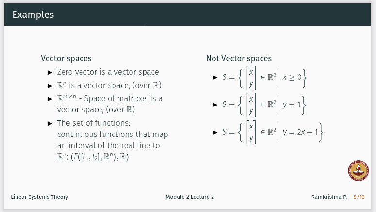

# Linear Algebra

**Faculty**: Prof Ramakrishna Pasumarthy &lt; ramkrishna@study.iitm.ac.in &gt; (his email is copied from first slide of 0th Intro lecture PDF)

Common unofficial P2P Colab Notebook shared by Samuel (classmate): Linear Algebra: https://colab.research.google.com/drive/1Ka_REmcYf0RYliDglSsrnbkWQXHkfU74#scrollTo=V5HgLa5q9Crh

Each heading here is a title of a lecture PDF. Under that are my notes on it.

## THEORY ALMOST DONE, GIVEN EXERCISES TODO: Introduction: Linear Algebra for Data Science

- Solution types: Consistent (unique, infinite), Inconsistent (no solution)
- Elimination (High school method)
- Graphical Method (plot 2 equation lines, point where they meet is solution)
- **Geometry of Linear Equations**: 3 ways of viewing System of Linear Equations:
    - Matrix Form $A \mathbf{x} = \mathbf{b}$
        where $A$ is coefficient matrix, $\mathbf{x}$ is vector of unknown variables, $\mathbf{b}$ is vector of RHS values.
    - Row Picture - viewing one equation at a time. Each equation is a line (2D) / plane (3D) / hyperplane (n-D). 2 3D equations/planes meet at a 2D line/equation. In graph common inyeresection is equation solution point(s) if any.
    - Column Picture - view as one vector equation in terms of column vectors of $A$:
If $A = \mathbf{a}_1 \ \mathbf{a}_2 \ \dots \ \mathbf{a}_n$ and x vector has x1, x2 .. xn scalars then:

$$
A x = b \quad \text{translates to} \quad x_1 \mathbf{a}_1 + x_2 \mathbf{a}_2 + \dots + x_n \mathbf{a}_n = \mathbf{b}.

$$

- *Order of Matrix* is $m \times n$ (rows, columns) - $m$ equations, $n$ unknowns (rectangular matrix). Becomes square matrix if $m = n$.
- *Singular* coefficient matrix is not invertible, so either no (all dont interesect at any common line, though 2 of them might - eg. triangle 3 arms dont interesct at single common point) or infinite solutions (all interesect at common points), depending on RHS $\mathbf{b}$.

**TODO: graphically plot column view** - question came previously in an IIT question paper I think!

## THEORY DONE, GIVEN EXERCISES TODO: Linear Algebra 1: Vector Space Norms

### Vector Space

Vector Space $(V, \mathbb{F})$ is a set of vectors $V$, and a field of scalar $\mathbb{F}$, having these binary operations:
- closed under vector addition, ie $\mathbf{x} + \mathbf{y}$ also in same vector space.
- closed under scalar multiplication, ie $c \mathbf{x}$ also in same vector space.

Additionally it must satisfy these 8 properties:
- exists unique zero vector such that $\mathbf{x} + 0 = \mathbf{x}$
- Commutative: $\mathbf{x} + \mathbf{y} = \mathbf{y} + \mathbf{x}$
- Associative: $(\mathbf{x} + \mathbf{y}) + \mathbf{z} = \mathbf{x} + (\mathbf{y} + \mathbf{z})$
- Negative vector: exists unique so that $\mathbf{x} + (\mathbf{-x}) = 0$
- Identity with scalar mutliply: $1 \mathbf{x} = \mathbf{x}$
- Associativity with 2 scalars: $(c_1 c_2) \mathbf{x} = c_1 (c_2 \mathbf{x})$
- Distributivity with scalar factor: $c (\mathbf{x} + \mathbf{y}) = c \mathbf{x} + c \mathbf{y}$
- Distributivity with vector factor: $(c_1 + c_2) \mathbf{x} = c_1 \mathbf{x} + c_2 \mathbf{x}$

Examples of both: vector spaces, and not vector spaces, in below image:

**Inner Product Vector Space** is a vector space in which inner product exists $\mathbf{x} \cdot \mathbf{y} = c$

**Normed Vector Space** is an Inner Product Vector space in which a norm exists. **Norm** function converts any vector in vector space to a positive scalar length.
*p-Norm Vector Space* is a normed vector space in which p-norm $\| \mathbf{x} \|_p = p(\mathbf{x})$ exists.

### Vector Norm

Vector Norm is basically magnitude of a vector. Properties:
- non-zero vector -> non-zero positive scalar norm: $\| \mathbf{x} \| \gt 0$
- zero vector -> zero norm $\| \mathbf{x} \| = 0$ iff $\mathbf{x} = 0$
- scalar multiply: $\| c \mathbf{x} \| = c \| \mathbf{x} \|$
- triangular inequality: $\| \mathbf{x} \| + \| \mathbf{y} \| \le \| \mathbf{x} + \mathbf{y} \|$

Important Norms:
- 0-norm: count of vector dimensions
- 1-norm: sum of vector components
- 2-norm (Euclidean): $\sqrt{\| \mathbf{x}^2 + \mathbf{y}^2 \|}$
- general $p$-norm: $\| \mathbf{x}^p + \mathbf{y}^p \| ^ {1/p}$
- Infinity $\inf$-norm is maximum axis value of $\mathbf{x}$

#### Equivalence of Norms 

2 norms $\| . \|_a$ and $\| . \|_b$ are equivalent if one norm can be bounded wrt other norm: 

$$\exists \alpha, \beta \in \mathbb{R}^n, \alpha \| \mathbf{x} \|_a \le \| \mathbf{x} |_b \le \beta \| \mathbf{x} \|_a$$

### Metric Spaces

Metric Space $X$ is a set where **distance metric function between 2 vectors** exists: $d: X -> X -> \mathbb{R}^+$.
*Normed vector space is a Metric space, but a Metric space need not be a Normed vector space.*

Properties of metric:
- positive: $d(\mathbf{x}, \mathbf{y}) \ge 0$
- zero distance if equal: $d(\mathbf{x}, \mathbf{y}) = 0$ iff $\mathbf{x} = \mathbf{y}$
- commutative args: $d(\mathbf{x}, \mathbf{y}) = d(\mathbf{y}, \mathbf{x})$
- triangular inequality: $d(\mathbf{x}, \mathbf{z}) \le d(\mathbf{x}, \mathbf{y}) + d(\mathbf{y}, \mathbf{z})$

#### Euclidean Space
- *Euclidean Norm* is 2-norm
- *Euclidean distance* $d(\mathbf{x}, \mathbf{y}) = \| \mathbf{x} - \mathbf{y} \|$ using any vector norm $\| . \|$.
- Euclidean Space uses Euclidean distance.

## THEORY DONE, GIVEN EXERCISES TODO: Linear Algebra 2: Span, Basis, Vector Subspace

*Linear Independence of Vectors*: In vector space $(v, \mathbb{F})$, non-zero vectors $\mathbf{v_1}, \mathbf{v_2} \cdots \mathbf{v_n} \in V$ are dependent iff
exist scalars $k_1, k_2 \cdots k_n$ (at least one non-zero) such that:

$$k_1 \mathbf{v_1} + k_2 \mathbf{v_2} + \cdots + k_n \mathbf{v_n} = 0$$

Otherwise (if this is only possible if all scalars are 0) vectors are linearly independent.

**Orthogonal vectors are independent, but independent vectors need not be orthogonal**, they can be *skewed* instead.
That is (example of independent vectors):
- 2D plane: 2 vectors are independent iff they DON'T lie along same line/direction.
- 3D space: 3 vectors are independent iff 3rd vector does NOT lie on plane formed by first 2 vectors.
- nD space: independent iff each new vector adds a new dimension, does not lie on hyper-plane formed by previous vectors.

**Skewed** means independent but NOT all orthogonal (though it's possible for some pairs of subset of vectors to be orthogonal).

### Span and Basis

Let $V$ be vector space, $S$ be its subset. $S$ **spans** $V$ if every vector in $V$ can be written as a linear combination of vectors in $S$.

**Basis** is minimal span with additional condition that all its vectors must be linearly independent.
Any vector in space can be written using basis vectors and *coordinate representation / coordinate vector* $k_1, k_2 \cdots k_n$:

$$k_1 \mathbf{v_1} + k_2 \mathbf{v_2} + \cdots + k_n \mathbf{v_n}$$

NOTE: span and basis vectors DO NOT need to be orthogonal!

**Dimension of vector space** is number of basis vectors.

**Orthonormal basis vectors**: basis vectors that are mutually orthogonal and all of unit length.
Coordinates of vector v wrt orthonormal basis vectors b1,b2 .. bn are found by simply taking dot products with basis: $\mathbf{v} \cdot \mathbf{b_i}$
* but this method of coordinates is NOT TRUE for general basis vectors (NOT orthonormal).

**Span vs Basis**:
Practically this means that unlike span, it can't have any "redundant" vectors.
$\mathbb{R}^n$ has exactly $n$ basis vectors, but span can have any number of vectors $\ge n$.

Example of span vs basis for $\mathbb{R}^2$$:
- ${(1,0), (0,1)}$ (standard unit/orthonormal basis vectors in 2D) - this set is both a span and a basis (linearly independent).
- ${(1,0), (0,1), (3,-5)}$ is still a span but not a basis - due to addition of "extra" vector $(3,-5)$, now set is no longer linearly independent.

**Testing for span and basis**:
- span: row-reduce matrix (where vectors are columns), now if rank = n (dimension of vector space eg. $\mathbb{R}^n$) 
then column space/vectors span $\mathbb{R}^n$. NOTE: span can have more vectors than required, so row-reduced can have all 0 rows as long as non-zero rows number equals n.
- basis: same as span, but linear independent so can't have any 0 rows in row-reduced form.

### Vector Subspace

$(U, \mathbb{F})$ is a subset of linear vector space $(V, \mathbb{F})$ iff subset $U \subseteq V$ satsifies *subspace conditions*:
- contains zero vector: $0 \in U$ (so empty set is never a subspace)
- closed under vector addition: $\mathbf{x} + \mathbf{y} \in U$
- closed under multiplication with scalar: $c \mathbf{x} \in U$

## IN PROGRESS: Linear Algebra 3: Linear Transforms, Rank, Nullity

### Linear Transformation / Map

Transform / Map $f: U -> V$ from **domain / inputs space** $U$ to **co-domain / output space** $V$ is linear if it satisfies conditions:
- **Homogenous** (multiplication with scalar): $f(c \mathbf{x}) = c f(\mathbf{x})$ (so can be linear combination of coordinates only, no constant otherwise this would fail)
- **Additive**: $f(\mathbf{x}) + f(\mathbf{y}) = f(\mathbf{x} + \mathbf{y})$ (so can't have any multiplication or powers of coords, else this would fail)
- **Superposition**: $f(c_1 \mathbf{x_1} + c_2 \mathbf{x_2} + \cdots + c_n \mathbf{x_n}) = c_1 f(\mathbf{x_1}) + c_2 f(\mathbf{x_2}) + \cdots + c_n f(\mathbf{x_n})$

(Lecture states this "superposition" seperately but I don't see why it's needed since IMO implied by first 2 conditions of Homogenous and Additive).

Examples of Linear Transforms are:
- Identity transform: $f(\mathbf{x}) = \mathbf{x}$
- Zero transform: $f(\mathbf{x}) = 0$
- Multiplication with scalar $c$: $f(\mathbf{x}) = c \mathbf{x}$
- Inner Product with vector $\mathbf{v}$: $f(\mathbf{x}) = \mathbf{x} \cdot \mathbf{v}$

**Image / Range** is set of output vectors on applying transformation on input vectors in domain: $Im(f) = \{ y | y = f(\mathbf{x}), x \in U, y \in V \}$

Depending on the transformation, actual range/image may be subset (not all) of declared co-domain.

**Kernel / Null Space** is set of all non-trivial vectors for which $f(\mathbf{x}) = 0$.
It is either:
- a set with single zero vector $\{0\}$ (zero is always in null space) iff **transform matrix** $A$ has indepenent column vectors, OR
- infinite set of vectors if $T$ has dependent column vectors.

System of linear equations $A \mathbf{x} = \mathbf{b}$ has:
- *unique solution* if $b \in Im(f)$ and kernel only has zero $Ker(f) = \{0\}$
- *infinite solution* if $b \in Im(f)$ and kernel is non-trivial (so it's infinite)
- *no solution* if $b \notin Im(f)$

**Linear Space of Transforms**: $\mathcal{L}(U,V)$ set of all $U -> V$ linear transforms is itself a linear space as it satisfies space properties:
- zero transform is zero element
- closure under addition
- closure under scalar multiplication

### Matrices as Linear Maps

TODO

## TODO: Eigen Values and Eigen Vectors

## TODO: Linear Systems Theory: Eigen, SVD, Diagonalize, Jordan Normal

## TODO: Linear Algebra 5: Change of Basis

## TODO: Linear Algebra Class Notes: written by Professor in freeform using Stylus Pen

