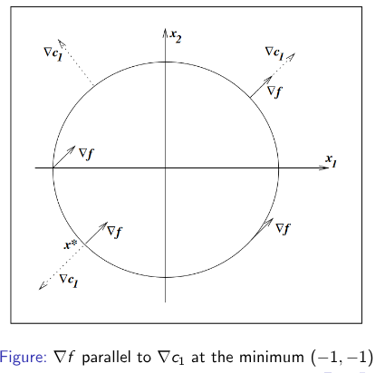
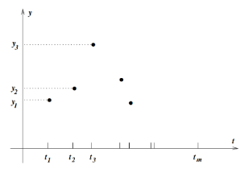
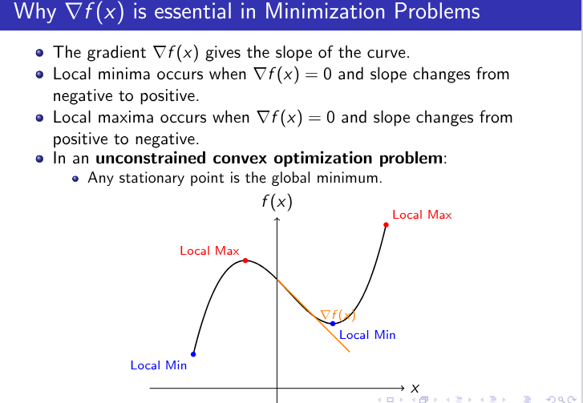

# Optimization

On 13 Nov 2025, Prof Ramkrishna started covering Optimization

TODO: syllabus, notes on topics

topics covered (non-exhaustive): *Unconstrained Optimization*: basic plots (lines on 2d plane, shading), gradients, first & second derivatives, minima/maxima, **Jacobian & Hessian matrices**,
  **Numerical/approx optimization** (when exact methods can't be used): **Gradient Descent**

*Positive definite*, *Positive semi-definite* etc. : a Matrix is > 0 if all its eigenvalues are > 0, Matrix < 0 if all its eigenvalues are < 0 - others (mix) I guess are non-classifiable?

LATER **Stochastic Gradient Descent**, *Constrained Optimization*, Linear Programming (intro to **simplex method**), **Quadratic Optimization**

Exact topics shared in first Optimization lecture (shared by a colleague):

1. General introduction to optimization problems.
2. Arranging a school trip as an example of an optimization problem.
3. Mathematical formulation of the optimization problem.
4. Constraints related to the number of buses and drivers.
5. Graphical techniques for solving optimization problems.
6. Linear programming and its components.
7. Unconstrained optimization problems.
8. First and second order conditions for optimization.
9. Local vs. global minima.
10. Convex functions and their properties.
11. Gradient descent as a method for optimization.
12. Numerical methods for optimization.
13. Discussion on initial guesses and learning rates in optimization algorithms.
14. Overview of constrained optimization and future topics to be covered, including KKT conditions and linear programming with the simplex method.

## WIP 6.1 CONSTRAINED OPTIMIZATION - KKT
* f(x) = func to minimize or maximize
* ci(x) = 0 --- equality constraints
* cj(x) >= 0 -- inequality constraints

### Single Equality problem:

only one equality condition $c(x) = 0$

At minimum $x^*$, $\delta f(x^*) = \lambda \delta c(x^*)$ that is, constraint normal is parallel to gradient of function being optimized.
This can be derived from  first order gradient of **Lagrangian** (unconstrained optimization).

Lagrangian $L(\mathbf{x}, \lambda) = f(x) - \lambda c(x)$ where $\lambda$ is *Lagrangian multiplier*.
First order gradients, one wrt x, one wrt $\lambda$ :

$$
\nabla_x L = \nabla_x f(x) - \lambda \nabla_x c(x) = 0 \\
\nabla_\lambda L = - c(x) = 0
$$

NOTE: Since we have only considered only first order gradient here, this is a **necessary but not sufficient condition**.

TODO: Haven't fully understood below geometry image, re-study

SKIPPED "Proof of First Order Condition"

TODO: REST OF KKT LECTURE SLIDES (Constrained Optimization)

## WIP 6.2 Unconstrained Optimization

**Gradient** $\nabla f(\mathbf{x})$ is vector, val at position i is $\frac{\partial f}{\partial x_i}$.

minimize (wrt $\mathbf{x}$ vector) **objective function** $f(x_1, x_2, ..., x_n)$ without any constraints.

Application: Curve Fitting

minimize (wrt $\mathbf{a}$) **objective function** $\sum (\hat{y_i} - y_i)^2$ (sum of squares of distances)
where:
* $\mathbf{a}$: weights/param vector, $\mathbf{t}$: input vector such that $0 \leq t_i \leq 1$
* $y_i = y(t_i)$ is given actual output
* $\hat{y_i} = \phi(t_i, \mathbf{a})$ is predicted output using weights vector (basically fancy for a polynomial with given coefficients!)

Global Minima has output less than or equal to any other point output $y* \leq y_i$ (ie global minima can occur multiple times),
whereas **Strict Global Minima** has strictly less than $y* < y_i$ (ie global minima once only).
Similarly for Maxima.

Local Minima vs **Strict Local Minima** is same, just within a neighbourhood $N$.

**Taylor's Theorem** --- SKIP TODO

optimal conditions:
* first derivative $\nabla f(\mathbf{x}) = 0$ - *necessary but not sufficient*
* second derivative has positive definite Hessian Matrix $\nabla^2 f(\mathbf{x}) > 0$ - *sufficient but not necessary*
    * here $\nabla^2 f(\mathbf{x})$ is **Hessian Matrix**: position (i,j) has value $\frac{\partial^2 f}{\partial x_i \partial x_j}$
    * **positive definite** matrix means all eigen values must be $> 0$.

**Convex Function** is such that any local minima is automatically a global minima also.
* If func is convex and differentiable, $\nabla f(x) = 0 \iff \text{x is global minimizer}$

### Algos to find minimizers

#### Line Search methods

In each step,
find a line/direction vector $\mathbf{p_k}$;,
then find suitable steps $\alpha$ and move that many steps along line to minimize.

1. **Steepest Descent**: $\mathbf{p_k} = - \nabla f(x_k)$ -- simpler computation (one derivative only), but slow convergence
2. **Newton Direction**: $\mathbf{p_k} = - (\nabla^2 f(x_k))^{-1} \nabla f(x_k)$ (hessian matrix multiply) **IF** $\nabla^2 f(x_k) > 0$
    - 2 derivatives calc (first order, second order) -- derive from second order taylor approximation

**Quasi-Newton Method**: SKIP TODO

**Scaling** means when you multiply say one of the inputs $x_i$ with a constant factor (eg. convert metre to millimetre),
does objective function $f(\mathbf{x})$ change significantly??
Steepest Descent has poor scaling (sensitive), while Newton method is not affected by scaling.

#### SKIP TODO Trust Region methods

SKIP TODO: first order model function (steepest descent with distance), second order etc.

#### WIP Least Squares Optimization

SKIP TODO: something related to J matrix (maybe jacobian) ?

SKIP TODO: **Cholesky factorization**

SKIP TODO: **QR Factorization**

## WIP 6.3 Gradient Descent

minimize f(x). Assuming f is convex and differentiable.

Gradient points in direction of *steepest increase*, so move in opposite direction $- \nabla f(\mathbf{x})$. 
Gradient is 0 at minima.

In **unconstrained convex optimization problem**, any stationary point (ie first derivative 0) is global minimum.

**Gradient Descent Update Rule**: $x_{t+1} = x_t - \eta \nabla f(x_t)$ where $\eta > 0$ is *step size* / *learning rate*.
* *Stopping Criteria*: Close to stationary point (ie gradient is very close to 0) OR change in x vector is too small OR stop after max epochs
    * usually combination of these criteria is used

**TODO IMPORTANT EXAMPLE** Linear Regression using Gradient Descent 
(NOTE: it's used when closed-form direct solution of least squares too expensive, eg. data too large)

SKIP: Gradient Descent for Multivariate Regression

**Stochastic Gradient Descent**: normal Batch Gradient Descent uses entire dataset for every update -> scalability issues when large data or can't fit in RAM
* so approx gradient using just one random data point
* shuffle dataset, loop update rule over samples
* fast => noisy but efficient convergence

## TODO IMPORTANT: Simplex Linear Programming

It's a popular method to solve KKT conditions of Linear Programming. 
Despite bad exponential worst case complexity, it performs well on real problems.

**IMPORTANT**: Simplex tableau example problem: (downloaded) *SimplexExample_external.pdf* from https://math.libretexts.org/Bookshelves/Applied_Mathematics/Applied_Finite_Mathematics_(Sekhon_and_Bloom)/04%3A_Linear_Programming_The_Simplex_Method/4.02%3A_Maximization_By_The_Simplex_Method

## TODO LATER Duality & Geometry: KKT conditions, etc.

## TODO LATER Quadratic Programming

## Tutorial 5 (Mrudula) - Gradient Descent, Newton Method, KKT etc.

### Unconstrained Optimization (Minimization)

[Convex Function test](https://math.stackexchange.com/questions/3325382/how-to-check-if-a-function-is-convex):
For any point $\lambda x + (1 - \lambda) y$ between $x$ and $y$ vectors (where $\lambda \in [0,1]$):

$$f(\lambda x + (1 - \lambda) y) \leq \lambda f(x) + (1 - \lambda) f(y)$$

Simpler, equivalent tests:
* general: forall x,y, $f(\frac{x+y}{2}) \leq \frac{f(x) + f(y)}{2}$
* if f is twice differentiable, $\nabla^2 f(x) > 0$ Hessian Matrix is positive definite (ie eigen values all positive)

Problem $\min\limits_{\mathbf{x} \in \mathbb{R}^n} f(\mathbf{x})$ where objective function $f: \mathbb{R}^n -> R$ converts vector to scalar.

Required both conditions (forall points $x$ in domain), assuming $f$ is **strictly convex** everywhere:

* *First Order Condition*: If $f$ is differentiable, Gradient $\nabla f(\mathbf{x}) = 0$ => **stationary point**
* *Second Order Condition*: If $f$ is twice differentiable, Hessian Matrix $\nabla^2 f(\mathbf{x})$ conditions:
    * Positive Definite: eigen values $> 0$ => **strict/unique** local minima (also global, since $f$ is convex)
    * Negative Definite: eigen values $< 0$ => **strict/unique** local maxima (also global, since $f$ is convex)
    * Positive Semi-Definite (ie some 0s): eigen values $\geq 0$ => local minima (same may occur at multiple points)
    * Negative Semi-Definite (ie some 0s): eigen values $\leq 0$ => local maxima (same may occur at multiple points)
    * some eigens positive, some negative
        * includes 0 eigen value => **degenerate critical point** (short flat line - may or may not be minima/maxima, need to check higher order derivatives).
        * Indefinite: no 0s => **saddle point** (gradient increase on one side, decrease on other)

#### Gradient Descent: UNDERSTOOD, TODO: Primal-Dual gradient method

Update Rule using $\eta > 0$ step size / learning rate:

$$x_{k+1} = x_k - \eta \nabla f(x_k)$$

#### Newton Method

**Newton Update Rule**: For scalar $x$ it's $x_{k+1} = x_k - \frac{f'(x)}{f''(x)}$. For vector $x$, double derivative is Hessian Matrix so:

$$\mathbf{x_{k+1}} = \mathbf{x_k} - (\nabla^2 f(\mathbf{x_k}))^-1 \nabla f(\mathbf{x_k})$$

This is only **valid** if second derivative $> 0$, ie Hessian Matrix is positive definite so all eigen values $> 0$.
In invalid case we instead use Hessian Modified update rule (NOT IN SYLLABUS).

*Newton fails on linear/constant function because second derivative is 0!*

**Stopping Criteria**: TODO

##### Newton Method for Quadratic Polynomial Functions

Quadratic Function (in matrix terms): $f(x) = 1/2 x^T H x + c^T x + d$ -- NOTE: constant term $d$ has no effect on minima so often omitted.

Quadratic Functions are special as they lead **exactly** to global minima in **single iteration**.
Because they themselves are exact second order Taylor expansions (NOT approximation like for other functions).
**Newton Direction at any starting point in quadratic function is same constant direction $-\frac{1}{2} H^{-1} c$**.

**Converting quadratic into matrix form**: (for now 2 variables only)

$$
p x_1^2 + q x_2^2 + r x_1 x_2 + s x_1 + t x_2 + d \\
\implies \frac{1}{2} x^T H x + c x + d \\
where \, H = \begin{pmatrix} 2p & r \\ r & 2q \end{pmatrix}, c = \begin{pmatrix} s \\ t \end{pmatrix}
$$

**Gradient vector & Hessian Matrix** is easy: $\nabla f = 2 H x + c, \nabla^2 f = H$

* If $H > 0$ - strictly positive definite, strictly convex => unique global minimizer
* If $H \geq 0$ - positive definite, convex but not everywhere => same minima at multiple points (meaning a flat pane)
* If $H < 0$ - indefinite, not convex

### UNDERSTOOD: Constrained Optimization - KKT Method (both linear and non linear problems)

NOTE: Unlike Simplex, KKT Lagrangian method DOES NOT involve making a table.

Infdefinite $H$ => no sufficiency, KKT points may or may not be optima.

For KKT, $H \geq 0$ local convex is necessary => KKT points may not be global but instead be local optima / saddle / stationary points. 
Strong Duality still holds.

To get globally optimal solution, strictly convex is required.

Minimize $f(x)$ => Lagrangian
* Equality conditions $h_i(x) = 0$ 
* Inequality conditions
    * Less than or equal : $g_j(x) \leq 0
    * Greater than or equal : $g_j(x) \geq 0$ => rewrite to $- g_j(x) \leq 0$

ONLY FOR INEQUALITY CONSTRAINTS, not equality constraints:
* **Dual Feasability**: Lagrangian multipliers must be non-negative $\lambda_j \geq 0$
* **Complementary Slackness**: multiplier * condition must be 0 $\lambda_j g_j(x) = 0$

first solve only with equality constraints (equalities are always **active**). 
now check all inequalities: satsified (then set it **inactive**, ie set multiplier $\lambda_i$ to 0).

