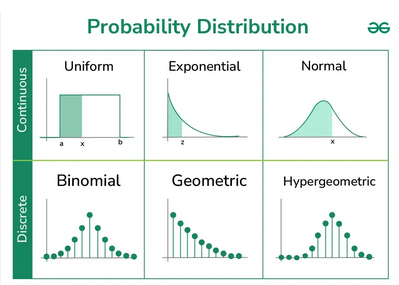
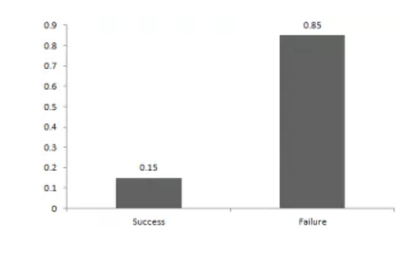
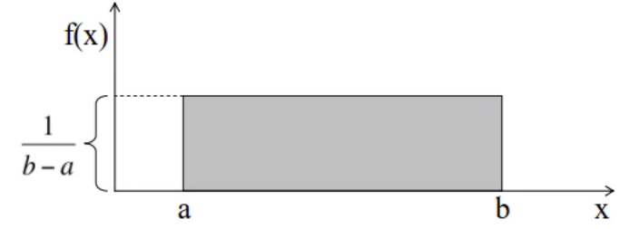
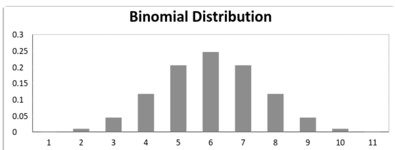
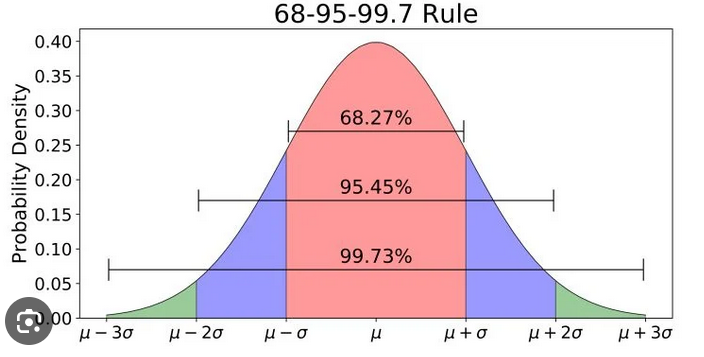
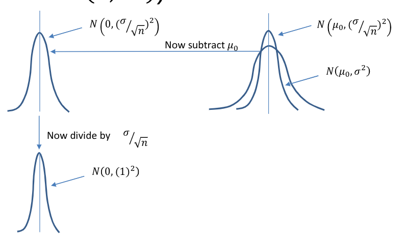
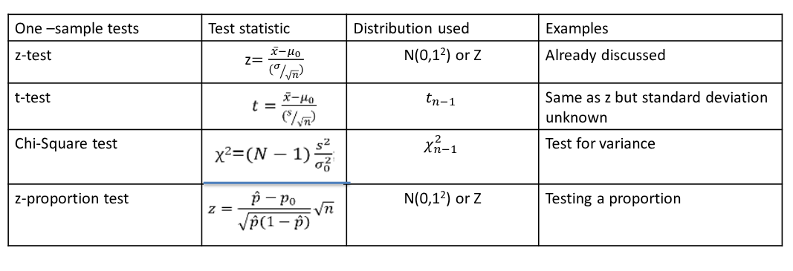
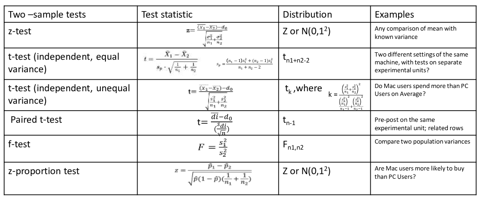
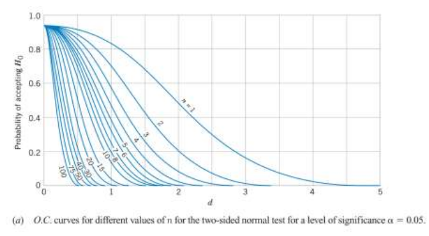

# Probability & Statistics

**Faculty**: Prof Nandan Sudarsanam (email unknown, TODO find out)

Each heading here is a title of a lecture PDF. Under that are my notes on it.

<strong>Mid Sem:</strong> 

## THEORY ALMOST DONE, GIVEN EXERCISES TODO: Lecture Note 1 & 2 - Moment, Bayes, Skew, Kurtosis, EVSI, EVPI

- *Sample Space* is set of all possible outcomes of a *random experiment*.
- *Random Variables* can be discrete (*Probability Mass Function* is used) or continous (*Probability Density Function* is used).
- *Cumulative Distribution Function* describes, for any random variable, probability of outcome $X$ **below** a certain value $x$ : $P(X \le x)$
- 4 types of **Moments** (TODO) are *Mean* (measure of central tendency), *Variance* (dispersion), **Skew**, **Kurtosis**
- Measures of Central Tendency: Mean, Median, Mode -- mean is bad with outliers, mode is useful with **nominal distributions** (TODO) and *multi-modal distributions* (ie multiple peaks in frequency plot).
- 4 Quartiles are there (min is NOT counted, but max is): Q1 (25% percentile), Q2 (median), Q3 (75% percentile), Q4 (max)
- **Inter-Quartile Range**: Q3 - Q1, just Range is max - min

Dispersion measures:
- *Sample Variance*:
$$Var(x) = \frac{\sum (x_i - \bar{x})^2}{N-1} = \frac{\sum x_i^2}{N-1} - \bar{x}^2$$
    - Here **Bessel's correction: using $N-1$ denominator** instead of $N$ to make sample var,std an unbiased estimator of population var,std (ie expected value of sample stds is population std with correction). NOTE: N-1 only in variance, std, mean still uses $N$ only.
    - but in general use $N$ only except this case of using sample var,std to estimate population var,std.
- *Standard Deviation* $SD(x)$ is square root of variance. 
- *Mean Absolute Deviation*:
$$MAD = \frac{\sum |x_i - \bar{x}|}{N}$$

*Formulae in case of continous distribution* using probability density function $p(x)$:
- Total Probability is always 1: $\int_{-\inf}^{\inf} p(x) dx = 1$
- Expected Value $E(x) = \int_a^b x p(x) dx$
- Variance:
    - $Var(x) = \mu^2 = \int_a^b (x - \sigma)^2 dx = \int_a^b x^2 dx - \sigma^2$
    - or restated in expected value: $Var(x) = E((x - \sigma)^2) = E(x^2) - \sigma^2$

TODO: Bayes Theorem (both probab formula form and using table form), Heirachical Bayes

Effect of plus/minus, multiply constant:
- $E(a + bX) = a + b E(X)$
- $SD(a + bX) = |b| SD(x)$
- $Var(X) = b^2 SD(X)$

- **Skew** = property of being left or right-tailed, assymetric deviation from mean. *there are multiple measures of skewness but formulae not given in lecture so skip*
- **Kurtosis** = "fat tailed" (basically how much normal curve is "spread" or wide around mean: TODO confirm this), if I make plot fat tailed is it not just increasing variance?? (TODO find answer to this question) - *formuula not given so SKIP*

### Decision Tree, Value of Information: EVPI, EVSI

NOTE: for now only talking about binary choices, eg. whether to invest or not, NOT how much.

**EMV (Expected Monetary Value)** = normal expected value, no extra value

**EVPI (Expected Value with Perfect Information)** = Expected Value with Perfect Info Expected Value without additional info (ie normal EV)
    - to calculate Expected Value with Perfect Info, replace any negative payoff / loss with 0 (because with perfect info we would never invest on a losing day)
    - **Perfect Info never really happens** - instead purpose is to **set max bound on cost of info** by 
    considering hypothetical scenario where we do know future in advance perfectly
    - *don't forget to subtract the normal EV without info!*

**EVSI (Expected Value with Sample Info)** = EV with sample probabilities (instead of normal probabs) - normal EV (EMV)
- TODO: write detailed about EVSI probabilities table

**Net EVSI** = EVSI - Sample Cost

## THEORY DONE, GIVEN EXERCISES TODO: Lecture Note 3 - Common Probability Distributions

### Plots

All statistical plots (histogram / bar graph, scatter plot, **heatmap** (magnitudes of points repr as colors), box plot (quartiles), pie (rarely used in ML))  -- mentioned in lecture video but not PDF

### Probability Distributions

https://www.geeksforgeeks.org/maths/probability-distribution/ (has questions!) : (only major Poisson distribution seems missing in below summary plot)

https://www.analyticsvidhya.com/blog/2017/09/6-probability-distributions-data-science/#Types_of_Distributions

#### Bernoulli Distribution (always discrete)

only 2 outcomes (success / fail). Probab(success) = $p$, $E(X) = p$, $Var(X) = p(1-p)$

#### Uniform / Rectangular Distribution (discrete and continous)

all n outcomes equally likely (unlike Bernoulli where success, fail can have different probab).

for continous, Probability Density $p(X) = 1 / (b-a)$ where $a,b$ are lower and upper bounds of non-zero probab (i.e. **support of probab distribution**).

#### Binomial Distribution (always discrete)

result of a series of Bernoulli (yes/no) trials. *despite Bi in name, actually has multiple outputs not just 2!!*

*Probability Mass Function* P(exactly x successes) = $\binom{n}{x} p^x (1-p)^{n-x}$ -- for P(at least or at most r), have to manually sum these probabilities.

Mean = $n p$, Variance = $n p (1-p)$ where $n$ is no. of trials, $p$ is probab of success in individual trial.

NOTE: below plot is for perfect case where (for each individual Bernoulli trial) P(success) = P(fail) = 0.5.
*When individual trial's P(success) < P(fail), it skews to right* (left in opposite case).

##### Pascal / Negative Binomial

Binomial PMF answers: given n trials, probability of how many successes?
Negative Binomial PMF answers: given r successes, probability of how many trials (or failures)?

PMF P(xth trial (last rth success occurs exactly at xth trial)) = $\binom{x-1}{r-1} p^r (1-p)^{x-r}$  (basically instead of nCr it's (n-1)C(x-1))

#### Normal / Gaussian Distribution (always continous)

**Large sums of small random variables is often normally distributed.**

Properties:
* mean, median, mode coincide
* curve is bell-shaped and symmetrical about the mean, exactly half to left (less) of mean, half to right (greater)
* total area under curve is 1 (of course, as it's probability distribution!)

Probability Density Function: $P(x) = \frac{1}{\sqrt{2 \pi} \sigma} e^{\frac{-(x - \mu)^2}{2 \sigma}}$

**Standard Normal Distribution** has mean 0, std 1, then formula becomes $P(x) = \frac{1}{\sqrt{2 \pi}} e^{\frac{-x^2}{2}}$

As above plot shows, area under the curve (probability) at 1 sigma away from mean (both sides inclusive) is 68%, 2 sigma is 95%, 3 sigma is 99.7%. This is called **68-95-99.7** rule in short.

#### Poisson Distribution (always discrete)

limit of binomial for rare events (probability of success too low or too high)

Parameter (expected number of events per unit time) $\lambda = n p$

PMF P(x) = $\frac{\lambda^x e^{-\lambda}}{x!}$

#### Exponential Distribution (always continous)

continous waiting time between discrete Poisson trials. Here $\lambda$ is same as of corresponding Poisson distribution.

- PDF **Probability of waiting exactly $x$ waiting time** $P(x) = \lambda e^{-\lambda x}$
- CDF **Probability of waiting less than or equal to $x$ waiting time** $1 - e^{-\lambda x}$
- Mean waiting time $1 / \lambda$ (makes sense since $\lambda$ is just expected no. of events per unit time).
- Variance of waiting time $1 / \lambda^2$

#### Normal (continous) Approximations of Binomial and Poisson (discrete)

Useful for area, ie. probab in range P(a <= x <= b)

By default use Binomial (n large, np or n(1-p) > 5), with mean, variance being usual binomial ones: mean=np, variance=np(1-p)

But if (large n and np or np(1-p) > 10) OR ($\lambda = n p > 5$), use Poisson, with its usual mean=$\lambda$, variance=$\lambda$

#### Geometric Distribution (always discrete)

This is pretty simple case that we do normally - probability of 1st success at x'th trial. So (x-1) failures, then 1 success at x'th trial.

- PDF **Probability of first success at exactly x'th trial** $p(x) = (1-p)^{x-1} p$
- CDF **Probability of first success at most x'th trial** $1 - (1-p)^x$
- Mean **How many trials before first success?** $1 / p$ (pretty intuitivie I guess?)
- Variance $(1-p) / p^2$    ------------- **REMEMBER!!** (forgetting as didnt see derivation :( )) - TODO: see derivation

##### Hyper-Geometric (always discrete)

Binomial draws with replacement from bag with 2 types of balls, Hyper-Geometric draws without replacement

Formulae
- PDF = $\binom{n}{x} \binom{N-K}{n-x} / \binom{N}{n}$ where:
    - $N,K$ are population (total number, number of successes)
    - $n,x$ are sample     (total number, number of successes)
- CDF, Mean, Variance -- TODO

 <!-- Midsem end -->

## TODO: Lecture Note 4 - Confidence Intervals, Central Limit Theorem, Sampling Distributions, (no specific hypothesis tests) -- NOT IN MIDSEM

TODO: 95% confidence interval of difference in population means... and rem topics

## IN PROGRESS: Lecture Note 5.1 (Bayes Inferential Stats) - Hypothesis Testing (Tests: Z, T, Paired T, F, Z Proportion)

### P Value

If we assume the null hypothesis to be true (and make some assumptions about the distributions of various variables), 
then the **‘test statistic’ should be no different than a single random draw from a specific probability distribution**.

Ascertain the probability of observing a “test statistic” equal to or more extreme than that which was observed, 
from this theoretical distribution, assuming that the null hypothesis is true. This is the p-value.

Reject the null hypothesis if the p-value is low. *It’s P(Data|Hypothesis) not P(Hypothesis|Data)*.

Alt Definition: The P-value is the smallest level of significance that would lead to rejection of the null hypothesis $H_0$ 
with the given data.

### Hypothesis Testing - Sample vs Population

* Initially we assume population follows a specific probability distribution (eg. Normal, T Distribution etc.)
* Form null and alternate hypothesis: *Mutually Exclusive Collectively Exhaustive*
* Calc *test statistic* (eg. z score, f score etc. - depends on test)
* Lookup **p-value** (probab of getting as extreme value as input in assumed distribution) using Z Table, T Table, F Table etc.
* Reject Null Hypothesis if $pvalue < significance$ (usually significance is $\alpha=0.05$).

Convention: Population mean, std are $\mu$, $\sigma$ ; sample mean, std are $\bar{x}$, $s$

#### Z Test: Single Sample

Comparing sample mean vs population mean. If only 1 sample value, then that is sample mean.

* Z Score is $z = \frac{\bar{x} - \mu}{\sigma / \sqrt{n}}$
    * Additional Note (not in syllabus): Denominator $\sigma / \sqrt{n}$ is Standard Error $SE$ of sample means from normal population.
* Lookup p-value ($P(X <= \mu)$: **area to left of Z Score**) in Z Table.
    * **Critical Area** (extreme area where vals should be REJECTED), in case of 2-tailed, 
      is area more than 2 (population) standard deviations away from (population) mean.

Types: 
- *Two-tailed* (equality) $H_0: \bar{x} = \mu)$
- *Left-Tailed* $H_0: \bar{x} \geq \mu$  because critical (rejection) area is to the left of mean
- *Right-Tailed* $H_0: \bar{x} \leq \mu$ because critical (rejection) area is to the right of mean

##### Z Test Assumptions

A **z distribution** is just $N(0,1^2)$ - a standard normal distribution with mean 0, std dev 1 - explained in image:

So formula is standard normal formula only:

$$P(Z \leq z) = \int_{-\infty}^{\infty} \frac{1}{\sqrt{2 \pi}} e^{\mu^2/ 2}$$

* Population is Normally distributed OR sample size is large enough for $\bar{x}$ to be approximately normal.
* **Population Standard Deviation $\sigma$ is known** and we're comparing given sample mean to expected population mean.

Lookup of critical p-values from Z Scores is done by:
* above formula (not often used directly as it has an integral!)
* Z Table (manual method)
* Excel: `norm.s.dist(1.2, TRUE)`
* R: `> pnorm(1.2)`

##### NOT IN NOTES SO UNSURE: [Paired Z Test](https://www.ncss.com/wp-content/themes/ncss/pdf/Procedures/PASS/Paired_Z-Tests.pdf)

When comparing 2 means, we take mean difference and check if it's greater than, less than or equal to 0 
(assuming population standard deviation of paired differences is known).

**TODO: Exercises given in lectures themselves, solve/revise!**

##### Summary (Table Formulae): Z, T, Chi-Square, Z-Proportion -- TODO: lookup these in detail online!!

### Hypothesis Testing - Cmp 2 Samples

**How to lookup in T Table**: find p-value using degrees of freedom and significance level $\alpha$. 
Usually 2 tables are given, one for 1-tailed and one for 2-tailed.
In case only 1 T table is given, lookup using $\alpha$ for 1-tailed, $\alpha / 2$ for 2-tailed.

NOTES RE ABOVE TABLE IMAGE:
* **Welsch T Test** is another name for *t test (independent, unequal variances)* mentioned above.
  In its formula $\frac{(\bar{x_1} - \bar{x_2}) - d_0}{\sqrt{\frac{s_1^2}{n_1} + \frac{s_2^2}{n_2}}}$:
  * in numerator $d_0$ is difference in population means $\mu_1 - \mu_2$. But it's generally assumed 0 so can be omitted.
  * denominator $\sqrt{\frac{s_1^2}{n_1} + \frac{s_2^2}{n_2}}$ is actually the Standard Error for difference in population means.
  * T Table is same as in Student's T Distribution. Only difference is degrees of freedom calculation. Full formula for degrees of freedom in Welsch T Test is complicated, so use these simplifications instead:

| Situation                                                          | Degrees of Freedom                   |
| -------------------------------------------------------------------| ------------------------------------ |
| Equal variances (Student's T Distribution) OR Similar sample sizes | $n_1 + n_2 - 2$                      |
| Unequal variances, small samples                                   | $\min(n_1-1, n_2-1)$                 |
| Unequal variances, large samples                                   | Z test (degrees of freedom $\infty$) |

## IN PROGRESS: Lecture Note 5.2 (Bayes Inferential Stats) - Acceptance Sampling (Acceptance Matrix (TP, FP errors), OC Curve), ANOVA, Chi Squared -- NOT IN MIDSEM

**Acceptance Sampling**: does my population match standard / ideal population? 
In factory items production, we know from experience that standard deviation remains about the same, so we can assume that as population std.
But are my items produced acceptable acc standards? I.e., how closely does my population mean match standard mean?
Huge pouplation so we draw $n$ random samples & use sample mean as **unbiased estimator** of population mean 
(because with or without replacement, expected sample mean = populatin mean) 
*so within how many standard deviations is this known mean from required mean? measured by $d$ param*.

NOTE: with or without replacement, Expected sample mean = population mean, but Expected variance is different.

This is the **Acceptance Matrix** (NOTE: true/false is with respect to Alt Hypothesis only, 
ie null hypothesis being correct means alt hypothesis is false => so false prediction)

Predicted \ Actual            | False Prediction of Alt Hypothesis             | True Prediction of Alt Hypothesis
----------------------------- | ---------------------------------------------- | -------------------------------------------------
Alt Hypothesis actaully True  | FP (**Type 1 error / producer risk**) $\alpha$ | TP $1-\alpha$
Alt Hypothesis actually False | TN $1-\beta$                                   | FN (**Type 2 error / Consumer risk**) $\beta$

IMPORTANT: $\alpha$, $\beta$ in above table should be used only after row-wise normalization:

$$
\alpha = \frac{FP}{TP+FP} \\
\beta = \frac{FN}{TN+FN}
$$

in hypothesis testing, before testing, we initially choose $\alpha$ (usually 0.05) of how much max FP error we are willing to allow.
after testing, if p value > $\alpha$ => fails. if p value < $\alpha$ => *then this measured p value is now exact FP rate, alpha was only a max threshold*.

$\beta$ (FN / type 2 error) is more complicated, it depends on:
* d = $|\mu_1 - \mu_2| / \sigma$ - mean of population (or else sample mean as approx replacement) compared to standard mean - how many standard deviations away is it?
    (NOTE: this is NOT z score -- TODO: write more about difference here)
* sample size n
* FP / type 1 error $\alpha$

$\alpha$, $\beta$ are related (if $\alpha$ decreases while keeping sample size and mean constant, then $\beta$ will increase).
But there is no general formula linking the two, relation depends on specific hypothesis test.

SKIPPING (not in lecture slides, so hopefully not needed!) Formulae mostly from https://www.geeksforgeeks.org/machine-learning/confusion-matrix-machine-learning/:

$$
\text{Reliability / Accuracy} = P(overall_correct_prediction) = \frac{TP+TN}{TP+FP+TN+FN} = 1 - (\alpha + \beta) \\
\text{Power / Sensitivity / True Negative Rate} = P(true_prediction | true_actual) = \frac{TN}{TN+FN} = 1 - \beta \\
\text{Precision / True Positive Rate} = P(true_actual | true_prediction) = \frac{TP}{TP+FP} = 1 - \alpha \\
\text{Recall} = \frac{TP}{TP+FN} = \frac{1 - \alpha}{1 - \alpha + \beta} \\
\text{F1 Score (combines Precision, Recall)} -- TODO
Prevelance -- TODO
$$

Graph of beta versus d for a given sample size n is called **Operational Curve (OC)**.

**ANOVA**, **Chi Squared Test** (degrees of freedom), **F Score** (compares 2 variances) -- SKIP: hypothesis testing shouldn't come in midsem exam!
