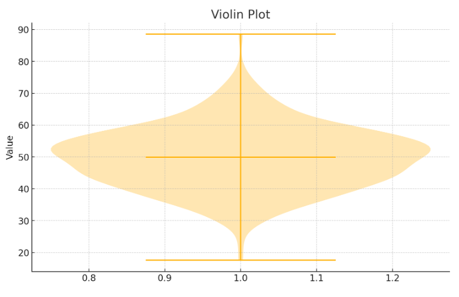
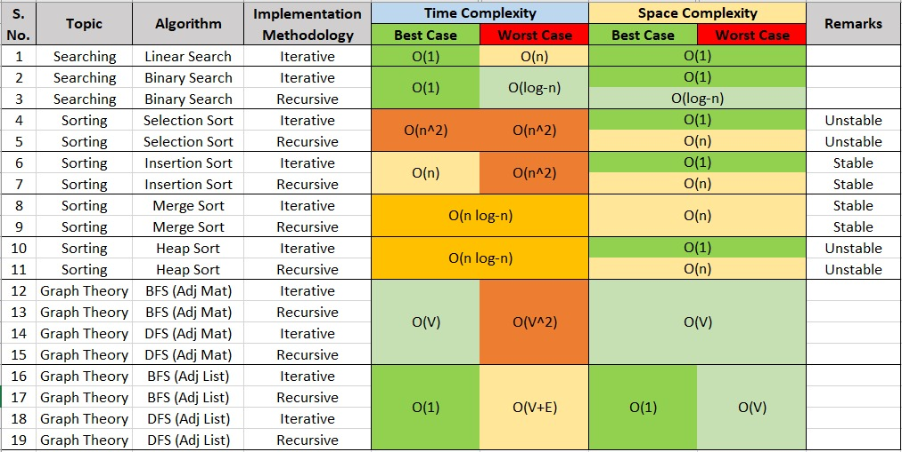

# DA5301W - Python & Data Structures for Data Science

Faculty:
- Prof Satya Jayadev pappu &lt;ps.jayadev@gmail.com&gt;
- Prof Chitra Babu &lt;chitrababu@iitm.ac.in&gt;

DA5301 Course group email: &Lt;da5301w@code.iitm.ac.in&gt;

Midsem question paper with all public & private tests downloaded from https://seek.onlinedegree.iitm.ac.in/courses/ns_25t3iai_daxxxxw?id=83 at [Exams dir](./exams/).

## Notes based on Lectures

TODO: NOTEBOOKS REMAIN!

### Git

4 stages where code lives: 
Working Directory, Staging Directory [`git add files` snapshot (intermediate stage)], Local Repository, Remote Repository

Workflow: Edit files, `git add`, `git commit`, `git push`, `git pull`

Each commit has a hash id. Commits store:
* snapshot of files at that point
* pointer(s) to parent commit(s) --> so git history forms a DAG (Directed Acyclic Graph)
* metadata (author, timestamp, etc.)

Branch is simply movable pointer to specific commit.
`HEAD` is special pointer (to latest commit of current branch)

Branch Merging:
* fast-forward when no changes in "main" branch, only feature branch.
* merge with common ancestor: look at 3 commits (common ancestor, latest main, latest feature); **new merge commit** after 3-way merge
* merge with conflicts: git pauses for manual review

Undo changes:
* Before staging: `git restore /path/to/file`
* After staging Before Commit: `git restore /path/to/file --staged`
* Undo last commit (working directory not affected): `git reset --soft HEAD~1`
* Discard last commit: `git reset --hard HEAD~1`
* Safer: new commit reverting last commit: `git revert HEAD~1`

### Visualization

libs: 
- matplotlib: figure, axes, plt, ticks, colors, grids, fonts
- plotly (supports interactive  plots (hover, zoom, filter), web dashboards with Dash): figure, plotly.express, graph_objects
- seaborn (built on top of matplotlib)

TODO: plot practice in seaborn, plotly, matplotlib

variables:
• Numerical : Continous / Discrete
• Categorical : Ordinal (ordered but cant be measured. eg. temp: cold,warm,hot) / Nominal (unordered eg. Gender)

*Histogram for continous ranges, Bar Plot for discrete data*

Violin Plot (shows both spread, shape of numerical variables) - smooth curve estimation of distribution around box plot:
- using kernel density  estimation estimate continous probability density function from finite sample. kernel function (usually Gaussian) places smooth "bump" on each data point
- **so in addition to box plot (median, IQR) info, also shows data frequencies, esp peaks (multi modes)**41
- shows shape: unimodal / bimodal / skewed / heavy-tailed / tightly clustered



Multi-variate plots show pattern/correlation/trend over time:
- scatter plot
- line plot (eg. stock prices)
- bubble plot: each dot/bubble size indicates external var (numerical), color (categorical)
- heatmap: colored matrix plot. **numerical var (x) against 2 categorical: y axis, and color.** eg. process/sensor data -> spectral/temporal plot
- parallel numerical plot: superimposed (ie on same X axis) line plots (called **polylines**), each colored to identify (so color is category of y)

Cmp categorical variables and/or summary plots: Bar plot (optional: grouped, stacked bars), Count plot (subtype of bar - y = frequencies), Pie Chart (prefer bar chart when categories are many or close in size)

### Graphs

lib: networkx
• Neighbours of a vertex ?
• shortest path ? (only BFS, NOT DFS)
• which vertices reachable from a start vertex ?
• is graph connected - ie all vertices reachable from any vertex?
• map coloring (example of graph problem) - states that share border should have different color. particular example of graph coloring problem
    Four Color Theorem: for planar graphs derived from geographical maps, 4 colors suffice
• Vertex Cover : marking a vertex covers all its edges - find min vertex subset covering all edges. eg. hotel CCTV cameras covering all corridors
• Independent Subset: subset of vertices such that no 2 are connected by an edge
• Matching is mutually disjoint set of edges, ie no 2 edges share any vertex. Find maximal matching

Graph G = (V,E) vertices & edges, E is subset of V x V
• Directed Graph: (v1, v2) in E does not imply (v2, v1) in E
• Undirected Graph: implies

Degree of vertex = Number of edges. For directed, out-degree & in-degree
Path is sequence of vertices v1..vn connected by edges (vi, v(i+1)) in E
Normally path does not re-visit a vertex, if it does it's called a walk
Vertex v is reachable from u if exists path from u to v

Graph Representations:
• Adjacency Matrix (sparse) of vertices - 1 at (i,j) if (vi,vj) is edge, else 0 - usually we assume no self loops. In Directed Graph, rows are outgoing edges, columns are incoming edges.
• Adjacency List (less space): foreach vertex, store list of outgoing neighbours

Breadth First search:
- FIFO queue of curr level, ie visited vertices whose neighbours yet to be explored
- n = no of vertices, m (no of edges) - if connected graph, n-1 <= m <= n(n-1)/2
- each reachable vertex visited exactly once. max n vertices visited.
- Sum of degrees of all vertices = 2 m = 2 * no. of edges
- Complexity: Adjacency Matris has O(n^2), Adjacency List has O(m + n)
- enhanced BFS: 
    * track all shortest paths from start to end, so track parents
    * track vertex distances - save level(i) instead of visited(i)
- in weighted graphs, minimize total cost of edges not number of edges

Depth First Search:
- Backtracking, stack of suspended vertices
- like BFS, each vertex is visited once
- complexity same as BFS: Adjacency Matrix: O(n^2), Adjacency List: O(m + n)
- **DFS Paths are NOT shortest paths, unlike BFS**

**adjacency list better for big sparse graph**: 
DFS, BFS: 
* time: adjacency list => O(V+E), vs adjacency matrix => O(V^2)
* space: worst O(n) in both, but adjacency list has O(1) best space

### sorting, search, exception handling, debugging & testing

Stable algos (preserve order of equal elems): Bubble, Insertion, Merge (also variants: Timsort, Power sort)
Unstable: Selection, Quick, Heap

**Fastest**: merge sort, heap sort both O(n log n)
* merge sort is stable
* but heap sort (iterative) has O(1) space, ie doesn't require extra O(n) array like merge sort

SELECTION SORT
Recurrence means T(n) of an algo

find 1st min put in ans list, 2nd min ... (or inplace: swap 1st min with 1st elem, 2nd min with 2nd elem..)

T(n) = n + (n-1) + .. + 1 = n(n+1)/2 = **O(n^2) -- always this much even for almost sorted list**

ADDITIONAL (NOT IN SYLLABUS): QuickSort (real one is in-place): pivot elem, on left sort less elems, on right sort greater elems

```haskell
quicksort []     = []
quicksort (x:xs) = quicksort [y <= x | y <- xs] ++ [x] ++ quicksort [y > x | y <- xs]
```

INSERTION SORT
maintain sorted list - starting with empty list, one by one insert new elem into correct position to maintain sorting.
more efficient: do it in place in list.

Recurrence:
For inserting new elem: TI(0) = 1, TI(n) = TI(n-1) + 1 => TI(n) = n
Overall sort: TS(0) = 1, TS(n) = TS(n-1) + TI(n-1) => TS(n) = 1 + 2 + ... + n-1 = n(n-1)/2

Worst case complexity is O(n^2). 
But in best case (already sorted list), inserting new elem takes only O(1) time so overall O(n).

ANALYSIS OF MERGE SORT:
Recurrence: **T(n) = 2T(n/2) + 1 = n log n + n**
$$
T(0) = T(1) = 1 \, T(n) = 2T(n/2) + 1 \\
\implies T(n) = 2^k T(n / 2^k) + kn \, But k = log n so T(n / 2^k) = T(1) = 1 \\
\implies T(n) = n log n + n
\implies O(n log n)
$$

But downside is space: inherently recursive and extra list is needed for merge (no obvious way to do it in place)

Variations of merge sort, in merge step:
* Set Union of 2 sorted lists: discard duplicates: if A[i] == B[j], move just one copy to C and increment i, j
* Set Intersection: copy smaller of A[i], B[j] to C; in addition to discard duplicates like prev in case of A[i] == B[j]
* List Difference: elements in A but not in B

TIM SORT: Hybrid (merge sort + insertion sort)
improves const factor in merge sort O(n log n) by sorting smaller level arrays with insertion sort instead (better cache locality and in place). **stable sort**: preserves order of equal elems

It was (until py 3.10) used in python implementation `list.sort()` and `sorted()`.

POWERSORT: (new default implementation (since py 3.11) in python): it's a variant of Timsort
in timsort and powersort, a "run" is a nearly sorted slice in original array (it scans and finds them first because easier to merge: O(n))
if runs found get below min run size threshold, we extend the run to take in nearby elems and sort it with insertion sort.

**power of a run = floor(log2(len(list)))** -> powersort uses this to manage exactly how to better merge runs to make it faster

-----

SEARCH IN ARRAY
* Linear Search: T(n) = n => O(n)
* Binary Search: (only for sorted list)
   * T(0) = 1, T(n) = T(n//2) + 1 => T(n) = 2 + log n => O(log n)

------

HEAP & PRIORITY QUEUE using `heapq`

Heap search time is O(n) because it's NOT sorted!

Priority Queue: 
stores priorities along with elems; Delete_max => FIFO delete (with max priority first, need not be unique) & Insert: add new item

Max Heap is type of Binary Tree, where for each node, to left is smaller elems, to right is greater.
Similar for Min Heap.
*No "holes" allowed in heap - ie cannot leave any empty slots, need to fill a level before going deeper. So insert/delete => rebalance tree*.
* Insert is O(log n), Delete is O(log n) as need to rebalance tree (but O(1) if we just need max and are discarding heap anyway!)
* `heapq.heapify()`: unsorted -> heap : O(n) by building it bottom up (instead of naive top down that takes O(n log n))

------

DEBUGGING
Error types: Syntax, Runtime, Logic, Data (eg. missing val, extra category etc.), Performance

Validation: Pydantic (inherit BaseClassModel, Field()), Pandera (schema validation of Pandas / Polars / Pyspark df, integrates with pytest, on fail shows row, column, failing rule)

* Notebook: `%pdb on` (auto enter pdb on error), `%debug` (inspect after error)
* VS Code: Debug and Run, put breakpoints

Tests: Unit, Integration, Performance, End to End

Pytest: Fixture, Parameterized Test, pytest.raises(), 
float approx equal -->
 assert x == pytest.approx(3.14, [OPTIONAL precision: 0.2])

### WIP pytorch & tensorflow NOT IN ENDSEM

static graph (of model layers) (built before execution) was used in tensorflow v1

dynamic graph (more debuggable but lib can optimize less) used in pytorch and tensorflow v2

TODO: didn't really understand static vs dynamic graph here, see code examples

#### PyTorch

* torchvision
* torchtext
* torchaudio
* captum: model explainability
* detectron: object detection & segmentation
* autograd (pytorch feature not diff lib) : automatic differentiation (gradients) -> . backward() 

Pytorch lightning is higher level lib, automatea train, eval loops

#### TENSORFLOW / KERAS

* TensorBoard -- TODO: visualize computation graph (layers), visualize weights distribution, visualize train & infer images,track&visualuze train with diff hyperparams, analyze train bottlenecks with memory & cpu usage stats!
* TensorflowLite: supports Android, iOS
* TensorflowExtended (TFX): production pipeline, integrates with Tensorflow Serving
* Tensorflow Hub: ML models repo

Also support TPUs (difficult to work with in pytorch) 

Equivalent of autograd for gradient calc is `GradientTape()`


### TODO AI assisted coding NOT IN ENDSEM

TODO

### Summary

Algorithms Complexities Table:


