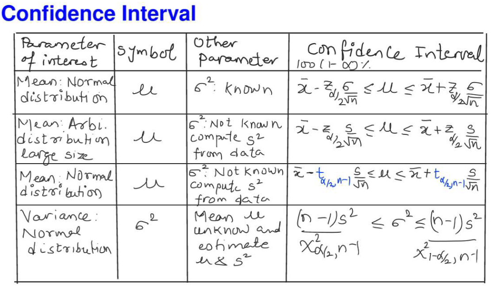
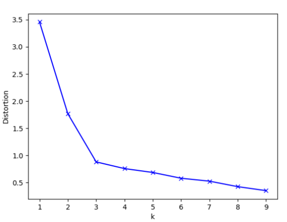
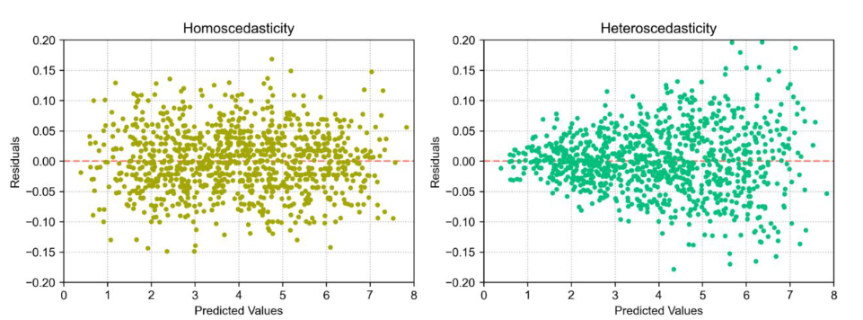

# DA45400W : Foundations of Machine Learning

Faculty:
* Prof Nirav Pravinbhai Bhatt &lt;niravbhatt@smail.iitm.ac.in&gt;
* Prof Tirthankar Sengupta &lt;tirtha.s@gmail.com&gt;

Course group email &lt;da5400w@code.iitm.ac.in&gt;

Machine Learning usually requires significant feature engineering, but Deep Learning often automatically transforms features.

$$
\nabla x^n = n (x^{n-1})^T \\
\nabla x A^T = A \\
\nabla x^T A = \nabla A^T x = \nabla A x^T = A^T \\
\nabla x^T A x = (A + A^T) x \\
\nabla (A x + b)^T (A x + b) = 2 A^T (A x + b) \\
\nabla A x B = A^T B^T \\
\nabla A x^{-1} B = -(x^{-1} B A x^{-1})^T \\
\nabla Trace(p(x)) = \nabla p(x)
$$

## Lecture 1 (Optimization) & Lecture 2 (Probability) revision (common lecture slides)

### Optimization Revision

* Constrained vs Unconstrained (aka **Static**) optimization
* Linear, Quadratic, Non linear programming
* Integer optimization
* Direct vs Iterative solution
* **Arthur Samuel's pardigm/mechanism** to improve performance by tweaking weights/parameters.
* Gradient Descent

#### Mathematical Optimization

* Linear function: $a f(x) + b f(y) = f(ax + by)$
    * **Linear vs Affine linear**: linear has only scaling $A x$, with transform it becomes Affine linear $A x + b$
* Convex function ($\lambda \in [0,1]$): $\lambda f(x_1) + (1 - \lambda) f(x_2) \le f(\lambda f(x_1) + (1 - \lambda) f(x_2))$

Optimize: select best elem (or multiple best elems) from available set of options.

Optimization problem with decision variables: maximize **cost/objective/loss function** $f(\mathbf{x})$ subject to constraints $g_i(\mathbf{x}) \le 0$ .

NOTE: constraints can be both linear and non-linear, sometimes linear are written seperately $A_i x \le b_i$.

#### Optimization Types

* Linear programming: maximize $c^T x$ subject to $A_i x \le b_i$
* Quadratic
* Non-linear

Based on time:
* Static - no time involved
* Dynamic - time involved

#### Constrained Optimization

##### KKT 

Has to be used for non-linear optimization.

Lagrangian $L(\mathbf{x}, \mathbf{\lambda}, \mathbf{\mu}) = f(\mathbf{x}) + \mathbf{\lambda}^T h(\mathbf{x}) + \mathbf{\mu}^T g(\mathbf{x})$

* First-order necessary condition: 
$$
\nabla L(\mathbf{x^*}, \mathbf{\lambda}) = 0 \\
h_i(\mathbf{x^*}) = 0, \quad g_j(\mathbf{x^*}) = 0 \\
\lambda_i \ge 0, \mu_j \ge 0 \\
$$

Complementary condition $\mu_j g_j(\mathbf{x^*}) = 0$ (NOTE: $\mu_j$ is dependent on $x$, here we're talking only about values of $\mu_j$ at $x^*$)

* Second-order necessary condition: TODO

**LICQ**: Linearly Independent (TODO: rem full form)

#### Unconstrained Optimization

##### Gradient Descent

* If learning rate is too big, oscillation diverges
* If learning rate is too low, it takes a long time to converge.

Learning Rate should be (determine these by checking loss values):
* Near local solution: proceed quickly with small learning rate
* Far from local solution: proceed quickly with large learning rate

Types of Gradient Descent (here L is loss) - tradeoff in convergence vs computation (speed, memory):
* Batch GD $w_{i+1} = w_i - \eta \nabla L(w)$ -- smoother convergence, but loads a lot of data into memory so slower
* Stochastic GD (online/streaming data) (different update rule) -- uses less (only one data at a point), faster
* Mini-batch GD: hybrid of batch and SGD -- (NOTE: for convergence Batch is best if can fit data into memory. There can be some extreme data in a mini-batch which affects strongly, but would affect batch GD less due to averaging out with more data)

### Probability Revision 

* Experiments & Random Variables
* Sample Space $\Omega$
* Events:
    * Set Algebra:
        * Commutative (both union & intersection) $E \cup F = F \cup E$, $E \cap F = F \cap E$
        * Associative (both union & intersection) $(E \cup F) \cup G = E \cup (F \cup G)$, $(E \cap F) \cap G = E \cap (F \cap G)$
        * Distributive (both union on intersection & intersection on union) $(E \cup F) \cap G = (E \cap G) \cup (F \cap G)$, $(E \cap F) \cup G = (E \cup G) \cap (F \cup G)$
    * Independent & Mutually Exclusive events
    * Union $E \cup F$, Intersection $E \cap F$, Null event (mutually exclusive) $E \cap F = \emptyset$
    * Complement $E^c = \Omega - E$, Difference $E - F = E \cap F^c$
* Counting:
    * $n$ distinct objects can be arranged in $n!$ ways
    * Permutations: $^n\mathrm P^r = \frac{ n! }{ (n-r)! }$
    * Combinations: $^n\mathrm C^r = \frac{ n! }{ r! (n-r)! }$
* Probability Measure: a function $P: Event -> [0,1]$ such that for mutually exclusive events, $P(E \cup F) = P(E) + P(F)$

Expected Value & Variance properties (if X, Y are independent random variables):

$$
E[X] = \int_{-\infty}^\infty x p(x) dx, \quad Var(X) = E[(X - \mu)^2] = \int_{-\infty}^\infty (x - \mu)^2 p(x) dx \\
E[X + c] = E[X] + c, \quad Var(X + c) = Var(X) \\
E[c X] = c E[X], \quad Var(c X) = c^2 X \\
E[X + Y] = E[X] + E[Y], \quad Var(X + Y) = Var(X) + Var(Y) +
$$

**Covariance** (0 if X, Y have no linear relationship):

$$
Cov(X,Y) = E[(X - \mu_X) (Y - \mu_Y)] = E[X Y] - E[X] E[Y] \\
Cov(X+Z, Y) = Cov(X,Y) + Cov(Z,Y) \\
Cov(\sum_{i=1}^m X_i, \sum_{j=1}^n Y_j) = \sum_{i=1}^m \sum_{j=1}^n Cov(X,Y) \\
Var(X + Y) = Var(X) + Var(Y) + 2 Cov(X,Y)
$$

**Probability Distributions**:

* Normal *65-95-99* Rule
* Hypothesis Test: Chi-Squared (normal distribution): TODO

Type                 | Distribution | $P(X = x)$                          | $P(X \le x)$         | $E[X]$          | $Var(X)$
-------------------- | ------------ | ----------------------------------- | -------------------- | --------------- | --------------------------
Discrete & Continous | Uniform      | $\frac{1}{b-a}$                     | $\frac{x-a}{b-a}$    | $\frac{a+b}{2}$ | $\frac{(b-a)^2}{12}$
Discrete             | Binomial     | $\binom{n,x} p^x (1-p)^{n-x}$       | _                    | $n p$           | $n p (1-p)$
Discrete             | Poisson      | $e^{-\lambda} \frac{\lambda^x}{x!}$ | $1 - e^{-\lambda x}$ | $\lambda$       | $\lambda$
Discrete             | Exponential  | $\lambda e^{-\lambda x}$            |                      | $1 / \lambda$   |
Continous            | Normal       | $\frac{1}{\sigma \sqrt{2 \pi}} e^{- \frac{1}{2} (\frac{x-\mu}{\sigma})^2}$ | _ | $\mu$ | $\sigma$

$$X_1, X_2 ... X_n \sim \mathcal{N}(\mu, \sigma^2) \implies E[\bar{X}] = \mu, \quad SE[\bar{X}] = \frac{\sigma}{\sqrt{n}}$$

**Central Limit Theorem**: At large number of random variables, their sum approaches normal distribution.

$p$ *Percentile* means p % of data is less than or equal to its value.

## Lecture 3 - Bias-Variance, Estimation (MLE, MOM), Bootstrap, Confidence Interval (same lecture slides as prev)

$$Z = \frac{x - \mu}{\frac{\sigma}{\sqrt{n}}}$$

- Confidence Interval: (2-sided Normal) $\bar{x} - z_{\alpha/2} \frac{\sigma}{\sqrt{n}} \le \mu \le \bar{x} + z_{\alpha/2} \frac{\sigma}{\sqrt{n}}$
- Tolerance Interval: TODO
- Prediction Interval: TODO

Table of all Confidence Interval formulae:

TODO: Hypothesis Testing

$$Precision = \frac{TP}{TP + FP}, \quad Recall = \frac{TP}{TP + FN}, \quad \frac{1}{F1} = \frac{1}{Precision} + \frac{1}{Recall}$$

Bias-Variance Tradeoff: TODO details

2 estimators $\theta_1$, $\theta_2$ of same unknown parameter $\theta$

Relative Efficiency = $MSE_1 / MSE_2$

Estimator with less MSE (mean squared error) is more efficient. 
So if relative efficiency here is $< 1$, then $\theta_1$ is more efficient.

This is used in Cross-Validation and other places.

**Likelihood** [good explanation](https://www.statlect.com/glossary/log-likelihood):
* Assuming a probability distribution having density function $p(x; \mathbf{\theta})$ (x is single input, $\mathbf{\theta}$ is vector of parameters to be estimated)
* Likelihood is joint probability $P(\mathbf{x} | \mathbf{\theta})$ of observing sample (collection of inputs) $\mathbf{x}$ (in assumed distribution) given parameters $\mathbf{\theta}$ :
    * during training, learn optimal parameter $\hat{\theta}$ to maximize likelihood in [Maximum Likelihood Estimator](#maximum-likelihood-estimator-mle)
    * during validation, if likelihood on test data is low, it means train issue: model overfit on training data OR training data distribution is not representative of test data.
* Since all inputs are assumed to be Independent & Identically Distributed, joint probability is simply product of probability of each input in sample (having $N$ inputs):

$$L(\mathbf{\theta}; \mathbf{x}) = P(x | \theta) = \Pi_{i=1}^N x_i$$

### Estimating Parameters

Estimator = Set of estimated parameters

#### Method of Moments

**Moment** is just generalized average. k'th moment is $E[X^k] = \frac{x_1^k + x_2^k + ... + x_n^k}{n}$ where $n$ is sample size (no. of inputs)

If probability distribution density function $p(x; \mathbf{\theta})$ has $m$ parameters to be estimated, then equate theoritical and sample moments to estimate all paramteters:

$$
\begin{pmatrix} E[X^1 | \theta] \\ E[X^2 | \theta] \\ \vdots \\ E[X^m | \theta] \end{pmatrix} 
= \begin{pmatrix} \frac{1}{n} \sum x_i^1 \\ \frac{1}{n} \sum x_i^2 \\ \vdots \\ \frac{1}{n} \sum {x_i^m} \end{pmatrix}
$$

In general this is non-linear system of equations. In case of linear estimation, this reduces to linear regression using **Ordinary Least Squares**:

$$(X^T X) \beta = X^T y$$

#### Maximum Likelihood Estimator (MLE) 

Assuming training data follows a particular probability distribution, learn optimal parameter $\hat{\theta}$ to maximize likelihood:

$$\hat{\theta} = \argmax{L(\theta; X_{train})}$$

This should maximize accuracy on test data also assuming it follows same distribution.

#### Boostrapping Estimation

TODO: it's in Math_Estimation.pdf slides and also in tutorial.

#### Finding best Estimator

For a probability distribution with density $(p(x; \theta)$, compare 2 estimators (set of estimated parameters) $\hat{\theta_1}$, $\hat{\theta_2}$ (of true value $\theta$) by:
* **Bias**: Find biases of estimators: $Bias(\hat{\theta}) = E[\hat{\theta}] - \theta$
* **Variance**: Find variances of estimators: $Var(\hat{\theta}) = \sigma^2 = \frac{1}{n-1} \sum (x_i - E[x])^2$ (sample variance so denominator is $n-1$ due to Bessel's Correction)
    * Estimator with lower variance is called **Minimum Variance Unbiased Estimator**.
    * If both estimators are unbiased or have equal bias, then this only is better estimator as its MSE will automatically be lower.
* **MSE (Mean Squared Error)**: Lower is better: $MSE = E[(f(X) - X)^2]$. i.e. Relative Efficiency $\frac{MSE_1}{MSE_2}$ < 1 indicates estimator 1 is better.

NOTES: 
* **Better to do all 3 checks using test data rather than training data.**
* Estimator with lower MSE is always better. But bias, variance tell why (high bias means underfitting, high variance means overfitting).

## Lecture 4 - PCA (Principal Components Analysis) - Linear Algebra Revision

Coefficient matrix $A$ does NOT need to be square, can be rectangular (in linear system of equations $A x = b$)

Effect of row-operations on determinant:
* add 2 rows => determinant is unchanged
* multiply a row with a constant => deterimant is multiplied with the constant
* swap 2 rows => determinant sign flips

Covariance matrix $x^T x$ is square matrix.

For an eigenvalue $\lambda_i$, which is a root of characterstic equation $det(A - \lambda I) x = 0 \implies (\lambda - \lambda_1)^{p_1} (\lambda_1 - \lambda_2)^{p_2} ... (\lambda - \lambda_n)^{p_n} = 0$
* **Dimension of Eigenspace** is nullity of $A - \lambda_i I$ -  - i.e. no. of eigenvector bases (linearly independent).
* **Algebraic Multiplicity** is no. of times it appears as a root - i.e. power $p_i$.
* **Geometric Multiplicity** is *dimension of its eigen-space.

$$\forall \lambda_i, GeometricMultiplicity \le AlgebraicMultiplicity$$

In real symmetric matrices, eigen-vectors of distinct eigenvalues are orthogonal.

* Matrix $A$ is **diagonalizable** if it can be written as $A = P D P^{-1}$ where $P$ is an invertible matrix and $D$ is a diagonal matrix.
* Square matrix is **orthogonal** iff $P^T = P^{-1}$
* **Spectral Theorem**: A real symmetric matrix is *orthogonally diagonalizable*.
* Square matrix is *diagonalizable* iff for each eigen value, $GeometricMultiplicity = AlgebraicMultiplicity$.
* So from above, for any real symmetric matrix, for all eigen values $GeometricMultiplicity = AlgebraicMultiplicity$.

To construct set of orthonormal eigenvectors for a $n \times n$ real symmetric matrix, simply take set of all eigen-vectors of all eigen-values.
It's because eigen-vector bases of an eigen-value are always orthonormal; and for real symmetric matrix, eigen-vectors of distinct eigen values are orthogonal.

**Optimization Problem** (which we try to solve using PCA): 

$$
\max \|A x\|^2 \\
s.t. \quad \|x\| = 1
$$

Writing unit vector $x$ in terms of its basis coordinates: $x = c_1 v_1 + c_2 v_2 + ... + c_n v_n$ :

$$\| A x \|^2 = (A x)^T (A x) = x^T A^T A x = c_1^2 \sigma_1^2 + c_2^2 \sigma_2^2 + ... + c_n^2 \sigma_n^n$$

where $\sigma_i = \sqrt{\lambda_i}$ are singular values (square roots of eigen values).

**Solution to Optimization Problem**: If $\sigma_1 > \sigma_2 > ... > \sigma_n$, then:

$$
\| A x \|^2 = c_1^2 \sigma_1^2 + c_2^2 \sigma_2^2 + ... + c_n^2 \sigma_n^n \le \sigma_1^2 (c_1^2 + c_2^2 + ... + c_n^2) = \sigma_1^2 \\
\implies \| A x \|^2 \le \sigma_1^2
$$

So maxima is $x = v_1$ - eigen vector of largest eigen value.

Data Matrix $X$ is $n \times p$ where $n$ is no. of samples, $p$ is no. of dimensions; rows are sample vectors $x_i^T$.

Centered Matrix $X_c = H x$ (subtract mean of each feature column from the column so feature mean becomes 0):
* $H = I_n - \frac{1}{n} 1_n 1_n^T$ where $1_n 1_n^T$ outer product $n \times n$ matrix is all 1s.
* Each column of $H x$ sums to 0 - i.e. mean of all samples is 0: $\hat{x}^T = \frac{1}{n} (\hat{x_1}^T + \hat{x_2}^T + ... + \hat{x_n}^T) = 0_{1 \times p}$
* For any vector $u$, projection $y = X_c u$ (ie dot product with all centered sample vectors) has mean 0: $\bar{y} = \bar{\hat{x}^T u} = \bar{\hat{x^T}} u = 0$

$$
X_c = H x \\
y = X_c u \\
\sigma_y^2 = \frac{1}{n-1} \| X_c u \|^2 = u^T S u
$$

**PCA Objectives** (all $|u| = 1$):
- $u_1 = \argmax u^T S u$
- $u_2 = \argmax u^T S u$ such that $u^T u_1 = 0$
- $u_k = \argmax u^T S u$ such that $\forall i, u^T u_i = 0$

Sample variance-covariance matrix $S$ has $S_{ij} = Cov(feature_i, feature_j)$ - values are covariance of each feature vector of centered $X_c$. At diagonal $S_{ii} = Var(feature_i)$.

Maximizing $u^T S u$ essentially means maximizing direction $u$ of most variance.

**Solution to Optimization Problem**:
* Find eigenvalues of $S$ in decreasing order: $\lambda_1 > \lambda_2 > ... > \lambda_k$
* First principal component is eigen vector $v_1$ corresponding to maximum $\lambda_1$ which is max objective function value: $\lambda_1 = v_1^T S v_1$
* Similarly for rem principal components.
* All found features $u$ become column vectors of $U$ matrix -- $U^T U = I_k$
* *Explained Variance* by i'th principal component is $\frac{\lambda_i}{trace(S)}$ (Trace is sum of diagonal elems = sum of eigen values)

**Scores Matrix**: $T = X_c U$

## Lecture 5 & 6 - Clustering (Unsupervised Learning) Analysis

Clustering maximizes *Intra-Cluster* (similarity within a cluster), minimizes *Intra-Cluster* (similarity between clusters). Similarity is basically low variance.

Clustering Uses:
* Data Analysis & Visualization
* Pre-Processing: Numerosity Reduction (i.e. in large data, remember only most important parts -- cluster centroids), Remove Outliers
* Unsupervised Learn applications: Segmentation, Anamoly detection, Topic detection, Information retrieval, etc.

Definitions:
* Centroid is mean of all point vectors. $\mu = \frac{\sum x_i}{N}$
* Radius is max distance of any point from the centroid. $r_i = max |x - \mu|^2$  -- NOTE: we DID NOT take square root here for convinience.
* Diameter is max pairwise-distance between any 2 points. It's NOT related to radius. $di_i = max |x_p - x_q|^2$ (again square root not taken here for convinience)

For large dimensional data, PCA can be done to reduce dimensionality before Clustering.

**Clustering Methods**:
- *Partitional* searches among different partitions of data: **K-Means**, K-Medoids, PAM (partition around medoids), CLARANS (Clustering Large Applications via RANdom Search)
- *Heirachical*: **AGNES** (AGGlomerative NESting heirachical clustering algorithm), **DIANA** (DIvisive ANalysis clustering Algorithm), BIRCH
- *Density-based* use connectability & reachability: **DBSCAN** (Density-Based Spatial Clustering of Applications with Noise), OPTICS (Ordering Points To Identify Clustering Structure), DENQUE, CLIQUE
- *Graph-based* use graph theory concepts, Spectral clustering
- *Grid-based*
- *Model-based*

TODO: 1 slide each on graph-based clustering, Spectral clustering

For Outlier detection (noise removal, anamoly detection), Density-based methods are used.

Numerosity Reduction (form tight clusters) is key idea behind many scaling techniques. Use representative points: centroids, medoids, many points per cluster.

**Clustering Distance metrics**:
- Manhattan (L1), Squared Euclidean (L2)
- *Mahalanobis Distance* (b/w point and distribution / centroid) accounts for correlations between variables and differences in scaling. 
  It's used in outlier detection, classification, clustering. It uses mean vector $\mu$ and covariance matrix $\Sigma$:

$$D_M(x) = \sqrt{(x - \mu)^T \Sigma^{-1} (x - \mu)}$$

### K-Means Clustering

K (No. of clusters) is determined heuristically / with trial and error.

It uses Lloyd's Heuristic algorithm (usually Euclidean distance is used, i.e. minimize *Within-Cluster Sum of Squares*, but other distance metrics can also be used):

Starting with $k$ random centroids, Until Centroids converge:
* Find clusters: each point assigned to the centroid it's closest to.
* Calc new centroids as means of each cluster.

**Responsibility** of each centroid is just no. of points in its cluster.

K-Means yields **Convex Sets** - i.e. the clusters can be seperated by lines.

K-Means can be slow for large data, but is solvable in polynomial time if all points lie on a line.

**Limitations**:
- K-Means finds local optima not global.
- works with numeric data only (centroid not defined for other data)
  - fix: use actual data points: medoids -- TODO
- does not scale well
  - fix: run on sample of all data
- $K$ no. of clusters needs to be pre-specified.

#### Knee Method to find K

Distortion = Sum of Squared Errors (ie squared distance of each point from its respective cluster centroid)

Try various K, plot K vs Distortion error. Choose in plot where there's a "knee" (abruptly reduced rate of reduction of error) - after that there's diminishing error till no. of data points where error reaches 0.

### Heirachical Clustering

Dendograms = tree of clusters: root has all data, leaves are individual data points

* MOST POPULAR: Agglomerative (aka AGNES): Start with clusters = individual data points, repeatedly merge clusters based on criterion
  * No. of clusters not specified so some stopping criterion required
  * Computationally expensive so Scale via Sampling, Clustering features
* Divisive (aka DIANA): Start with 1 cluster = all data, repeatedly divide based on criterion.

#### Agglomerative Clustering (aka AGNES)

**Inter-Cluster Distance Linkage methods**:
* Single link: shortest distance bw elem 1 from cluster 1, elem 2 from cluster 2
* Complete link: longest distance
* Average distance
* Centroid distance
* Medoid distance (medoid = one chosen, centrally located object in cluster)

**Algorithm**:
- Choose a distance measure (eg. Euclidean) and a linkage method
- Calc pair-wise distance matrix between all clusters
- Merge 2 closest clusters
- Update distance matrix
- Loop till all data merged into single cluster

**Branch Length** = 1/2 of min distance between 2 clusters

### Density-based Clustering

#### DBSCAN (params: Eps, MinPts)

- Eps = space within a radius centered at $o$
- MinPts = density threshold of a region
- a point is a Core Point if its Eps-neighbourhood has a least MinPoints including itself. Then its Eps-neighbourhood points are Density-Reachable.
- Density-Connected (points a, b) if exists point q density reachable from both a and b.

Algorithm:
- Visit all points p.
- Calc Eps-neighbourhood of p.
- If >= MinPts, then p is a core point and cluster is formed, else p is boundary point and has no density-reachable points so skip.

### Quality of Clusters

With Labelled Data:
* Purity $\in [0,1]$: no. of correctly assigned data points / N (0 is poor, 1 is perfect)
* Entropy:
  * For each cluster $C_i$, probab of data having class j is $P_{ij}$: no. of points of class j in cluster $N_i$ / cluster size
  * Entropy $e(C_i) = \sum_{j=1}^l - P_{ij} ln(P_{ij})$
  * Total entropy is weighted average: $\sum \frac{N_i}{N} e(C_i)$

With a known ground-truth clustering set:
* It's probability that current clustering and ground truth would agree on cluster for a given data point.
* RAND index = (A + B) / (N(N-1)/2) where A = no. of points in same cluster in curr & ground truth clustering, B = no. of points in same cluster in curr but different clusters in ground truth

No Information:
* Diameter
* Radius
* Inertia is total of squared distances of each point from its cluster centroid: $\sum_{j=1}^k \sum_{x_i \in C_j} (x_i - \mu_j)^2$
* Dunn Index (measures compactness of clusters):
  * $\min_{i < j} InterClusterDistance(C_i, C_j)$ / $\max_i Diameter(C_i)$ -- TODO: didn't understand, see example
  * Suffers from outliers
  * Can be used to find no. of clusters
* Silhoutte Score:
  * For a point $x_j$, $a(x_j)$ is avg distance from all other points in same cluster, $b(x_j)$ is minimum(avg distance from all points in other clusters)
  * $Silhoutte = \frac{b(x_j) - a(x_j)}{max(a(x_j), b(x_j))}$: if -1 point should be assigned to neighbouring cluster instead, 1 means correct assign
  * Silhoutte Score = mean of silhouttes for all point -- closer to 1 is better

## WIP Lectures - Regression Part 1 by Prof Jayadev

We find relationship between independent and dependent variables.

Sample value types are:
* *True Value*: ground-truth actual value, perfectly related to independent variable. Generally unknown.
* *Observed Value*: measured value in data. Usually different from true value due to measurement error.
* *Predicted Value*: estimated value by regression model.

Noise is always assumed to be gaussian / normal.

Linear Regression is of multiple types:
* *Simple Linear Regression*: single dependent and single independent variable: $y(x, w) = w_0 + w_1 x + \epsilon$
    * Solution to $y = m x + c$ is (here $s_x, s_y$ are standard deviations, $cov(x,y)$ is Co-Variance):
    $$
    r = cov(x,y) / s_x s_y \quad (\text{Regression Coefficient}) \\
    m = r s_y / s_x = cov(x,y) / s_x^2 \quad (\text{Slope}) \\
    c = \bar{y} - b \bar{x} \quad (\text{Intercept}) \\
    $$
* *Multiple Linear Regression*: single dependent, multiple independent variables: $y(x,w) = w_0 + w_1 x_1 + w_2 x_2 + \cdots + w_D x_D + \epsilon$

Generalization of Linear Regression (linear combination of functions of variables):

$$y(x,w) = w_0 + w_1 \phi_1(x) + w_2 \phi_2(x) + \cdots + w_D \phi_D(x) + \epsilon$$

In matrix form we can write general equation using *augmented* input $X^*$ (it just has a column of 1s appended to it):

$$
y = [1_n X] w  + \epsilon \\
y = X^* w + \epsilon
$$

Assumptions on Random Error $\epsilon$ for Unbiased best-fit model:
- $E[\epsilon] = 0$ expected/average error noise should be 0, i.e. actual values of output should be equally-spread around predicted value.
- *Homoscedsatic errors*: $Cov[\epsilon] = \sigma^2 I$ Variance of error should be same for all independent variables, i.e. error residuals should NOT be correlated with input for best-fit unbiased model.
- Errors should be normally distributed.

Another assumption of OLS (Ordinary Least Squares) is that no 2 input variables should be *Multi-Collinear* (ie inputs themselves are correlated).

Bayesian Linear Regression (it gives same output as Ridge Regression, but in addition also gives variance in output), Bayesian Neural Network [only Ridge Regression is in course, will be covered]

### Total Least Squares (TLS)

**Pre-Requisites (linear algebra)**:
* SVD: $X_{m \times n} = U_{m \times m} D_{m \times n} V^T_{n \times n}$
    * Right singular vectors $v$ are directions along which variance in data is equal to singular values $\sigma$.
    * Left singular vectors $u$ are projections along $v$ directions.
    * *For largest singular value, its right singular vector is direction of maximum variance in data.*
* Using SVD, matrix of rank $r$ can be written as sum of $r$ rank-1 matrices: $X = \sum_{i=1}^r u_i \sigma_i v_i^T$ -- each summed matrix is $(m,1) * (1,1) * (1,n) = (m,n)$
* *Low-Rank Approximation*: Approx $X$ by $X_l$ of rank $l < r$ by summing largest $l$ rank-1 matrices: $X_l = \sum_{i=1}^l u_i \sigma_i v_i^T$
* *Frobenium Norm of Matrix*: sqrt(sum of squares of all cells in matrix)

**TLS (Total Least Squares):** (No closed form solution, only iterative approx based on SVD)
* It's less used instead of Ordinary Least Squares, when we know there's noise in both x and y so *values of both x, y to be estimated*.
    * models: true $y_t = w_0 + w_1 x_t$ vs observed $y = w_0 + w_1 x + (w_1 \epsilon_x - \epsilon_y))$
* Objective: $\min_w \|(X,y) - (\hat{X},\hat{y})\|, \quad \text{such that } \hat{y} \in ColumnSpace(\hat{X}), \hat{y} = \hat{X} w$
* Algorithm:
    * Z-Score Standardize input to 0 mean, 1 variance (singular values depend on variance, so standardize to ensure equal attention to each feature)
    * Augmented $X_{aug} = [ X | y ]_{N \times (D+1)}$
    * SVD $X_{aug} = U S V^T$ -- smallest singular value is $\sigma_{D+1}$ with corresponding right singular vector $v_{D+1}$
    * Break augmented right singular vec $v_{D+1}$ back to components $v_X: n \times 1, v_y: 1 \times 1$ and calculate regression coefficients vector:
    $$\hat{w} = \frac{-1}{v_y} v_X$$
    NOTE: diagonal values in $S$ are sorted from largest to smallest (top to bottom). 
          So we use $v_{D+1}$ - last column (right singular vector) since that always corresponds to smallest singular value.
    * Get corrected estimates for X,y by taking *low-rank approximation* (upto D) of augmented matrix:
    $$X_{aug}^c = \sum_{i=1}^D u_i \sigma_i v_i^T$$

### Weighted OLS, TLS

Needed when assumption of *Homoscedsatic errors* is broken. 
i.e. variance (noise / probability of being wrong) is different for each sample row $Var(\epsilon_i) = \sigma_i^2$, so *Heteroscedastic errors*.
NOTE: errors in data are due to unreliable measurements.

$y$ in some samples (eg. from bank statement) are known to be more reliable than others (eg. a neighbourhood estimate).

* Weighted OLS Objective: $min_w \sum_i \frac{(y_i - \hat{y_i})^2}{\sigma_i^2}$
* Solution: $X w = y \implies X^T \Sigma^{-1} X w = X^T \Sigma^{-1} y \implies w = (X^T \Sigma^{-1} X)^{-1} X^T \Sigma^{-1} y$ 
  where $\Sigma = diag([\sigma_1^2, \cdots, \sigma_n^2])$

So weight matrix adjusts influence on regression model, i.e. more reliable (less error variance) samples will have more impact while calculating coefficients.
NOTE: Here "weights" DOES NOT MEAN regression model coefficients, but instead how much "weight" is to be given to each sample row.

TODO

### Polynomial Regression

Mk $x$, $x^2$, $x^3$... as features and then do OLS linear regression. It's biased as features are correlated.

### Log Regression

Apply log transformation to one or both of x, y before regression.

One scenario is when we're more interested in percent change rather than absolute difference: $d(ln y) = dy / y \approx (y_2 - y_1) / y_1$ 

### Multi-Variate Linear Regression

When you have multiple outputs that are strongly correlated with each other.

TODO

## WIP Regression Part 2 (using gradient descent)

In OLS ordinary least squares you have to compute $(X^T X)^{-1}$ -- this is very expensive / impossible when X data is very large, or data is streaming in batches.
Then we use gradient descent

Loss for simple linear regression: $\frac{1}{2 N} \sum_{i=1}^N (y_i - x_i^T w)^2$ - it's quadratic (convex), good loss candidate for gradient descent

Gradient Descent of Linear Regression (doing it in mini-batches usually for large data):

$$
w_{k+1} = w_k - \eta \nabla L(w_k) \\
\nabla L(w) = -\frac{1}{N} X^T (y - X w) \quad (\text{loss gradient for linear regression}) \\
w_{k+1} = w_k + \frac{1}{N} X^T (y - X w) \quad (\text{gradient descent for linear regression})
$$

Feature Scaling should be done ideally by normalizing: $(x - \mu) / \sigma$

Univariate/simple - 1 input, 1 output
Multivariate - multiple inputs, multiple outputs (so as many lin reg eqns as num of outputs) 
Multiple - multiple inputs, 1 output

True x vs Observed (having measuremenr error) 

- E[error] = 0
- Homeoscedatic CovarianceMatrix[error] = sigma^2 I (variance of error same for all features, no covariance between features) 
- Inputs & errors shouldn't be correlated, ie model shouldn't consistently over or under estimate outputs
- Normal error

ORDINARY LEAST SQUARES
minimize SSR (sum of squared residuals) = (y - X w)^T (y - X w) 
y = X w + ey => w = P y where projection matrix  P = (X^T X)^-1 X^T
Residual vector r = y - X w is perpendicular to column space of X

TOTAL LEAST SSQUARES
TODO low rank approximation of matrix
Frobenius Matrix Norm - flatten matrix => L2 norm

Observed x has error, predict both x, y
minimize |(X, Y) - (Xtrue, Ytrue) |_frobenius
ytrue = w0 + w1 xtrue
Observed: y = w0 + w1 x + (w1 ex - ey) 
No closed form solution, approx sol using SVD

Tls steps
1. Normalize each feature to 0 mean, 1 variance ((x-mean)/std). Reason: singular values affected by scale, so ensure all features treated same regardless of scale
2. TODO

TODO

## Classification

TODO Naive Bayes (in syllabus but not in Prof slides) 

Logistic Regression - know

KNN - know
Weighted KNN = KNN weighted by 1/d (distance of existing point from inference point) 

TODO balanced accuracy, ROC-AUC

What % of actual positives are correctly predicted
Sensitivity = Recall = TP / (TP + FN) 

What % of predicted positives are actually correct
Precision = TP / (TP + FP) 

1/F1 = 1/Precision + 1/Recall

Specificity = TN / (TN+FP) 
Balanced accuracy = mean of specificity, sensitivity

True Positive Rate TPR = TP / (TP+FN) 
False Positive Rate FPR = 1 - TPR
ROC = plot TPR (y)  vs FPR (x) (while varying threshold for true pred between 0-1) -- helps to choose threshold
AUC = Area Under Curve (no formula, have to sum/integrate) 
One way for max threshold is maximize J = TPR - FPR
Can be misleading for highly imbalanced data

**Naive Bayes**:
* Bernoulli Naive Bayes: 
* Multinomial Naive Bayes: TODO formula
* Gaussian Naive Bayes: TODO formula

### Handling Data Imbalance (one class has much more than others)

Accuracy misleading (very good on majority class, but very bad on small minority class).
This is because Cross Entropy loss gives equal importance to any mis-classification but actually data is imbalanced.

ways to deal:
* Undersample majority class, Oversample / synthesis sample minority class or Resample to fix data imbalance, and better metric (give more weightage to minority class in loss function)
* lower probability threshold for minority class

## WIP lecture

TODO: supervised learning workflow

High bias in predictions if model consistently gives too high or too low answer for data.

Balanced model when test error/loss is close to training error.

### Generalized Linear Regression Model

$$\min_w (y - X^* w)^T (y - X^* w) + \lambda \Omega (w)$$

where $\lambda \ge 0$ is regularization hyperparam, $\Omega (w)$ is regularization penalty (balances against training loss - high for complex models, low for simple models)

1. Ridge Regression (L2 Regression) - use L2 norm of weights

$$
min_w (y - X^* w)^T (y - X^* w) + \lambda \|w\|^2 \\
w_{ridge} = (X^T X^* + \lambda I)^{-1} X^T y
$$

2. Lasso Regression (L1 Regression): when we are more interested in selecting features / eliminating unnecessary features

$$min_w (y - X^* w)^T (y - X^* w) + \lambda \|w\|$$

Solution has to be found iteratively, no equation as L1 norm is not differentiable (CHECK?)

## WIP lecture

**LASSO Solution using Coordinate Descent**: (these points specific to simple ML models, NOT neural net)
* Issue: LASSO (L1) objective is not differentiable at 0. No closed form solution, so have to find iteratively.
* Coordinate Descent optimizes objective one parameter at a time (holding other params constant).
* Algorithm:
  * Repeat till convergence:
    * For each of the D input features, calc partial residual for all samples: $r_{i(-j)} = y_i - \sum_{k=1} x_{ik} w_k \forall j vars$
     This gives what part of $y$ is left unexplained if we ignore variable $j$.
     NOTE: At optimal values, residual will be 0 for all.
     This is the target $w_j$ must explain.
    * Compute OLS like contribution of feature j
      * Regress this residual only on $x_j$ (all samples)
      $$
      r_{-j} = \rho_j x_j \\
      \rho_j = \frac{x_j^T r_{-j}}{x_j^T x_j} (\text{scaled features})
      $$
      * Explains potential value for $w_j$
    * Apply Soft Thresholding and update weights (L1 penalty introduced here):
    $$
    w_j = \frac{\rho_j - \lambda}{\|x_j\|^2}; \rho_j > \lambda \\
    w_j  0; \quad |\rho_j| \le \lambda \\
    w_j = \frac{\rho_j + \lambda}{\|x_j\|^2}; \rho_j < -\lambda
    $$
    $\lambda$ is strength of regularization
        * No gradient, no matrix inverse and natural sparsity
        * NOTE: $\lambda$ is chosen using validation techniques.
  
**Model Validation**:
* User has to choose:
  * Regularization rate $\lambda$
  * Regularization type: Ridge or LASSO
  * Learning rate
  * Polynomial degree
* Alternatively, it is chosen using a validation strategy.
* To perform model validation & testing, the given dataset is split into Train, Validation (for model selection) & Test

**Validation Strategies**:
* Hold-out (large data): Train, Val, Test split (80:20 or 70:30 train:val are common) - sample bias due to random splitting especially if data is small
* K-Fold Cross Validation (medium data, > 50): 
    train & choose best model from all fold splits (train,val). Different fold data sizes is ok (eg. if total size N isn't divisible by k).
    Validation performance is average performance of all folds (this is how sklearn does it) - unbiased because we trained on all folds. (Alternative approach: worst performance)
    Final model is trained on all data.
    Then finally test on unseen data.
* Leave-one-out (small data, < 50): basically k-fold with k=1.

**Regression Metrics**: (Cross-Entropy is used only for classification not regression)
* Mean Absolute Error (MAE): can be used for test performance but not validation performance during train as not differentiable. 
  It has same unit as output, treats all errors equally, doesn't amplify large errors.
* Root Mean Squared Error (RMSE): Penalizes large errors, useful to detect outliers. Same unit as output. 
  Suppresses small errors $< 1$ so not used when say output range is $[0,1]$ (like in logistic regression)
* Mean Absolute Percentage Error (MAPE): Easy to interpret, eg. 5% error. But if actual values are very small, then relative error becomes large so misleading & avoid.
  Scale / magnitude independent and can be used to compare models & outputs at different scales.
* R^2 metric (how good does model fit data) = ratio of explained variance to total variance. 
  Between -1 (worst fit) and 1 (perfect fit). 0 means performance is same as just using mean as the output in all cases.
  Dependent on dataset (cannot compare across different datasets), so can't use in Cross Validation:
$$R^2 = 1 - \frac{RSS}{TSS} = 1 - \frac{\sum (y_i - \hat{y_i}^2)}{\sum (y_i - \bar{y}^2)}$$
  Issues:
  * usually R^2 very close to 0 is bad. But it can also indicate that dataset itself is bad, i.e. very noisy, very low variance of actual outputs and variance of noise are very close.
  * High R^2 usually indicates good model. But can be misleading in case of large variance in data.
  * R^2 increases with no. of predictors in model even if actual performance isn't better.
* Adjusted R^2 (unitelss and can be used to compare variety of models): $1 - (1-R^2) (n-1) / (n-p-1)$ where n is no. of samples, p is no. of features.
  * Overcomes limitation that R^2 increases with no. of features. But limitation when very high or vey low variance in data remains.
  * Can find out if there are unncessary features by comparing R^2 to Adjusted R^2.

## WIP lecture

### Regression

**Recursive Feature Elimination**: Importance of feature $j$ is proportional to associated coefficient $w_j$, so Small $|w_j|$ -> Weak Contribution -> Candidate for removal
* Algorithm:
    * Let $S_0 = \{1,2,..,D\}$
    * TODO

**Sequential Feature Selection**: Importance of feature $j$ is proportional to associated coefficient $w_j$, so Small $|w_j|$ -> Weak Contribution -> Candidate for removal
* Algorithm directly minimizes validation validation loss $L_{val}(S) = \frac{1}{N_val} \sum_i (y_i - \hat{y_i}_s)^2$
    * Start with empty feature set $S_0 = \emptyset$
    * At step $i$:
        * For each candidate feature $j$ not in $S_i$
        * Fit model using $S_i \cup \{j\}$
        * Compute Validation loss $L_{val}(S_i \cup \{j\})$
        * Choose feature $j^* = \argmin_j L_val(S_i \cup \{j\})$
        * Update the feature set $S_{i+1} = S_i \cup \{j^*\}$
* A variant of this algorithm can also be done backward - starting from full feature set and dropping one by one.

**Bayesian Linear Regression**: (Non-Deterministic) Instead of normal (model has fixed parameters at inference), model parameters are chosen randomly from a multi-variate gaussian, so output can change for same input. Instead of training weights, we train the mean and covariance matrix values.
* Assumption on noise $\epsilon \sim \mathcal{N}(0, \beta^{-1})$ (Precision = inverse variance $\beta = 1 / \sigma^2$)
* Implies target values follow a Gaussian distribution $p(y|w) = \mathcal{N}(X w, \beta^{-1} I)$
* Bayesian Idea:
    * Estimate a distribution over parameters instead of point estimates.
    * Assumes a prior distribution on paramters and infers a posterior based on data using Bayes rule (where $D$ is whole dataset (combination of $X$, $y$)):
    $$P(w|D) = \frac{P(D|w) P(w)}{P(D)}$$
* Not much used in practice, because in large enough data prior has negligible impact on posterior. Suited for very small datasets where there is high degree of uncertainity.

**Non-Linear Least Squares Regression** (where cannot be converted into a linear form in terms of parameters)
* Minimize sum of residuals between observed and predicted values:
$$\min_{A,B,C} \sum_{i=1}^N (y_i - \hat{y_i})^2, \quad \text{s.t.} \ln{\hat{y_i}} = A - \frac{B}{x_i + C}$$
* Choose initial values for A, B, C.
  Use a non-linear least squares solver (Gradient Descent or Gauss-Newton) to minimize objective and obtain A, B, C.
  Solver for this is inbuilt in Scipy.

#### Further Reading
* Generalized Least Squares and Bayesian Regression
* Elastic Net: L1 + L2 regularization of a linear regression model
* Confidence Intervals for parameters and predictions

### Classification

Types of Classification:
* based on Decision Boudary - Linear, Non-Linear
* based on No. of classes - Binary, Multi-Class
* based on No. of output labels - Single-Label, Multi-Label

Soft prediction (output is probabilities of belonging to each class) vs Hard prediction (directly gives class)

#### KNN (k Nearest Neighbours)

There's no model params, no training, only inference.

TODO: formula

Weighted KNN : (divide by distance so further points get less weightage)

#### Naive Bayes

#### Logistic Regression

## Misc

### Calculus

- **Gamma Integral**: $\int_0^\infty x^2 e^{-x / \alpha} dx = 2! \alpha^3$

### Python Code

- Plot **contour** (2D visualization of a 3D surface) using matplotlib: `X, Y = np.meshgrid(x,y,indexing="ij"); Z = polynomial(X,Y); plt.contourf(x,y,Z,levels=20)`

## TODO Practice Questions

* (Coding Questions) Q3, 5 of Assignment 1 (skipped as not required for submission)

TODO: Gaussian Mixture Model (GMM) - not taught in class I think, but came in Assignment 2

