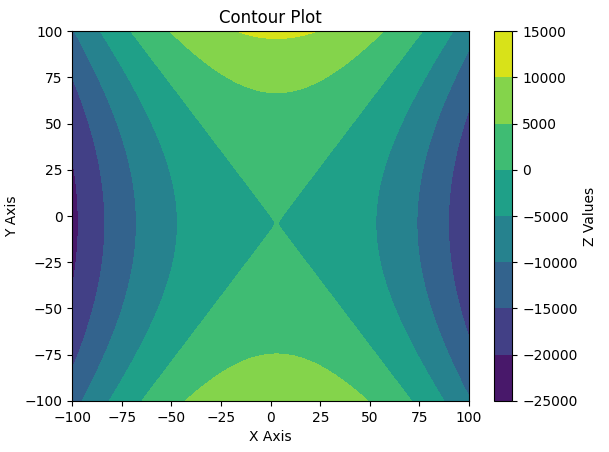
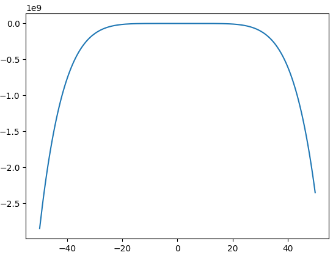

--
Author: 
CreationDate: 
ChangeDate: 
CurrentDate: 
<!-- set all attributes used by VS Code Markdown Converter extension to blank above, so that it doesn't come in generated PDF -->

<!-- SKIPPED Q3, Q5 (not required acc. later instructions) -->

# DA5400W (Foundations of Machine Learning) Assignment 1

Submitted by Sohang Chopra &lt;DA25M622&gt;

## Problem 1

The following probability distribution function can describe the growth rate of finance:

$$f(x) = \frac{1}{\alpha^2} x e^{-x / \alpha}$$

with $\alpha \in (0, \infty)$ and $x \in [0, \infty]$. 
Find an estimate of the parameter $\alpha$ using the maximum likelihood estimators and the method of moments given the datasets $x_1, x_2, \cdots x_n$ .

### Solution

Sample Size is denoted as $n$ here.

* Estimating using **Maximum Likelihood Estimator** :

Likelihood is joint probability of sample, i.e. product of probabilites of each input $x_i$ (given parameter $\alpha$):

$$L(\alpha; \mathbf{x}) = \Pi_{i=1}^N f(x_i, \alpha) = \Pi_{i=1}^N \frac{1}{\alpha^2} x_i e^{-x_i / \alpha} = \frac{1}{\alpha^{2N}} \Pi_{i=1}^n x_i e^{-x_i / \alpha}$$

We need to maximize likelihood, or equivalently maximize log-likelihood:

$$l(\alpha; \mathbf{x}) = -2 n ln(\alpha) + \sum_{i=1}^n ln(x_i) - \sum_{i=1}^n \frac{x_i}{\alpha}$$

Solving optimization problem $\max_\alpha l(\alpha; \mathbf{x})$:

$$
\frac{d}{d\alpha} l(\alpha; \mathbf{x}) = 0 \implies \frac{-2 n}{\alpha} + 0 + \frac{1}{\alpha^2} \sum_{i=1}^n x_i = 0 \implies \alpha = \frac{1}{2 n} \sum_{i=1}^n x_i\\
\frac{d^2}{d\alpha^2} l(\alpha; \mathbf{x}) = \frac{2}{\alpha^2} + \frac{2}{\alpha^3} > 0 \implies \text{Stationary point is maxima}
$$

* Estimating using **Method of Moments**:

As there is only 1 parameter, so only 1st moment of theoritical and sample mean needs to be equated:

$$
E[X | \theta] = E[x] \\
\implies \int_0^\infty x f(x) dx = \frac{1}{n} \sum_{i=1}^n x_i \\
\implies \int_0^\infty x \frac{1}{\alpha^2} x e^{-x / \alpha} dx = \frac{1}{n} \sum_{i=1}^n x_i \\
\implies \frac{1}{\alpha^2} \int_0^\infty x^2 e^{-x / \alpha} dx = \frac{1}{n} \sum_{i=1}^n x_i \\
\implies \frac{1}{\alpha^2} 2! \alpha^3 = \frac{1}{n} \sum_{i=1}^n x_i \quad (\text{using Gaussian integral:} \int_0^\infty x^2 e^{-x / \alpha} = 2! \alpha^3) \\
\implies \alpha = \frac{1}{2 n} \sum_{i=1}^n x_i
$$

Therefore both methods give same estimated parameter.

## Problem 2

Consider a process for which a random sample $X_1, X_2, \cdots X_9$ is collected to understand the population properties. 
The population mean and variance are $\mu$ and $\sigma^2$. 
Mr and Mrs. Stat have proposed two estimators as follows:

$$\theta_{Mr} = \frac{X_1 + X_3 + 4 X_5}{6} , \quad \theta_{Mrs} = \frac{X_2 - X_6 + 2 X_7 + 3 X_4}{5}$$

Which is the best estimator and why?

### Solution

Using $E[aX \pm bY] = a E[X] \pm a E[Y], Var(aX \pm bY) = a^2 Var(X) + b^2 Var(Y)$:

$$
E[\theta_{Mr}] =  \frac{\mu + \mu + 4 \mu}{6} = \mu,         \quad Var{\theta_{Mr}}  = \frac{\sigma^2 + \sigma^2 + 4^2 \sigma^2}{6^2} = 0.5 \sigma^2 \\
E[\theta_{Mrs}] = \frac{\mu - \mu + 2 \mu + 3 \mu}{5} = \mu, \quad Var(\theta_{Mrs}) = \frac{\sigma^2 + \sigma^2 + 2^2 \sigma^2 + 3^2 \sigma^2}{5^2} = 0.6 \sigma^2
$$

Both estimators have expected value $\mu$ so are **unbiased**, but $\theta_{Mr}$ has lower variance so it's better estimator.

## Problem 4

Find the maximum likelihood estimate of the parameter $\theta$ of the following probability distribution function:

$$f(y; \theta) = \frac{3 y^2}{\theta^3}$$

with $\theta \in (0,\infty)$ and $y \in [0,\theta]$ using the data $y_1, y_2, \cdots, y_n$ .

### Solution

Likelihood is: $L(\theta; y) = \Pi_{i=1}^n \frac{3 y_i^2}{\theta^3} = \frac{3^n}{\theta^3} \Pi_{i=1}^n y_i^2$

We need to find $\max_\theta l(\theta; y) = \max_\theta \frac{3^n}{\theta^3} \Pi_{i=1}^n y_i^2$.

$\theta$ is in denominator so we want to minimize it. But $y \in [0,\theta]$ so minimum value it can take is max input $\theta = \max(y_1, y_2, \cdots, y_n)$.

## Problem 6

Consider a random variable $C$ with mean $\mu$ and standard deviation $\sigma$. 
Two experiments are performed to collect two random samples with $n_1$ and $n_2$ sample sizes. 
The sample means for these experiments are $C_1$ and $C_2$ . 
Then, show that an estimator for the sample mean:

$$\bar{C} = a \bar{C_1} + (1 - a) \bar{C_2}$$

is an unbiased estimator for the mean $\mu$.

### Solution 

$E[a \bar{C_1} + (1 - a) \bar{C_2}] = a \mu + (1 - a) \mu = \mu = \bar{C}$ : So the given estimator for mean is unbiased, as expected value of estimator equals mean.

## Problem 7

Find the local extrema of the following functions and classify the points as minimum or maximum:

1. $f(x) = 4 x^3 - 3 x^2 + 2 x - 1$
2. $f(x) = sin(x) + cos(x)$
3. $f(x) = \frac{x^2 - 1}{x}$

### Solution

1. $\nabla f = 12 x^2 - 6 x + 2 = 0$ : No real solutions exist for $x$ so no stationary points / extrema exist.

2. 
$$
\nabla f = cos(x) - sin(x) = 0 \implies x = \frac{sin^{-1}(1)}{2} \\
\nabla^2 f = -sin(x) - cos(x) \implies \nabla^2 f(\frac{sin^{-1}(1)}{2}) = - \sqrt{1 + sin(2 x)} = - \sqrt{2}
$$
So one extrema exists: $\frac{sin^{-1}(1)}{2}$ (maxima since $\nabla^2 f > 0$).

3. $f(x) = x - x^{-1}, \quad \nabla f = 1 + x^{-2} = 0$ : No real solutions exist for $x$ so no stationary points / extrema exist.

## Problem 8

Show that the function $f(x_1, x_2) = 8 x_1 + 12 x_2 + x_1^2 - 2 x_2^2$ has only one stationary point and that it is neither a maximum nor a minimum, but a saddle point. 
Sketch the contour line of $f$.

### Solution

$$
\nabla f = \begin{pmatrix} 8 + 2 x_1 \\ 12 - 4 x_2 \end{pmatrix} = 0 \implies (x_1, x_2) = (-4, 3) \\
\nabla^2 f = \begin{pmatrix} 2 & 0 \\ 0 & -4 \end{pmatrix}
$$

Hessian $\nabla^2 f$ is a diagonal matrix so eigenvalues are from diagonal: 2, -4. As one positive and one negative eigenvalue is there, it's an indeterminate matrix.
So stationary point $(-4,3)$ is a saddle point.

Plotting contour (2D visualization of a 3D surface):

```python
import numpy as np
from matplotlib import pyplot as plt
x = np.linspace(-100,100,201)
y = np.linspace(-100,100,201)
X, Y = np.meshgrid(x, y, indexing='ij')
Z = 8*X + 12*Y + X**2 - 2*Y**2
plt.contourf(x,y,Z)
plt.colorbar(label='Z Values')
plt.title('Contour Plot')
plt.xlabel('X Axis')
plt.ylabel('Y Axis')
plt.show()
```



## Problem 9

Determine the stationary points and classify their nature for the function $f(x,y) = x^4 + y^4 - 36 x y$ .

### Solution

$$
\nabla f   = \begin{pmatrix} 4 x^3 - 36 y \\ 4 y^3 - 36 x \end{pmatrix} = 0 \implies 4 x^3 = 30 y, 4 y^3 = 30 x \implies (x,y) = (0,0), (3,3), (-3,-3) \\
\nabla^2 f = \begin{pmatrix} 12 x^2 & -36 \\ -36 & 12 y^2 \end{pmatrix} \\
\nabla^2 f(0,0) = \begin{pmatrix} 0 & -36 \\ -36 & 0 \end{pmatrix} \implies det(\nabla^2 f(0,0)) = -  36^2 < 0 \implies \text{Saddle Point}
\nabla^2 f(\pm 3, \pm 3) = \begin{pmatrix} 108 & -36 \\ -36 & 108 \end{pmatrix} \implies det(\nabla^2 f(\pm 3, \pm 3)) = 108^2 - 36^2 > 0, f_{xx} = 108 > 0 \implies \text{Saddle Point}
$$

So stationary points are (0,0) (saddle point) and (3,3), (-3,-3) (both local minima).

This works because for 2x2 Hessian Matrix:
* determinant $D < 0$ implies eigen values $\lambda_1$, $\lambda_2$ are of opposite signs (as $D = \lambda_1 \lambda_2$), so point is saddle point.
* determinant $D > 0$ and $f_{xx} > 0$ implies positive eigen values, so Hessian is Positive Definite and point is local minima.

## Problem 10

Solve the following optimization problems by hand(s) and also draw the feasible regions:

1. Find the maximum of the following functions:
    * $f(x) = 1 - 8 x + 2 x^2 - \frac{10}{3} x^3 + \frac{1}{4} x^4 + \frac{4}{5} x^5 - \frac{1}{6} x^6$
    * $f(x_1, x_2) = x_1 + x_2 \quad \text{subject to} \quad x_1^2 + x_2^2 - 1 = 0$

2. Verify the KKT conditions and find the Lagrange multipliers for the following function at $x = (1,0)$ :

$$
(x_1 - \frac{3}{2})^2 + (x_2 - \frac{1}{8})^2 \\
\text{subject to} \quad \begin{pmatrix}1 - x_1 - x_2 \\ 1 - x_1 + x_2 \\ 1 + x_1 - x_2 \\ 1 + x_1 + x_2 \end{pmatrix} \ge 0
$$

3. Find the minimum of the function $f(x) = (x_1 - 1)^2 + x_2^2, \quad \text{subject to} \quad x_1 - x_2^2 \le 0$

### Solution

1. 
* $f(x) = 1 - 8 x + 2 x^2 - \frac{10}{3} x^3 + \frac{1}{4} x^4 + \frac{4}{5} x^5 - \frac{1}{6} x^6$ :
$$
\nabla f = -8 + 4 x - 10 x^2 + x^3 + 4 x^4 - x^5 = (-x^5 + 2 x^4 + 5 x^3 + 4 x) + (2 x^4 - 4 x^3 - 10 x^2 - 8) = (x - 2) (-x^4 + 2 x^3 + 5 x^2 + 4) = 0 \\
\nabla^2 f = 4 - 20 x + 16 x^3 - 5 x^4
$$

Here one root (stationary point) is 2; remaining real roots are approximately 3.51471704 and -1.71339702$ (found using `numpy.polynomial.Polynomial([4,0,5,2,-1]).roots()` which finds roots via Newton Raphson update rule $x_{k+1} = x_k - \frac{f'(x_k)}{f''(x_k)}$) 

For each of these roots:

$$
\nabla^2 f(2) = 4 - 20*2 + 16*2^3 - 5*2^4 = 12 > 0 \quad (\text{local minima}) \\
\nabla^2 f(3.51471704) = 4 - 20*3.51471704 + 16*3.51471704^3 - 5*3.51471704^4 = -134.6 < 0 \quad (\text{local maxima}) \\
\nabla^2 f(-1.71339702) = 4 - 20*(-1.71339702) + 16*(-1.71339702)^3 - 5*(-1.71339702)^4 = -85.3 < 0 \quad (\text{local maxima})
$$

Since 2 local maxima exist, find which has greater value:

$$
f(3.51471704) = 1 - 8*3.51471704 + 2*3.51471704^2 - 3.51471704^3*10/3 + 3.51471704^4/4 + 3.51471704^5*4/5 - 3.51471704^6/6 = 5.906 \\
f(-1.71339702) = 1 - 8*(-1.71339702) + 2*(-1.71339702)^2 - (-1.71339702)^3*10/3 + (-1.71339702)^4/4 + (-1.71339702)^5*4/5 - (-1.71339702)^6/6 = 23.469
$$

So global maxima is -1.71339702 and maximum value of $f(x)$ is 23.469 .

Plotting feasible region:

```python
from matplotlib import pyplot as plt 
import numpy as np 
x = np.linspace(-50, 50, num=200)
y = 1 - x*8 + x**2*2 - x**3*10/3 + x**4/4 + x**5*4/5 - x**6/6
plt.plot(x, y)
plt.show()
```



BUG: maximum value solution I got is 23, but plot shows maximum value around 0!

* $f(x_1, x_2) = x_1 + x_2 \quad \text{subject to} \quad x_1^2 + x_2^2 - 1 = 0$

$(x_1, x_2)$ lies on a circle of radius 1 around origin. Let $\theta$ be angle of point wrt X axis such that $x = cos(\theta), y = sin(\theta)$. Then:

$$
f(\theta) = cos(\theta) + sin(\theta) \\
\nabla_\theta f = - sin(\theta) + cos(\theta) = 0 \implies \theta = \frac{pi}{4} \\
\nabla^2_\theta f = - cos(\theta) - sin(\theta) = -\frac{1}{\sqrt{2}} - \frac{1}{\sqrt{2}} = -\sqrt{2} < 0 \quad (\text{maxima})
$$

So maxima point is $(x_1, x_2) = (cos(\frac{\pi}{4}), sin(\frac{\pi}{4}) = (\frac{1}{\sqrt{2}}, \frac{1}{\sqrt{2}})$ and maximum value is $\frac{1}{\sqrt{2}} + \frac{1}{\sqrt{2}} = \sqrt{2}$.

TODO: plot feasible region

2. 

$$
(x_1 - \frac{3}{2})^2 + (x_2 - \frac{1}{8})^2 \\
\text{subject to} \quad \begin{pmatrix} 1 - x_1 - x_2 \\ 1 - x_1 + x_2 \\ 1 + x_1 - x_2 \\ 1 + x_1 + x_2 \end{pmatrix} \ge 0
$$

Lagrangian: $L(x_1,x_2,\lambda_1,\lambda_2,\lambda_3,\lambda_4) = (x_1-\frac{3}{2})^2 + (x_2-\frac{1}{8})^2 + \lambda_1 (x_1+x_2-1) + \lambda_2 (x_1-x_2-1) + \lambda_3 (-x_1+x_2-1) + \lambda_4 (-x_1-x_2-1)$ where $\lambda_1,\lambda_2,\lambda_3,\lambda_4$ are Lagrangian multipliers.

KKT Conditions are:
* Stationarity: 
$$\nabla_{x_1,x_2} L = \begin{pmatrix} 2 x_1 - 3 + \lambda_1 + \lambda_2 - \lambda_3 - \lambda_4 \\ 2 x_2 - \frac{1}{4} + \lambda_1 - \lambda_2 + \lambda_3 - \lambda_4 \end{pmatrix} = 0$$
* Primal Feasability: 
$$\begin{pmatrix} x_1 + x_2 - 1 \\ x_1 - x_2 - 1 \\ -x_1 + x_2 - 1 \\ -x_1 - x_2 - 1 \end{pmatrix} \le 0$$
* Dual Feasability:
$$\lambda_1, \lambda_2, \lambda_3, \lambda_4 \ge 0$$
* Complementary Slackness:
$$
\lambda_1 (x_1+x_2-1) = 0 \\
\lambda_2 (x_1-x_2-1) = 0 \\
\lambda_3 (-x_1+x_2-1) = 0 \\
\lambda_4 (-x_1-x_2-1) = 0
$$

At $(x_1=1, x_2=0)$:
$$
\lambda_1 (1 + 0 - 1) = 0 \implies 0 \lambda_1 = 0 \\
\lambda_2 (1 - 0 - 1) = 0 \implies 0 \lambda_2 = 0 \\
\lambda_3 (-1 + 0 - 1) = 0 \implies -2 \lambda_3 = 0 \implies \lambda_3 = 0 \\
\lambda_4 (-1 - 0 - 1) = 0 \implies -2 \lambda_4 = 0 \implies \lambda_4 = 0
$$

$$
\begin{pmatrix} 2(1) - 3 + \lambda_1 + \lambda_2 - 0 - 0 \\ 2(0) - \frac{1}{4} + \lambda_1 - \lambda_2 + 0 - 0 \end{pmatrix} = 0 \\
\implies \begin{pmatrix} \lambda_1 + \lambda_2 - 1 \\ \lambda_1 - \lambda_2 - \frac{1}{4} \end{pmatrix} = 0 \\
\implies \lambda_1 = \frac{5}{8}, \lambda_2 = \frac{3}{8}
$$

Therefore Lagrangian multipliers are $(\lambda_1,\lambda_2,\lambda_3,\lambda_4) = (\frac{5}{8}, \frac{3}{8}, 0, 0)$

TODO: plot feasible region

3. $\min f(x) = (x_1 - 1)^2 + x_2^2, \quad \text{subject to} \quad x_1 - x_2^2 \le 0$

In terms of $x_2$:

$$
f(x_2) = x_1^2 - 2 x_1 + 1 + x_2^2 = x_2^4 - 2 x_2^2 + 1 + x_2^2 = x_2^4 - x_2^2 + 1 \\
f'(x_2) = 4 x_2^3 - 2 x_2 = 0 \implies x_2 = 0, \frac{1}{\sqrt{2}} \\
f''(x_2) = 12 x_2^2 - 2 \implies f''(0) = -2 < 0, f''(\frac{1}{\sqrt{2}}) = 4 > 0
$$

So minima is at $(x_1,x_2) = (\frac{1}{2},\frac{1}{\sqrt{2}})$ and minimum value is $(\frac{1}{2} - 1)^2 + \frac{1}{\sqrt{2}}^2 = \frac{3}{4}$.

TODO: plot feasible regions