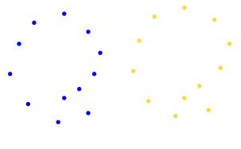
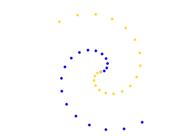
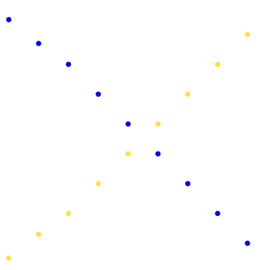
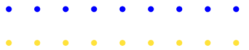

<!-- set all attributes used by VS Code Markdown Converter extension to blank above, so that it doesn't come in generated PDF -->

# Foundations of Machine Learning Assignment 2

Submitted by: Sohang Chopra &lt;DA25M622&gt;

## Problem 1

Consider a dataset with two numerical features:
- $x_1$ measured in kilometers, with values approximately ranging from 0 to 10.
- $x_2$ measured in meters, with values approximately ranging from 0 to 500.

No preprocessing or scaling is applied to the data.

1. Explain how the difference in feature scales affects clustering when Euclidean distance is used.
2. If K-means clustering is applied directly to this dataset without preprocessing, which
feature is likely to dominate the clustering result? Justify your answer.
3. Describe one preprocessing technique to address this issue and explain how it changes
the geometry of the data.

## Solution 1

For each cluster, average squared Euclidean distance of any point from centroid is:

$$ E[|(x_{i,1}, x_{i,2}) - (\bar{x_{1,i}}, \bar{x_{i,2}}|^2] = E[(x_{i,1} - \bar{x_{i,1}})^2] = E[(x_{i,2} - \bar{x_{i,2}})^2] = \sigma_1^2 + \sigma_2^2 $$

Here $\sigma_1^2$, $\sigma_2^2$ are variances of $x_1$, $x_2$. 
$x_2$ is in metres and has greater range of values, whereas $x_1$ is in kilometres.
So average distance of points from cluster centroids is approximately $\sigma_2^2$, as variance $\sigma_1^2$ of $x_1$ would be much less.

K-Means clustering minimizes this metric only (*Within-Cluster Sum of Squares*).
So **feature $x_2$ is likely to dominate** if K-Means clustering is done without any preprocessing.

To solve this issue, we standardize data (i.e. calculate Z scores) so that both features have mean 0, variance 1 and both features are treated equally:

$$\hat{x_1} = \frac{x_1 - \bar{x_1}}{\sigma_1}, \quad \hat{x_2} = \frac{x_2 - \bar{x_2}}{\sigma_2}$$

*Geometry of Pre-Processed data*: Standardization transforms original elongatened data into almost spherical data centered on origin.

## Problem 2

1. Explain the role of distance (or similarity) measures in clustering algorithms.
2. Compare **Euclidean distance** and **Mahalanobis distance** . Discuss how the choice of distance measure affects:
- The shape of clusters
- Sensitivity to feature scaling and correlation
3. Give one practical scenario where Euclidean distance may lead to poor clustering
results and justify your answer.

## Solution 2

1. We use distance metric to measure inter-cluster distance (Seperation) and within-cluster distance of each point from centroid (Cohesion).
   Loss is defined in terms of distance - for example, K-Means minimizes within-cluster average distance.
   Cluster quality measures like Silhoutte Score are also defined in terms of distance.
   Typically Euclidean distance is used by default.

2. 
* Euclidean Distance uses L2 norm. It assumes variance is equal in all directions, leading to **spherical clusters**. 
  It's **highly sensitive** to feature scaling (which causes variance to increase, breaking assumption of equal variance in all directions) 
  and correlation among input features (as it breaks assumption of all features being independent).

* Mahalanobis Distance is $D_M(x) = (x - \mu)^T \Sigma^{-1} (x - \mu)$ where $\mu$ is mean vector, $\Sigma$ is covariance matrix.
  It allows for unequal variances and correlation among features (which are accounted for using covariance matrix).
  It leads to **ellipsoidal clusters** and is not sensitive to feature scaling and correlation amongst features.

3. Euclidean Disance leads to poor clustering results if input features are highly correlated, for example *age* and *height*.

## Problem 3

1. Explain the intuition behind the Knee (Elbow) Method for selecting the number of
clusters in partitional clustering algorithms.
2. Discuss two limitations of the Knee Method when applied to real-world datasets.
3. Describe one alternative approach for estimating the number of clusters and explain
how it differs conceptually from the Knee Method.

## Solution 3

1. Inertia (measure of Cohesion within clusters) is $\sum_{j=1}^k \sum_{x_i \in C_j} (x_i - \mu_j)^2$ (sum of squared distances of points from corresponding cluster centroids).
   Ideal Inertia is 0 when each point is a cluster, i.e. no. of clusters = no. of points. But that is not very useful.
   In Knee method (aka Elbow plot) we choose $k$ (no. of clusters) where there is a sudden, large decrease in Inertia - 
   this is the **point of diminishing returns**, a good compromise between minimizing Inertia and not having too many clusters.

2. Limitations of Knee Method:

* It's possible to not have any "knee" (steadily decreasing Inertia) - this can happen if points are uniformly distributed, so there are no natural clusters.
* If there are multiple "knees", this indicates non-spherical clusters - Heirachical Clustering may be a better choice in this case.

3. An alternative to Knee Method is to instead look at Silhoutte Score vs $k$ (no. of clusters) plot, and choose the $k$ which maximiizes Silhoutte Score.
   Silhoutte Score considers both Cohesion and Seperation, unlike Knee Method where Inertia considers only Cohesion.
   
   For a point $i$, if $a_i$ is distance of point from its cluster centroid and $b_i$ is distance of point from centroid of nearest cluster,
   then total score is mean of Silhoutte Score $s_i$ of each point:

$$ Score = E[s_i] = E[\frac{b_i - a_i}{\max(a_i, b_i)}] $$

## Problem 4

1. Explain the working principle of hierarchical agglomerative clustering. What is the
role of a dendrogram?

2. Compare the following linkage criteria:

- Single-link
- Complete-link
- Average-link

in terms of cluster shape, sensitivity to noise, and tendency to form compact clusters.

3. Explain how the choice of linkage affects the structure of the resulting dendrogram.

## Solution 4

1. Heirachical Agglomerative clustering starts out with each point being its own clusters, and then iteratively merges clusters using linkage criterion.
   In each iteration, *linkage matrix* of distances / similarities between all pairs of points is formed.
   The 2 clusters with minimum linkage are merged into one.

   **Dendogram** is binary tree visualization plot of the formed clusters - root being one big cluster having all points, and leaf clusters have just one point each.
   In Dendogram we can cutoff at a level of tree nesting according to desired no. of clusters.

2. Linkage criteria comparision (where $d$ is vector of all pairs of distances between 2 clusters).

Linkage  | Formula   | Cluster Shape | Sensitivity to noise | Tendency to form compact clusters
-------- | --------- | ------------- | -------------------- | ----------------------------------
Single   | $min(d)$  | Elongated     | High                 | Low
Complete | $max(d)$  | Spherical     | Low                  | High
Average  | $mean(d)$ | Spherical     | Low                  | Medium

3. Structure of dendograms for linkage criteria:

* Single - thin, skewed dendograms (very imbalanced tree). Suspecible to "chaining" where points are added one by one to a large central cluster, as it only requires a single pair of points between 2 clusters to be close to merge clusters.
* Complete - compact, well-seperated dendograms (balanced tree). Highly sensitive to outliers as it avoids merging clusters with even a single distant outlier (since that increases maximum distance).
* Average - in middle of Single and Complete. It's less susceptible to chaining than Single linkage and less sensitive to outliers than Average linkage.

## Problem 5

Hierarchical agglomerative clustering is applied to a dataset using single-linkage clustering.

1. Explain how the presence of a small number of noisy or outlier points can significantly
alter the resulting dendrogram.
2. Compare the sensitivity of single-linkage and complete-linkage clustering to such
noise.
3. Discuss how this sensitivity impacts the interpretability of clusters obtained by cutting the dendrogram at a fixed height.

## Solution 5

1. When outliers are present, single-linkage clustering keeps adding points to a single big central cluster (during cluster merge).
   This is because in single-linkage, merging only requires any 2 points in 2 clusters to be close, irrespective of remaining cluster points including outliers.
   So dendogram becomes skewed and highly imbalanced binary tree.

2. Due to above reason, single-linkage clustering is highly sensitive to noise.
   But in complete-linkage clustering, maximum distance between points in 2 clusters is considered, so it rejects any outliers.
   So complete-linkage clustering has low sensitivity to noise.

3. Complete-linkage clustering results in balanced clusters, with outliers seperated (at a fixed height of dendogram). So it's very interpretable.
   But single-linkage tends to have one big central cluster with many other smaller clusters (at a fixed height of dendogram) and so it has low interpretability.

## Problem 6

1. Explain how a dataset can be represented as a weighted undirected graph for clustering purposes.
2/ Describe how single-link and complete-link hierarchical clustering can be interpreted
using thresholded graphs.
3. Using this graph-theoretic view, discuss one strength and one weakness of each
method.

## Solution 6

1. A dataset can viewed as a weighted undirected graph $G$ where nodes are points, edges are distances $d$ between points.

2. Using some threshold $0 < \theta < max(d)$, we can define a thresholded graph $G_\theta$ 
   where an edge exists between two points if distance between them is below threshold. Here:
    * *Single-link clusters* are the **connected components** of graph $G_\theta$, i.e. 
      2 points belong to same cluster if there is a path between them where distances between intermediate points is less than threshold.
    * *Complete-link clusters* are **complete sub-graphs** of graph $G_\theta$ - every pair of points in a cluster must have an edge with distance less than threshold.

3. 
* *Single-link clustering*:
    * Strength: It can identify non-linearly seperable clusters.
    * Weakness: It is susceptible to **chaining** - a few noisy points can act as a bridge to merge unrelated clusters.
* *Complete-link clustering*:
    * Strength: It is robust to noise, and forces clusters to be roughly spherical (compact).
    * Weakness: It is sensitive to outliers - an outlier can increase a cluster's diameter and prevent it from merging with a similar cluster.

## Problem 7

The K-means algorithm (Lloyd's algorithm) is widely used for partitional clustering.

1. Can the algorithm result in fewer than $k$ clusters at any iteration, even if $k$ was
initially specified? Justify your answer.
2. Can the algorithm ever return to the same clustering arrangement that it had in any
of the previous iterations? Justify your answer.

## Solution 7

1. Yes, if a centroid was chosen very far away from actual data points in an iteration, then that cluster can become empty as all points are closer to other centroids.
   This results in fewer than $k$ clusters. One remedy is to randomly choose a new point as centroid to replace the empty cluster.
2. K-Means clustering minimizes Inertia in each iteration - it moves to a different clustering arrangement only when its Inertia is lower.
   So it would never return to a previous arrangement as that would mean increasing Inertia not decreasing.

## Problem 8

Consider the following points:

$$x_1 = [0, -1], \quad x_2 = [0, 1], \quad x_3 = [1,0], \quad x_4 = [1,0], \quad x_5 = [-1,0], \quad x_6 = [0,0]$$

For $k = 3$, is $\{x_3, x_6, x_4\}$ a valid order of means selected during K-means++ initialization?
If not, suggest one valid possible order and justify briefly.

## Solution 8

**K-Means++ initialization** is a variation of K-Means. 
Instead of picking $k$ random starting centroids (as in standard K-Means), 
we pick first centroid at random and each $k-1$ subsequent centroid is picked one-by-one with a probability proportional to squared distance from nearest centroid.
Distance of a point from itself is 0, so same point cannot be chosen again as centroid.

Here $x_3 = x_4 = [1,0]$ are equal points, so they cannot both be chosen as centroids. 
*$\{x_3, x_6, x_4\}$ is therefore not a valid order of means.*

One valid possible order of means is $x_1, x_2, x_3$.

## Problem 9

Consider the following 2D data points:

* P1: (7.0,  6.5)
* P2: (5.0, 10.0)
* P3: (6.2,  7.1)
* P4: (2.0,  3.1)
* P5: (9.3,  2.4)
* P6: (8.5,  1.9)
* P7: (2.8,  3.6)

Apply the DBSCAN algorithm with parameters minPts = 2 and $\epsilon = 1.15$ using Euclidean distance.
After running DBSCAN with the given parameters, determine the number of clusters formed.

## Solution 9

Clusters formed (excluding noise/outlier P2):
* P1, P3
* P4, P7
* P5, P6

So 3 clusters are formed and 1 noise point was found.

## Problem 10

For each of the following datasets, assume the number of clusters is $k = 2$. Which
clustering method among the following would work best? Justify briefly.

- Hierarchical clustering with single-link
- Hierarchical clustering with complete-link
- Hierarchical clustering with average-link
- K-means
- Gaussian Mixture Model (with no restriction on covariance matrices)

1.

**Solution 10.1** - K-Means, because the 2 clusters are spherical and linearly seperated.

2.

**Solution 10.2** - Heirachical clustering with single-link - due to *chaining effect*, it will be able to capture these clusters of overlapping spirals.

3. 

**Solution 10.3** - Gaussian Mixture Model (GMM) with no restriction on covariance matrix - it can model clusters as ellongated ellipses, so it will be able to capture these clusters of 2 perpendicular lines crossing each other.

4. 

**Solution 10.4** - Heirachical clustering with single-link - it will be able to capture these clusters of 2 parallel lines as distance between points within cluster is smaller than distance to points of parallel line cluster.

