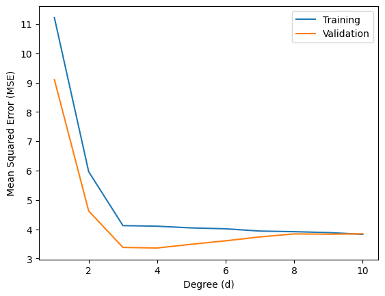

<!-- set all attributes used by VS Code Markdown Converter extension to blank above, so that it doesn't come in generated PDF -->

# FML Assignment 3 (Regression)

Submitted by: Sohang Chopra &lt;DA25M622&gt;

## Problem 1

Which of the following equations can be reformulated as linear regression models, treating ( _x, y_ )
as variables and ( _a, b_ ) as parameters? For each valid case, show the algebraic transformation that
converts the equation into linear regression form.

1. $y = a e^{b x}$
2. $y = \frac{a x}{b + x}$
3. $y = \frac{a}{x + b}$
4. $y = a (1 - e^{-b x})$

### Solution 1

1. Can be transformed into linear form: $\hat{y} = b x + \ln(a)$ where transformed $\hat{y} = \ln(y)$
2. Can be transformed into linear form: $\hat{y} = \frac{b}{a} \hat{x} + \frac{1}{a}$ where transformed $\hat{x} = \frac{1}{x}, \hat{y} = \frac{1}{y}$
3. Can be transformed into linear form: $\hat{y} = \frac{1}{a} \hat{x} + \frac{b}{a}$ where transformed $\hat{x} = \frac{1}{x}, \hat{y} = \frac{1}{y}$
4. Cannot be transformed into a linear form such that transformed x, y are independent of a, b


## Problem 2

Data on the monthly sales (y) in rupees and advertising spend (x) in rupees for 25 retail stores were collected. 
The mean and covariance matrix (about the mean) computed from the data is given:

$$z = \begin{pmatrix} y \\ x \end{pmatrix}, \quad \bar{z} = \begin{pmatrix} 200 \\ 400 \end{pmatrix}, \quad S_z = \begin{pmatrix} 1800 & 900 \\ 900 & 500 \end{pmatrix}$$

Assume a linear relation $y = a x + b$ exists between monthly sales $y$ and advertising spend $x$.
Compute the model parameters using OLS approach.

### Solution 2

Standard Deviations of x, y are $s_x = \sqrt{1800} = 90, s_y = \sqrt{500}$ and covariance is $cov(x,y) = 900$

$$
r = cov(x,y) / s_x s_y \quad (\text{Regression Coefficient}) \\
a = r s_y / s_x = cov(x,y) / s_x^2 = 900 / 1800 = 0.5 \\
b = \bar{y} - b \bar{x} = 400 - 0.5 * 200 = 300 \\
$$

So linear relationship is $y = 0.5 x + 300$


## Problem 3

We need to find a relationship between the saturated pressure $P_{sat}$ and the saturated temperature $T$ (boiling point) of a substance called n-hexane. 
The data provided in the linked file *vpdata.csv* contains measurements of saturated pressure and corresponding temperature for n-hexane, where the first column represents the temperature (in $K$) and the second column represents the pressure (in $kPa$). 
Theoretically, there is an equation called Clausius-Clapeyron equation which models the relationship between $P_{sat}$ and $T$, and is given by

$$\ln(P_{sat}) = A - \frac{B}{T}$$

Assuming that temperature measurements are noise-free and pressure measurements are noisy, do the following:

1. Use regression to obtain estimates of parameters $A$, $B$ .
2. Find maximum absolute error in predicting pressure in $kPa$ ?
3. What is $R^2$ score for the regression model?

### Solution 3

```python
import numpy as np
import pandas as pd
from sklearn.linear_model import LinearRegression
from sklearn.metrics import r2_score

df = pd.read_csv('vpdata.csv')

# fit model
xtransformed = (-1 / df['Temp']).to_frame()
ytransformed = np.log(df['Psat']).to_frame()
linreg = LinearRegression().fit(xtransformed, ytransformed)
print(linreg.coef_, linreg.intercept_)     # A, B

# evaluate
ypred = np.squeeze(linreg.predict(xtransformed))
ypred = np.exp(ypred)      # transformed space -> original space
print('Max Absolute Error:', np.max(np.abs(ypred - df['Temp'])))
print('R^2 Score:', r2_score(df['Temp'], ypred))
```

1. $A = 30.16773335$, $B = 4.53017516$
2. Max Absolute Error in predicting pressure = $7.849209255771072$ kPa
3. $R^2 = 0.9450108107197727$

## Problem 4

Consider the following data-generating process:

$$
x_{1,true}, x_{2,true} \sim \mathcal{N}(0,1^2) \\
y_{true} = 3 x_{1,true} - 2 x_{2,true}
$$

However, the observed variables are corrupted with measurement noise:

$$x_1 = x_{1,true} + \epsilon_1, \quad x_2 = x_{2,true} + \epsilon_2, \quad y = y_{true} + \epsilon_y$$

where $\epsilon_1, \epsilon_2 \sim \mathcal{N}(0, 0.5^2), \quad \epsilon_y \sim \mathcal{N}(0, 0.2^2)$

Generate $N = 200$ samples.

1. Fit a multiple linear regression model using Ordinary Least Squares (OLS). Report the estimated coefficients.
2. Implement Total Least Squares (TLS) using Singular Value Decomposition (SVD) and report the TLS coefficient estimates.
3. Compare OLS and TLS estimates with the true parameters $(3,-2)$. Which method is closer to the true parameters? Explain.

### Solution 4

```python
import numpy as np
import pandas as pd
from sklearn.linear_model import LinearRegression
from scipy.linalg import svd

rng = np.random.default_rng(seed=42)
N = 200

# generate random X, y
x1_true = rng.normal(0, 1, size=N)
x2_true = rng.normal(0, 1, size=N)
y_true = 3 * x1_true - 2 * x2_true
e1 = rng.normal(0, 0.5, size=N)
e2 = rng.normal(0, 0.5, size=N) 
ey = rng.normal(0, 0.2, size=N)
x1 = x1_true + e1
x2 = x2_true + e2
y = y_true + ey
X = np.vstack([x1, x2]).T

linreg = LinearRegression().fit(X, y)
print(f'OLS: coefficients={linreg.coef_}, intercept={linreg.intercept_}')

aug = np.column_stack([X, y])
aug = aug - np.mean(aug, axis=0)    # standardize X, y to 0 mean BUT NOT to 1 variance (since we want weights relation for original data, not transformed data)
U, s, Vh = svd(aug)    # left singular vectors are columns of U, right are rows of Vh
vX, vy = Vh[-1, :-1], Vh[-1, -1]
w = - vX / vy
print(f'TLS: coefficients={w}, intercept=0')
```

Calculated weights:

* OLS: coefficients=[ 2.32678514 -1.76295545], intercept=0.015768849913575744
* TLS: coefficients=[ 2.98468133 -2.12239001], intercept=0

TLS solution is closer to true weights: coefficients=(3,-2), intercept=0


## Problem 5

You are given a dataset *polynomial_regression_dataset.csv* of $N = 300$ observations $(x_i, y_i)$ where the response $y$ is generated from a nonlinear function with noise:

$$y = f(x) + \epsilon, \quad \epsilon \sim \mathcal{N}(0, \sigma^2)$$

but the form of $f(.)$ is unknown.

1. Split the dataset into a training set (70%) and a validation set (30%).
2. For polynomial degrees $d \in 1,2..10$, fit a polynomial regression model (without regularization) using the training data. 
   For each $d$, compute the Mean Squared Error (MSE) on both the training and validation sets. 
   Plot the training and validation MSE as functions of $d$, and use the plot to select an appropriate degree $d^*$ that balances underfitting and overfitting.
3. For the chosen degree $d^*$, fit the following regularized polynomial models using the training data 
   (Use K-fold cross-validation on the training set to select the best $\lambda$ for each method.):
    * Ridge regression with $\lambda \in \{10^{-4}, 10^{-3}, 10^{-2}, 10^{-1}, 1, 10\}$
    * Lasso regression with $\lambda \in \{10^{-4}, 10^{-3}, 10^{-2}, 10^{-1}, 1, 10\}$
4. For each method above (Ridge, Lasso), report:
    - The selected $\lambda$
    - Training MSE and cross-validation MSE
    - Validation set MSE using the final model
    - Estimated model coefficients
5. Based on your results:
    * Which regularization method performs best on the validation set? Explain why.
    * Does regularization improve generalization relative to the unregularized polynomial model? Justify using the plots and error values.
    * Discuss how the chosen regularizer affects model complexity and coefficient estimates.

### Solution 5

Imports:

```python
import numpy as np
import pandas as pd
from matplotlib import pyplot as plt
from sklearn.model_selection import train_test_split, cross_val_score
from sklearn.linear_model import LinearRegression, Ridge, Lasso
from sklearn.preprocessing import PolynomialFeatures
from sklearn.metrics import mean_squared_error
from sklearn.pipeline import make_pipeline
```

1. Split dataset into training set (70%) and validataion set (30%):

```python
df = pd.read_csv('polynomial_regression_dataset.csv')
Xtrain, Xval, ytrain, yval = train_test_split(df['x'], df['y'], train_size=0.7, random_state=42)
Xtrain, Xval = Xtrain.to_frame(), Xval.to_frame()
```

2. 

```python
train_mses = []
val_mses = []
weights = []
degrees = np.arange(1,11)
for d in degrees:
    pipeline = make_pipeline(PolynomialFeatures(degree=d), LinearRegression()).fit(Xtrain, ytrain)
    weights.append((pipeline[1].coef_, pipeline[1].intercept_))
    train_mses.append(mean_squared_error(ytrain, pipeline.predict(Xtrain)))
    val_mses.append(mean_squared_error(yval, pipeline.predict(Xval)))

plt.plot(degrees, train_mses, label='Training')
plt.plot(degrees, val_mses, label='Validation')
plt.xlabel('Degree (d)')
plt.ylabel('Mean Squared Error (MSE)')
plt.legend()
plt.show()
```

Training & Validation MSE vs $d$ Plot:



From plot, best degree is $d=3$. For this model:

```python
# 3-1 = 2 since 0-based indexing
print('Weights of best linear regression model:', weights[2])
print('MSE on Hidden Validation set:', val_mses[2])   
``` 

```
Weights of best linear regression model: (array([ 0.        ,  1.36115702, -0.83045106,  0.33329799]), np.float64(2.185583111621991))
MSE on Hidden Validation set: 3.3784353777264475
```

3. Fit Regularized polynomial models (Ridge, Lasso regression):

```python
alphas = [1e-4, 1e-3, 1e-2, 1e-1, 1, 10]

ridge_mses = []
for alpha in alphas:
    pipeline = make_pipeline(PolynomialFeatures(degree=3), Ridge(alpha, random_state=42))
    folds_mse = cross_val_score(pipeline, Xtrain, ytrain, cv=10, scoring='neg_mean_squared_error')   # Cross Validation (k=10) using MSE
    ridge_mses.append(np.mean(folds_mse))
best_idx = np.argmin(ridge_mses)
print('Best Ridge alpha:', alphas[best_idx])
print('Best Ridge Cross-Validation MSE:', -ridge_mses[best_idx])

lasso_mses = []
for alpha in alphas:
    pipeline = make_pipeline(PolynomialFeatures(degree=3), Lasso(alpha, random_state=42))
    folds_mse = cross_val_score(pipeline, Xtrain, ytrain, cv=10, scoring='neg_mean_squared_error')   # Cross Validation (k=10) using MSE
    lasso_mses.append(np.mean(folds_mse))
best_idx = np.argmin(lasso_mses)
print('Best Lasso alpha:', alphas[best_idx])
print('Best Lasso Cross-Validation MSE:', -lasso_mses[best_idx])
```

```
Best Ridge alpha: 10
Best Ridge Cross-Validation MSE: 4.3378998651875
Best Lasso alpha: 10
Best Lasso Cross-Validation MSE: 11.072690472366679
```

4. 

```python
ridge_pipeline = make_pipeline(PolynomialFeatures(degree=3), Ridge(alpha=10, random_state=42)).fit(Xtrain, ytrain)
print('Ridge Training MSE:', mean_squared_error(ytrain, ridge_pipeline.predict(Xtrain)))
print('Ridge Hidden Validation set MSE:', mean_squared_error(yval, ridge_pipeline.predict(Xval)))
print('Ridge Weights:', ridge_pipeline[1].coef_, ridge_pipeline[1].intercept_)

lasso_pipeline = make_pipeline(PolynomialFeatures(degree=3), Lasso(alpha=10, random_state=42)).fit(Xtrain, ytrain)
print('Lasso Training MSE:', mean_squared_error(ytrain, lasso_pipeline.predict(Xtrain)))
print('Lasso Hidden Validation set MSE:', mean_squared_error(yval, lasso_pipeline.predict(Xval)))
print('Lasso Weights:', lasso_pipeline[1].coef_, lasso_pipeline[1].intercept_)
```

```
Ridge Training MSE: 4.1299298445990225
Ridge Hidden Validation set MSE: 3.432545904186892
Ridge Weights: [ 0.          1.24034723 -0.82431307  0.35195248] 2.167858892159883

Lasso Training MSE: 10.829502537602314
Lasso Hidden Validation set MSE: 10.38260606210781
Lasso Weights: [ 0.          0.         -0.          0.45976504] -0.42862201003005257
```

* Ridge performs better on hidden validation set (MSE = 3.43) than Lasso.
* Unregularized Linear Regression MSE (on hidden validation set) is 3.359. Ridge performs slightly better (MSE = 3.43) but Lasso is much worse (10.38).
  So here Ridge Regression improved generalization with best $\lambda = 10$.
* Ridge and unregularized regression both have same model complexity (4 coefficients & 1 intercept). Learnt coefficients in both are:
    * Unregularized: $coefficients=[0, 1.36115702, -0.83045106, 0.33329799], \quad intercept=2.185583111621991$
    * Ridge: $coefficients=[0, 1.24034723, -0.82431307, 0.35195248], \quad intercept=2.167858892159883$


## Problem 6

**Note:** Solve this problem manually using a calculator but do not use code. 
          Your submission should include manual calculations.
          Feel free to approximate the values to 2 or 3 decimals.

A company is studying how *monthly online sales* $S$ (in units) change with *monthly ad spend* $A$ (in lakhs of rupees). 
Management believes that the effect of ad spend is best described in terms of *percentage change in sales* rather than absolute change.

For the last 5 months, the data are:

$A$ (lakhs) | 1   | 2   | 3   | 4   | 5
----------- | --- | --- | --- | --- | ---
$S$ (units) | 200 | 270 | 330 | 390 | 440

1. Using the above data, estimate a model that makes the relationship between $A$ and $S$ *approximately linear* when the output is expressed in *percentage terms* .
2. Using your fitted model, estimate the *approximate percentage increase in sales* when ad spend increases $A$ from 2 lakhs to 3 lakhs .
3. Is the model implying a *constant percentage gain per lakh* or a *diminishing percentage gain per lakh* ? Justify your answer.

### Solution 6

1.

$A$ | $S$ | $S_\% = (S_i - S_{i-1}) / S_{i-1}$
--- | --- | -----------------------------------
1   | 200 | _
2   | 270 | (270-200)/200 = 35%
3   | 330 | (330-270)/270 = 22.22%
4   | 390 | (390-330)/330 = 18.18%
5   | 440 | (440-390)/390 = 12.82%  

Linear Regression between $A$ and $S_\%$ (ignoring first row with $A=1$ as it has no appropriate corresponding % change in S):

$$
\bar{x} = (2+3+4+5) / 4 = 3.5 \quad (\text{Mean of } A) \\
\bar{y} = (35+22.22+18.18+12.82) / 4 = 22.05 \quad (\text{Mean of } S_\%) \\
\sum (x - \bar{x})^2 = (2-3.5)^2 + (3-3.5)^2 + (4-3.5)^2 + (5-3.5)^2 = 5 \\
\sum (x - \bar{x}) (y - \bar{y}) = (2-3.5)*(35-22.05) + (3-3.5)*(22.22-22.05) + (4-3.5)*(18.18-22.05) + (5-3.5)*(12.82-22.05) = -35.29 \\
m = \frac{\sum{(x - \bar{x}) (y - \bar{y})}}{\sum (x - \bar{x})^2} = -35.29 / 5 \approx -7.06 \quad (\text{Slope}) \\
c = \bar{y} - m \bar{x} = 22.05 - (-7.06)*3.5 = 46.758
$$

So fitted model is: $S_\% = -7.06 A + 46.758$ (NOTE: here $A$ input is the value in lakhs AFTER change, not before)

2. $S_\% = -7.06 * 3 + 46.758 \approx 25.58%$

3. Model is implying a diminishing percentage gain per lakh (since slope is negative in fitted linear regression model).


## Problem 7

Consider the simple linear regression model:

$$y = w_0 + w_1 x$$

Given $N$ samples of data, the Ordinary Least Squares (OLS) estimator minimizes the sum of squared residuals:

$$ SSR = \sum_{i=1}^N (y_i - w_0 - w_1 x_i)^2 $$

to estimate the parameters.

1. Derive the first-order conditions by differentiating $SSR$ with respect to $w_0$ and $w_1$ and setting the derivatives equal to zero.
2. Using the result from part 1, show that the OLS estimator of the slope is

$$ \beta_1 = \frac{\sum_{i=1}^N (x_i - \bar{x}) (y_i - \bar{y})}{\sum_{i=1}^N (x_i - \bar{x})^2} $$

### Solution 7

Partial derivative of SSR wrt $w_0$ set to 0:

$$
\frac{\partial SSR}{\partial w_0} = \sum_{i=1}^N 2(y_i - w_0 - w_1 x_i)(-1) = 0 \\
\implies -2 \sum_{i=1}^N (y_i - w_0 - w_1 x_i) = 0 \\ 
\implies \sum_{i=1}^N y_i - \sum_{i=1}^N w_0 - \sum_{i=1}^N w_1 x_i = 0 \\
\implies \sum y_i = N w_0 + w_1 \sum x_i \quad (\text{since } \sum_{i=1}^N w_0 = N w_0)
$$

Partial derivative of SSR wrt $w_1$ set to 0:

$$
\frac{\partial SSR}{\partial w_1} = \sum_{i=1}^N 2(y_i - w_0 - w_1 x_i)(-x_i) = 0 \\
\implies -2 \sum_{i=1}^N x_i(y_i - w_0 - w_1 x_i) = 0 \\
\implies \sum_{i=1}^N x_i y_i - w_0 \sum_{i=1}^N x_i - w_1 \sum_{i=1}^N x_i^2 = 0 \\
\implies \sum x_i y_i = w_0 \sum x_i + w_1 \sum x_i^2
$$

First, we solve the first normal equation for $w_0$ by dividing by $N$:
$$\bar{y} = w_0 + w_1 \bar{x} \implies w_0 = \bar{y} - w_1 \bar{x}$$

Now, substitute $w_0$ into the second normal equation:
$$\sum x_i y_i = (\bar{y} - w_1 \bar{x}) \sum x_i + w_1 \sum x_i^2$$
$$\sum x_i y_i = \bar{y} \sum x_i - w_1 \bar{x} \sum x_i + w_1 \sum x_i^2$$

Rearrange to group the $w_1$ terms:
$$\sum x_i y_i - \bar{y} \sum x_i = w_1 \left( \sum x_i^2 - \bar{x} \sum x_i \right)$$

Using the identities $\sum x_i = N\bar{x}$ and $\sum y_i = N\bar{y}$, we can rewrite the components:
1. **Numerator:** $\sum x_i y_i - N\bar{x}\bar{y} = \sum (x_i - \bar{x})(y_i - \bar{y})$
2. **Denominator:** $\sum x_i^2 - N\bar{x}^2 = \sum (x_i - \bar{x})^2$

Thus, the OLS estimator for the slope $w_1$ and intercept $w_0$ is:

$$
w_1 = \frac{\sum_{i=1}^N (x_i - \bar{x}) (y_i - \bar{y})}{\sum_{i=1}^N (x_i - \bar{x})^2} \\
w_0 = \bar{y} - w_1 \bar{x}
$$

