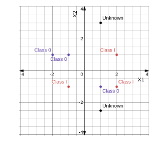
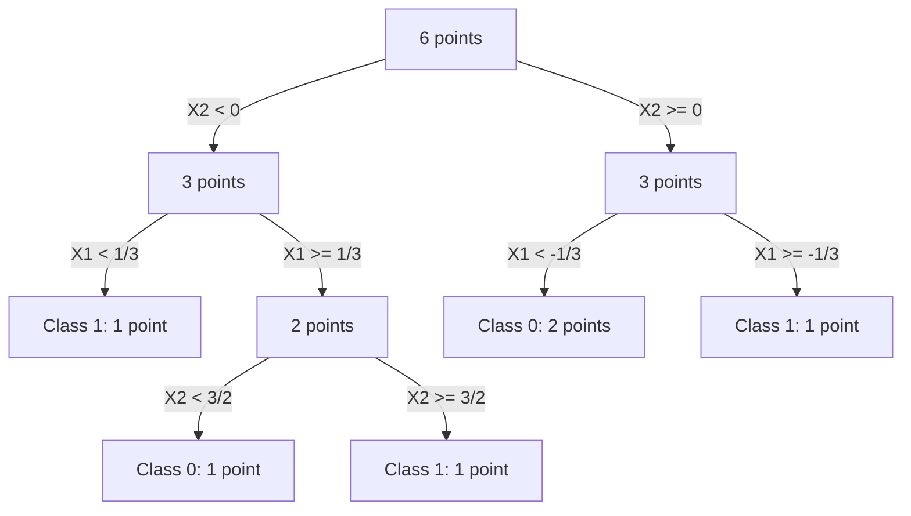
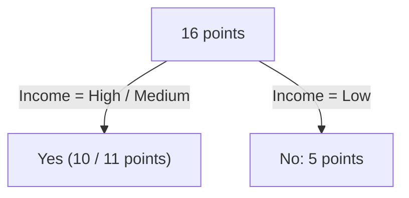

<!-- set all attributes used by VS Code Markdown Converter extension to blank above, so that it doesn't come in generated PDF -->

# DA5400W Foundations of Machine Learning, Assignmet 4

## Problem 1: Solve the problem by hand using a calculator

Consider the following dataset used to classify industrial components as **Pass** or **Fail** :

Sample | Temperature (Celcius) | Vibration (mm/s) | Class
------ | --------------------- | ---------------- | ------
1      | 40                    | 1.0              | Pass
2      | 42                    | 1.2              | Pass
3      | 45                    | 1.1              | Pass
4      | 60                    | 4.5              | Fail
5      | 62                    | 4.8              | Fail
6      | 65                    | 5.0              | Fail

A new sample has features (50, 1.5).

1. Classify the new sample using the 3-nearest neighbors (3-NN) classifier with Euclidean distance, **without** performing any feature scaling.
2. Standardize each feature using the mean and standard deviation computed from the training data, and then classify the new sample again using the 3-NN classifier with Euclidean distance.
3. Based on your results, comment on the importance of feature scaling in the KNN classifier.

### Solution 1

1. Classifying (50,1.5) using raw features:

Sample | Temperature (Celcius) | Vibration (mm/s) | Class | Distance from (50, 1.5)
------ | --------------------- | ---------------- | ----- | ------------------------
1      | 40                    | 1.0              | Pass  | 10.01
2      | 42                    | 1.2              | Pass  |  8.05
3      | 45                    | 1.1              | Pass  | 25.16
4      | 60                    | 4.5              | Fail  | 10.44
5      | 62                    | 4.8              | Fail  | 12.44
6      | 65                    | 5.0              | Fail  | 15.40

3 nearest neighbours are (42, 1.2) (Pass), (40, 1.0) (Pass), (60, 4.5) (Fail). So sample is classified as **Pass**.

2. Temperature has mean 62.3, standard deviation 10.3 ; Vibration has mean 2.9, standard deviation 1.8 . Standardized Point is $(50-62.3)/10.3 = -1.2, (1.5-2.9)/1.8 = -0.8$

Sample | Standard Temperature  | Standard Vibration | Class | Distance from (-1.2, -0.8)
------ | --------------------- | ------------------ | ----- | --------------------------
1      | -1.2                  | -1.0               | Pass  | 0.20
2      | -1.0                  | -0.9               | Pass  | 0.22
3      | -0.7                  | -0.9               | Pass  | 0.51
4      |  0.7                  |  0.8               | Fail  | 2.48
5      |  0.9                  |  1.0               | Fail  | 2.76
6      |  1.2                  |  1.1               | Fail  | 3.06

3 nearest neighbours (-1.2, -1.0), (-1.0, -0.9), (-0.7, -0.9) are all Pass. So sample is classified as **Pass**.

3. When using raw features, neighbour distances are dominated by Temperature and Vibration has negligible effect - because Temperature scale is much more than Vibration.
   Feature Scaling fixed this issue and gave equal importance to both features, now classification for any point is more accurate.

## Problem 2

A training dataset and a test dataset for a binary classification problem are provided in the accompanying Excel file *knn_imbalanced_dataset_Q2.xlsx*. 
The target variable is `Class`, which takes values **Normal** and **Fault**. The training dataset is imbalanced, with the minority class corresponding to **Fault** .

Use the given datasets to answer the following questions:

1. Train a K-nearest neighbors (KNN) classifier on the training dataset using all the input features. Before training, apply appropriate feature scaling. Use Euclidean distance and choose a suitable value of $k$ using a reasonable validation strategy.
2. Using the model obtained in part 1, predict the class labels for the test dataset.
3. Based on the predictions from part 2, compute the following performance measures on the test dataset:
   * confusion matrix,
   * precision,
   * recall,
   * F1-score,
   * balanced accuracy.
4. Since the training dataset is imbalanced, apply **two different methods** to handle class
imbalance and retrain the KNN classifier. You may choose any two of the following:
   - random oversampling of the minority class,
   - random undersampling of the majority class,
   - synthetic oversampling such as SMOTE,
   - distance-weighted KNN.
5. For each of the two imbalance-handling methods chosen in part (d), retrain the classifier and
evaluate it on the same test dataset. Report:
    * the chosen method,
    * the value of _k_ used,
    * the confusion matrix,
    * the F1-score,
    * the balanced accuracy.
 
Compare the results of the baseline KNN classifier in part 2 with the two imbalance-handling approaches in part 5. 
Comment on whether handling class imbalance improves performance, especially for the minority class.

### Solution 2

TODO: code

## Problem 3

Consider the following dataset of the students of class. 
Apply the Naive Bayes classifier on the dataset and estimate the probability of a student excelling in the end-semester exam given her mid-semester performance is "Average" and has submitted all her assignments. 
Please ensure you show all the necessary calculations by hand.

|Mid Sem Performance|Submitted Assignments|Aced End Sem|
|---|---|---|
|Below Average|False|False|
|Below Average|False|False|
|Below Average|True|True|
|Below Average|False|False|
|Average|True|False|
|Average|True|True|
|Average|False|False|
|Average|True|True|
|Average|True|True|
|Above Average|False|True|
|Above Average|True|True|

### Solution 3

For inference point (Average, Submited Assignments = True) :

* P(False) = 5/10 = 0.5, P(True) = 5/10 = 0.5
* P(Aced End Sem | Mid Sem Performance) values are: P(False | Average) = 2/5 = 0.4, P(True | Average) = 3/5 = 0.8
* P(Aced End Sem | Submitted Assignments) values are: P(False | Submitted Assignments=True) = 2/7, P(True | Submitted Assignments=True) = 5/7

Total Naive Bayes likelihoods are: False -> $0.5 * 0.4 * 2/7 = 0.05$, True -> $0.5 * 0.8 * 5/7 = 0.28$

Student has $0.28/(0.28+0.05) = 0.848$ (84.8%) probability of excelling in exam.

## Problem 4

Consider a Multinomial Naive Bayes classifier for a classification problem with $K$ classes and a vocabulary of size $V$ . 
Let $\theta_{jc}$ denote the probability of observing feature (or word) $j$ in class $c$,
where

$$\sum_{j=1}^V \theta_{jc} = 1, \quad \theta_{jc} \ge 0$$

Suppose that for class $c$, the total count of feature $j$ aggregated over all training samples belonging to class $c$ is $N_{jc}$ .

1. Write down the likelihood function of the training data for class $c$ under the multinomial model.
2. By taking the logarithm of the likelihood and using the constraint $\sum_{j=1}^V \theta_{jc} = 1$, derive the maximum likelihood estimator (MLE) of $\theta_{jc}$ .
3. State the final MLE expression clearly in terms of the counts $N_{jc}$ .

### Solution 4

1. Likelihood (product of each class's probability) is $L = \Pi_{c=1}^K \Pi_{j=1}^V \theta_{jc}$
2. Log-Likelihood $\ln(L) = \sum_{c=1}^K \sum_{j=1}^V \ln(\theta_{jc})$ has to be maximized, subject to $\sum_{j=1}^V \theta_{jc} = 1$. TODO
3. TODO

## Problem 5

Show that for $\frac{\partial \sigma}{\partial a} = \sigma (1 - \sigma)$ for the logistic sigmoid function.

### Solution 5

$$
\sigma = \frac{1}{1 + e^{-a}} \quad (\text{Sigmoid Function}) \\
\frac{\partial \sigma}{\partial a} = \frac{-1}{(1 + e^{-a})^2} (- e^{-a}) = \frac{1}{1 + e^{-a}} \left (1 - \frac{1}{1 + e^{-a}} \right) = \sigma (1 - \sigma)
$$

Hence proved.

## Problem 6

A multinomial logistic regression classifier is used to classify a production batch into one of three categories:

$$C_1 = \text{Accept}, \quad C_2 = \text{Rework}, \quad C_3 = \text{Reject}$$

For a given batch, the model produces the following class scores:

$$z_1 = 2.4, \quad z_2 = 1.8, \quad z_3 = 0.6$$

1. Compute the softmax probabilities for all three classes and mention the predicted class.
2. Compute the odds ratio $\frac{P(C_1 | x)}{P(C_2 | x)}$ and interpret its meaning.
3. Suppose that due to a calibration shift, the same constant 5 is added to all three scores, would the classifier predictions be affected?
4. Suppose instead that only the score of class $C_3$ increases from 0.6 to 2.0, while the other two scores remain unchanged. Recompute the softmax probabilities and comment on how the prediction confidence changes.

### Solution 6

Softmax formula is:

$$P(C_i) = \frac{e^{z_i}}{\sum_j e^{z_j}}$$

1. Softmax probabilities: $P(C_1 | x) = 0.58, P(C_2 | x) = 0.32, P(C_3 | x) = 0.10$
2. Odds ratio $\frac{P(C_1 | x)}{P(C_2 | x)} = 0.58 / 0.32 = 1.8125$ means class $C_1$ is 1.8 times more likely to be predicted than $C_2$ for any random input sample.
3. If same constant 5 were to be added to all 3 scores, order of softmax probabilities would remain the same so classifier predictions would not be affected.
4. New softmax probabilities are $P(C_1 | x) = 0.45, P(C_2 | x) = 0.25, P(C_3 | x) = 0.30$. Previously $C_3$ was less likely than $C_2$, now it's more likely to be predicted than $C_2$ for a random sample.

## Problem 7

Consider the plotted data points in Fig. 1. The problem involves two features (X1, X2) and two classes (0, 1). There are two unknown points in the figure. Answer the following questions:

1. Develop a decision tree-based classifier with the available data in the figure (Class 0 and Class1), with the Unknown data points being the test data.
2. Provide calculations for determining each split, including root nodes. One can use missclassification rate, entropy, and Gini as criteria.
3. If you include one of the unknown points and arbitrarily assign one of the classes, will it change the decision tree?

### Solution 7

$$Gini = 1 - \sum_j p_j^2$$

* Initial (all points in root r): P(Class 0) = 3/6 = 0.5, P(Class 1) = 3/6 = 0.5, Gini Index = 1 - 0.5^2 - 0.5^2 = 0.5, Mean X1 = (-2-1-1+1+2+2)/6 = 1/6, Mean X2 = (1+1+1-1-1-1)6 = 0
* Available Splits (both have equal Info Gain, so splitting based on X2 (chosen randomly)):
    * X1 < 1/6 (P0 = 2/3, P1 = 1/3, Gini = 1 - (2/3)^2 - (1/3)^2 = 4/9), X1 >= 1/6 (P0 = 1/3, P1 = 2/3, Gini = 1 - (1/3)^2 - (2/3)^2 = 4/9) ; Info Gain = $0.5 - 0.5*4/9 - 0.5*4/9 = 0.055$
    * X2 < 0 (P0 = 2/3, P1 = 1/3, Gini = 1 - (2/3)^2 - (1/3)^2 = 4/9), X2 >= 0 (P0 = 1/3, P1 = 2/3, Gini = 1 - (1/3)^2 - (2/3)^2 = 4/9) ; Info Gain = $0.5 - 0.5*4/9 - 0.5*4/9 = 0.055$
* In bottom child (X2 < 0): Mean X1 = (-1+1+2)/3 = 1/3; splits: X1 < 1/3 (P0 = 0, P1 = 1, Gini = 1-0^2-1^2 = 0), X1 >= 1/3 (P0 = 0.5, P1 = 0.5, Gini = 1-0.5^2-0.5^2 = 0.5) ; Info Gain = 4/9 - 1/3 (0) - 2/3 (0.5) = 1/9
* In top child (X2 >= 0): Mean X1 = (-2-1+2)/3 = -1/3; splits: X1 < -1/3 and X1 >= 1/3  (perfect classify so stop (both branches have data points))
* In chid (X2 < 0 => X1 >= 1/3): Mean X2 = (1+2)/2 = 3/2; splits: X2 < 3/2 and X2 >= 3/2 (perfect classify so stop (both branches have data points of a single class))

Decision Tree formed is:

Yes, if one of the unknown outlier points were included, it would change decision tree. For example if (2,3) point were included as Class 0, then leaf (X2 >= 0, X1 >= -1/3) would no longer be pure (i.e. have a mix of classes) and so would be split again.

## Problem 8

Train a decision tree using the first 16 observations. The remaining two observations can be used for the test data. Then, answer the following questions regarding the fitted decision tree.

1. Is it possible to prune the tree? Which criteria can be used to prune the tree?
2. Any feature can be dropped? If "yes", which feature should be dropped?
3. Is it possible to get pure labels for the fitted tree?

Sr. No. | Income  | Application Usage | Age Group | Favorite Color | Classes
------- | ------- | ----------------- | --------- | -------------- | --------
1       | High    | Daily             | > 25      | Red            | Yes
2       | High    | Daily             | > 25      | Blue           | Yes
3       | High    | Daily             | > 25      | Green          | Yes
4       | High    | Daily             | > 25      | Red            | Yes
5       | High    | Daily             | > 25      | Blue           | Yes
6       | High    | Daily             | > 25      | Green          | Yes
7       | High    | Daily             | > 25      | Red            | Yes
8       | High    | Daily             | > 25      | Blue           | Yes
9       | High    | Daily             | > 25      | Green          | Yes
10      | High    | Daily             | > 25      | Red            | No
11      | Low     | Monthly           | < 25      | Blue           | No
12      | Low     | Weekly            | > 25      | Green          | No
13      | Low     | Daily             | 25 - 45   | Red            | No
14      | Low     | Monthly           | > 25      | Blue           | No
15      | Low     | Weekly            | < 25      | Green          | No
16      | Medium  | Weekly            | < 25      | Red            | Yes
17      | Medium  | Weekly            | < 25      | Red            | Yes
18      | Medium  | Weekly            | < 25      | Blue           | No
 
### Solution 8

$$Gini = 1 - \sum_j p_j^2$$

In train data (first 16), Income (High: 10, Medium: 1, Low: 5), Application Usage (Daily: 11, Weekly: 3, Monthly: 2), Age Group (>25: 12, 25-45: 1, <25: 3), Favorite Color (Red: 6, Blue: 5, Green: 5)

pYes = 11/16, pNo = 5/16, Gini = 1 - (11/16)^2 - (5/16)^2 = 110/256 = 0.429

* Root split on Income: High/Medium (pYes = 10/11, pNo = 1/11, Gini = 1 - (10/11)^2 - (1/11)^2 = 20/121), Low (only No, Gini = 0) -- Info Gain = 0.429 - 20/121 * 10/16 = 0.325
* Income=High/Medium split on Favorite Color: Red (pYes = 4/5, pNo = 1/5, Gini = 1 - 0.8^2 - 0.2^2 = 0.22), Green/Blue (only Yes, Gini = 0) -- Info Gain = 0.165 - 0.22*5/11 = 0.065
* Income=High/Medium => Color=Red split on Application Usage: Weekly (only Yes, Gini = 0), Daily/Monthly (pYes = 3/4, pNo = 1/4, Gini = 1 - 0.75^2 - 0.25^2 = 0.375) -- Info Gain = 0.22 - 0.375*5/11 = 0.049 . We cannot split more as there's no more differentiating feature left.

Pruning can be done based on criteria (minimum Info Gain should be say 0.1):
* Split based on Application Usage should be pruned as Info Gain is too low (0.049), and both its children have result classifiation Yes only.
* Split based on Income should also be pruend as its Info Gain is too low (0.065) and both its children have result classification Yes only.

Final Pruned Decision Tree is:

Favorite Color feature should be dropped. Also any 2 features out of Income, Application Usage and Age Group should be dropped as they are highly correlated and redundant.

No we cannot assign pure labels to leaves of fitted tree as one leaf is impure (has points with multiple classes).

## Problem 9

Consider a data set comprising 400 data points from class C1 and 400 data points from class C2.
Suppose that a tree model A splits these into (300, 100) at the first leaf node and (100, 300) at the second leaf node, where $(n,m)$ denotes that $n$ points are assigned to C1 and $m$ points are assigned to C2. 
Similarly, suppose that a second tree model B splits them into (200, 400) and (200, 0) at the first leaf and the second leaf nodes.

1. Evaluate the misclassification rates for the two trees and show that they are equal.
2. Evaluate the cross-entropy and Gini index for the two trees and show that they are both lower for tree B than for tree A.

### Solution 9

1. Mis-Classification Rate = No. of Incorrect Predictions / No. of Correct Predictions

Tree A: 
* Leaf 1 predicts C1 (as 300 > 100), so 100 C2 mis-classified as C1
* Leaf 2 predicts C2 (as 100 < 300), so 100 C1 mis-classified as C2
* Mis-Classification Rate = (100+100)/(300+300) = 2/6

Tree B:
* Leaf 1 predicts C2 (as 200 < 400), so 200 C1 mis-classified as C2
* Leaf 2 predicts C1 (as all 200 are C1), no mis-classifications
* Mis-Classification Rate = 200/(400+200) = 2/6

So misclassification rates for both trees are equal.

2. 

* Formulae: $Gini = 1 - P(C_1)^2 - P(C_2)^2, \quad Entropy =  - P(C_1) \log2(P(C_1)) - P(C_2) \log2(P(C_2))$
* Tree A:
  * Leaf 1 (400 points): $P(C_1) = 300/400 = 0.75, P(C_2) = 100/400 = 0.25, \quad Gini = 1 - 0.75^2 - 0.25^2 = 0.375, \quad Entropy = - 0.75 \log2(0.75) - 0.25 \log2(0.25) = 0.81$
  * Leaf 2 (400 points): $P(C_1) = 100/400 = 0.25, P(C_2) = 300/400 = 0.75, \quad Gini = 0.375, \quad Entropy = 0.81$
  * Overall (weighted): $Gini = 0.5*0.375 + 0.5*0.375 = 0.375, \quad Entropy = 0.5*0.81 + 0.5*0.81 = 0.81$
* Tree B:
  * Leaf 1 (600 points): $P(C_1) = 200/600 = 0.33, P(C_2) = 400/600 = 0.67, \quad Gini = 1 - 0.33^2 - 0.67^2 = 0.44, \quad Entropy = - 0.33 \log2(0.33) - 0.67 \log2(0.67) = 0.914$
  * Leaf 2 (200 points): $P(C_1) = 1, P(C_2) = 0, \quad Gini = 0, \quad Entropy = 0$
  * Overall (weighted): $Gini = 0.44*6/8 + 0*2/8 = 0.33, \quad Entropy = 0.914*6/8 + 0*2/8 = 0.6855$
  
Tree B is better as overall Gini Index and Entropy are both lower in it than Tree A.

## Problem 10

Consider the following binary classification dataset with labels $y_i \in \{-1, +1\}$ :

Sample $i$ | True label $y_i$ | Prediction of weak classifier $h_1(x_i)$
---------- | ---------------- | -----------------------------------------
1          | +1               | +1
2          | +1               | +1
3          | +1               | -1
4          | -1               | -1
5          | -1               | +1
6          | -1               | -1

Assume that initially all training samples have equal weights:

$$w_i^{(1)} = \frac{1}{6}, \quad i = 1, \cdots, 6$$

AdaBoost is applied using the above weak classifier as the classifier obtained in the first round.

1. Compute the weighted classification error $\epsilon_1$ of the weak classifier $h_1$.
2. Compute the classifier weight
3. Update the sample weights and normalise them to 1. Report the updated weights for all six samples.
4. Based on the updated weights, identify which samples will receive greater emphasis in the next boosting round. Briefly explain why.
5. Suppose that in the second round, the weak classifier $h_2$ makes mistakes only on samples 2 and 4. Using the updated weights from part 3, compute the weighted error $\epsilon_2$ of $h_2$.
6. Without carrying out the full weight update again, explain whether $h_2$ is expected to receive a larger or smaller classifier weight than $h_1$, based on the value of $\epsilon_2$.

### Solution 10

NOTE: While calculating $\epsilon_m$, we use 1 **for wrong predictions**, 0 for correct prediction.

Learner weight is $\eta_m = \frac{1}{2} \ln(\frac{1 - \epsilon_m}{\epsilon_m})$

Updated sample weight in each step (for new learner, before normalization) is $w_{m+1,i} = w_{m,i} exp(- \eta_m y_i f(x_i))

1. Mis-classification rate $\epsilon_1 = 0*1/6 + 0*1/6 + 1*1/6 + 0*1/6 + 1*1/6 + 0*1/6 = 1/3 = 0.33$
2. Learner weight is $\eta_1 = 0.5 \ln((2/3) / (1/3)) = 0.5 \ln(2) = 0.346$
3. Calculating new sample weights:
   * $w_1 = 1/6 exp(-0.346 * 1 * 1) = 0.118, w_2 = 1/6 exp(-0.346 * 1 * 1) = 0.118, w_3 = 1/6 exp(-0.346 * 1 * (-1)) = 0.235, w_4 = 0.118, w_5 = 0.235, w_6 = 0.118$
   * sum = 0.942; Normalizing so they sum to 1: $w_1 = 0.118/0.942 = 0.125, w_2 = 0.125, w_3 = 0.249, w_4 = 0.125, w_5 = 0.249, w_6 = 0.125$
4. $w_3$, $w_5$ are higher so 3rd and 5th samples will recieve more attention in next boosting round. It's because they were predicted wrongly this time, so next weak classifier needs to learn to correct errors in these.
5. Weighted error $\epsilon_2 = w_2 (1) + w_4 (1) = 0.125 + 0.125 = 0.250$
6. $h_2$ should recieve less classifier weight than $h_1$ as its weighted error is less. NOTE: This weighted error is actually better when it's higher as it's fraction of wrong predictions!