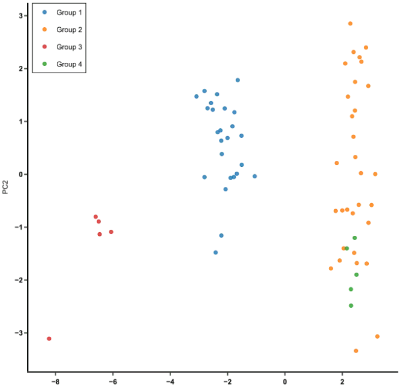
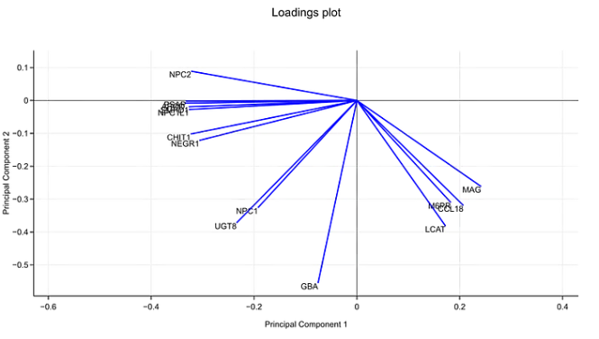
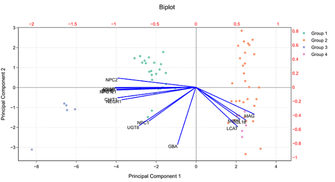

# DA5401 : Data Analytics Lab

Prof Arun Ayyar &lt;arun.ayyar@dsai.iitm.ac.in&gt;

This will have practical session for theory that is taught in [Machine Learning](../DA5400W_MachineLearning/) class.

Libraries: 
* Numpy
* Pandas
* Scipy
* Scikit-learn
* Seaborn

**Classification Errors**: RMSE (lower is better), R^2 (higher is better)

### PCA

[PCA Plots](https://bioturing.medium.com/how-to-read-pca-biplots-and-scree-plots-186246aae063):

PCA Score (scatter) Plot:



PCA Loading Plot shows how strongly each characterstic influences a principal component (X,Y axes are 2 principal components, each original component's vector is (x,y) of how much it influences the 2 principal components):
* when 2 feature vectors have a small angle between them => positively correlated
* right angle => likely no correlation
* (diverge) greater than 90 angle => negative correlation



PCA Biplot (score + loading):



### Optimize methods

Scalar unconstrained minimization (requires strict bounds ie not open-ended `np.inf`): `scipy.optimize.minimize_scalar(lambda x: y(x), bounds=(0,5000), method='bounded')`

Each of these is a method choice available in (vector minimization):

```python
from scipy.optimize import minimize, LinearConstraint, NonLinearConstraint
constraint1 = LinearConstraint(A, lb, ub)    # lb <= A.dot(x) <= ub
bounds = [(x1_lo, x1_hi), (x2_lo, x2_hi), ...]  # lower,upper for each elem in 1D x
minimize(lambda x: objective(x), initial_guess_x, jac=lambda x: objective_gradient(x), method='METHOD', constraints=[constraint1], bounds=bounds)`
```

Feature | SLSQP | BFGS | Nelder-Mead | CG
------- | ----- | ---- | ----------- | ----------
Full Form | Sequential Least SQuares Programming | Broyden-Fletcher-Goldfarb-Shanno | _ | Conjugate Gradient
Theory | Solves a sequence of quadratic subproblems. | A Quasi-Newton method that approximates the Hessian. | Geometric search using a moving simplex (triangle/tetrahedron). | Uses conjugate directions to find the minimum.
Requires Gradient? | Yes | Yes | No | Yes
Convergence | Fast (for constrained) | Very Fast (Superlinear) | Slow | Moderate
Problem Type | Linear constraints | Smooth, medium-scale unconstrained | Noisy or non-differentiable functions. | Large-scale problems (memory efficient).

### Clustering

Centroid = mean of all points in a cluster, Radius = max distance bw centroid and any point in cluster, Diameter = max pairwise distance bw any 2 points in cluster

Diameter is NOT 2*Radius

### Choosing Metric

| Metric | Requires Labels | Range | Best Value | Use When |
|--------|----------------|-------|------------|----------|
| **Purity** | Yes | [0, 1] | 1 | Simple interpretation |
| **Entropy** | Yes | [0, log k] | 0 | Information-theoretic view |
| **RAND Index** | Yes | [0, 1] | 1 | Pair-wise agreement |
| **Adj. RAND** | Yes | [-1, 1] | 1 | Corrects for chance |
| **Silhouette** | No | [-1, 1] | 1 | No ground truth available |
| **Adj. MI** | Yes | [0, 1] | 1 | Information-based, corrected |

**Recommendations:**
- **With ground truth**: Use Adjusted RAND or Adjusted Mutual Information
- **Without ground truth**: Use Silhouette Score
- **For interpretation**: Use Purity (easy to understand)
- **For research**: Report multiple metrics

### Choosing Cluster Algorithm

| Algorithm | Cluster Shape | Requires k | Handles Noise | Time Complexity | Best For |
|-----------|---------------|------------|---------------|-----------------|----------|
| **K-Means** | Spherical | Yes | No | O(nkt) | Large datasets, spherical clusters |
| **Hierarchical** | Any | No | No | O(n²log n) | Small datasets, hierarchy needed |
| **DBSCAN** | Arbitrary | No | Yes | O(n log n) | Arbitrary shapes, noise detection |
| **Spectral** | Non-convex | Yes | No | O(n³) | Graph data, complex shapes |

##### Decision Guide

**Use K-Means when:**
- Clusters are roughly spherical
- You know k in advance
- You have large datasets
- Speed is important

**Use Hierarchical when:**
- You need a hierarchy of clusters
- You don't know k
- Dataset is small (< 10,000 points)
- You want to explore different k values

**Use DBSCAN when:**
- Clusters have arbitrary shapes
- You need to identify outliers
- Cluster density is roughly uniform
- You don't know k

**Use Spectral when:**
- Data has graph structure
- Clusters are non-convex
- You can afford computational cost
- K-Means fails on your data

#### Choosing Cluster Evaluation Metric

| Metric | Requires Labels | Range | Best Value | Use When |
|--------|----------------|-------|------------|----------|
| **Purity** | Yes | [0, 1] | 1 | Simple interpretation |
| **Entropy** | Yes | [0, log k] | 0 | Information-theoretic view |
| **RAND Index** | Yes | [0, 1] | 1 | Pair-wise agreement |
| **Adj. RAND** | Yes | [-1, 1] | 1 | Corrects for chance |
| **Silhouette** | No | [-1, 1] | 1 | No ground truth available |
| **Adj. MI** | Yes | [0, 1] | 1 | Information-based, corrected |

**Recommendations:**
- **With ground truth**: Use Adjusted RAND or Adjusted Mutual Information
- **Without ground truth**: Use Silhouette Score
- **For interpretation**: Use Purity (easy to understand)
- **For research**: Report multiple metrics

### Agglomerative Clustering

4 Linkage Methods: Ward (recommended usually: min within-cluster var), distance bw any 2 points: Single (min), Complete (max), Average

## Midsem Syllabus

- [x] Optimization: Linear `linalg` & Non-Linear `minimize_scalar`, `minimize` (SLSQP, BFGS, Nelder-Mead, CG)  (scipy.optimize) 
- [x] MLE, MOM, Bootstrapping (numpy) 
- [x] PCA `sklearn.preprocessing.StandardScaler, sklearn.decomposition.PCA`
    - [x] PCA from scratch (standardize, covariance matrix > sort eigen-vectors descending by eigen-values, pick top k ; explained-variance = eigen-value)
- Clustering (sklearn.cluster) [`X_standard = StandardScaler().fit_transform(X)` befor PCA, all clustering algos]: 
    - [x] `KMeans(num_clusters=k)`
    - [x] `AgglomerativeClustering(num_clusters=k, method='ward')` (heirachical/tree-based clustering)
    - [x] `DBSCAN(eps=0.5, num_samples=5)`
    - `SpectralClustering(n_clusters=2, n_init=2)` (uses graph theory and eigen-values to find clusters)
        - [ ] Choose k using eigen-gap plot
        - [ ] Affinity Matrix methods: RBF Kernel, KNN, Epsilon-neighbourhood
- Cluster Quality Evaluation (`sklearn.metrics`) (higher better in all except Entropy) (unsupervised - ground truth labels not required, supervised - required)
    - [x] Unsupervised: `silhoutte_score(X, labels_predicted)` (how similar point is to own cluster compared to other clusters)
    - [x] Superised: Purity (no sklearn func): cluster label = most common label in cluster. Purity = no. of correctly matched ground-truth and cluster labels / total points
    - [x] Req ground-truth labels: Entropy (within clusters): entropy of a single cluster $H(C_i) = - sum(p_j log2(p_j))$ where p is probability of class j being assigned cluster i
          Total entropy = mean of all clusters' entropy, weighted by no. of points in each cluster
    - [x] `rand_score(labels_true, labels_predicted)` (in [0,1]) (agreement bw 2 set of cluster labels) 
        - `adjusted_rand_score(labels_true, labels_predicted)` corrects for chance
- Clustering from-scratch implementations:
    - [ ] K-Means
    - [ ] Agglomerative
    - [ ] DBSCAN
    - [ ] Spectral
- [x] Linear Regression `sklearn.linear_model.LinearRegression` 
- Plots (matplotlib):
    - [x] K-Means: kmeans elbow plot `kmeans.inertia_` vs k (NOTE: k-means fails on data with non-spherical clusters, eg. concentric circles)
    - [x] K-Means: silhouette score plot `sklearn.metrics.silhoutte_score(X, labels)` vs k
    - [x] K-Means: clusters plot `cluster_labels = kmeans.fit_predict(X_scaled)` OR `kmeans.fit(X_scaled); kmeans.labels_`
    - [x] KNN K-Distance plot to choose Epsilon for DBSCAN clustering: k'th nearest neighbour's distances (ascending) VS just indices (1,2...)
          Look for a "knee" (sudden increase), use that K-Distance as Epsilon. 
          If there's no "knee" (i.e. line is increasing smoothly), that indicates that clusters of varying densities are present.
          In that case alternatives like OPTICS clustering can be used (OPTICS doesn't require a fixed Epsilon).
    - [x] Agglomerative `from scipy.cluster.hierarchy import dendrogram, linkage`: dendogram plot is "tree" of cluster heirachies (on top is all data in one cluster, then divide into parts until each point is a cluster)

## Notebooks (midsem)

- [x] Pandas 1 & 2 
- [ ] ALMOST DONE: Industrial AI Week 1
- [x] Bootstrap & MoM
- [x] Probability Statistics
- [ ] WIP Optimization Methods
- [x] PCA_Detailed_Tutorial
- [ ] WIP Optimization_PCA
- [ ] ALMOST DONE: Clustering (from-scratch algo impls remaining)
- [x] regression_notebook.ipynb

## Problems

- [x] *Part 4: Practice Exercises* cell in *Bootstrap_and_Method_of_Moments.ipynb*
- [ ] *Part 10: Practice Exercises* cell in *PCA_Detailed_Tutorial.ipynb*

## ENDSEM -- NOT IN MIDSEM SYLLABUS

Manual gradient descent (diff types) in linear regression, Total Least Squares regression, Polynomial Regression

TODO

Notebooks after Midsem:

- [ ] DA5401W_Regression_I_unsolved.ipynb
- [ ] DA5401W_Logistic_Regression.ipynb
- [ ] DA5401W_LogReg_Tutorial_Problems.ipynb (& solutions)
- [ ] DA5401W_Gradient_Descent_Feature_Scaling.ipynb
- [ ] DA5401W_Ridge_Lasso_Tutorial_Questions.ipynb (& solutions)

## Additional (not in syllabus)

### PCA

#### Further Reading

- **Kernel PCA**: Nonlinear extension using kernel trick
- **t-SNE**: Nonlinear dimensionality reduction for visualization
- **UMAP**: Modern alternative to t-SNE
- **Autoencoders**: Neural network-based dimensionality reduction
- **Factor Analysis**: Probabilistic alternative to PCA

#### Practice Recommendations

1. Apply PCA to real datasets (Kaggle, UCI ML Repository)
2. Compare PCA with other dimensionality reduction methods
3. Use PCA as preprocessing for classification/regression
4. Experiment with different numbers of components
5. Visualize high-dimensional data using PCA

### K-Means Clustering - Further Reading

- K-Means++: Improved initialization method
- Mini-Batch K-Means: Faster variant for large datasets
- DBSCAN: Density-based clustering (handles non-spherical clusters)
- Hierarchical Clustering: Creates tree of clusters
- Gaussian Mixture Models: Probabilistic clustering

