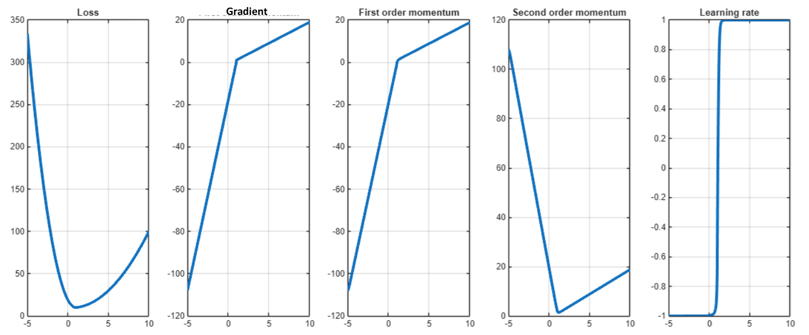

## Linear Algebra

* Vector Space $a x + b y \in V$, Subspace (has 0)
* Inner Product $x^T y = 0$ means Orthogonal; Outer Product $x y^T$
* Vector p-norm: $\|x\|_p = (\sum_i x_i^p)^{1/p}$
* Matrix p-norm: $\|A\|_p = \max \frac{\|Ax\|_p}{\|x\|_p}$
* Singular Value Decomposition (SVD) for any matrix: $A = U \Sigma_r V$ where:
  * $U = eigenvectors(A^T A)$: left singular vectors
  * $V = eigenvectors(A A^T)$: right singular vectors
  * $\Sigma_r = diag(\sigma_1, \sigma_2 .. \sigma_r)$ is diagonal matrix where $r$ is rank of $A$, singular values $\sigma_1 \ge \sigma_2 \cdots \ge \sigma_r \ge 0$ are square roots of eigenvalues of $A A^T$: $\sigma_i = \sqrt{\lambda_i}$
  * *Pseudo-Inverse*: $V \Sigma_r^{-1} V^T$
  
## Probability

* $Posterior \propto Likelihood \times Prior$
* **Multi-Variate Gaussian**: a vector of normally distributed variables, such that any linear combination of them is also normal. Used in ML for eg. in detecting faces, where features are correlated.
$$\mathbf{x} \sim \mathcal{N}(\mu, \Sigma) = \frac{1}{\sqrt{(2 \pi)^n det(\Sigma)}} e^{-(x - \mu)^T \Sigma^{-1} (x - \mu)}$$
  * $x = [X_1, X_2, \cdots, X_n]$ has $n$ random variables that are also *jointly Gaussian*.
  * $\mu = E[x]$ is the mean vector, $\Sigma = E[(x - \mu) (x - \mu)^T]$ is Positive Semi Definite covariance matrix
  * If $z = \Sigma^{-1/2} x$: elements of $z$ are independent Gaussian Random Variables (which are converted to Multi-Variate Normal).
  * *Precision* $\beta = \Sigma^{-1}$
  * (additional, NOT in slides) *Extended Central Limit Theorem*: N i.i.d. random variables with commmon mean vector $\mu$, PSD covariance matrix $\Sigma$. 
    Then $Y_n = \frac{1}{\sqrt{n}} \sum_{i=1}^n (x_i - \mu)$ converges to $Y_n \sim \mathcal{N}(0, \Sigma)$

TODO: examples solved questions of multi-variate gaussian
  
Entropy:
* **Maximum Entropy Distributions**: Uniform for Discrete random variables, Normal for Continous
* Entropy $H(P) = E_P(- ln(P)) = \sum_i - p_i ln(p_i) \in [0, \ln(n)]$
* Relative Entropy (KL Divergence) $D(P \parallel Q) = E_P(ln(P/Q)) = \sum_i p_i ln(p_i / q_i) \in [0, \infty]$
* Cross Entropy $H(P; Q) = D(P \parallel Q) + H(P) = E_P(- ln Q) = \sum_i - p_i ln(q_i) \in [0, \infty]$

Classical vs Bayes:
* Classical (no prior) assumes fixed unknown param and has poor performance if data isn't Uniform; Bayes treats params as a random variable and has poor peformance if data doesn't fit prior assumption.
* Classical estimation: MLE (Maximum Likelihood), Bayes: MAP (Maxima a Priori)

Taylor Series:
$$f(x) = f(a) + (x-a)^T \nabla f(a) + \frac{1}{2!} (x-a)^T \nabla^2 f(a) (x-a) + \cdots$$

## Machine Learning Fundamentals

Training $\theta = \argmin Loss(f(x,\theta); label(x))$

Losses:
* L0 Norm $\|y - y_{true}\|_0$ (sparsity-promoting): 0-1 loss: proportion of number of zeros in error (difference between predicted and true output)
* L1 Norm $\|y - y_{true}\|_1$ : absolute error
* Squared L2 Norm (Euclidean) $\|y - y_{true}\|^2$
* Mixed Norm: linear combination of $p \ge 1$ norms
* Cross Entropy, F1-Score, etc.

Regression: $y = x^T W + \epsilon$

Classification Posterior Probabilities:
* Binary (sigmoid): $P(y=1 | x) = \frac{1}{1 + e^{-a}}$ where logits (log likelihood) $a = \ln(\frac{P(x | y=1) P(y=1)}{P(x | y=0) P(y=0)})$
* Multi-class (softmax): $P(y=C_k | x) = \frac{e^{a_k}}{\sum_j e^{a_j}}$ where logits (log likelihood) $a_j = \ln(P(x | y=C_k) P(y=C_k))$

TODO: SKIPPED complicated formulae of slide 35 "Inference on Gaussian Data": Binary Classification, Multi-class Classification, Ridge Regression [these seem to be MAP (Maximum a Posteriori) bayesian estimation where prior probability is assumed to be Multi-Variate Gaussian]

Classifying Linearly Seperable Data (distance from hyper-plane): $z = x^T w + w_0$, followed by activation to get probability:
* Binary $Sigmoid(z)$: Bernoulli output (0 or 1)   [on the plane probability: $\sigma(0) = 1/2$]
* Multi-Class $Softmax(z)$: Categorical one-hot encoded output (list of 0 or 1)   [on the plane probability: $\sigma_k(0) = 1/K$]

Logistic Regression is equivalent to gradient descent training a single neural net linear layer with sigmoid activation, cross entropy loss

Training:
* VC Dimension (ideal number of model weights for given data)
* ValidationError is also called Generalization Error
* *Cross-Validation* when data is limited: Train various models on different (train, validation) data splits; in the end use test data
* Bias-Variance Tradeoff
* No Free Lunch Theorem: no model can perform best on all possible datasets
* Double Descent: overfitting can be overcome with very deep networks, at *Interpolation Threshold* (no. of params = no. of training data)
* Grokking: over-parameterized model, train loss appears to flat line for many epochs (before sudden drop) but validation loss improves

## Multi-Layer Perceptron

* Universal Function Approximator: approximate any continous function with a neural net having 1 hidden layer
* Loss Surface smoothens with more data
* Activations:
  * $sigmoid(z) = \frac{1}{1 + e^{-z}} \in [0,1]$, derivative $y (1 - y)$
  * $tanh(z) = 1 - sigmoid(2 z) = \frac{1 - e^{-2 z}}{1 + e^{-2 z}} \in [-1,1]$, derivative $1 - y^2$
  * Rectified Linear Unit (ReLU): $z$ if $z > 0$ else 0
  * Scaled Exponential Linear Unit (SeLU): $z$ if $z > 0$ else $\alpha (e^z - 1)$

## Training Neural Networks

* Gradient Descent of Loss with step size / learning rate: $w_{n+1} = w_n - \eta \nabla L(w)$:
  * Stochastic Gradient Descent (SGD) - unbiased: at each step, find gradient and update for only one random sample. Very slow convergence $O(1 / \sqrt{n}$)
    * Uncorrelated samples (noisy gradient) may lead to divergence (variance of z is high)
  * Batch Gradient Descent - find gradient and update for whole batch of samples.
  * Mini-Batch SGD - at each step, find gradient and update for one mini-batch of samples
  * Stochastic Average Gradient (SAG) - biased: also stores some previous iteration gradients and averages gradients to move weights in direction. Reduces variance (zig-zag) compared to SGD.
  * Stochastic Average Gradient Ameliore (SAGA) - unbiased: makes SAG unbiased by incorporating difference between current and previous gradients
* Backpropogation (gradients calculation and update) [NOTE: feed-forward of each layer is $activation(W X)$]:
  * Start with $dX = \nabla_{output} Loss$
  * For each layer $i$ (starting from last/output layer):
    * $dX = \nabla_z activation_i W_i^T * dX$
    * $dW_i = X_i dX^T \quad (\text{get current layer gradients by multiplying with layer input})$
    * $W_i = W_i - lr \times dW_i \quad (\text{weights update})$
* Weights Initialization:
  * Xavier (for sigmoid, tanh): $\mathcal{N}(0, \frac{2}{n_{l-1} + n_{l+1}})$ OR $\mathcal{U}(j\frac{-6}{n_{l-1} + n_{l+1}}, \frac{6}{n_{l-1} + n_{l+1}})$ ; At l'th layer:
    * $Var(output_{l}) = n_{input} \sigma_W Var(output_{l-1})$
    * $Var(grad_{l}) = n_{output} \sigma_W Var(grad_{l+1})$
  * Kaimeng He (for ReLU, Leaky ReLU): $\mathcal{N}(0, \frac{2}{n_{l-1}})$
    * Almost half of ReLU output is 0
  * Le Cun (for SeLU): $\mathcal{N}(0, \frac{1}{n_{l-1}})$
  * (For general) Random orthogonal matrix
* Autograd
  * Calculates *exact gradient, not numerical gradient* (no cycles)
  * Forward Pass: calculate outputs
  * Backward Pass: calculate gradients using forward pass outputs and chain rule
  * Implemented using **computational graphs**
  * [Limitations of Autograd](https://github.com/HIPS/autograd/blob/master/docs/tutorial.md#what-can-autograd-differentiate), doesn't work for:
    * Non-differentiable functions
    * Improper computation graph, eg. `if x == 2 then 4 else 2*x` -> here autograd calculates 0 gradient at x = 2, but real answer is 2
    * Assignment to array slice
* Computational Graphs
  * Directed Acyclic Graph between input and outputs
  * Dynamic (loops and conditions) vs Static
  * No cycle (no variable is reused in loop)
  
### Learning Rate Schedulers

LR Schedulers: AdaGrad, RMSProp, Adam

Optimal LR (for each individual epoch, not always computable) $\eta^* = \argmin_\eta L(w_{n-1} - \eta g_n)$ where $g_n = \nabla w_{n-1} L$ is gradient :
* At optimal $\eta^*$, $\nabla_\eta L(w_{n-1} - \eta g_n) = 0$. But $w_n = w_{n-1} - \eta g_n$, so by chain rule $\nabla_\eta L(w_n) \dot (-g_n) = g_{n+1}^T g_n = 0$
* This is called **Steepest Descent with Line Search** - try to use "perfect" LR in each epoch to get closest possible to minimum.

Consecutive gradients are orthogonal, so updates undo previous updates. Fix: adaptive LR

#### Adaptive Learning Rate

Linear Decay: $\eta_n = (1 - \alpha) \eta_0 + \alpha \eta_t$ where $t$ is terminal rate instance, $\alpha = min(1, n/t)$

[AdaGrad](https://datascience.stackexchange.com/questions/77308/why-l2-norm-in-adagrad-update-equation-not-l1) uses L2 norm:
$$
v_t = v_t + (\nabla w_t)^2 \\
w_{t+1} = w_t - \frac{\eta}{\sqrt{v_t + \epsilon}} \nabla w_t
$$
* Change LR according to magnitude of slope of each coordinate
* Element-wise learning rate $\epsilon$ is for numerical stability, i.e. to avoid division by 0
* Reduces LR when accumulated gradient is large and vice-versa
* PRO: good for sparse gradients
* CON: causes LR to decrease early; vanishing - problem when gradient is noisy

[RMS Prop](https://medium.com/deepkapha-notes/optimization-algorithms-and-interactive-visualization-part-2-4d6d9791e1d3) modifies accumulated gradient in AdaGrad - accumulation is averaged to prevent early decrease in LR
$$
v_t = \beta v_{t-1} + (1 - \beta) (\nabla w_t)^2 \\
w_{t+1} = w_t - \frac{\eta}{\sqrt{v_t + \epsilon}} \nabla w_t
$$

#### Adaptive Moment Estimation - Adam

NOTE: Multiple variants of Adam exist in literature.

$$
m_n = \beta_1 m_{n-1} + (1 - \beta_1) g_n, \quad k_n = m_n / (1 - \beta_1^n) \quad (\text{first moment}) \\
v_n = \beta_2 v_{n-1} + (1 - \beta_2) g_n^2, \quad s_n = \sqrt{v_n / (1 - \beta_2^n)} \quad (\text{non-central second moment}) \\
w_{n+1} = w_n - \frac{\eta k_n}{\sqrt{s_n + \epsilon}} \nabla w_n \quad (\epsilon \text{ to avoid division by 0})
$$

* $m_n$ is moving weighted average of gradients for smoother trajectory (skip small local minima) - it builds **momentum** to help get out of small wells
  * For $m_0 = 0$ and constant gradient $g_n = g$, $m_t \to \beta_1 g_n$
* Too large momentum can lead to skipping significant minima - so use second moment to take smaller steps when variance of gradient is high and vice-versa. It helps reduce oscillations.
* $\beta_1, \beta_2$ both are less than 1 but close to 1
* Biased towards 0 as initial starting points of moments are 0
  * Unbiased first moment is $k_n$
  * Unbiased second moment is $s_n$

Example plots:

#### Nesterov Optimization

TODO: formula didn't understand

Evaluates gradient near predicted point instead of current point. Converges fast: $O(1 / n^2)$

Applicable to all LR Schedulers discussed above; *NAdam* is when applied to Adam

