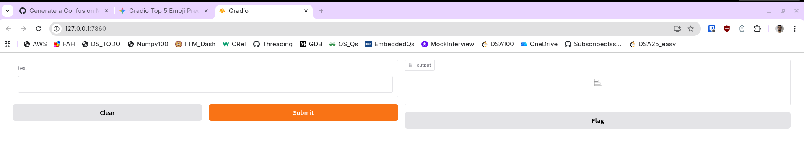

my name: Sohang Chopra, roll no. DA25M622, email da25m622@smail.iitm.ac.in, project is part of class DA6401 Introduction to Deep Learning, trimester 2 of MTech (Industrial AI) at IIT Madras.

Motivation of this project is that I have personally observed most emoji keyboards are bad at search (eg. android, linux etc.) - they seem to use keyword matching only,
and not deal with synonymns or same meaning texts. 
usually i have to resort to googling / asking online llm to get the emoji character i want using my description. but that requires internet and/or very heavy llm model.
instead this project allows offline usage anywhere - the model is simple enough (yet still decent) that both training and evaluation are easily doable on cpu device only, so even constrained devices like android, or Raspberry Pi - it could easily work there although not specifically tested.

* Project Title: SemanticEmoji: Multi-lingual Neural Emoji Search	
* Project Topic: Natural Language Processing & Multi-class (3953 classes acc Wikipedia) Classification
* Description: Semantic emoji search (deep learning) using natural language queries instead of exact-match keyword lookups.	
* Other Items (if any): Optionally support Hindi, Hinglish languages in addition to English. Optionally use synthetic dataset. --> NOT DONE, FUTURE POSSIBILITY

### Usage Information

NOTE: some paths may need to be adjusted before running the scripts.

Install: `pip install -r requirements.txt` on Python 3.14 (though it will likely also work on older Python versions but not tested)

* *data/data.csv* has full synthetic LLM-generated data of Emojis (classes) and corresponding Descriptions - 96 emojis, 50 descriptions per emoji.
* *emoji_classes.txt* has the list of 96 emoji output classes (one emoji per class). NOTE: order is important, it's in exact class order used (0 is first class and so on).

Scripts order of running:

* *preprocess.py* - "explodes" data.csv (ie makes one row for each emoji description) and splits into *data/train.csv* and *data/val.csv* (80:20 split).
* *train.py* - trains model using pytorch lightning on train.csv, val.csv . Outputs are saved to *model/* folder (both are self-contained, independent, equivalent representations of final best epoch model): model weights *model_weights.pth*, checkpoint file *.ckpt . 
  * NOTE: cached text embeddings of train.csv, val.csv are saved to *embeddings/* folder.
* *evaluate.py* - evaluates on same val.csv (metrics, confusion matrix). Outputs are saved to *evaluated/* folder. Summary:
  * Balanced Accuracy 75.6% but Top-5 Accuracy is much better: 92.46%. This seems likely due to some semantically related emojis (although effort was made initially to remove and only take one in each group, but some may have slipped)
  * (on average) 78% precision, 76% recall, 75% f1 score
  * confusion matrix .csv i made but to be honest not sure what to actually do with it. for 96 emoji classes it's almost impossible to interpret at a glance.
* *predict.py* - opens a Gradio web UI where we can input text to see output (top 5 emojis) [input text -> preprocess -> encoder gives embedding -> model gives output class index -> map to emoji]. Web UI looks ike this:



### Model Information

on top of embeddings by `sentence_transformers.SentenceTransformer(model_name='all-mpnet-base-v2')` (of train, val), actual model is very simple classifier to learn class indices of emoji classes (so no. of input features = 786, because that's no. of features in encoder embedding which we use as input):

```python
batch_size = 64
self.model = nn.Sequential(       
    nn.Linear(input_dim, 512),
    nn.BatchNorm1d(512),
    nn.GELU(),
    nn.Dropout(0.4),
    nn.Linear(512, 256),
    nn.BatchNorm1d(256),
    nn.GELU(),
    nn.Dropout(0.3),
    nn.Linear(256, num_classes)
)
self.criterion = nn.CrossEntropyLoss(label_smoothing=0.1)
optimizer = torch.optim.AdamW(self.parameters(), lr=1e-3, weight_decay=0.05)
# OneCycleLR is great for small datasets to avoid local minima
scheduler = torch.optim.lr_scheduler.OneCycleLR(
    optimizer,
    max_lr=1e-3,
    total_steps=self.trainer.estimated_stepping_batches,
    pct_start=0.2,
    div_factor=10,
    final_div_factor=100
)
```

NOTE: model actually used is a `LightningModule` wrapper over above (classes `EmojiClassifier` and `EmojiDataset` in train.py).

Training & testing is done using PyTorch Lightning to make script more organized and reduce usual boilerplate of PyTorch manual loops for training, evaluation.

Callbacks used: ModelCheckpoint (to save best model), EarlyStopping(patience=15).