# DA6401W: Introduction to Deep Learning

Professor email: &lt;lnt@dsai.iitm.ac.in&gt;

Head TAs :
* Manoj Kumar &lt;da24s018@smail.iitm.ac.in&gt;
* Yuvaram Singh &lt;da24s015@smail.iitm.ac.in&gt;

In this course we'll only do supervised learning, not unsupervised learning.
All of Deep Learning, especially supervised learning, is basically curve fitting.

**Marks Weightage**:
- 25% Midsem
- 25% Endsem
- 20% Assignments (best 4 out of 6)
- 30% Project (report + code) by April 22

While creating a new architecture, activation etc. we have to make sure everything is differentiable, otherwise Deep Learning optimization will not work.

## Linear Algebra & Probability Revise (lecture 1 slides have material of remaining lectures as well)

### Linear Algebra Revision

#### Spaces and Norms

Vector Spaces $\mathbb{V}: \forall \mathbf{x}, \mathbf{y} \in \mathbb{V}, a \mathbf{x} + b \mathbf{y} \in \mathbb{V}$ 
can be Binary/Boolean, Complex $C(N)$ but we use Real spaces $R(N)$ mostly.

Vector Subpsaces are closed under vector addition, scalar multiplication and must contain zero vector.

In a neural network, neurons create projections of inputs from vector space onto a subspace.

If Inner Product $\mathbf{x}^T \mathbf{y}$ is:
* $> 0$, then vector components are along same direction
* $< 0$, then vector components are along opposite direction
* $== 0$, then **orthogonal vectors**.

If basis vectors $\mathbf{b_1} ... \mathbf{b_n}$ are orthonormal, 
then projection of vector $\mathbf{v}$ has components simply inner products with bases:
$(\mathbf{v}^T \mathbf{b_1}, ... \mathbf{v}^T \mathbf{b_n})$

p-norm $p \ge 1$ of vector $(\sum v_i^p)^{\frac{1}{p}}$ (it's defined for real spaces, NOT defined for binary spaces):
* 0-norm (counting norm) - just counts non-zero entries. It's very sparsity-promoting (ie we're trying to make ). But rarely used in practice as it's not differentiable.
  Often L0 norm is used in theory, but in practice we replace it with L1 norm.
* 1-norm $\sum v_i$ is used in popular **L1 Regularization** (minimize L1 norm to reduce overfitting by promoting sparsity of matrix).
* 2-norm (Euclidean distance from origin) is used in **L2 Regularization** (minimize L2 norm - it's used less than L1).
* Elastic loss (Mixed Norm) -- uses multiple L1,L2 norms etc. - but this is complex so not used often.

One nice property of norms as loss for optimization is that they are convex, so guaranteed to have some minima.

**We usually use Cross-Entropy loss (or binary cross entropy), but may additionally use L1,L2 norms to promote sparsity so there are less weights**.

**Loss functions measure some kind of distance.**

Loss                       | Application           | $L(y, \hat{y})$                           | $\frac{\partial L}{\partial \hat{y}}$
-------------------------- | --------------------- | ----------------------------------------- | -----------------------------------------
Binary Cross Entropy (BCE) | Binary Classification | $- y ln(\hat{y}) - (1-y) ln(1 - \hat{y})$ | $- y / \hat{y} + (1-y) / (1-\hat{y})$
Mean Squared Error (MSE)   | Regression            | $\frac{1}{2} (\hat{y} - y)^2$             | $\hat{y} - y$

#### Linear Hyper-plane

It's an $n-1$ dimensional subspace of $\mathbf{R}^n$.

Plane divides space into 2 parts, so for linearly seperable data it can be used for **binary classification**.
This is in fact what the last/output layer of a neural network does in case of binary classification (sigmoid activation)
- i.e. a single sigmoid neuron creates a plane.
The job of the remaining hidden layers is to transform data into linearly seperable data for last layer to then classify.

NOTE: for regression, no activation function is used on final Linear layer as we want continous output only.

Distance of a vector $x$ from hyperplane = $\frac{x^T v}{\|v\|}$ where $v$ is normal vector of hyperplane.

A simple example of a problem that's NOT linearly seperable is XOR. So a single neural layer cannot learn it, multiple are required.

#### Singular Value Decomposition (SVD) of Matrix

$$M = U \Sigma V^T$$

where:
* $U$, $V$ are **orthogonal matrices** (i.e. $I = A A^T = B B^T$, i.e. both matrices' row & column vectors form orthonormal bases)
    * **Left Singular Vectors** are columns of $U$ - they come from eigen vectors of $M^T M$
    * **Right Singular Vectors** are columns of $V$ - they come from eigen vectors of $M M^T$.
* $\Sigma$ is a **Positive Semi-Definite Diagonal matrix** -- its non-zero diagonal entries are called **Singular Values**.
  These *diagonal values are positive and in ascending order*: $\sigma_1 \le \sigma_2 \le .. \sigma_r$ where $r$ is rank of $\Sigma$ - remaining are 0 values.

**Pseudo-Inverse** of $M$ is $V \Sigma^{-1} U^T$

For all singular values $\sigma_i$ and corresponding left singular vectors $u_i$, right singular vectors $v_i$:

$$M v_i = \sigma_i u_i$$

#### Matrix Norm

$$\|A\|_p = \sup \limits_{x \ne 0} \frac{ \|A x\|_p }{ \|x\|_p } , \quad \|A\|_2 = \sigma_{max}(A)$$

Here $\sup$ is basically equivalent to $\max$. **Matrix 2-norm is its largest singular value** (singular values calculated in SVD)

#### Taylor series, Gradient & Hessian

Taylor: polynomial expansion of function $f$, centered at point $a$, at a random point $x$ near $a$.

$$T(x) = f(a) + (x-a)^T \nabla f(a) + \frac{1}{2!} (x-a)^T \nabla^2 f(a) (x-a) + ...$$

Gradient vector (most practical optimization methods like Adam, RMSProp use upto first order derivative Taylor only)

$$\nabla f(x) = \begin{pmatrix} \frac{\partial f}{\partial x_1} (p) \\ \frac{\partial f}{\partial x_2} (p) \\ \vdots \\ \frac{\partial f}{\partial x_n} (p) \end{pmatrix}$$

Hessian matrix (Newton, LPF, GS optimization etc. use upto second-derivative Taylor)

$$H_f = \begin{pmatrix} 
\frac{\partial^2 f}{\partial x_1^2} & \frac{\partial^2 f}{\partial x_1 \partial x_2} & \cdots & \frac{\partial^2 f}{\partial x_1 \partial x_n} \\
\frac{\partial^2 f}{\partial x_2 \partial x_1} & \frac{\partial^2 f}{\partial x_2^2} & \cdots & \frac{\partial^2 f}{\partial x_2 \partial x_n} \\
\vdots                                         & \ddots                                       & \vdots \\
\frac{\partial^2 f}{\partial x_n \partial x_1} & \frac{\partial^2 f}{\partial x_n \partial x_2} & \cdots & \frac{\partial^2 f}{\partial x_n^2} \\
\end{pmatrix}$$


### Probability

PMF of distribution P = TODO: formula

**Probability Space**:
* Sample Space
* $F$ Event Space - contains all possible subsets of Sample Space
* $P$ **measure** for all elements of $F$ - eg. proportion of occurance of any $u \in F$

Mapping $SampleSpace \rightarrow \mathbb{R}$ is a **Random Variable**.

#### Bayes Formula

$$
P(X|Y) = \frac{ P(Y|X) P(X)}{ P(Y) } \\
\implies P(X|Y) \propto P(Y|X) P(X) \\
\implies Posterior \propto Prior \times Likelihood
$$

Here:
* $P(X)$ is **prior** (statistics known before making any observations)
* $P(X|Y)$ is **posterior** (updated probability after finding out outcome of $Y$)
* $P(Y=y | X)$ is **likelihood** (calculated based on outcome of $Y$). **It's NOT a valid PMF / PDF** because probability space itself changes for each value of $X$.

All of Deep Learning theory uses Bayesian framework. 
But if prior (training) distribution is incorrect (ie posterior distribution of test/inference data is different), then poor results.

**Sum of posteriors is 1 as sample space $Y$ is same in all**: eg. for binary classification, $P(X=0 | Y) + P(X=1 | Y) = 1$

#### WIP Entropy (Cross, Relative, KL Divergence)

Cross Entropy loss - use in classification (cross entropy and relative entropy are similar, so you're automatically using relative entropy as well here)

Minimizing Cross Entropy & KL Divergence gives same minima; we prefer cross entropy as it's easier to differentiate.

Information Theory definitions:
* Entropy is original bits of distribution (least bits req to encode)
* Relative Entropy is how many bits (ie log 2 of information) you need to encode distribution
* Cross Entropy is how many bits used if you wrongly assume distribution P is actually distribution Q + entropy of P

For true probability distribution $P$ and assumed probability distribution $Q$ (NOTE: **KL Divergence is also called Relative Entropy**):

$$
Entropy = H(P) = - \sum_{i=1}^{classes} p(x_i) \ln(p(x_i)) \\
CrossEntropy = H(P,Q) = - \sum_{i=1}^{classes} p(x_i) \ln(q(x_i)) \\
KLDivergence = D_{KL}(P || Q) = H(P,Q) - H(P) = \sum_{i=1}^{classes} p(x_i) \ln(\frac{p(x_i)}{q(x_i)})
$$

### Machine Learning

#### Supervised vs Unsupervised learning

Supervised learning            | Unsupervised
------------------------------ | ---------------
Labelled data                  | Unlabelled data
Training + Inference           | No Train, only Inference
eg. Classification, Regression | eg. PCA, Clustering, Pattern Finding

#### Loss functions

Loss functions quantify error obtained during parameter optimization.

$$\argmin Loss \{ f(x,\theta) - label(x) \}$$

* L0  norm (sparsity -promoting), 0 -1 loss:  $\|y  - y true \|_0$
* L1  norm, absolute error: $\|y  - y true \|_1$
* Squared L2  norm, Euclidean distance: $\|y  - y true \|^2_2$
* Mixed norms: linear combination of different p-norms $p ge 1$ - convex losses
* Cross entropy, F-score, etc.

#### Classification

* Sigmoid etc. activations are useful to convert non linearly seperable data into linearly seperable data.
* **Sigmoid / Softmax are basically single layer classifiers**. It converts **logits** (distances) to probabilities.

##### Binary Classification

Calculate Posterior probabilities $P(y=0 | x)$, $P(y=1 | x)$, then $a$ is log posterior ratios.

By Bayes and conditional probability:

$$P(y=1 | x) = \frac{P(x | y=1) P(y=1)}{P(x | y=0) P(y=0) + P(x | y=1) P(y=1)}$$

For binary classification, this simplifies to **Sigmoid** (using log posteriors $a_0$, $a_1$ for y=0,1):

$$P(y=1 | x) = \sigma(a_1) = \frac{1}{1 + e^{-a}}$$

**Derivative / Gradient of Sigmoid**: $\sigma'(z) = \sigma(z) * (1 - \sigma(z))$

Finally after sigmoid gives us the probabilities, just choose class with higher probability.

##### Multi-Class Classification

$$P(y=C_k | x) = \frac{P(x | y=C_k) P(y=C_k)}{\sum_j P(x | y=C_j) P(y=C_j)}$$

This simplifies to **Softmax** function (using log posterior vector $a$ having elements $a_k = ln P(x | y=C_k) P(y=C_k)$):

$$P(y=C_k | x) = \sigma_k(a) = \frac{e^{\alpha_k}}{\sum_j e^{\alpha_j}}$$

**Logistic Regression** is equivalent to a single neural network layer with Sigmoid activation (name has regression but actually final output is classification probabilities).

#### Regression

* $y_i = f(x_i) + \epsilon$ where $\{x_i\}, \{y_i\}$ are training inputs, labels, $\epsilon$ is error. Find $f$.
* Parameterized $f(x) = g(W,x)$ where $W$ is weights matrix ; Linear Regression: $g(W,x) = W^T x$

Linear Regression uses **linear activation**, i.e., just identity (no change)

TODO: Polynomial Regression uses Taylor's Expansion

TODO: Multi-Class Regression

TODO: Ridge Regression (MAP (Maximum a Posteriori) method where data is assumed to be Normal)


#### Training & Generalization (Test) errors - Underfitting and Overfitting

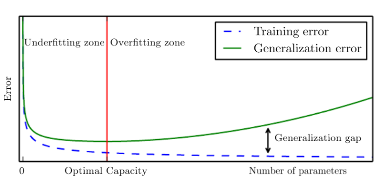

Assuming uniform, balanced data

Underfitting -- train error is high (too less model params), so try increasing number of model parameters or number of layers etc.

Overfitting -- low train error BUT high test error (too many model params) => regularization techniques to solve like L1, L2, Dropout etc.

NOTE: test error is also called **generalization error**.

Finding *optimal number of model parameters* is hard.

**VC Dimension** $|TrainError - TestError| \le \sqrt{O(d_{VC} \frac{log n}{n})}$ -- this is **probabilistic equation NOT deterministic** 
(it's likely to hold not guaranteed) -- TODO: CHECK what's this vc dimension (he said it's used mostly in theoritical ML not practical?)

Examples of underfit, overfit and bestfit:

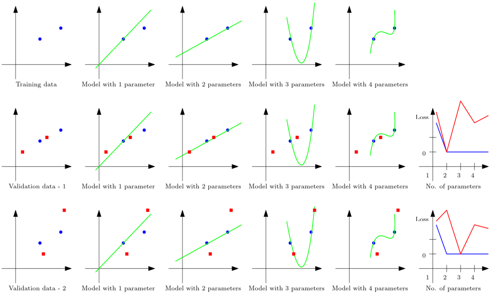


Some **counter-intuitive facts**:

* Sometimes more training data can lead to worse performance! TODO: examples of this?
* Double Decay

##### Double Decay

When you overfit, validation error increases. 
But after that point if you keep increasing parameters massively (millions / billions of params), then after a point accuracy increases - **Double Descent**!
LLMs operate in this *over-parameterized* zone.
But even after that when you keep increasing parameters a lot (millions / billions of params!), then validation error actually reduces!
This is **Over-parameterized region** (LLMs operate here).
It's because as no. of parameters (depth) increases, overfitting is smoothened (smoother interpolation and extrapolation).
So **Overfitting can be overcome with deeper networks**. *Interpolation Threshold* for this is when *no. of parameters = no. of data points*.

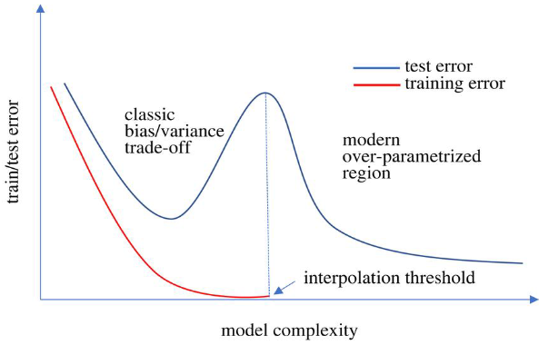

#### Validation (split data, Cross-Validation)

In training only not validation, we maximize posterior probability. 

Split data: Train-Validation typically 80:20 ; also Test data

Cross-Validation: multiple (train,val) splits & trains, then average all the models' weights/params -- accuracy is worst accuracy from all splits.
   (NOTE: seperate test data is still recommended to be used in Cross-Validation)
    * No hard rule for number of folds in k-fold cross validation - chosen subjectively.


#### Bias-Variance tradeoff

Bias: high if model is too simple (underfitting), low if model has sufficient complexity according to data.

Variance: sensitivity from small fluctuations in training set. High variance means overfitting.

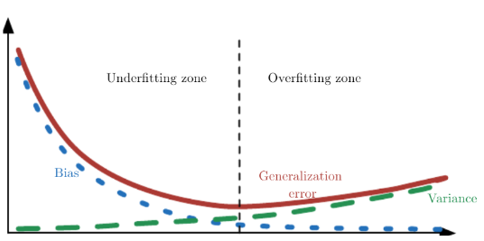

When we train model on different training data sampled from same underlying data (eg. Cross Validation),
and then do inference with all the trained models on fixed validation point (TODO: on only one point, or fixed validation data):

Bias, Variance values are different at different chosen validation points.

$$
Bias(x) = E[y_{pred}] - y_{true}, \quad \text{where } y_{true} = f(x) \\
Variance(x) = Var(y_{pred}) \\
$$

Bias reduce => Variance increase

**Capacity Point** is where (bias, variance) both are overall minimized (ie any further reduction in one will only come at expense of increase in other).

$Error = E[(y_{true} - y_{pred})^2] = Bias^2 + Var(y_{pred}) + IrreducibleError)$

For finite datasets & specific model training runs, loss can be reduced to 0.
But for large datasets & considering statistical loss (ie in cross-validation, average loss of all trained models) - 
that can't go to 0, but can only be reduced till the Irreducible Loss.

#### No Free Lunch Theorem

No model can have best possible performance on all possible unseen data (since unseen data can have unique statistics).
Tradeoff between **Robustness** and **Accuracy**.

**Regularization**: Use any known statistical behaviour of entire data to optimize model (in addition to training data).

#### Maximum Likelihood Estimation (MLE) vs Maximum A Posteriori (MAP - Bayesian Inference)

Infer bias $p$ of a coin from observations of its toss $X_i ~ Bernoulli(p)$.

**Maximum Likelihood Estimation (MLE - Classical / no prior bias)**: 
* Probability of head: $\hat{p} = \frac{\sum y_i}{N}$ where $y_i \in \{0,1\}$ are experiment outputs.
* On taking many different sample observations of same coin: $Bias(\hat{p}) = 0 \quad Variance(\hat{p}) = \frac{p (1-p)}{N}$

**Maximum A Posteriori (MAP - Bayesian / prior bias)**:
* We maximize Posterior probability (ie updated probab after knowing about previous coin tosses): $\argmax\limits_{p} P(\text{data} | p) P(p)$
    * TODO QUESTION: in slide this is shown to solve to $\frac{\sum y_i}{N+1}$ -- here how did the $N+1$ come in denominator??
* Unlike MLE, here Bias is NOT 0 (since prior knowledge is used).

MLE vs MAP (Bayesian) plot (MSE error vs N number of observations) with different $w$ (weight given to prior data -- give more weight if prior is more reliable).
We can see Bayesian line is lower, i.e., for any N here, MSE is lower for Bayesian:

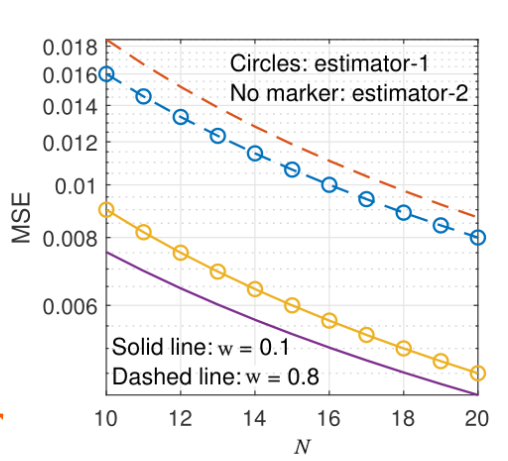

An example of a prior is: suppose we only collect some kind of data in summer. 
So summer = prior bias; in summer model can perform better than a generic model ; but badly not in summer.

#### Grokking

* Generalization of *over-parameterized models* by **over training** (less over training needed for smaller dataset).
* **Weight Decay** helps (additional term in loss function that pushes weights closer to 0)

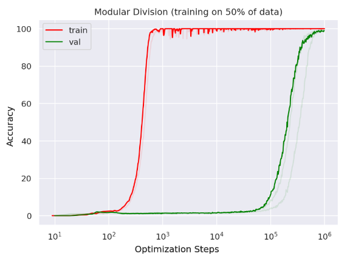

Grokking was discovered in 2023 by OpenAI when they accidentally left a model training even after loss appeared to saturate (so straight line loss).
But after a long time (a week), the loss suddenly dropped a lot from previous straight line loss!
It's because loss wasn't actually straight line, it was just decreasing very very slowly so it wasn't noticeable.
Here loss function jumped from one local minima to far-away better local minima.

**Grokking vs Double Descent**: 
* In Double Descent no. of model parameters are increased, but in grokking no. of parameters is same - just training epochs increases.
* Grokking depends on loss function used, Double Descent doesn't.

#### No Free Lunch Theorem

It's *applicable only to parameterized supervised learning, but NOT online learning, reinforcement learning etc.*

**Inductive Bias**: bias learnt by model from traininig data (practically impossible to have 0 bias in data)

*Tradeoff between good Robustness (how much model can generalize, so less Variance) vs good Accuracy (so less Bias)*

So it's impossible to train one model which has best possible performance for any possible data.


## WIP Multilayer Perceptron (Lecture 5)

Single perceptron: $u(W^T x + b)$ (linear calculation with weights, then run non-linear activation)

* Any continous function can be approximated by a polynomial of sufficient degree.
* Deep Learning (neural network) is *Universal Function Approximator*.

width = no. of neurons in a layer, depth = no. of layers

Motivation to come up with Resnet model was to look at loss surface plot and try to design a loss with good loss surface.

ReLU activation doesn't work well with a single layer model (due to its sharp edges in plot).
But in multiple layers (ie hidden layers) it works very well. And computationally it's best as very simple (derivative is also very simple).

`sigmoid` is equivalent to `tanh` with some extra weights.

sigmoid derivative is 1/4 -> less than 1 creates problem in gradient descent (vanishing gradient). 
tanh is better (in hidden layers) - unlike sigmoid it can be negative, and has
TODO: finish above sentence

Here $z = W x + b, y = activation(z)$:

Activation |                                       Gradient                  | Use
------------------------------------------------- | ------------------------ | ---------------------------------------------
$sigmoid(z) = \frac{1}{1 + e^{-z}}$               | $y (1-y)$                | Output layer (classification probabilities)
$tanh(z) = \frac{1 - e^{-2 z}}{1 + e^{2 z}}$      | $1 - y^2$                | Hidden layer 
$relu(z) = max(0, z)$                             | 1 if y > 0 else 0        | Hidden layer
$leakyrelu_\alpha(z)$: 1 if z > 0 else $\alpha z$ | 1 if y > 0 else $\alpha$ | Hidden layer

## WIP Gradient Descent (Lecture 6)

* how to find roots of derivative of loss function ?
* Taylor approximations in higher dimensions:
    * Gradient Vector (linear approx at a point)
    * Hessian Matrix (curvature of function at a point)
* Loss $L(w + \epsilon) \approx L(w) + \nabla L(w)^T (w + \epsilon - w)$
    * For $L(w + \epsilon) - L(w) \le 0$, pick $\epsilon$ opposite to $\nabla L(w)$

* Update (using first order Taylor approx) in steepest direction (gradient of loss) $w_{n+1} = w_n - \eta \nabla L(w_n)$
    * $L(w_0) \ge L(w_1) \ge \cdots \ge L(w_n)$
* How to find gradient w.r.t all weights? - by using Backpropogation
* What is a good learning rate $\eta$ ?
* What is a good starting rate $w_0$ ?

In some situations second order Taylor approx is also used in update rule -- will be covered later.

### Backpropogation

* Compute $g = \nabla_{output} L$
TODO

* For input-label pair (x,y) and loss function C(.):

$$C(y, f^L) =$$

TODO


### Weights Initialization

DON'T initialize all weights to same value like 0 (else very bad performance). Init has to be random weights.

Control variance of randomness (U - Uniform, N - Normal distribution):

Technique  | Activations           | Distribution                                      | Remark
---------- | --------------------- | ------------------------------------------------- | -------------------
Xavier     | tanh, sigmoid, linear (no activation for regression output) | $\mathcal{U}(\pm \sqrt{6 / (n_{l+1} + n_{l-1})})$ | NOT applicable for RELU because unlike tanh, sigmoid RELU doesn't have symmetric mean around 0
Kaiming He | RELU, Leaky RELU etc. | $\mathcal{N}(0, \sigma=\sqrt{2/n_{l-1}})$                     |
LeCun      | SELU                  | $\mathcal{U}(\pm \sqrt{6 / n_{l-1}})$             |

Random orthogonal matrix is used for any arbitary activation in libraries.

NOTES: 
* In each both uniform and normal distributions with specific values can be used. What are listed here are best.
* $n_{l-1}, n_l, n_{l+1}$ are no. of neurons in previous (i.e. no. of inputs), current and next (i.e. no. of outputs) layers repsectively.

### WIP Forward pass, Back propogation, Autograd, Adam Learning Rate Scheduler etc.

Autograd:
* automatically (dynamically) create model layers graph from function (pytorch looks at it line by line AT TRAIN & INFERENCE TIME -- NOT before hand from function AST)
    * so unlike static graphs in tensorflow (model layers defined & fixed at train & inference time), here model layers can change at runtime based on input in pytorch!!
      TODO: i think dynamic graphs are supported in tensorflow also - check.
      static graph (faster as avoids some computation), dynamic (slower) -- 
      NOTE: dynamic graph only advantage is if and for loops (ie at runtime on getting input different layers), otherwise use static graph only for faster
```python
def model(x):
    if x > 0:
        y = 1
    else:
        y = 0
    z = 2 * x
    for i in range(2):
        y = z*y + i
    return y
```
* auto called in back propogation `.backward()`
TODO

In forward pass (required first), no gradients are calculated, just graph is constructed.
Then in backpropogation, gradients of loss are calculated at each layer to finally get total.

TODO: Backpropogation gradient calculation autograd process

Backpropogation:
* Autograd computes gradients through backpropogation
    * Gradients *flow* from one node to another.
    * Recursion and matrix operations (eg. SVD) can have derivatives, according to research [Auto-Differentiating Linear Algebra (2019) by M. Seeger et al](https://arxiv.org/abs/1710.08717)
* **Vanishing** or **Exploding** gradient problems: gradients don't flow
TODO

**Universal Approximation Theorem** states that a feed-forward neural network having at least one hidden layer with non-linear activation can approximate any continous real function.

## WIP lecture (slides not shared)

**Conjugate gradient descent**: changes gradient computations instead of changing LR -- unlike standard gradient descent, it chooses direction based on curvature of loss surface & previous directions.
* At step n, if $d_n$ is the direction along which we are descending:
  * Avoid $d_n^T d_{n-1} = 0$ (orthogonal consecutive gradients) by setting $d_n = g_n + \beta d_{n-1}$ -- constraint, find $\beta$
  * Such that they are *conjugate directions*: $d_n^T H d_{n-1} = 0$
    * where $g_n$ is gradient of Loss, $H$ is Hessian Matrix of Loss wrt weights $w_n$; optimal directions are eigenvectors of $H$
  * Substituting, we get $\beta = - g_n^T H d_{n-1} / d_{n-1}^T H d_{n-1}$
  * *Flescher-Reeves approximation*: $\beta = - g_n^T g_{n-1} / g_{n-1}^T g_n$
  * Update step: $w_n = w_{n-1} - \eta d_n$

**Second-order Newton's Method**: if loss surface is quadratic, then it will reach minima in a single step!
* $L(w + \epsilon) \approx L(w) + \nabla L(w)^T (w + \epsilon - w) + \epsilon^T H \epsilon / 2$ -- quadratic Taylor approx instead of linear
* Similarly, $\nabla L(w + \epsilon) \approx \nabla L(w) + H \epsilon$
  * $H \epsilon$ is the *change of gradient* along the direction $\epsilon$
  * $v^T H \epsilon = 0$ is direction orthogonal to change of gradient
  * If gradient in next step has to be zero, then $-\epsilon = H^{-1} \nabla L(w)$
  * To prevent instability: $-\epsilon = (H + c I)^{-1} \nabla L(w)$
  * Update step $w_n = w_{n-1} - \eta (H_{w_{n-1}} + c I)^{-1} \nabla L(w_{n-1})$
  * Convergence: $O(1/n^2)$ - superlinear!

**Broyden-Fletcher-Goldfarb-Shanno Optimizer (BFGS)**: like second-order Newton, but faster as it estimates Hessian inverse which is expensive to calculate (an even faster approx is LBNGS - L stands for lower memory (major memory consumption is storage and calc of Hessian - LBNGS instead calculates only for a few eigenvecs instead of whole))
* Change in weights $d_n = w_n - w_{n-1}$
* Change in gradient: $h_n = g_n - g_{n-1}$
* Hessian at that location: $H_n d_n \approx h_n$
  * Can we find a matrix $H_n$ that satisfies this equation?
  * Constraints: symmetric, positive definite, close to $H_{n-1}$
  * Solve $\argmin | A - H_{n-1} |$ such that $A = A^T$ and $A d_n = h_n$
    * *Hessian-inverse is estimated, not directly calculated as it's expensive*.
    * In below formula, notice that numerators are matrices (eg. outer product of $d_{n-1}$ in RHS second term), denominators are scalars (inner product and quadratic respectively)
  $$
  H_n^{-1} \approx B_n = B_{n-1} + \frac{d_{n-1}T d_{n-1}^T}{h_{n-1}^T d_{n-1}} - \frac{B_{n-1} h_{n-1}^T h_{n-1} B_{n-1}}{h_{n-1}^T B_{n-1} h_{n-1}} \\
  w_n = w_{n-1} - \eta B_{n-1} \nabla L(w_{n_1}) \quad (\text{Update; Initial } B_0 = 0)
  $$

**Nesterov Optimization**: works really well if loss surface is smooth
* Evaluate gradient / Hessian near update point.
  * Predict next point and find gradient there: *gradient look-ahead*
* Compute $\nabla w_{n-1 + \mu r_{n-1}} L_{i}$ instead of $\nabla_{w_{n-1}} L$
  * $r_n$ is the paramter update term such that $w_n = w_{n-1} + r_n$
  * Convergence rate: $O(1/n^2)$ - first order
* This speed-up is applicable to all optimization techniques.
  * NAdam is fastest convergence first order method.

## Reduce Overfitting / Regularization

**Ensemble Neural Networks** - TODO (aggregates many neural networks at end)

Regularization improves weight selection through prior information:

**Weight Decay Regularization** (only for weights, NOT biases since only weights get multiplied with inputs)
* Loss function $L(w) + \lambda |w|^2$ -- added L2 loss term, smoothens loss surface
* L2 or Tikhonov regularization, Ridge Regression
* Update step: $w_n = (1 - \eta \lambda_n) -- TODO
* TODO

**Data Augmetation**: Increase training dataset size to improve loss surface
* *Noise Injection* / Perturbation: Add noise to dataset (adding Gaussian noise has same effect as L2 regularization)
* *Label Smoothening*: Change 0/1 labels to $\epsilon$, $1 - \epsilon$ (label noise)
* Unsupervised / semi-supervised learning: 
    * Learn data distribution and sample from data
    * Bootstrap through autoencoders

**Dropout**: approximates training an exponential number of models simultaneously -- Dropout (multiplying noise with weights) has very similar effect to L2 regularization.
* Mask $m_i \in \{0,1\}$ (in each mini-batch train, randomly some weights are disabled via mask, to ensure all weights forced to learn)
$$
L = (y - \sum w_i m_i xi)^2 \quad (\text{Loss}) \\
\implies L = y^2 + (\sum w_i m_i x_i)^2 - 2 y \sum w_i m_i x_i \\
\implies L = (y - p w^T x)^2 + p (1-p) \sum w_i^2 x_i^2 \quad (E[m_i] = E[m_i^2] = E[m_i m_j] = p) \\
\implies L = (y - p w^T x)^2 + p (1-p) \|w\|^2 \quad (\text{if} \quad E[x_i^2] = 1)
$$
* This mask is probabilistic - changes every epoch (but not every batch). So in each epoch different weights are selected & rest are effectively dropped.
* This is similar to *Ensemble Neural Networks* (aggregation of effectively many different neural networks), but more convinient.
* Equivalent to L2 regularization.
* At inference time no mask (all weights used).
* *DON'T USE DROPOUT WHEN LAYER SIZE IS VERY SMALL (No. of neurons in layer) - AND NEVER IN INPUT & OUTPUT LAYERS*
* At inference time, each neuron's output is scaled by retention probability $p$. This is necessary to approximate averaging all possible sub-networks, to account for the fact that some weights were randomly disabled during training.

**Early Stopping** has similar effect as L2 regularization. makes sense when data is noisy. (more you train, more chances of overfitting - avoid oscillations of loss up & down, ie keep moving from one to a different local minima)
* Patience parameter $p$ (how many epochs do we wait?)
* Especially good for noisy training data (high variance)

Early Stopping, Dropout, Weight Decay -- all 3 are equivalent to L2 regularization, but L2 can get computationally expensive whereas those 3 reduce computation.

NOTE: this equivalence is exact for simple neural nets (with linear activations only), but it's only approx not exactly true for neural nets in general (due to various non-linear activations).
In linear-only neural net, we can use only one regularization technique. But in actual non-linear neural net, multiple regularizations are generally used.

In all these methods we're also trying to avoid problems of Exploding or Vanishing Gradients. All regularization techniques implicitly smoothen loss function gradients.
Other loss function smoothening guidelines:
* DON'T use Sigmoid, Softmax activation in hidden layers, only in hidden -- instead ReLU, Leaky ReLU, Tanh etc.
* Do Input Normalization (*Min-Max Scaling* $(X - X_{min}) / (X_{max} - X_{min})$ (sensitive to outliers / corrupt data) or *Z-score Standardization* $(X - \mu) / \sigma$)

**Most often used**: L2 regularization + Dropout -- others are more on case-by-case basis of if it fits or not

**Distribution Shift Across Layers**
* *Internal covariance shift* due to weights changing in training
* TODO

**Batch Norm** (also a regularization technique) stabilizes weights distribution shift across layers, for a mini-batch size $m$ and reduce gradient variance:
* $\mu = \sum x_i / m ; \quad \sigma^2 = \sum (x_i - \mu)^2 / m$ (mean, variance of same neurons, different data points)
* $y_i = \beta + \gamma (x_i - \mu) / (\sigma + \epsilon)$ (normalizes layer activation output (Z-score standardization))
* *It's calculated along batch dimension for each input feature.*
    * $\beta$ and $\gamma$ are learned parameters.
* Behaves like noise injection so regularization
* Larger batch sizes provide better estimate of statistics
* Good for CNN architectures, esp when going from a larger (neurons/channels) to smaller (neurons/channels)
* No *cross-connections*: prev layer's each neuron maps directly to a single BatchNorm neuron.
* Loss is computed by averaging data points in a mini-batch. Gradient update after 1 epoch.
* Normally used with CNN etc. (though layer norm can also be used for CNN).

**Layer Normalization** (unlike batch norm, does not depend on batch size)
* [for a single data point not batch (mean, variance of different neurons, same data point)] --> then average of all data points' answers for whole batch
* Has *cross-connections*: prev layer's every neuron maps to every LayerNorm neurons.
* *It's done along feature dimension, does not depend on batch size.*
* Unlike BatchNorm, it DOESN'T save training data statistics so has no learnable parameters; for both train, inference it just normalizes over a single sample row's statistics.
* Computational complexity same as BatchNorm
* Good for sequential architectures: RNN (Recurrent Neural Nets), Transformers

One way to remember these is, for input $X: (batch_size, num_features)$, batchnorm = column-wise avg,std (size=num_features), layernorm = row-wise avg,std (size=batch_size)

Batch Normalization performance degrades when the batch size is very small, whereas Layer Normalization does not suffer from this issue.

Batch vs Layer Norm:

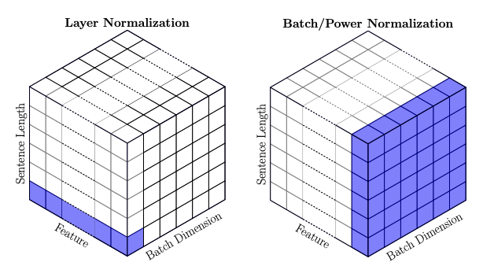

**Instance and Group Normalizations**: TODO

### Curriculum Training: Teacher Training & Knowledge Distillation

* handle shift of variance by varying dataset used for training (ie change data distribution over epochs)
  * train model from *easier* to *harder* to learn data
* Curriculum: a sequence of training dataset - D1 .. Dt
  * Each dataset is used of L epochs or until loss converges
  * Entropy of training datasets increases over epochs
  * TODO

Scoring and Pacing Functions (both are domain-dependent):
* Scoring function $s(d)$ tells how difficult it is to learn a data point
* Pacing function $p(t)$ tells when to train with a difficult sample
  * Discrete data: change dataset at fixed intervals
  * Continous data: change dataset at each epoch - sample from a distribution
    * Params of distribution can be updated over epochs
    * Start with Gaussian and move to Uniform: $f(t,d) = p(t) \mathcal{N}(d) + (1 - p(t)) \mathcal{U}$
  
**Self-Paced Learning** (when we don't know appropriate scoring & pacing functions so we need to learn them)
* Samples with smaller loss values are selected first
* Loss function itself acts as scoring function -- "harder" samples have higher loss values - higher variance of gradients
* *Reduces gradient variance early in training*
* Reinforcement Learning can be used to dynamically change dataset
* When earlier samples now have losses close to 0, shift to next set of harder data.
* Often used in NLP & Computer Vision, wherever dataset has very high variance

**Transfer Learning**: we initialize a neural network (or parts of it) with weights of another pre-trained model
* It's a special case of curriculum or teacher learning
* Two goals: parameter transfer or feature representation transfer
* *Inductive* (different task) vs *transductive* (same task  -- retain only initial layers) transfer
* Neural net output $y(w,x) = g(w_1, h(w_2, x))$ (i.e. 2 parts of weights)
  * Feature extractor - $h()$, task-specific inference function - $g()$
* Inductive: same features can be used across different tasks
  * Different tasks may share same input dataset with different labels and loss functions
  * Transfer feature representation function - $h()$ - share inital layers' weights
* Transductive: Same task, different data - transfer inference func $g()$
* Prevent too much model drift: $L(w) + \lambda |w - w_{pretrained}|^2$
* Multi-task learning loss (learning same set of features for multiple tasks): $\min_w L_1(w_1, h(w_0, x)) + \lambda L_2(w_2, h(w_0, x))$

**Meta-Learning & Few-Shot Learning**: (train not only for different task, but also different datasets with different features)
* Learn different params for different tasks with different train & test (correlated) datasets
  * Meta learning (outer loop): $\sum_i L_d(W_i, D_{i,MetaTraining})$
  * Task-specific learning (inner loop): $W_i = U(W, D_{i,Train})$
  * Model-agnostic meta learning
  * Similar to a Bayesian model of learning the prior
  * so in meta-learning we're optimizing gradients, so backpropogation involves gradient of gradient, i.e. Hessian
  * (we often use first-order approx of meta-learning -- used because meta-learning is very computationally expensive)
* Few-Shot learning: $D_{i,Test}$ is a small dataset
* Idea in Meta-Learning is: the Meta-Weights by themselves are not used, but rather using those individual tasks' weights learn in just a few epochs using meta-weights.

### Skip Connection

avoid vanishing/exploding gradients by skipping between layers.

types: short skip vs long skip (many hundreds of layers apart!)

* Use in deep networks (>= 10 layers).
  * Needed when for example, loss is not decreasing but maybe converging at a high value.
* When features learned by earlier layers need to be preserved
  * Adding residue requires some feature dimensions
  * Concentrate where features need to be preserved
  * In Conv nets, short skips are often used.
  * In Autoencoder, long skips are often used (connect at very end).
  * TODO

### Hyperparameter Tuning

Optimal way is to do a gradient descent to find best hyper-params on top of gradient descent -- but this is too expensive

Typical hyperparameters: Learning rate, momentum factors, weight decay-regularization coefficient, dropout rate, label smoothening level,
  batch size

Tools: optuna (recommended by Prof), Hyperopt, skopt, raytune, wandb

* Grid search: search from a predefined set of values
* Random search: sample from a distribution
  * Learning rate - log uniform, dropout -- uniform
  * Bayesian search: fit a distribution (eg. Gaussian) to hyper-params, estimate its params and sample from it
* Hyperband: Pick multiple candidates, TODO

Unlike backprop training (where gradient updates need to be sequential), hyper-param tuning runs can run in parallel as they are independent.

---------
Regularization (\ = reg param, n = lr) : all methods try to keep gradients stable, avoid vanishing / exploding

Weight Decay (only weights not biases) 
* L2/ridge/Tikhonov (smoothen loss surface) : loss L(x) + \ |w|^2, update w = (1 - n \) w - n g
* L1

Param sharing (fine tuning) constrain weights to be similar to another model, loss L(x) + \ |w - wfixed|^2

Data Augmentation: adding gaussian noise N(0, sigma^2) to train X has same effect as L2

Label Smoothening: Replace y 0,1 with $\epsilon$, $1-\epsilon$ (for 2-class).
* For multi-class output, replaced with $1-\epsilon$ (true class), or $\epsilon / (K-1)$ for other classes - i.e. $\epsilon$ is distributed across classes.

Teacher Train / Knowledge Distillation: train smaller model using outputs of larger model

NOT  SURE:
Semi-Supervised (like augmentation but for unsupervised): learn train distrib, sample more data from it

Bagging / Ensemble / Bootstrap:
* multiple samples with replacement from train data, train on each
* classify: max votes, regression: average
* loss calc using all data, prediction yi using only models that did not see it during training

Dropout: bagging alternative, faster, approxes training exponential number of models
* train: each epoch, disable random selection of weights with mask

Early stopping
* patience param
* typically model learns easy samples first

Skip Connection:
* short skip (Add layers of same size, eg. ResNet) or (Concat layers of diff sizes, eg. DenseNet) 
* long skip: RNN

Hyper-Param Tuning:
Train models in parallel on different hyper-params, pick best

## Convolutional Neural Networks (CNN)

Convolution Layer formula (output) - sum (for each image depth/channel) of convolutions of each kernel's weight matrix with matched input regions: 

$$Y_{out} = B + \sum_{k=0}^{C_{in}-1} W_k \circledast X_k$$

where the convolution operation is:

$$(W \circledast X)_{i,j} = \sum_m \sum_n w_{m,n} x_{i-m,j-n}$$

No. of learnable parameters is $K (F^2 D + 1)$

Shift invariant features
Segment input vector, filters output scalars for each
Matched filter = projecting input onto a filter
Correlation over a region = sum(input * kernel over matched region)
Segment, filter, convolution can be done with a MLP but weights are sparse, many shared weights. So warrants new layer type

Input shape: W,H,D (width, height, depth)
Kernel shape: F,F,D (F = filter's kernel size)
Output of whole layer: W-F+1, H-F+1, K (K = no. of kernels); output of single kernel is first 2 dimensions ; without padding, stride 

Padding P add to get feature info from corners, depends on kernel size F ("same" padding=F-1)
Stride: non-continous filter, downsampled output with downsampled factor S

Now output width: floor((W-F+2P)/S) [same for height]

Pooling reduce feature size, get similar features even with greater stride, handle pixel jitter (local invariance but globally equivalent image) (slight shifts of few pixels due to minor cropping, rotation, translation)
* MaxPool: for each block of pool size (say 2x2), replace it with scalar (max of block).
  * NOTE: pooling also has padding, stride, output. width, height is same as in conv but input depth passes through unchanged: (floor((W-F+2P)/S + 1), floor((H-F+2P)/S) + 1, D)
  * We can set stride = kernel size so that we get non-overlapping blocks.
* Average pool
* pool after activation : This is used by default today in all modern neural nets. Some older models used to do pooling before activation. Both give similar result (not same), main reason for pooling before activation was to try to reduce computation a bit in activation layer.

Globalaveragepooling: for each channel, take avg of entire image, so order of values doesn't matter and can use when spatial location doesn't matter for final output (eg. Image classify; can't use for object detection as we need bounding box there). 1D output (K,)

AlexNet (62M params)
* Relu, sgd with momentum, batch 128, MaxPool, dropout
* augmentation: flipping, jittering (random adjusts to bright, contrast, saturation, hue), cropping, color normalisation 
* early layers (large kernels, strides) -> later layers (smaller kernels, strides)
* final receptive field is almost whole image (receptive field is how much of image a single kernel sees at once, grows with layers)

All these seem to have blocks of (conv 1 or more, MaxPool)

AlexNet: not deep enough, too big kernels, no proper normalisation 

VGGNet (138M params)
* Smaller filters, stride 2
* more depth (but that means more vanishing gradient)
* receptive field grows gradually, capturing more features

VGGNet Model architecure (3x3 Conv2D, 2x2 MaxPool (kernel sizes)):

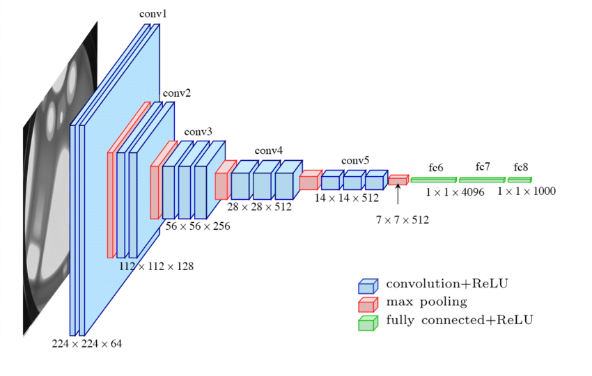

GoogleNet (6.8M params)
* Has "Inception" blocks with different conv kernel sizes in branches, concat output 
* 1x1 conv (weighted sum across channels) - reduces only channel dimension
* Global Pooling (before fully-connected FC) reduces params
* Vanishing gradient: 3 output heads (1 main, 2 auxiliary) lead to softmax in train (to solve vanishing gradient) -- only main output is used during testing. Loss = 0.3 Ld1 + 0.3 Ld2 + Lend
* can't make this deeper to generalize

Resnet 18 (12M params)
* Skip connection
* batch norm
* "Bottleneck" (name of blocks of layers) allows only important features to pass through 
* variants: densenet (feature reuse, concats instead of adds skip connection), resnext (Inception+ resnet), neural ode (ordinary differentiatial equation)

U-Net (31M params) - it is an AutoEncoder variant
* Downsample then upsample, so denoise (regression), segmentation (classification)
* blocks of same width in encoder, decoder are connected by skip connection - this provides feature location info & compensates for info loss

DeepLabV3 (also Encoder-Decoder) TODO

LATEST MODELS 

Vision Transformer (ViT): global attention & context understanding 

YOLO26

GradCAM (Class Activation Mapping) - which spatial region caused decision 
TODO

## RNN (Recurrent Neural Network)

Handle varying length causal sequence (inputs & outputs), out sequence can be infinite 

AR vs NARX process 
Autoregressive (AR(N) process): append out to input sequence then out again
moving average (MA(N) process): ARMA (Autoregressive Moving Average): sum1toN(Wi xi) + sum1toM(Vi yi) (linear layer) (sums autoregressive part + weighted moving average of past forecast errors)
Wold's Representation Theorem: ARMA is universal (any WSS (Weakly Stationary ie statistical properties remain const, eg. No big upward trend in sequence) process is deterministic part + stochastic part)
Non linear autoregressive exogenous process (NARX): yi = f(x0..t, y0..t-1) -- Exogenous just means external input to system

State Space Model
ht = g(ht-1, xt) , yi = f(xi) ---> ORIGINAL RNN FORMULA
Hidden state has info about all past inputs (eg. statistics), model learns state predictor g(), output predictor f() (their params shared for all t)

Applications:
* Time series predictor 
* sequence (next word) predict: speech recognition, sentence classification, etc.
* Sequence to sequence: language translation, text to speech etc.

Train RNN
Unfolding an RNN over time gives an MLP (backprop over time = over unfolded MLP)
Output & gradient will shrink / expand by power t of eigenvalues of weight matrix, so exploding / vanishing gradient 
Long-term memory loss: gradients from deeper layers or very past values vanish

UNROLLED RNN (convert to regular MLP, now we can backpropogate): ht = g(xt, ht-1, yt-1); yt = f(xt, ht, yt-1)

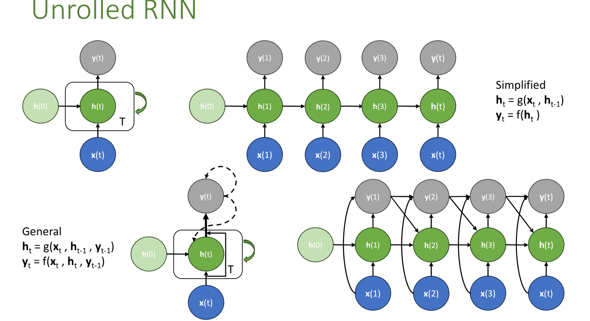

BACKPROPOGATION THROUGH TIME: (gradient formulae in my assignment 6 solution.md)

"skipping through time" = addition of past state (gated with a counter) to retain memory
* short-term memory (no long-term memory): ht = g(xt, rt * ht-1) where rt = reset gate (1/0) - if 0 then forgets old state else remembers
* long-term memory:  ht = ut ht-1 + (1 - ut) g(xt, rt * ht-1) - when update gate ut = 1, gradient flows directly from past so avoids vanishing gradient

**Gated Recurrent Unit** is just addition of the reset gate rt, update gate ut discussed above, so weighted sum of long and short-term states (it becomes same as regular RNN when rt = 1, ut = 0):
$$
r_t = \sigma(W_{rx} x_t + W_{rh} h_{t-1} + b_r) \quad (\text{Reset Gate (Short-term memory)}) \\
u_t = \sigma(W_{ux} x_t + W_{uh} h_{t-1} + b_u) \quad (\text{Update Gate (Long-term memory)})
$$

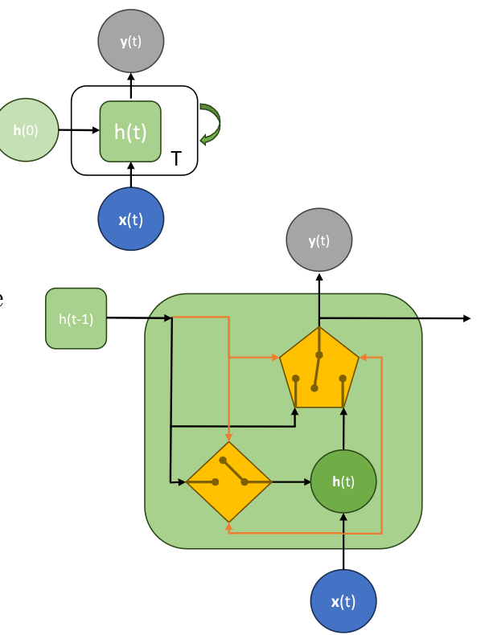

**Long Short Term Memory (LSTM)** learns appropriate functions of long and short term memory
* Long-term memory is retained via *cell memory / context* $c_t$
* Update context: $C_t = f_t C_{t-1} + i_t g_c(x_t, h_{t-1})$ -- *forget gate* $f_t$, usefulness of current input decided with *input gate* $i_t$
* Hidden state update: $h_t = o_t g_h(c_t)$ -- *output gate* $o_t$ decides if this context is relevant to be carried forward.
* Output: $y_t = f(h_t)$
* Gate calculations (context $C$ is a matrix, square brackets mean concat column vector to matrix) :
$$
f_t = \sigma(W_{fx} x_t + W_{fh} [C_{t-1} | h_{t-1}] + b_f) \quad (\text{Forget Gate}) \\
i_t = \sigma(W_{ix} x_t + W_{ih} [C_{t-1} | h_{t-1}] + b_i) \quad (\text{Input Gate}) \\
o_t = \sigma(W_{ox} x_t + W_{oh} [C_t | h_{t-1}] + b_o) \quad (\text{Output Gate; unlike other 2 it uses current context not old context})
$$

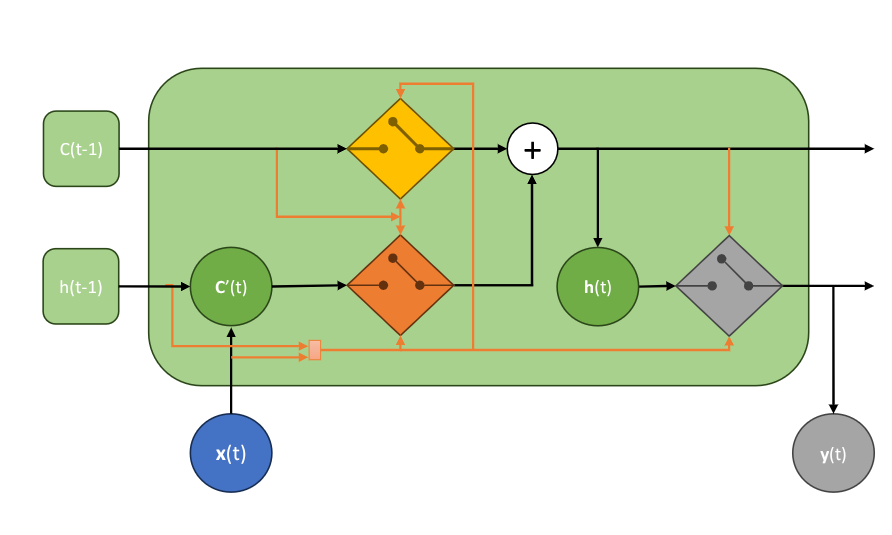

**Teacher Forcing**: sequential training of unrolled RNN takes long time to train but quick for inference. In teacher forcing we remove ht-1 -> ht (this allows parallelism and faster training) and instead feed ground truth yt-1 to calculate yt. *We have kept pre-calculated y1..t values in training data that we now use here.*
* Curriculum training with Teacher forcing: mix of teacher forcing and using predicted output (teacher forcing gradually reduced over epochs) --> as it also requires predicted output it's no longer parallel

**Stacking RNN cells**: multiple RNN "layers" can be stacked vertically, each learning different features, different contexts, possibly at different time steps. Deeper connections can be done (dropout, skip connections vertically).

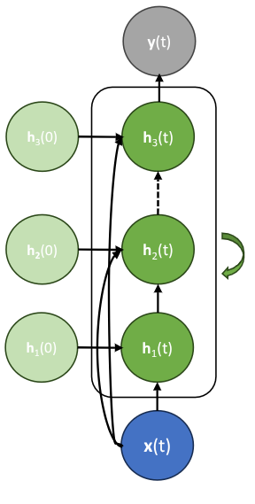

**Bi-directional RNN (breaks causuality - use when whole sequence available at once (eg. text))**: output at time t depends on both *forward state* $g_f(), h_{ft}$ 0,1..t-1 and *backward state* $g_b(), h_{bt}$ N,N-1..t+1 . Both use independent weights. All RNNs can be converted to Bi-RNN :
* Bi-GRU
* Bi-LSTM
* The 2 unrolled networks trained almost independently: to get each gradient $\nabla x_t$, sum gradients of forward $g_f()$ and backward $g_b()$

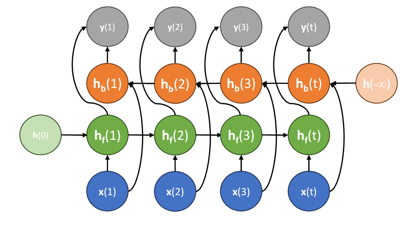

## Attention Mechanism in RNN

Whole input sequence available at once.

* Attention Score $a_i = s(h_t, x_i), i = 1..t$ -- attention score implemented with a MLP
* Update state $h_t = g(h_{t-1}, \sum_i a_i g_v(x_i_))$

For input $x_i$, learn :
* **Key** $k_i = g_k(x_i) = W_k x_i$ - feature representing input, normalized to have norm 1
* **Value** $v_i = g_v(x_i) = W_v x_i$ - feature of x_i useful for current task

For state $h_t$ learn **query** $q_i = g_q(h_t) = W_q h_t$ - feature representing current state.

Attention is (projection gives similarity score, softmax gives how much probability/relevance every input is to current input):

$$a_t = \sigma_N(q_t^T k_t) v_t \quad \text{softmax(Query-Transpose Key) Value}$$

weights $W_k$, $W_v$, $W_q$ are shared for all inputs i.

**Multi-Head / Cross Attention** is computed between data and state (every feature j of i'th input has $k_{ij}, v_{ij}, q_i \forall i = 1,2..N$)

$$h_t = g(h_{t-1}, g_m(\sum_i a_{i1} g_{v1}(x_i), ..., \sum_i a_{iL} g_{vL}(x_i)))$$

**Self-Attention**: if query, key computed for same sentence, useful to learn a context-aware representation of input (words can mean different things at different positions)

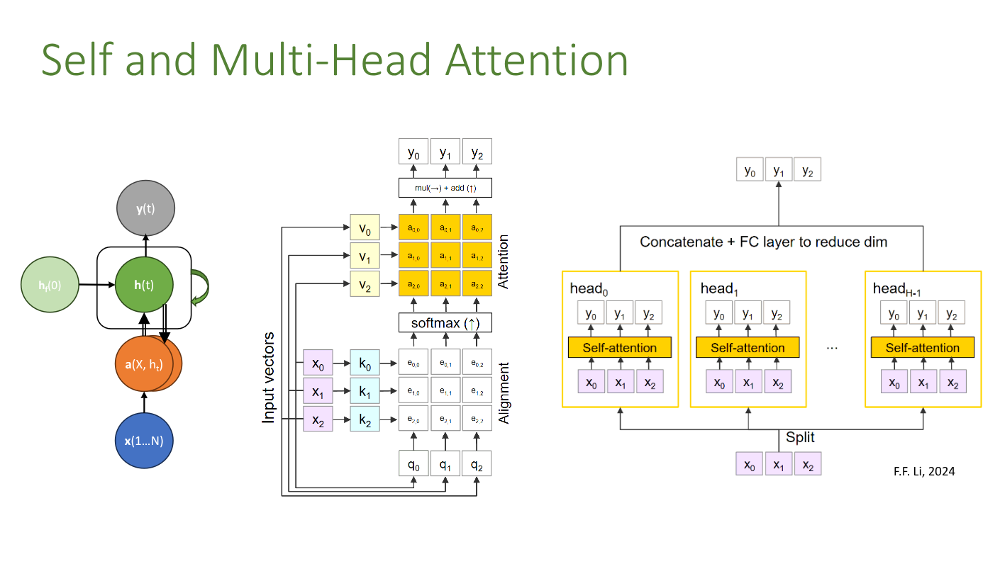

## AutoEncoder (Unsupervised learning), Transformers (Causal Attention) -- TODO: (in slides, but not coming in endsem exam)
  
## Misc Resources

- [PyTorch Intro Tutorial](https://docs.pytorch.org/tutorials/beginner/basics/intro.html)
- [Training on MNIST using only Numpy](https://python-course.eu/machine-learning/training-and-testing-with-mnist.php)
- [Tensorflow Neural Nets Playground & Visualization](https://playground.tensorflow.org/)

[Backprop Problems by Andrew Karpathy](https://karpathy.medium.com/yes-you-should-understand-backprop-e2f06eab496b):
* **Vanishing Gradients** in `sigmoid`, `tanh` (esp if used in hidden layer), activation derivative small so overall gradient flow small => hardly any learning in earlier layers.
* **Dying ReLU**: If $W x + b \le 0$, ReLU value and gradient are both 0 - meaning the neuron remains "dead" throughout training.
* **Exploding Gradients** in RNN, recurrence matrix is multiplied over and over in gradient calc. If its eigen value > 1, then value explodes towards infinity.
* **DQN Clipping**: TODO: didn't fully understand what is DQN
