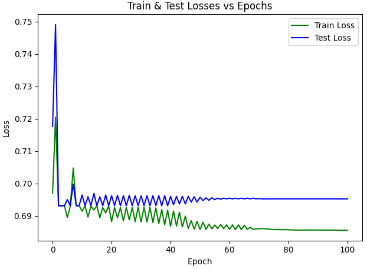
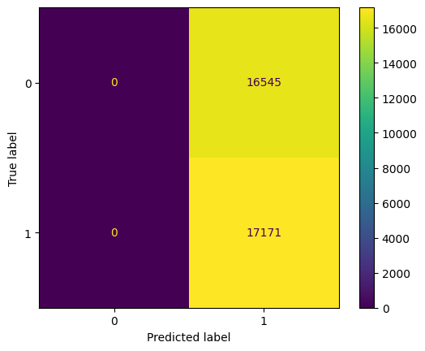
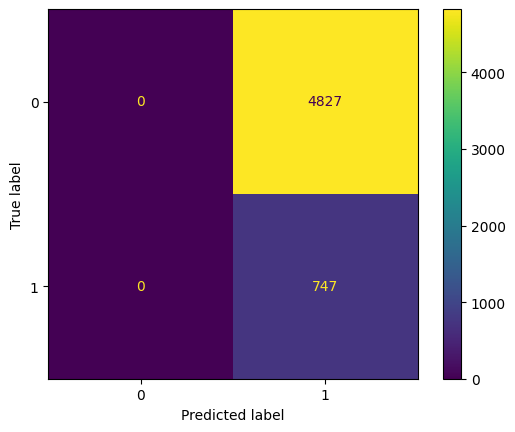
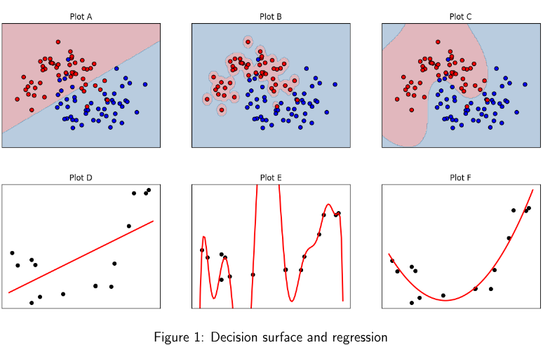
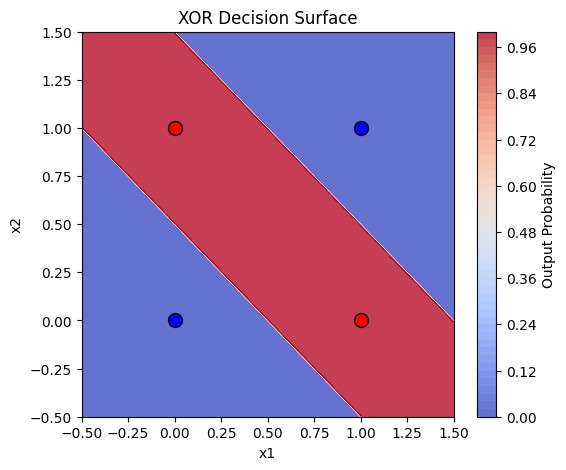
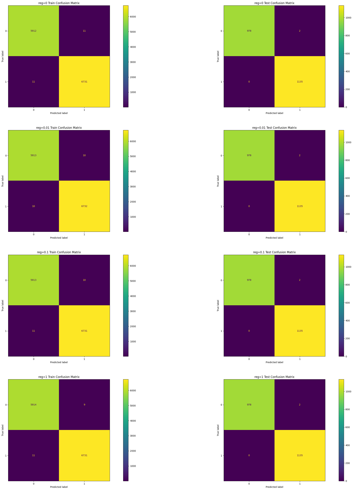
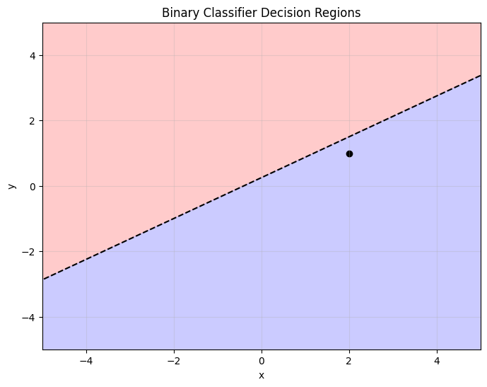

<!-- set all attributes used by VS Code Markdown Converter extension to blank above, so that it doesn't come in generated PDF -->

# DA6401W (Intro to Deep Learning) - Assignment 1

Submitted by: Sohang Chopra &lt;DA25M622&gt;


## Problem 1: Implement Logistic Regression from Scratch for Spam Classification

The objective is to build a binary spam classifier using Logistic Regression implemented from scratch using only NumPy. 
The use of sklearn's `LogisticRegression` or similar high-level machine learning libraries is not permitted.
The model must be trained and evaluated on the [Enron Spam dataset](https://huggingface.co/datasets/bvk/ENRON-spam) 
and tested on a different dataset, the [SMS Spam dataset](https://huggingface.co/datasets/bvk/SMS-spam).

Report the following performance metrics for both training and testing splits:

* Confusion Matrix
* Accuracy
* Precision
* Recall
* F1-Score

Compare the model's performance on the two datasets and provide possible reasons for any
observed differences in the results.

### Solution 1

```python
import numpy as np
from datasets import load_dataset
from tqdm import trange
from sklearn.metrics import confusion_matrix, ConfusionMatrixDisplay, classification_report
from matplotlib import pyplot as plt

############# Load train & validation data #############################

train_df = load_dataset("bvk/ENRON-spam", split="train").to_pandas()[['label', 'email']]
val_df = load_dataset("bvk/SMS-spam", split="train").to_pandas().rename(columns={'data': 'email'})

# rm non-ascii characters: https://stackoverflow.com/a/56744855/12947681
train_df['email'] = train_df['email'].str.encode('ascii', 'ignore').str.decode('ascii')
val_df['email'] = val_df['email'].str.encode('ascii', 'ignore').str.decode('ascii')

max_email_len_train = train_df['email'].str.len().max()
print('Max email length in training data:', max_email_len_train)

Xtrain = np.zeros((train_df.shape[0], max_email_len_train))
for i, email in enumerate(train_df['email']):
    Xtrain[i, : len(email)] = [ord(char) for char in email]
ytrain = train_df['label'].to_numpy()

Xval = np.zeros((val_df.shape[0], max_email_len_train))
for i, email in enumerate(val_df['email']):
    Xval[i, : len(email)] = [ord(char) for char in email]
yval = val_df['label'].to_numpy()

############## Train Binary Logistic Regression model #####################3
epsilon = 1e-8

def xavier_weights_init(input_dimensions: int, output_dimensions: int) -> np.ndarray:
    """Recommended random weights initialization method for layer with sigmoid activation."""
    rng = np.random.default_rng(seed=42)
    limit = 6 / (input_dimensions + output_dimensions)
    return rng.uniform(-limit, limit, size=(output_dimensions, input_dimensions))

def sigmoid(z: np.ndarray) -> np.ndarray:
    return 1 / (1 + np.exp(-z))

def predict(W: np.ndarray, X: np.ndarray) -> np.ndarray:
    return sigmoid(np.clip(np.squeeze(X @ W.T), epsilon, 1 - epsilon))

def binary_cross_entropy(y: np.ndarray, ypred: np.ndarray):
    ypred = np.clip(ypred, epsilon, 1 - epsilon)
    return - np.mean(y * np.log(ypred) + (1-y) * np.log(1-ypred))

def gradients(X: np.ndarray, y: np.ndarray, ypred: np.ndarray) -> np.ndarray:
    batch_size = X.shape[0]
    return (ypred - y) @ X / batch_size

def train(input_dimensions: int, step_size: float):
    W = xavier_weights_init(input_dimensions, 1)       # includes intercepts also
    train_losses = []
    test_losses = []     
    for epoch in trange(1001):
        yprobab_train = predict(W, Xtrain)
        train_losses.append(binary_cross_entropy(ytrain, yprobab_train))

        yprobab_val = predict(W, Xval)
        test_losses.append(binary_cross_entropy(yval, yprobab_val))

        W -= step_size * gradients(Xtrain, ytrain, yprobab_train)       # backpropogation using train data
    
    return train_losses, test_losses, yprobab_train, yprobab_val

train_losses, test_losses, yprobab_train, yprobab_val = train(max_email_len_train, step_size=0.1)

################# Train Results #######################333

ypredict_train = np.where(yprobab_train >= 0.5, 1, 0)
ypredict_val = np.where(yprobab_val >= 0.5, 1, 0)

# Train & Val Loss vs Epoch plot
fig, ax = plt.subplots()
epochs = list(range(101))
ax.plot(epochs, train_losses, label='Train Loss', color='green')
ax.plot(epochs, test_losses, label='Test Loss', color='blue')
ax.set_title('Train & Test Losses vs Epochs')
ax.set_xlabel('Epoch')
ax.set_ylabel('Loss')
ax.legend()
fig.tight_layout()

# accuracy, precision, recall, f1 score
print('\n\nTRAIN METRICS:\n\n')
print(classification_report(ytrain, ypredict_train))
print('\n\nTEST METRICS:\n\n')
print(classification_report(yval, ypredict_val))

# training confusion matrix
ConfusionMatrixDisplay(confusion_matrix(ytrain, ypredict_train), display_labels=[0,1]).plot()

# validation confusion matrix
ConfusionMatrixDisplay(confusion_matrix(yval, yval_train), display_labels=[0,1]).plot()
```

Data               | Accuracy | Precision | Recall | F1 Score
------------------ | -------- | --------- | ------ | ----------
Train (Enron SPAM) | 51%      | 25%       | 50%    | 34%
Val (SMS SPAM)     | 13%      |  7%       | 50%    | 12%

Train & Validation losses vs epochs plot:



Train Confusion Matrix:



Validation Confusion Matrix:



**Observation**: Model trained on Enron Spam data performed with much worse accuracy on SMS Spam data. 
This is because SMS Spam data is significantly different, including much shorter max email length, data imbalance, and different data distribution from train data.


## Problem 2

Let $X = \{x_1,x_2,x_3\}$. Two discrete probability distributions $P$ and $Q$ over $X$ are given as $P = [0.5, 0.3, 0.2], Q = [0.4, 0.4, 0.2]$.

* Compute the cross-entropy $H(P,Q)$.
* Compute the Kullback-Leibler divergence $D_{KL}(P||Q)$.
* Compute the entropy $H(P)$.
* Derive the relationship between Cross-entropy and KL divergence.

### Solution 2

Formulae:

$$
Entropy = H(P) = - \sum_{i=1}^{classes} p(x_i) \ln(p(x_i)) \\
CrossEntropy = H(P,Q) = - \sum_{i=1}^{classes} p(x_i) \ln(q(x_i)) \\
KLDivergence = D_{KL} = \sum_{i=1}^{classes} p(x_i) \ln(\frac{p(x_i)}{q(x_i)})
$$

* Cross Entropy: $H(P,Q) = - 0.5 * ln(0.4) - 0.3 * ln(0.4) - 0.2 * ln(0.2) \approx 1.05$
* KL Divergence: $D_{KL}(P || Q) = 0.5 * ln(0.5 / 0.4) + 0.3 * ln(0.3 / 0.4) + 0.2 * ln(0.2 / 0.2) \approx 0.02$
* Entropy $H(P) = - 0.5 * ln(0.5) - 0.3 * ln(0.3) - 0.2 * ln(0.2) \approx 1.03$
* Relationship between Cross-Entropy and KL-Divergence:
  
$$
D_{KL}(P || Q) = \sum_{i=1}^{classes} p(x_i) \ln(\frac{p(x_i)}{q(x_i)}) 
\implies D_{KL}(P || Q) = - \sum_{i=1}^{classes} q(x_i) \ln(p(x_i)) - (- \sum_{i=1}^{classes} p(x_i) \ln(p(x_i)))
\implies D_{KL}(P || Q) = H(P,Q) - H(P)
$$

Therefore, $KLDivergence(P || Q) = CrossEntropy(P,Q) - Entropy(P)$


## Problem 3: Bias-Variance Tradeoff -- Plot Matching and Justification



You are given six plots (Figure 1 A-F). Each plot represents either a classification or regression
model fit to a dataset. The models differ in their complexity and decision boundaries or fitted
curves.
For each plot, complete the following tasks:

1. Select the most appropriate bias-variance category from the options below.
    * High Bias - Low Variance
    * Low Bias - High Variance
    * Low Bias - Low Variance
2. Justify your choice using concepts such as.
    * model complexity
    * underfitting vs. overfitting
    * sensitivity to noise
    * stability of the model with respect to changes in the training data

### Solution 3

Plot | Bias-Variance Category   | Reason
---- | ------------------------ | --------
A    | High Bias, Low Variance  | Bias is high as model is too simple (underfits data); Variance is low as model has low sensitivity to noise in training data, so model is stable with respect to changes in training data
B    | Low Bias, High Variance  | Bias is low as model is complex; Variance is high as model overfits data and is highly sensitive to noise / changes in training data
C    | Low Bias, Low Variance   | Bias and Variance are both low as model is sufficiently complex to fit data without underfitting or overfitting; It isn't sensitive to noise in training data.
D    | High Bias, Low Variance  | Bias is high as model is too simple (underfits data); Variance is low as model has low sensitivity to noise in training data, so model is stable with respect to changes in training data
E    | Low Bias, High Variance  | Bias is low as model is complex; Variance is high as model overfits data and is highly sensitive to noise / changes in training data
F    | Low Bias, Low Variance   | Bias and Variance are both low as model is sufficiently complex to fit data without underfitting or overfitting; It isn't sensitive to noise in training data.


## Problem 4: Implement XOR gate using neural network 


The Exclusive-OR (XOR) function is a classic example of a Boolean function that is not linearly separable and therefore cannot be implemented using a single-layer perceptron. 
The XOR function takes two binary inputs $x_1,x_2 \in \{0,1\}$ and produces a binary output $y \in \{0,1\}$. The truth table for the XOR function is given below:

$x_1$ | $x_2$ | $XOR(x_1,x_2)$
----- | ----- | -------------
0     | 0     | 0
0     | 1     | 1
1     | 0     | 1
1     | 1     | 0

Consider a two-layer neural network (one hidden layer and one output layer) with:

* Two input neurons
* Two hidden neurons
* One output neuron
* Sigmoid activation function $\sigma(z) = \frac{1}{1 + e^{-z}}$

Plot the decision surface of your network. It will look something like the sample added here (Figure 2).
Use the following pre-defined weights and biases.

Hidden layer:

$$W_1 = \begin{pmatrix} 20 & 20 \\ 20 & 20 \end{pmatrix}, \quad b_1 = (-10, -30)$$

Output layer:

$$W_2 = \begin{pmatrix} 20 \\ -20 \end{pmatrix}, \quad b_2 = -10$$

### Solution 4

Using step function activation in hidden layer: $Step(a) = \begin{cases} 1, & a > 0 \\ 0, & \text{otherwise} \end{cases}$. Here $x = \begin{pmatrix} x_1 \\ x_2 \end{pmatrix}$ is input vector, $y$, $z$ are outputs of layer 1 (hidden) and 2 (output) respectively:

$$
y = Step(W_1 x + b_1) = \begin{pmatrix} Step(20 x_1 + 20 x_2 - 10) \\ Step(20 x_1 + 20 x_2 - 30) \end{pmatrix} \\
z = \sigma(W_2 y_1 + b_2) = \sigma(20 y_1 - 20 y_2 - 10)
$$

x     | y     | z (probability of output=1)   | Predicted Class
----- | ----- | ----------------------------- | ----------------
(0,0) | (0,0) | $\sigma(-10) \approx 0.00005$ | 0
(0,1) | (1,0) | $\sigma( 20) \approx 0.99999$ | 1
(1,0) | (1,0) | $\sigma( 20) \approx 0.99999$ | 1
(1,1) | (1,1) | $\sigma(-10) \approx 0.00005$ | 0

Plotting decision surface of network:

```python
import numpy as np
import matplotlib.pyplot as plt

def sigmoid(x):
    return 1 / (1 + np.exp(-x))

def forward_pass(x1, x2):
    # Hidden Layer with Step Function activation
    h1 = 20*x1 + 20*x2 - 10 > 0
    h2 = 20*x1 + 20*x2 - 30 > 0
    # Output Layer
    return sigmoid(20*h1 - 20*h2 - 10)

x = np.linspace(-0.5, 1.5, 200)
y = np.linspace(-0.5, 1.5, 200)
X1, X2 = np.meshgrid(x, y)
Z = forward_pass(X1, X2)

plt.figure(figsize=(6, 5))
cp = plt.contourf(X1, X2, Z, levels=50, cmap='coolwarm', alpha=0.8)
plt.colorbar(cp, label='Output Probability')

# Plot the XOR truth table points
plt.scatter([0, 1], [0, 1], c='blue', edgecolors='k', s=100, label='Class 0')
plt.scatter([0, 1], [1, 0], c='red', edgecolors='k', s=100, label='Class 1')

plt.xlabel('x1')
plt.ylabel('x2')
plt.title('XOR Decision Surface')
plt.show()
```




## Problem 5: Learning Dynamics and Generalization in Neural Networks

A supervised learning model is trained using gradient-based optimization. 
The behavior of training and validation losses provides insight into the learning dynamics and generalization ability of the model.

1. During training, the training loss decreases steadily, but the validation loss starts increasing after a few epochs. 
   Explain what this behavior indicates. Suggest two practical strategies to address this issue and explain why they work.
2. Two neural networks are trained on the same dataset. Both achieve similar training loss. Discuss how their generalization behavior may differ and justify your reasoning.
   * Network A: shallow but very wide
   * Network B: deep but narrow
3. Explain how the choice of activation function affects gradient flow during backpropagation. 
   Compare sigmoid and ReLU activations in deep networks without using their mathematical definitions.
4. Suppose all weights in a multilayer neural network are initialized to zero. Explain what happens during training and why learning fails in this case.
5. A model achieves very low bias but performs poorly on unseen test data. Explain how this situation can arise and discuss whether increasing the dataset size would help.

### Solution 5

1. This indicates **Overfitting** on training data, i.e., model has learnt even noise in training data and so can't generalize leading to high validation loss.
   Two **Regularization** strategies to tackle this are:
    * Early Stopping: save model at the epoch where validation loss was minimum, and stop training after say 5 epochs if validation loss does not improve.
    * L1 or L2 Norms: add an L1 or L2 norm term in loss function that promotes model sparsity, i.e., pushes weights towards 0. 
      This penalizes large weights and prevents model from relying too heavily on any single feature which smoothens decision boundary.

2. As Network B has more hidden layers, it will generalize better for complex features than Network A provided both have similar number of total neurons. 
   This is because each hidden layer takes previous layer's learnt simple features as input and learns more complex features from them, so overall model can better learn complex features.
   So to achieve same training loss, Network B may require fewer epochs. But it can also be a bit harder to train due to problem of vanishing gradients.

   On the other hand, Network A tends to memorize patterns (works well for simple features) instead of learning to generalize in case of complex features.

3. During backpropogation, using Sigmoid activation in hidden layers can cause **Vanishing Gradient** problem - since Sigmoid activation forces inputs into a narrow range $[0,1]$,
   gradient multiplication can very rapidly reduce gradients to near 0, i.e., "vanish" before reaching earlier layers. This hinders learning.
   On the other hand, ReLU activation does not saturate for positive values, so gradients flow easily and hence ReLU is a good fit for activation in hidden layers.
   Sigmoid activation is preferred with multi-class classification output layers as it naturally represents class probabilities due to its range $[0,1]$.

4. If all weights are identical (0), then every neuron in a layer will calculate same output in forward pass, and recieve same gradient update in backward pass.
   So all weights in a layer will remain identical, causing whole layer to effectively function as just one big neuron. This is called **Symmetry Breaking** failure.

5. This indicates Overfitting (Low Bias but High Variance) where model has learnt even the noise in training data and so fails to generalize to unseen test data.
   Increasing the dataset size significantly will help as model will no longer be able to just memorize patterns and will be forced to generalize in training.


## Problem 6: Comparison of Loss Functions: Mean Squared Error vs Cross-Entropy

Loss functions play a crucial role in training machine learning models by quantifying the discrepancy between true labels and model predictions.

1. **Definition of Loss Functions**: Define the following loss functions for a binary classification problem:
   * Mean Squared Error (MSE)
   * Binary Cross-Entropy (Log Loss)
2. **Behavior and Gradient Characteristics**: Compare MSE and Cross-Entropy loss in terms of:
   * Sensitivity to prediction errors
   * Gradient behavior when predictions are confident but incorrect
3. **Suitability for Classification**: Explain why Cross-Entropy loss is generally preferred over MSE for classification tasks such as logistic regression.
4. **Task-based Comparison**: Give one example where MSE is more suitable and one example where Cross-Entropy is more suitable. Justify your choices.

### Solution 6

1. For a binary classification problem, loss functions (where $y_i$ is true output, $\hat{y_i}$ is predicted output, $p$ is probability of getting predicted output $\hat{y_i} = 1$):
    * Mean Squared Error is $MSE = \frac{1}{n} \sum_i^n (\hat{y_i} - y_i)^2$ . For binary classification, $MSE \in [0,1]$.
    * Binary Cross-Entropy (Log Loss) is average of losses for each output $\frac{1}{n} \sum_i^n - [y_i \ln(\hat{y_i}) + (1 - y_i) \ln(1 - \hat{y_i})]$ - each individual output's loss simplifies to $- \ln(p)$ if output = 1, else $- \ln(1 - p)$ if output = 0 (range is $[0,\infty]$)
2. MSE vs Binary Cross Entropy:
    * Sensitivity to prediction errors: MSE is Relatively gentle on large errors because it is bounded between 0 and 1 for classification. 
      OTOH Binary Cross Entropy is highly sensitive; it penalizes "confident and wrong" predictions with near-infinite loss.
    * Gradient Behavior when preidictions are confident but incorrect: MSE causes **gradient saturation** (If a Sigmoid neuron is very wrong, the gradient becomes very small, making learning extremely slow)
      OTOH with Binary Cross Entropy, gradient is proportional to the error $\hat{y} - y$. This ensures the model keeps learning effectively even when errors are large.
3. MSE error surface is non-convex so gradient descent can get trapped in a local minima. Also MSE suffers from **vanishing gradient** problem - when an input to output Softmax / Sigmoid is very large or very small, its small gradient being multiplied during backpropogation can cause gradients to "vanish" (become nearly 0), causing weights to hardly change.
   OTOH, error surface of Binary Cross Entropy is convex, guaranteeing only one global minima (no other local minima). Also BCE maintains a steady slope, avoiding vanishing gradient problem and forcing model to keep learning.
4. MSE is used for regression, Cross Entropy for classification. TODO: reason


## Problem 7: Programming Question: Implement Loss Functions from Scratch

In this question, you will implement basic loss functions used in machine learning using NumPy only. Do not use any machine learning libraries.

1. **Mean Squared Error (MSE)**: Write a Python function that computes the Mean Squared Error loss given:
   * True labels y
   * Predicted values $\hat{y}$
2. **Binary Cross-Entropy Loss**: Write a Python function that computes the Binary Cross-Entropy loss for a binary classification task given:
   * True labels $y \in \{0,1\}$
   * Predicted probabilities $\hat{y} \in \{0,1\}$
3. **Numerical Stability**: Explain briefly why it is important to clip predicted probabilities when computing cross-entropy loss.

### Solution 7

Implementations of Loss functions Mean Squared Error and Binary Cross Entropy:

```python
import numpy as np

def mean_squared_error(ytrue: np.ndarray, ypredicted: np.ndarray) -> np.floating:
    return np.mean((ypredicted - ytrue)**2)

def binary_cross_entropy(ytrue: np.ndarray, probabilites: np.ndarray) -> np.floating:
    epsilon = 1e-7
    probabilites = np.clip(probabilites, epsilon, 1 - epsilon)
    return - np.mean(ytrue * np.log(probabilites) + (1 - ytrue) * np.log(1 - probabilites))

# Errors for example data
ytrue = np.array([1,0,0,1,0,1])       
probabilities = np.array([1,0,0.2,0.6,0.4,0.5])
ypredicted = np.where(probabilities >= 0.5, 1, 0)
mse = mean_squared_error(ytrue, ypredicted).item()
bce = binary_cross_entropy(ytrue, probabilities).item()
print(f'{mse=}, {bce=}')   # mse=0.0, bce=0.323
```

In cross-entropy calculation, extremely low or high prediction probabilities $\in [0,1]$ cause loss to explode: $0 : log(0) = \infty, \quad 1 : log(1-0) = \infty$.
That's why we clip probabilities to $[\epsilon, 1 - \epsilon]$ where $\epsilon$ is a small number near 0.


## Problem 8: Logistic Regression with L2 Regularization on MNIST

In this question, you will implement binary logistic regression with L2 regularization from scratch using only NumPy.
Use the MNIST dataset and create a binary classification task as follows:

* Class 0: Digit 0
* Class 1: Digit 1

You must:

1. Load the MNIST dataset: you may use tensorflow `from tensorflow.keras.datasets import mnist`.
1. Flatten the images and normalize input features.
2. Implement logistic regression with:
    * Sigmoid activation function
    * Binary cross-entropy loss
    * L2 regularization on weights
3. Train the model using batch gradient descent.

Report the following for both training and test sets:
* Loss vs iterations plot
* Confusion matrix
* Accuracy, Precision, Recall, and F1-score

Compare results for different regularization strengths: $\lambda \in \{0,0.01,0.1,1.0\}$ and explain the effect of regularization on overfitting and generalization.

### Solution 8

Forward Pass (using input $X$ having $N$ images and $D$ features, predicting probabilities $p = P(\hat{y}=1)$ which has loss $L$ compared to expected output $y$):

$$
z = W X^T \\
p = P(\hat{y}=1) = \sigma(z) = \frac{1}{1 + e^{-z}} \\
L = \frac{-1}{N} \sum_{i=1}^N [ y_i \ln(p_i) + (1 - y_i) \ln(1 - p_i)) ] + \frac{\lambda}{2 D} \sum_i \sum_j W_{i,j}^2
$$

NOTE: In above loss $L$, L2 regularization term (with strength $\lambda$) is kept only during training and removed in testing.

Gradient Descent Update Rule using learning rate (step size) $\eta$:

$$W_{k+1} = W_k - \eta \frac{\partial L}{\partial W}$$

Gradients for Backpropogation:

$$
\frac{\partial L}{\partial p} = \frac{-1}{N} (\frac{y}{p} - \frac{1-y}{1-p}) \\
\frac{\partial p}{\partial z} = p (1-p) \quad (\sigma'(z) = \sigma(z) (1 - \sigma(z))) \\
\frac{\partial z}{\partial W} = X
$$

By chain rule, finally gradient is:

$$\frac{\partial L}{\partial W} = \frac{\partial L}{\partial p} \frac{\partial p}{\partial z} \frac{\partial z}{\partial W} = \frac{1}{N} (p - y) X + \frac{\lambda}{D} W$$

```python
import numpy as np
import pandas as pd
from keras.datasets import mnist
from sklearn.metrics import confusion_matrix, ConfusionMatrixDisplay, classification_report
from matplotlib import pyplot as plt
from tqdm import trange

def preprocess(X, y):
    mask = np.isin(y, [0,1])
    X, y = X[mask], y[mask]         # filter - keep only digits 0,1
    num_images, width, height = X.shape
    X = np.reshape(X, (num_images, width*height))       # flatten images
    X = X.astype(float) / 255      # normalize from [0,255] to [0,1]
    X = np.hstack((X, np.ones((X.shape[0], 1))))        # add a 1 to each row (flattened image) to account for weight intercept term
    return X, y 

def Xavier_initial_weights(input_features: int, output_features: int) -> np.ndarray:
    limit = np.sqrt(6 / (input_features + output_features))
    shape = (output_features, input_features + 1)      # +1 to input_size to account for intercepts also
    return np.reshape(rng.uniform(-limit, limit, size=np.prod(shape)), shape)

def sigmoid(z):
    return 1 / (1 + np.exp(-z))

def binary_cross_entropy(ytrue, yprobab):
    return - np.mean(ytrue * np.log(yprobab) + (1-ytrue) * np.log(1-yprobab))

def l2_squared_norm(W):
    return np.sum(W ** 2)

def predict(W, X):
    return sigmoid(np.squeeze(W @ X.T))

def gradients(X, ytrue, yprobab, input_features, reg, W):
    """Feed forward - predict output probabilities."""
    num_images = X.shape[0]
    dW_loss = (yprobab - ytrue) @ X / num_images
    dW_L2 = W * reg / input_features
    return dW_loss + dW_L2

def train(W: np.ndarray, reg: float, ax_train, ax_test) -> None:
    """Train model weights using given regularization strength, and return trained weights."""
    train_losses = []
    test_losses = []     # includes intercepts also
    for epoch in trange(1, 101):
        yprobab_train = predict(W, Xtrain)
        train_losses.append(binary_cross_entropy(ytrain, yprobab_train) + l2_squared_norm(W) * reg / (2 * input_features))  # IMPORTANT: L2 regularization loss added only in train, not test

        yprobab_test = predict(W, Xtest)
        test_losses.append(binary_cross_entropy(ytest, yprobab_test))

        W -= step_size * gradients(Xtrain, ytrain, yprobab_train, input_features, reg, W)       # backpropogation using train data
    
    ypredict_train = np.where(yprobab_train >= 0.5, 1, 0)
    ypredict_test = np.where(yprobab_test >= 0.5, 1, 0)

    ConfusionMatrixDisplay(confusion_matrix(ytrain, ypredict_train), display_labels=[0,1]).plot(ax=ax_train)
    ax_train.set_title(f'{reg=} Train Confusion Matrix')
    ConfusionMatrixDisplay(confusion_matrix(ytest, ypredict_test), display_labels=[0,1]).plot(ax=ax_test)
    ax_test.set_title(f'{reg=} Test Confusion Matrix')

    x = classification_report(ytrain, ypredict_train, output_dict=True)
    train_metrics.append([reg, x['accuracy'], x['weighted avg']['precision'], x['weighted avg']['recall'], x['weighted avg']['f1-score']])

    x = classification_report(ytest, ypredict_test, output_dict=True)
    test_metrics.append([reg, x['accuracy'], x['weighted avg']['precision'], x['weighted avg']['recall'], x['weighted avg']['f1-score']])

(train_images, train_labels), (test_images, test_labels) = mnist.load_data()
Xtrain, ytrain = preprocess(train_images, train_labels)
Xtest, ytest = preprocess(test_images, test_labels)

input_features, output_features = 784, 1
reg = 1     # regularization strength: 0, 0.01, 0.1, 1
step_size = 0.1     # learning rate of gradient descent
epsilon = 1e-7
rng = np.random.default_rng(seed=42)
W = Xavier_initial_weights(input_features, output_features)

regularization_strengths = [0, 0.01, 0.1, 1]
train_metrics = []
test_metrics = []
fig, axes = plt.subplots(nrows=len(regularization_strengths), ncols=2, figsize=(30,30))
for i, reg in enumerate(regularization_strengths):
    print('\n\nRegularization Strength:', reg)
    train(W, reg, axes[i][0], axes[i][1])   
fig.tight_layout(pad=5)
print('TRAINING METRICS:', pd.DataFrame(train_metrics, columns=['reg', 'accuracy', 'precision', 'recall', 'f1-score']), sep='\n')
print('TEST METRICS:', pd.DataFrame(test_metrics, columns=['reg', 'accuracy', 'precision', 'recall', 'f1-score']), sep='\n')
```

**Training Metrics**:

reg  | accuracy  | precision | recall   | f1-score
---- | --------- | --------- | -------- | -----------
0.00 | 0.998263  | 0.998263  | 0.998263 | 0.998263
0.01 | 0.998421  | 0.998421  | 0.998421 | 0.998421
0.10 | 0.998342  | 0.998342  | 0.998342 | 0.998342
1.00 | 0.998421  | 0.998421  | 0.998421 | 0.998421

**Test Matrices**:


reg  | accuracy  | precision | recall   | f1-score
---- | --------- | --------- | -------- | -----------
0.00 | 0.999054  | 0.999056  | 0.999054 | 0.999054
0.01 | 0.999054  | 0.999056  | 0.999054 | 0.999054
0.10 | 0.999054  | 0.999056  | 0.999054 | 0.999054
1.00 | 0.999054  | 0.999056  | 0.999054 | 0.999054

**Train & Test Confusion Matrices**:




## Problem 9: Numerical Problem on Logistic Regression Prediction

Consider a binary logistic regression model defined as:

$$P(y=1 |x) = \sigma(z) = \frac{1}{1 + e^{-z}}, \quad z = w^T x + b$$

Given:

$$w = \begin{pmatrix} 0.6 \\ -0.4 \end{pmatrix}, \quad b = -0.2, \quad x = \begin{pmatrix} 2 \\ 1 \end{pmatrix}$$

1. Compute the value of $z$.
2. Compute the predicted probability $P(y = 1 | x)$.
3. Predict the class label assuming a threshold of 0.5.
4. Plot the hyperplane and the data points.

### Solution 9

1. $z = 0.6*2 - 0.4*1 - 0.2 = 0.6$
2. $P(y=1 | x) = \sigma(0.6) = 1 / (1 + exp(-0.6)) \approx 0.645$
3. $P(y=1 | x) (0.645) > threshold (0.5)$, so predicted class label is 1.
4. Plotting hyperplane (class 0 area is red, class 1 area is blue, **decision boundary** is dotted line, and given $x$ point is shown with black dot):

```python
import numpy as np
import matplotlib.pyplot as plt
w = np.array([0.5, -0.8]) 
b = 0.2
threshold = 0.5

x = np.linspace(-5, 5, 200)
y = np.linspace(-5, 5, 200)
X, Y = np.meshgrid(x, y)
Z = w[0] * X + w[1] * Y + b
Probability = 1 / (1 + np.exp(-Z))

plt.figure(figsize=(8, 6))
plt.contourf(         # color both sides of plane (one class on each side)
    x, y, Probability, 
    levels=[0, threshold, 1],  # mk two distinct colors for Class 0 and Class 1
    colors=['red', 'blue'], alpha=threshold
)
plt.contour(x, y, Z, levels=[0], colors='black', linestyles='--')  # Add the decision boundary line (where z=0)
plt.scatter(2, 1, color='black')    # show the point (2,1) given in question on plot

plt.xlabel('x')
plt.ylabel('y')
plt.title('Binary Classifier Decision Regions')
plt.grid(True, alpha=0.3)
plt.show()
```




## Problem 10: Find the advantages of using NumPy or PyTorch over naive python iterators and operations while working with neural networks

You are required to implement a fully-connected feedforward neural network with a single hidden layer (4-neurons) with ReLU activation, one output layer (one neuron) with sigmoid activation, using three different approaches:

1. Pure Python using iterators
2. NumPy arrays
3. PyTorch tensors

You will then compare their execution speed as a function of input dimension for a single data-point.
Repeat it for a batched-input and explore how broadcasting is done in NumPy or PyTorch, and explicitly mention where can it be used in the given scenario (which operation during the forward pass can utilize the automatic-broadcasting?).
Assume the dimensions wherever required.

Bonus: Compare the speedup in PyTorch when tensors are in the CPU and when tensors are in the GPU (use Google Colab or Kaggle notebooks for free GPU access) and find the reasons for any unexpected behavior if encountered.

### Solution 10

```python
from typing import Callable
import math
import random

import numpy as np
import torch


class PurePython:
    @staticmethod
    def matrix_multiply_transpose(A, B_transpose) -> list[list[float]]:
        """Matrix Multiply A with transpose(B)."""
        assert len(A[0]) == len(B_transpose[0]), f'Matrix Multiply shape mismatch: {len(A), len(A[0])}, {len(B_transpose[0]), len(B_transpose)}'
        return [
            [sum(a * b for a, b in zip(rowA, colB)) for colB in B_transpose] 
            for rowA in A 
        ]

    @staticmethod
    def matrix_map(matrix: list[list[float]], func: Callable[[float], float]) -> list[list[float]]:
        return [[func(x) for x in row] for row in matrix]
    
    def __init__(self, W1: np.ndarray, W2: np.ndarray):
        self.W1 = W1
        self.W2 = W2

    def feed_forward(self, X: list[list[int]]) -> list[int]:
        Y1 = PurePython.matrix_map(PurePython.matrix_multiply_transpose(X, self.W1), lambda z: max(0,z))    # hidden layer (relu)
        Y2 = PurePython.matrix_map(PurePython.matrix_multiply_transpose(Y1, self.W2), lambda z: 1 / (1 + math.exp(-z)))   # output layer (sigmoid)
        y = [1 if out[0] >= 0.5 else 0 for out in Y2]        # final predictions
        return y
    
class NumpyModel:
    @staticmethod
    def relu(z: np.ndarray) -> np.ndarray:
        return np.where(z > 0, z, 0)
    
    @staticmethod
    def sigmoid(z: np.ndarray) -> np.ndarray:
        return 1 / (1 + np.exp(-z))
    
    def __init__(self, W1: np.ndarray, W2: np.ndarray):
        self.W1 = W1
        self.W2 = W2

    def feed_forward(self, X: np.ndarray) -> np.ndarray:
        Y1 = NumpyModel.relu(X @ self.W1.T)
        Y2 = NumpyModel.sigmoid(Y1 @ self.W2.T)
        y = np.where(np.squeeze(Y2) >= 0.5, 1, 0)
        return y


class TorchModel:
    def __init__(self, W1: torch.Tensor, W2: torch.Tensor):
        self.W1 = W1
        self.W2 = W2

    def feed_forward(self, X: torch.Tensor) -> torch.Tensor:
        # Convert numpy arrays to torch tensors (using float64 for precision matching)
        Y1 = torch.relu(X @ self.W1.t()) 
        Y2 = torch.sigmoid(Y1 @ self.W2.t())
        y = (Y2.squeeze() >= 0.5).to(torch.int)
        return y


def kaimeng_he_weights_init(rng: np.random.Generator, input_features: int, output_features: int) -> np.ndarray:
    return rng.normal(0, 2 / input_features, size = (output_features, input_features))

def xavier_weights_init(rng: np.random.Generator, input_features: int, output_features: int) -> np.ndarray:
    limit = 6 / (input_features + output_features)
    return rng.uniform(-limit, limit, size = (output_features, input_features))


# Shapes (first dimension of data X, Y1, Y2 is always batch N)
# X: (N,D)
# W1: (4,D)    (4 neurons in hidden layer)
# Y1 = relu(X @ W1.T): (N,4)
# W2: (1,4)    (1 neuron in output layer)
# Y2 = sigmoid(Y1 @ W2.T): (N,1)

# MODIFY INPUTS HERE : N = batch_size, D = no. of input dimensions
# N, D = 1, 8
# N, D = 1, 64
N, D = 16, 8
# N, D = 256, 64

rng = np.random.default_rng(seed=42)
W1 = kaimeng_he_weights_init(rng,D,4)
W2 = xavier_weights_init(rng,4,1)
X = rng.choice([0,1], size=(N,D))

W1_torch = torch.from_numpy(W1).to(torch.float64)
W2_torch = torch.from_numpy(W2).to(torch.float64)
X_torch = torch.from_numpy(X).to(torch.float64)

assert torch.cuda.is_available(), 'CUDA GPU not available'
W1_cuda = W1_torch.cuda()
W2_cuda = W2_torch.cuda()
X_cuda = X_torch.cuda()

# Ran each %time in Colab notebook cell to get times
%time y_python = PurePython(W1,W2).feed_forward(X)
%time y_numpy = NumpyModel(W1,W2).feed_forward(X)
%time y_torch = TorchModel(W1_torch,W2_torch).feed_forward(X_torch)      # Torch CPU
%time y_cuda = TorchModel(W1_cuda, W2_cuda).feed_forward(X_cuda)         # Torch GPU

# assert y_python == y_numpy.tolist() == y_torch.tolist() == y_cuda.tolist()     # Verify all methods gave same output for same input
```

Batch Size $N$  | Input Dimensions $D$  | Method        | Duration (micro-seconds)
--------------- | --------------------- | ------------- | -------------------------
  1             |  8                    | Python        |      51.0
  1             |  8                    | Numpy         |      87.0
  1             |  8                    | PyTorch (CPU) |     539.0
  1             |  8                    | PyTorch (GPU) |     820.0
  1             | 64                    | Python        |     120.0
  1             | 64                    | Numpy         |     113.0
  1             | 64                    | PyTorch (CPU) |     338.0
  1             | 64                    | PyTorch (GPU) |     952.0
 16             |  8                    | Python        |     433.0
 16             |  8                    | Numpy         |      21.2
 16             |  8                    | PyTorch (CPU) |      31.9
 16             |  8                    | PyTorch (GPU) |     101.0
256             | 64                    | Python        |  27,200.0
256             | 64                    | Numpy         |     693.0
256             | 64                    | PyTorch (CPU) |     819.0
256             | 64                    | PyTorch (GPU) |     649.0

Above table of timings was made by running the code in Colab notebook (GPU runtime).

Observations:
* For tiny input `N, D = 1, 8`, pure Python code is fastest.
* Numpy is always faster than PyTorch (CPU tensors) code.
* For small inputs, PyTorch tensor calculations is slower on GPU than CPU (due to overhead of transferring memory from CPU to GPU).
* For large input `N, D = 256, 64`, pure Python code is very slow. PyTorch tensors run on GPU run slightly faster than Numpy.


## Problem 11: Prove that the Logistic Regression Loss Function is Convex

Consider a binary classification problem with labels $y \in \{0,1\}$. 
Logistic regression models the conditional probability as:

$$P(y = 1 |x; w) = \sigma(w^T x), \quad \sigma(z) = \frac{1}{1 + e^{-z}}$$

The empirical loss function is given by:

$$L(w) = \sum_{i=1}^n [-y_i \log(\sigma(w^T x_i)) - (1 - y_i) \log(1 - \sigma(w^T x_i))]$$

Prove that $L(w)$ is a convex function of the model parameters $w$.

**Hint**: Rewrite the loss for a single data point as a function of the scalar $z = w^T x$. 
Study the convexity of this function with respect to $z$, and use the fact that convexity is preserved under linear transformations and summation.

### Solution 11

Loss for a single point $x_i$, $y_i$ and predicted output $\sigma(z_i)$ (where $z_i = w^T x_i$) is:

$$
L(z_i) = -y_i \log(\sigma(z_i)) - (1 - y_i) \log(1 - \sigma(z_i)) \\
\implies L(z_i) = y_i \log(1 + e^{-z_i}) + (1 - y_i) \log(\frac{e^{-z_i}}{1 + e^{-z_i}}) \quad (\text{since } \sigma(z) = \frac{1}{1 + e^{-z}}) \\
\implies L(z_i) = y_i \log(1 + e^{-z_i}) - z_i - \log(1 + e^{-z_i}) - y_i z_i - y_i \log(1 + e^{-z_i}) \\
\implies L(z_i) = \log(1 + e^z_i) - y_i z_i
$$

Taking first and second derivatives of Loss:

$$
L'(w) = \frac{e^z_i}{1 + e^z_i} - y_i = \frac{1}{1 + e^{-z}} - y_i = \sigma(z_i) - y_i \\
L''(w) = \sigma'(z_i) = \sigma(z_i) (1 - \sigma(z_i))
$$

Since $0 < \sigma(z) < 1$, $L''(w) = \sigma(z_i) (1 - \sigma(z_i)) > 0$ so $L(w)$ is convex wrt $z_i$.
As convexity is preserved under linear transform and summation, it's also convex wrt $w$ (as $z_i = w^T x_i$, and total loss is sum of individual points' losses).

Therefore $L(w)$ is a convex function of model parameters $w$. Hence proved.