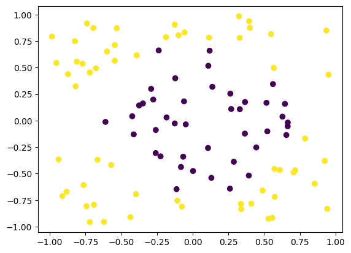
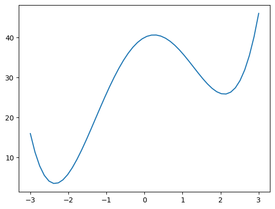
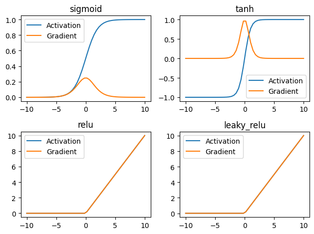

# DA6401W - Assignment 2

Author: Sohang Chopra &lt;DA25M622&gt;

## Problem 1: Effect of Network Depth on Learning Performance

In this question, you will study how the depth of a neural network affects learning and
generalization. You must implement all models **from scratch using NumPy only** . The
use of `sklearn`, `torch`, or `tensorflow` for model implementation is strictly prohibited.

### (a) Dataset Generation and Experimental Setup

Generate a synthetic binary classification dataset as follows:
- Input space: $x = (x_1, x_2) \in R^2$
- Number of samples: $N = 1000$
- Class labels: $y \in \{0, 1\}$

Data generation rule:

$$y = \begin{cases}
1 & \text{if } x_1^2 + x_2^2 > 0.5 \\
0 & \text{otherwise}
\end{cases}
$$

where $x_1, x_2$ are sampled uniformly from $[-1,1] \times [-1,1]$.

Split the dataset into:
- Training set: 80% of the data
- Test set: 20% of the data

Plot the dataset and explain why a linear classifier cannot solve this problem.

### (b) Neural Network Architectures

Implement the following two neural networks:

**Model 1 (Shallow Network):**
- Input layer: 2 neurons
- One hidden layer: 20 neurons
- Output layer: 1 neuron

**Model 2 (Deeper Network):**
- Input layer: 2 neurons
- Hidden layer 1: 10 neurons
- Hidden layer 2: 10 neurons
- Output layer: 1 neuron

Both models must use:
- ReLU activation in hidden layers
- Sigmoid activation in the output layer

### (c) Training Procedure

Train both models using the following fixed hyperparameters:
- Loss function: Binary Cross-Entropy
- Optimization method: Batch Gradient Descent
- Learning rate: $\eta = 0.01$
- Number of epochs: 100
- Weight initialization: $\mathcal{N}(0, 0.1)$
- Bias initialization: zeros

Plot the training loss versus epochs for both models on the same graph.

### (d) Evaluation Metrics

Evaluate both trained models on the test set using:
- Classification accuracy
- Confusion matrix

Use a decision threshold of 0.5 on predicted probabilities.

### (e) Analysis

Compare the two models and discuss the effect of depth in terms of:
- Representational capacity
- Optimization difficulty
- Generalization performance

### Solution 1

Full data plot:



A simple linear classifier cannot directly solve this problem as data is not linearly seperable.

TODO: code (WIP solution in assignment2.ipynb)


## Problem 2: Backpropagation in a Feedforward Neural Network

Consider a fully connected feedforward neural network with one hidden layer used for a
regression task. The network structure is as follows:
- **Input layer:** $x \in \mathbb{R}^d$
- **Hidden layer:** $h = ReLU(W_1 x + b_1)$
- **Output layer:** $\hat{y} = W_2 h + b_2$

The loss function used is the **mean squared error (MSE)** defined as:

$$L = \frac{1}{2} (y - \hat{y})^2$$

### (a) Forward Pass

Derive the expression for the network output $\hat{y}$ in terms of the input $x$, weights, and
biases.

### (b) Loss Gradient at Output Layer

Compute the gradient of the loss $L$ with respect to the output layer parameters $W_2$ and $b_2$.

### (c) Backpropagation Through Hidden Layer

Using the chain rule, derive the expression for the gradient of the loss with respect to the hidden layer weights $W_1$. 
Clearly indicate how the derivative of the ReLU activation affects the gradient flow.

### (d) Role of the Chain Rule

Explain briefly how the chain rule enables efficient gradient computation in deep networks
and why backpropagation is computationally efficient compared to naive differentiation.

### (e) Vanishing Gradient Discussion

State whether the use of ReLU activation helps mitigate the vanishing gradient problem.
Justify your answer.

### Solution 2 

Forward Pass:

$$\hat{y} = W_2 ReLU(W_1 x + b_1) + b_2$$

Loss Gradient of Output layer:

$$
L = \frac{1}{2} (y - \hat{y})^2 = \frac{1}{2} \hat{y}^2 - y \hat{y} + \frac{1}{2} y^2 \\
\frac{\partial L}{\partial \hat{y}} = \hat{y} - y \\
\frac{\partial L}{\partial W_2} = \frac{\partial L}{\partial \hat{y}} \frac{\partial \hat{y}}{\partial W_2} = (\hat{y} - y) h^T \\
\frac{\partial L}{\partial b_2} = \frac{\partial L}{\partial \hat{y}} \frac{\partial \hat{y}}{\partial b_2} = \hat{y} - y
$$

Applying chain rule to get gradient of hidden layer weights (here $z_1 = W_1 x + b_1$):

$$
\frac{\partial L}{\partial W_1} \\
= \frac{\partial L}{\partial \hat{y}} \frac{\partial \hat{y}}{\partial h} \frac{\partial h}{\partial z_1} \frac{\partial z_1}{\partial W_1} \\
= (\hat{y} - y) W_2^T ReLU'(z_1) x^T
$$

Here derivative of ReLU ($\begin{cases} 1, & \text{if } z_1 > 0 \\ 0, & \text{otherwise} \end{cases}$) is multiplied with remaining terms.
So gradient becomes 0 if $W_1 x + b_1 \le 0$ .

Chain Rule allows more efficient gradient computation as it allows us to reuse gradients of already-calculated  outward layers in current layer's gradients.
Naive differentiation would require differentiating loss wrt each layer's weights seperately, which becomes very slow for deep networks with many layers.

ReLU activation helps mitigate vanishing gradient problem as derivative of ReLU remains 1 as long as $z > 0 \implies W x + b > 0$ (so in multiplication remaining terms are not reduced).
This is unlike Sigmoid and Tanh activations in hidden layer whose derivatives are small for large inputs, so multiplying by them causes gradients of earlier layers to "vanish" (become close to 0).


## Problem 3: Simple Gradient Descent

You are optimizing a loss function $L(w) = w^4 - 10 w^2 + 5 w + 40$ .

1. Start with an initial parameter $w_0 = 1$. 
   Using a learning rate (step size) of $\eta = 0.01$, perform one manual iteration of gradient descent to find $w_1$. 
   Calculate the squared error for $w_0$ and $w_1$. Did the loss decrease?
2. Will this setup of initial parameter $w_0 = 1$ reach global minima of the given error surface? 
   Give the range of the initial parameter that will definitely converge to the global minima in the standard gradient descent approach.
3. If you chose a learning rate of $\eta = 2.0$ for this specific problem, what would happen to $w_1$ and the loss at $w_1$? Show the calculation.
4. Plot the loss function for the range $w \in [-3,3]$.

### Solution 3

Loss Gradient is $\frac{\partial L}{\partial w} = 4 w^3 - 20 w + 5$, Gradient Descent update rule is $w_{k+1} = w_k - \eta \frac{\partial L}{\partial w}$

1. With $w_0 = 1, \eta = 0.01$:
$$
w_1 = 1 - 0.01(4 * 1^3 - 20 * 1 + 5) = 1.11 \\
L(w_0) = 1^4 - 10 * 1^2 + 5 * 1 + 40 = 36 \\\
L(w_1) = 1.11^4 - 10 * 1.11^2 + 5 * 1.11 + 40 = 34.747
$$

So Loss of $w_1$ is less than $w_0$.

2. By looking at loss plot made in point 4, global minima is at $w = -2.37$, a local maxima is at $w = 0.1$ and a local minima at $w = 2.1$.
$w_0 = 1$ won't reach global minima as it will get stuck at local minima $w = 2.1$ .
To reach global minima -2.37 , $w_0 < 0.1$ (to left of local maxima so that it doesn't get stuck in local minima 2.1).

3. With $w_0 = 1, \eta = 2$:
$$
w_1 = 1 - 2(4 * 1^3 - 20 * 1 + 5) = 23 \\
L(w_1) = 23^4 - 10 * 23^2 + 5 * 23 + 40 = 274,706
$$

Loss increased a lot, indicating learning rate was too large and skipped over the global minima.

4. Plotting loss function:

```python
import numpy as np
from matplotlib import pyplot as plt
w = np.linspace(-3, 3)
L = w**4 - 10* w**2 + 5*w + 40
plt.plot(w, L)
plt.show()
```




## Problem 4: Code the Activation Functions

1. Create a class or set of functions in Python (using numpy) for the following activation
functions:
    * Sigmoid $\sigma(x) = \frac{1}{1 + e^{-x}}$
    * Tanh $tanh(x) = \frac{1 - e^{-2 x}}{1 + e^{-2 x}}$
    * ReLU $relu(x) = max(0,x)$
    * Leaky ReLU (use $\alpha = 0.01$) x if x > 0 else $\alpha x$
2. Implement the derivative for each function.
3. Visualization: Generate a range of inputs from -5 to 5. Plot each activation function and its corresponding derivative on the same graph.

### Solution 4

```python
import numpy as np
from matplotlib import pyplot as plt

class Activation:
    sigmoid = {
        'activation': lambda z: 1 / (1 + np.exp(-z)),
        'gradient': lambda ypred: ypred * (1 - ypred)
    }
    tanh = {
        'activation': lambda z: (1 - np.exp(-2*z)) / (1 + np.exp(-2*z)),
        'gradient': lambda ypred: 1 - y**2
    }
    relu = {
        'activation': lambda z: np.where(z > 0, z, 0),
        'gradient': lambda ypred: np.where(ypred > 0, ypred, 0)
    }
    leaky_relu = {
        'activation': lambda z: np.where(z > 0, z, 0.01),
        'gradient': lambda ypred: np.where(ypred > 0, ypred, 0.01)
    }

z = np.linspace(-10, 10)
activations = [['sigmoid', 'tanh'], ['relu', 'leaky_relu']]
fig, axes = plt.subplots(nrows=2, ncols=2)
for i, row in enumerate(activations):
    for j, name in enumerate(row):
        activation = getattr(Activation, name)
        y = activation['activation'](z)
        grad = activation['gradient'](y)
        ax = axes[i][j]
        ax.plot(z, y, label='Activation')
        ax.plot(z, grad, label='Gradient')
        ax.set_title(name)
        ax.legend()
fig.tight_layout()
```




## Problem 5: Numerical: Forward Pass in a Multilayer Perceptron

Consider a multilayer perceptron with:
- Input: $x = [1, -2]^T$
- One hidden layer with 2 neurons and ReLU activation
- Output layer with 1 neuron (linear activation)


The parameters are given as:

$$
W_1 = \begin{pmatrix} 1 & -1 \\ 2 & 0 \end{pmatrix}, \quad b_1 = \begin{pmatrix} 0 \\ 1 \end{pmatrix} \\
W_2 = \begin{pmatrix} 2 & -1 \end{pmatrix}, \quad b_2 = 0
$$

1. Compute the hidden layer pre-activation values.
2. Apply the ReLU activation.
3. Compute the final network output.

### Solution 5

$$
W_1 x + b_1 = [3, 3]^T \quad (\text{Hidden layer pre-activation}) \\
y_1 = ReLU(W_1 x + b_1) = [3, 3]^T \quad (text{Hidden layer output}) \\
W_2 y_1 + b_2 = 2 \quad (\text{Output layer pre-activation}) \\
y_2 = sigmoid(W_2 y_1 + b_2) = 0.377 \quad (\text{Final output})
$$


## Problem 6: Numerical Verification of Universal Approximation Theorem

A single hidden layer multilayer perceptron (MLP) with a non-linear activation function can
approximate any continuous function on a compact domain.

Consider the target function:

$$f(x) = sin(2 \pi x) + 0.5 x^2, \quad x \in [0,1]$$

A single hidden layer neural network is defined as:

$$\hat{f}(x) = \sum_{i=1}^3 \alpha_i \sigma(w_i x + b_i)$$

where the activation function is $\sigma(z) = \frac{1}{1 + e^{-z}}$.

The network parameters are:

$$w = [2, -3, 4],  \quad b = [-1, 2, -2], \quad \alpha = [1.5, -1, 0.5]$$

1. Compute the network output $\hat{f(x)}$ for the inputs $x = \{0, 0.5, 1\}$
2. Compute the Mean Squared Error (MSE):

$$MSE = \frac{1}{3} \sum_{i=1}^3 (f(x_i) - \hat{f}(x_i))^2$$

### Solution 6

$$
f(0) = sin(0) + 0 = 0, \quad \hat{f}(0) = 1.5 / (1 + e^{-2*0}) - 1 / (1 + e^{3*0}) + 0.5 / (1 + e^{-4*0}) = 0.5 \\
f(0.5) = sin(\pi) + 0.5^3 = 0.125,  \quad \hat{f}{0.5} = 1.5 / (1 + e^{-2*0.5}) - 1 / (1 + e^{3*0.5}) + 0.5 / (1 + e^{-4*0.5}) \approx 1.354 \\
f(1) = sin(2 \pi) + 0.5 * 1^2 = 0.5, \quad \hat{f}{1} = 1.5 / (1 + e^{-2*1}) - 1 / (1 + e^{3*1}) + 0.5 / (1 + e^{-4*1}) \approx 1.764 \\
MSE = ((0 - 0.5)^2 + (0.125 - 1.354)^2 + (0.5 - 1.764)^2) / 3 \approx 1.119
$$


## Problem 7: Programming: Gradient Checking for Neural Network Training

You need to implement a gradient checking procedure to verify the correctness of backpropagation in a multilayer perceptron (MLP).


Consider the following neural network architecture for regression:
- Input layer: $x \in \mathbb{R}^2$
- Hidden layer: 5 neurons with sigmoid activation
- Output layer: 1 neuron with linear activation


The network equations are:

$$
h = \sigma(W_1 x + b_1) \\
\hat{y} = W_2 h + b_2
$$


The loss function is $L = \frac{1}{2} (y - \hat{y})^2$.
You must generate a small synthetic dataset consisting of 20 samples where $x_1, x_2 \in Uniform(-1,1)$
and the target output is $y = x_1^2 + x_2^2$.

1. Implement forward propagation and manual backpropagation using NumPy.
2. Implement gradient checking using finite difference approximation:

$$\frac{\partial L}{\partial \theta} = \frac{L(\theta + \epsilon) - L(\theta - \epsilon)}{2 \epsilon}$$

where $\epsilon = 10^{-5}$ and $\theta$ represents any network parameter.

3. Compare analytical gradients obtained using backpropagation with numerical gradients
for at least three randomly chosen parameters.
4. Report the relative error between analytical and numerical gradients and comment on
the correctness of your implementation.


**Implementation Requirements:**
- Use NumPy only.
- Initialize weights randomly.
- Perform gradient checking before training the network.

### Solution 7

TODO: code


## Problem 8: Programming

Consider the problem of function approximation under different hypothesis
classes.


Let the true data-generating function be $y = sin(x)$ where $x \in [0, 2 \pi]$. 
A dataset is created by sampling $n$ points uniformly from this interval and adding i.i.d. Gaussian noise:

$$y_i = sin(x_i) + \epsilon_i, \quad \epsilon_i \sim \mathcal{N}(0, \sigma^2)$$


You are asked to study the **bias-variance tradeoff** using different hypothesis classes.
Let $\hat{f_D}(x)$ denote the predictor learned from a training dataset $D$ .

The expected prediction at a point $x$, over all possible training datasets of size $n$, is given by:

$$E_D[\hat{f}_D(x)]$$


The **bias** of the estimator at $x$ is defined as:

$$Bias(x) = E_D[\hat{f}_D(x)] - sin(x)$$

The **variance** of the estimator at _x_ is defined as:

$$Var(x) = E_D[(f_D(x) - E_D[f_D(x)])^2]$$

### 1. Linear Hypothesis

Assume the hypothesis class is linear:

$$y = W x + c$$

* Fit the model to the sampled data.
* Report the training & testing error. Visualize the learned hypothesis along with the true function and sampled points.
* Experiment with different values of _W_ and _c_ (either manually or via least-squares
fitting).
* Comment on the bias and variance of this model with respect to the true function.

### 2. Polynomial Hypothesis

Now consider a polynomial hypothesis of degree $d$ :

$$y = \sum_{k=0}^d w_k x^k$$

* Fit polynomial models for increasing values of $d$ (eg. 3, 5, 10).
* Report the training & testing error. Visualize the fitted polynomials along with the true function and sampled data.
* Observe the behavior of the learned function as the degree increases.
* Comment on how bias and variance change as model complexity increases.

### 3. Generalization Behavior (Optional)

Repeat the above experiments using different random samples from the same datagenerating process. 
Compare training and test performance across models and comment on generalization.

### Solution 8.1

TODO: code

### Solution 8.2

TODO: code

### Solution 8.3

TODO: code


## Problem 9

Consider a Multilayer Perceptron (MLP) consisting of fully connected layers with an activation function applied after each linear transformation.


1. Explain why activation functions are essential in an MLP. What would be the representational power of an MLP if no activation functions were used?
2. Let an MLP consist of multiple layers, each of the form

$$h_l = \phi(W_l h_{l-1} + b_l)$$

where $\phi$ is an activation function. Show that if $\phi$ is the identity function, the entire network reduces to a single linear transformation.

3. Discuss the role of nonlinearity in enabling MLPs to approximate complex functions. Briefly relate your answer to the Universal Approximation Theorem.
4. Compare sigmoid, tanh, and ReLU activation functions in terms of:
* output range,
* gradient behavior,
* suitability for deep networks.

### Solution 9

1. Activation functions are essential in a neural network so that model can learn non-linear functions. 
   If no activation functions were used, then whole model would be equivalent to a single linear layer.

2. Identity function as activation is equivalent to no activation:

$$h_l = W_l h_{l-1} + b_l = W_l (W_{l-1} h_{l-2} + b_{l-1}) + b_l = (W_l W_{l-1}) h_{l-2} + (W_l b_{l-1} + b_l)$$

So by repeating the above substitution process, $h_l$ can be written as a linear combination of model inputs. Therefore entire network reduces to a single linear transformation.

3. **Universal Approximation Theorem** states that a feed-forward neural network having at least one hidden layer with non-linear activation can approximate any continous real function.
   Non-linear activation functions allow model to approximate any continous function, else it would be limited to learning only linear functions.

4. Comparing activations:

Activation | Output Range  | Gradient Behaviour     | Suitability for Deep Networks
---------- | ------------- | ---------------------- | ------------------------------
Sigmoid    | $[0,1]$       | $y (1-y) \in [0,0.25]$ | Ideal for representing classification probabilities in output layer; Can cause **vanishing gradients** problem if used in hidden layers
Tanh       | $[-1,1]$      | $1 - y^2 \in [0,1]$    | Useful in hidden layers and regression output layer. It's *zero-centered* (outputs roughly balanced between negative and positive), and max gradient is 1 (unlike max gradient 0.25 in Sigmoid), so Vanishing Gradient problem is reduced.
ReLU       | $[0, \infty]$ | `1 if y > 0 else 0`    | Useful in hidden layers, doesn't diminish gradients during backpropogation as long as $W x + b > 0$ .


## Problem 10

Consider a binary classification problem with input-label pairs:

$$x \in \mathbb{R}^d, \quad y \in \{0,1\}$$

A fully connected neural network with an input dimension of $d$ is trained using two hidden layers of sizes $\frac{d}{2}$ and $\frac{d}{4}$, 
followed by a single output neuron where all hidden layers use sigmoid activation functions. 
The output layer uses a sigmoid activation, and the loss function is binary cross-entropy.

The network is trained using gradient-based optimization under the following initialization
and training settings:
1. All weights and biases are initialized to the same constant value.
2. Xavier initialization is used for all layers.
3. Weights are initialized randomly with small independent noise.

* For each initialization setting, determine whether the network is able to learn meaningful representations.
* For each case, explain the effect of the initialization on symmetry breaking and gradient flow during training.

### Solution 10

TODO: theory


## Problem 11

Implement a two-layer neural network with 2 input neurons, 10 hidden neurons, and 1 output neuron using ReLU activation in the hidden layer to solve the XOR classification problem. Investigate how the learning rate and bias initialization affect the dying ReLU phenomenon. Weights are initialized as:

$$W \sim \mathcal{N}(0, 0.01)$$

unless stated otherwise.

**Tasks**:

1. Train the network under the following five configurations:
   - Case 1: Learning rate = 0.1, Bias initialization = -5.0, Epochs = 500
   - Case 2: Learning rate = 0.1, Bias initialization = 0.0, Epochs = 500
   - Case 3: Learning rate = 0.01, Bias initialization = -5.0, Epochs = 500
   - Case 4: Learning rate = 0.01, Bias initialization = 0.0, Epochs = 500
   - Case 5: Learning rate = 0.01, Bias initialization = random, Epochs = 10000

2. For each configuration, plot a grid of figures showing:
    - Row 1: Training loss versus epochs
    - Row 2: Fraction of dead hidden neurons versus epochs
    - Row 3: Classification accuracy versus epochs

3. Answer the following questions:
    * Which configurations exhibit dying ReLU behavior? Explain why.
    * Why are dead ReLU neurons unable to recover through gradient descent?

### Solution 11

TODO: code


## Problem 12: Basics of Computational Graphs

Consider the function:

$$z = (x + y) y$$

where $x, y \in \mathbb{R}$.

1. **Graph Representation**

Write the sequence of intermediate computations needed to evaluate $z$ . (These define the computational graph nodes.)

2. **Forward Evaluation**

Compute $z$ for $x=2, y=3$.

3. **Gradient Computation**

Using the computational graph, compute:

$$\frac{\partial z}{\partial x}, \frac{\partial y}{\partial x}$$

(d) **Conceptual**

In one or two sentences, explain why computational graphs are useful for training neural
networks.

### Solution 12

TODO: theory


