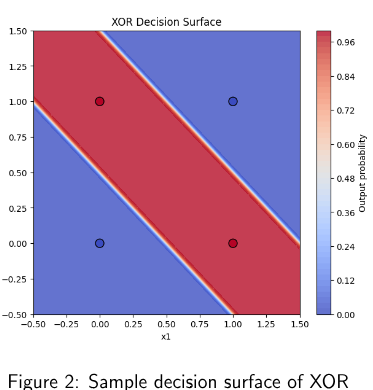

# DA6401W (Intro to Deep Learning) - Assignment 1

Submitted by: Sohang Chopra &lt;DA25M622&gt;

## Problem 1: Implement Logistic Regression from Scratch for Spam Classification

The objective is to build a binary spam classifier using Logistic Regression implemented from scratch using only NumPy. 
The use of sklearn's `LogisticRegression` or similar high-level machine learning libraries is not permitted.
The model must be trained and evaluated on the [Enron Spam dataset](https://huggingface.co/datasets/bvk/ENRON-spam) 
and tested on a different dataset, the [SMS Spam dataset](https://huggingface.co/datasets/bvk/SMS-spam).

Report the following performance metrics for both training and testing splits:

* Confusion Matrix
* Accuracy
* Precision
* Recall
* F1-Score

Compare the model's performance on the two datasets and provide possible reasons for any
observed differences in the results.

### Solution 1

TODO: code

## Problem 2

Let $X = {x1,x2,x3}$. Two discrete probability distributions $P$ and $Q$ over $X$ are given as $P = [0.5, 0.3, 0.2], Q = [0.4, 0.4, 0.2]$.

* Compute the cross-entropy $H(P,Q)$.
* Compute the Kullback-Leibler divergence $DKL(P||Q)$.
* Compute the entropy $H(P)$.
* Derive the relationship between Cross-entropy and KL divergence.

### Solution 2

TODO: theory

## Problem 3: Bias-Variance Tradeoff -- Plot Matching and Justification

You are given six plots (Figure 1 A-F). Each plot represents either a classification or regression
model fit to a dataset. The models differ in their complexity and decision boundaries or fitted
curves.
For each plot, complete the following tasks:

1. Select the most appropriate bias-variance category from the options below.
    * High Bias - Low Variance
    * Low Bias - High Variance
    * Low Bias - Low Variance
2. Justify your choice using concepts such as.
    * model complexity
    * underfitting vs. overfitting
    * sensitivity to noise
    * stability of the model with respect to changes in the training data

### Solution 3

TODO: theory

## Problem 4: Implement XOR gate using neural network 

The Exclusive-OR (XOR) function is a classic example of a Boolean function that is not linearly separable and therefore cannot be implemented using a single-layer perceptron. 
The XOR function takes two binary inputs $x_1,x_2 \in \{0,1\}$ and produces a binary output $y \in \{0,1\}$. The truth table for the XOR function is given below:

$x_1$ | $x_2$ | $XOR(x_1,x_2)$
----- | ----- | -------------
0     | 0     | 0
0     | 1     | 1
1     | 0     | 1
1     | 1     | 0

Consider a two-layer neural network (one hidden layer and one output layer) with:

* Two input neurons
* Two hidden neurons
* One output neuron
* Sigmoid activation function $\sigma(z) = \frac{1}{1 + e^{-z}}$

Plot the decision surface of your network. It will look something like the sample added here (Figure 2).
Use the following pre-defined weights and biases.

Hidden layer:

$$W_1 = \begin{pmatrix} 20 & 20 \\ 20 & 20 \end{pmatrix}, \quad b_1 = (-10, -30)$$

Output layer:

$$W_2 = \begin{pmatrix} 20 \\ -20 \end{pmatrix}, \quad b_2 = (-10)$$

### Solution 4

TODO: code

## Problem 5: Learning Dynamics and Generalization in Neural Networks

A supervised learning model is trained using gradient-based optimization. 
The behavior of training and validation losses provides insight into the learning dynamics and generalization ability of the model.

1. During training, the training loss decreases steadily, but the validation loss starts increasing after a few epochs. 
   Explain what this behavior indicates. Suggest two practical strategies to address this issue and explain why they work.
2. Two neural networks are trained on the same dataset. Both achieve similar training loss. Discuss how their generalization behavior may differ and justify your reasoning.
   * Network A: shallow but very wide
   * Network B: deep but narrow
3. Explain how the choice of activation function affects gradient flow during backpropagation. 
   Compare sigmoid and ReLU activations in deep networks without using their mathematical definitions.
4. Suppose all weights in a multilayer neural network are initialized to zero. Explain what happens during training and why learning fails in this case.
5. A model achieves very low bias but performs poorly on unseen test data. Explain how this situation can arise and discuss whether increasing the dataset size would help.

### Solution 5

TODO: theory

## Problem 6: Comparison of Loss Functions: Mean Squared Error vs Cross-Entropy

Loss functions play a crucial role in training machine learning models by quantifying the discrepancy between true labels and model predictions.

1. **Definition of Loss Functions**: Define the following loss functions for a binary classification problem:
   * Mean Squared Error (MSE)
   * Binary Cross-Entropy (Log Loss)
2. **Behavior and Gradient Characteristics**: Compare MSE and Cross-Entropy loss in terms of:
   * Sensitivity to prediction errors
   * Gradient behavior when predictions are confident but incorrect
3. **Suitability for Classification**: Explain why Cross-Entropy loss is generally preferred over MSE for classification tasks such as logistic regression.
4. **Task-based Comparison**: Give one example where MSE is more suitable and one example where Cross-Entropy is more suitable. Justify your choices.

### Solution 6

TODO: theory

## Problem 7: Programming Question: Implement Loss Functions from Scratch

In this question, you will implement basic loss functions used in machine learning using NumPy only. Do not use any machine learning libraries.

1. **Mean Squared Error (MSE)**: Write a Python function that computes the Mean Squared Error loss given:
   * True labels y
   * Predicted values $\hat{y}$
2. **Binary Cross-Entropy Loss**: Write a Python function that computes the Binary Cross-Entropy loss for a binary classification task given:
   * True labels $y \in {0,1}$
   * Predicted probabilities $\hat{y} \in \{0,1\}$
3. **Numerical Stability**: Explain briefly why it is important to clip predicted probabilities when computing cross-entropy loss.

### Solution 7

TODO: code

## Problem 8: Logistic Regression with L2 Regularization on MNIST

In this question, you will implement binary logistic regression with L2 regularization from scratch using only NumPy.
Use the MNIST dataset and create a binary classification task as follows:

* Class 0: Digit 0
* Class 1: Digit 1

You must:

1. Load the MNIST dataset: you may use tensorflow `from tensorflow.keras.datasets import mnist`.
1. Flatten the images and normalize input features.
2. Implement logistic regression with:
    * Sigmoid activation function
    * Binary cross-entropy loss
    * L2 regularization on weights
3. Train the model using batch gradient descent.

Report the following for both training and test sets:
* Loss vs iterations plot
* Confusion matrix
* Accuracy, Precision, Recall, and F1-score

Compare results for different regularization strengths: $\lambda \in \{0,0.01,0.1,1.0\}$ and explain the effect of regularization on overfitting and generalization.

### Solution 8

TODO: code

## Problem 9: Numerical Problem on Logistic Regression Prediction

Consider a binary logistic regression model defined as:

$$P(y = 1 |x) = \sigma(z) = \frac{1}{1 + e^{-z}}, \quad z = w^T x + b$$

Given:

$$w = \begin{pmatrix} 0.6 \\ -0.4 \end{pmatrix}, \quad b = -0.2, \quad x = \begin{pmatrix} 2 \\ 1 \end{pmatrix}$$

1. Compute the value of $z$.
2. Compute the predicted probability $P(y = 1 |x)$.
3. Predict the class label assuming a threshold of 0.5.
4. Plot the hyperplane and the data points.

### Solution 9

TODO: theory

## Problem 10

Find the advantages of using NumPy or PyTorch over naive python iterators and operations while working with neural networks.

You are required to implement a fully-connected feedforward neural network with a single hidden layer (4-neurons) with ReLU activation, one output layer (one neuron) with sigmoid activation, using three different approaches:

1. Pure Python using iterators
2. NumPy arrays
3. PyTorch tensors

You will then compare their execution speed as a function of input dimension for a single data-point.
Repeat it for a batched-input and explore how broadcasting is done in NumPy or PyTorch, and explicitly mention where can it be used in the given scenario (which operation during the forward pass can utilize the automatic-broadcasting?).
Assume the dimensions wherever required.

Bonus: Compare the speedup in PyTorch when tensors are in the CPU and when tensors are in the GPU (use Google Colab or Kaggle notebooks for free GPU access) and find the reasons for any unexpected behavior if encountered.

### Solution 10

TODO: code

## Problem 11

Prove that the Logistic Regression Loss Function is Convex
Consider a binary classification problem with labels y \in {0,1}. Logistic regression models
the conditional probability as

$$P(y = 1 |x; w) = \sigma(w^T x), \sigma(z) = \frac{1}{1 + e^{-z}}$$

The empirical loss function is given by:

$$L(w) = \sum_{i=1}^n [-y_i \log(\sigma(w^T x_i)) - (1 -y_i) \log((1 -\sigma(w^T x_i)))]$$

Prove that $L(w)$ is a convex function of the model parameters $w$.

**Hint**: Rewrite the loss for a single data point as a function of the scalar $z = w^T x$. 
Study the convexity of this function with respect to $z$, and use the fact that convexity is preserved under linear transformations and summation.

### Solution 11

TODO: theory