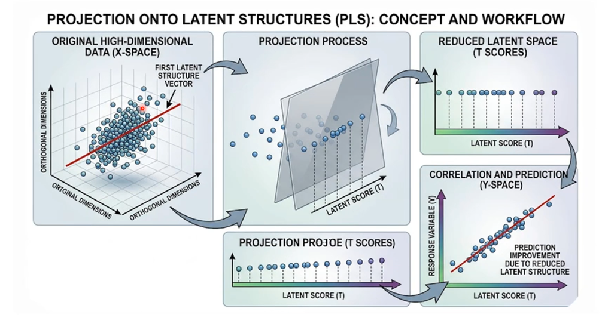

# CH54402 - Multi Variate Analysis

Suggested Book: *Kutner, M. H., C. J. Nachtschiem, J. Netner, Applied Linear Regression Models. 4th ed. New Delhi: McGraw Hill, 2004*

NOTE: Re Assignment 2 on Partial Least Squares (question paper not yet shared): answers / approaches discussed in lecture on July 28

**IMPORTANT**: most lectures (10) don't have slides uploaded but lecture videos are there on course site so check those!

## Day 1: Linear Regression

$Y$ is ground truth, $\beta$ is weights.

Error $\epsilon = Y - X \beta$, so (mean-squared error aka Sum of Squared Errors (SSE)) loss $L = \epsilon^T \epsilon = Y^T Y - Y^T X \beta + \beta^T X^T X \beta$ -- optimal weights satisfy $\frac{\partial L}{\partial \beta} = 0$.

Regression to the Mean

$Y = \beta_0 + \beta_1 X_1 + \beta_2 X_2 + \epsilon$, where $\beta_0$ is intercept and $\beta_1, \beta_2$ are **partial regression coefficients** (partial because beta 1,2 correspond to change in X1, X2 only when other variable is kept constant).

$Y = X \beta + \epsilon$ -- matrix form

least squares solution: $\beta = (X^T X)^{-1} X^T y$

NEW --> covariance matrix of weights $C = Cov(\beta, \beta) = (X^T X)^{-1} \sigma^2$ where $\sigma^2$ is noise aka variance of error in matrix equation $Var(\epsilon)$
* covariance matrix of weights $C$ is *symmetric matrix* since $X^T X$ is symmetric
* true $\sigma^2$ is unknown, so we must estimate it: $hat{\sigma}^2 = SSE / (n-p)$ where $n$ is no. of samples/rows, $p$ is no. of parameters/weights (size of covariance matrix of weights)
* **Estimated Standard Error** (after using this estimate of error variance) is $SE[\hat{\beta_j}] = \sqrt{\hat{\sigma}^2 C_jj}$. Small errors for good precision.

TODO

## Lecture 2

TODO

## Lecture 3

TODO

## Lecture 4

TODO

## Lecture 5

SUM[(y - y_{pred})^2] = TODO 

sum of all deviations (from mean) = 0 [for linear regression solution line]

TODO

## Lecture 17 -- Chi Square Distribution and Mahalanobis Distance

$$(x - \mu)^T \Sigma^{-1} (x - \mu) \le \chi^2 (\alpha) \quad \text{with probability} 1-\alpha$$

- In chi-squared distribution with $p$ degrees of freedom, standard $100 (1 - \alpha)$ 'th percentile means area of $1 - \alpha$ lies to left (below) the $\chi^2 (\alpha)$ curve.
- value of $d^2$ at $100 (1 - \alpha)$ 'th percentile represents all multivariate observations of X such that $100 (1 - \alpha) %$ lie below cuve and each obsevation has squared distance less than or equal: $d^2 \le \chi^2 (\alpha)$ .

TODO

--------------------------------------------------

Midsem was till above.

## Lecture 18 (13 July 2026) -- Partial Least Squares regression

Inexpensive to create new features, but getting more rows is expensive.
Clearly defined predictors and responses unlike PCA.

TODO

**Projection on Latent Structures (PLS)**
- combines features from PCA and MLR (multiple linear regression):
  - MLR regression only focuses on predicting Y
  - PCA only looks at directions of maximum variance in X
  - PLS decomposes X and Y at same time to capture shared variance
- Predict set of dependent vars (Y) from independent vars or predictors (X), by extracting from predictors a set of orthogonal factors called *latent variables* which have best predictive power. 
- Used when we Ordinary Least Squares is infeasible or can't be done because:
  - High Multi-collinearity (highly correlated features/predictors): $X^T X$ becomes nearly singular (nearly non-invertible)
  - High-dimensional data (no. of predictors $p$ > no. of observations $n$): $X^T X$ becomes singular (impossible to invert). common in genomics and chemometrics
- Finding latent variables which simultaneously explain most variance of both X and Y
- *NOTE*: Total Least Squares also looks at both X and Y - but there the reason is measurement error whereas in Partial Least Squares reasons are above (highly correlated features, features more than observations)

TODO

## Lecture on July 21 -- Partial Least Squares continued

Covariance between $t_1$ ($ = X_1 w$) and $u_1$ ($= q_1$) is maximum.

NIPALS Algorithm

PLS 2 Algorithm

we use all factors to predict both X and Y.

3 matrices: W (p x a matrix whose columns are weight matrices), T and U are n x a matrices corresponding to X and Y respectively.

X and Y are decomposed like this (Outer Relation):

$$ X = T P^T + E, \quad Y = U Q^T + F^* $$

Inner Relation: $U = T B + H$

Mixed Relation: $Y = T B Q^T + F$

Remember B is a diagonal matrix.

Next algorithm seeks to get estimates for W, P, T, Q, U, B

TODO

## Lecture on July 27

TODO

## Lecture on July 28 -- PLS 2 Regression & Assignment 2 Discussion

PLS = Partial Least Squares

[PLS 2: initial steps](images/partial_least_squares_initial_steps.jpeg)

TODO

## References

Books:
- Brereton R. J., The Chi Squared and Multinormal Distributions, J. Chemometrics 2015, 29: 9–12
- Johnson R A and D W Wichern, Applied Multivariate Statistical Analysis, Prentice Hall, 2002.
- Maiti J, Multivariate Statistical Modeling in Engineering and Management, CRC Press, 2023
- Backhaus K, B Erichon, S. Gensler, R. Weiber, T. Weiber, Multivariate Analysis – An Application Oriented Introduction, 2nd ed., Springer Gabler, 2023
- Montgomery, D C and G C Runger, Applied Statistics and Probability for engineers, Wiley, 2003
- Joseph F H, W C Black, BJ Babin and R E Anderson, Multivariate Data Analysis, 8th ed., Cengage, 2019
- Afifi, A., May, S., Donatello, R., & Clark, V.A. (2019). Practical Multivariate Analysis (6th ed.). Chapman and Hall/CRC -- https://doi.org/10.1201/9781315203737
- https://stats.oarc.ucla.edu/other/dae/
- https://www.routledge.com/Practical-Multivariate-Analysis/Afifi-May-Donatello-Clark/p/book/9781032088471

