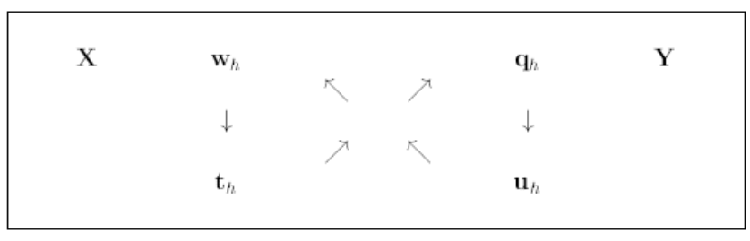

<!-- set all attributes used by VS Code Markdown Converter extension to blank above, so that it doesn't come in generated PDF -->

<!-- NOTE: couldn't run Jmp software on linux. I registered for 1-month free trial, got download link in email after a while, it only had Windows and Mac so downloaded Windows exe and started it with `wine start path/to/exe` - but eventually it failed with some weird assert error with no way to fix. 

So TLDR: Can't use JMP
-->

# CH5440W (Multi Variate Data Analysis) Assignment 2 

**Author:** Sohang, **Roll No.:** DA25M622

## Question 1 

We have learnt about PLS2 using NIPALS algorithm in the classes. 

1. Discuss next on PLS1 algorithm using SIMPLS algorithm. 
2. Bring out the difference between the two approaches 
3. Explain where each approach is preferred/applied. 

### Answer 1

<!-- TODO: Answer 1 -->

## Question 2 

With reference to the NIPALS algorrithm dealt in class, answer the following questions in your own words:

1. What is the difference between weights and loading? 
2. Indicate how X and Y scores condense voluminous data involving multiple features 
3. What is meant by deflation/reconstruction? 
4. Explain the figure given below (reference to the diplomat thesis given in class) 

1. To find weights $w$ why do you use Y-scores $u$ rather than **t** ? 
2. Why do you normalize the weights $w$ using its norm? 
3. To find X scores, why regress $\hat{E_{h-1}}$ with $w_h t_h^T$ ? Should it not be $p_h t_h^T$ ?
4. Explain the following steps in NIPALS PLS2 algorithm :
   * Step 9: Fit $t_h$ to the newly gained $p_h$ as $t_h = t_h | p_h |$
   * Step 10: Normalize $\hat{p_h}$ as $\hat{p_h} = \frac{p_h}{| p_h |}$
5. Why find by regression weights $w$ for X residuals but loadings $q$ for Y residuals? <!-- BUG: the equations for this in PDF aren't actually clear (some missing / erased symbol) -->

### Answer 2

<!-- TODO: Answer 2 -->

## Question 3

1. For facilitating your coding with Python and for a general understanding of the code’s workflow, neatly summarize the PLS2 algorithm step by step. 
2. Solve the following problem without centering or scaling or standardizing 
3. Report PRESS and root mean square PRESS 
4. Compare and validate all your Matlab/Python answers with JMP ( $W,T,U,Q,P,Beta$ , diagonal matrix $B$, Root Mean Square PRESS).  
   In JMP use “leave one out” option. 
5. Show finally how the PLS2 led to predictions of the outcomes $Y$ . 

**Note:** Use 3 factors 

$$
X = \begin{pmatrix}
2 & 5 & 3 & 6 & 8 & 1 \\
4 & 6 & 5 & 7 & 9 & 2 \\
5 & 8 & 6 ^ 8 & 10 & 3 \\
7 & 8 & 9 & 10 & 12 & 5 \\
9 & 11 & 9 & 12 & 13 & 6
\end{pmatrix}
, \quad Y = \begin{pmatrix}
20 & 35 \\
35 & 40 \\
28 & 45 \\
36 & 58 \\
42 & 66
\end{pmatrix}
$$

### Answer 3

<!-- TODO: Answer 3 -->

## Question 4

For the big data set (Gasoline.xls) carry out PLS2 analysis and find the model coefficients beta, $W,T,U,Q, P$ and $B$* .

### Answer 4

<!-- TODO: Answer 4 -->

## Question 5

For the following training dataset (Excel File Attached <!-- BUG: WE CAN'T ACCESS THE DATA, EMAILED TO REQUEST ACCESS -->), \
carry out the linear discriminant analysis and answer the following questions. 
Give the Matlab code as well. 

1. Find the variance matrix S for both classes 
2. Find the pooled variance 
3. Find the linear  classification equation assuming the cost ratio and probability ratios are unity 
4. Find from the results how many training data set points have been misclassified  in both classes. Identify them. 
5. For the new test dataset given in the same excel sheet as above, find which class(es) the data belongs to. 

### Answer 5

<!-- TODO: Answer 5 -->
