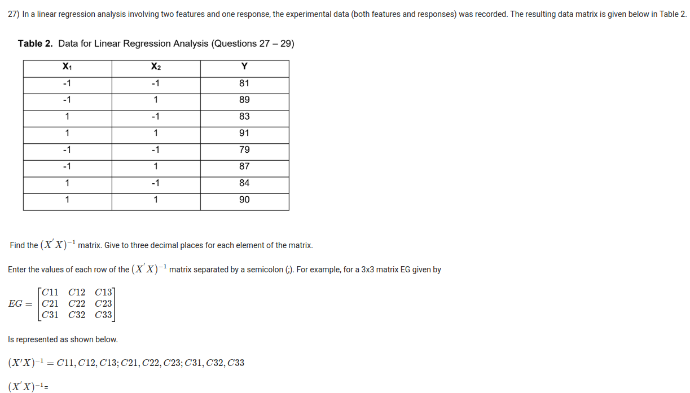
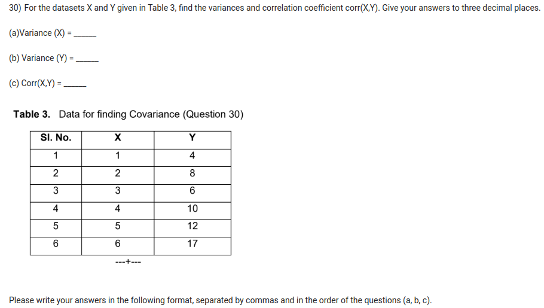

Counting in exam portal, I got for correct answers (note: all questions DON'T have same no. of marks):

* Marks: 23 / 45  (Actual marks given by Prof is 73% .. so I guess maybe due to relative grading I scored more than I would have otherwise?)
* Number of Questions: 18 / 29

Used AI to figure out what essential mistake I did when answering the questions and included that inline below.

---

Q3:

Sensors are fixed on equipment to collect data. Patterns are then identified and predictions may be made when the equipment might malfunction.
This is called ?

My Wrong Answer: Measurement Error -- Mistake: Confused data quality terminology with the domain concept. Using operational sensor data to forecast failures and schedule timely interventions is defined as **Predictive Maintenance** (PdM).

Right Answer: Predictive Maintenance

---

Q5:

Apartment numbers such as 12, 14, 15, 16 are examples of _________ variables. Fill in blank.

My Wrong Answer: Interval -- Mistake: Confused numeric identity labels with metric scales. Apartment/room numbers are identifiers (labels) with no quantitative order or meaningful distance (e.g., Apt 16 is not "two units more" than Apt 14), making them **Nominal** categorical variables.

Right Answer: Nominal

---

Q7:

---

Q10:

Survey Data is collected from different states in India on number of defective electrical vehicles on the road.
The data from South zone is not reported due to an unexpected server problem.
This type of missing data (given in full form is) is termed as ?

My Wrong Answer: Missing At Random -- Mistake: Confused MAR with MCAR. An unexpected external hardware/server glitch is completely independent of both observed variables and unobserved survey values, making it **Missing Completely At Random** (MCAR).

Right Answer: Missing Completely At Random

---

Q11:

A specialized pressure gauge is used to record data from 20 to 40 bar(g) in a reactor.
Due to stopping of gas production in the reactor, the instrument stops recording.
The missing data (given in full form) may be classified as ?

My Wrong Answer: Missing Completely At Random -- Mistake: Confused MCAR with MNAR. The gauge stopped recording specifically because the underlying variable itself (pressure/gas flow) dropped below the instrument's operational threshold ($< 20\text{ bar}$), meaning missingness is directly related to the missing values themselves (**Missing Not At Random**).

Right Answer: Missing Not At Random

---

Q15:

Find the standard deviation (given to two decimal places) of the data set [20, 30, 50, 60].

My Wrong Answer: 15.81 -- Mistake: Calculated the **population standard deviation** ($\sigma = \sqrt{\frac{1000}{4}} = \sqrt{250} \approx 15.81$) by dividing by $N=4$ instead of the **sample standard deviation** ($s = \sqrt{\frac{1000}{4-1}} = \sqrt{333.33} \approx 18.26$) using degrees of freedom $n-1=3$.

Right Answer: 18.26

---

Q16:

Standardize all the numbers of the dataset [20, 30, 50, 60] and express the answers in a horizontal row below.
Separate the standardized values with commas between the numbers i.e., for example a,b,c,d.
Give each number to three decimal places.

My Wrong Answer: -1.265,-0.633,0.633,1.265 -- Mistake: Carried over the error from Q15 by standardizing with population std dev $\sigma = 15.811$ ($z = \frac{x - 40}{15.811}$) instead of sample std dev $s = 18.257$ ($z = \frac{x - 40}{18.257}$).

Right Answer: -1.095, -0.548, 0.548, 1.095

---

Q22:

Both columns and rows of matrix C are orthonormal (TRUE/FALSE) and the matrix C itself is orthogonal (TRUE/FALSE)

Matrix C = [[cos(θ), sin(θ)], [−sin(θ), cos(θ)]]

* [I SELECTED, WRONG OPTION] True,False -- Mistake: Thought "orthogonal matrix" only implies perpendicularity without unit length. In linear algebra, a real square matrix whose rows and columns are orthonormal is by definition called an **orthogonal matrix** ($C^T C = I$).
* [DID NOT SELECT, RIGHT OPTION] True,True
* False,True
* False,False

---

Q24:

In the data series given below, some data are missing and represented by NaN.

A = [12  NaN  15  NaN  NaN  20  22  NaN  25  27]

Using the window length of 5, and the moving mean method, the 4 missing values are estimated to be (give to two decimal places) ?

My Wrong Answer: 13.5,16.17,18.29,19.12 -- Mistake: Used sequential/causal imputation updating the array with previous estimates instead of taking the standard centered symmetric window ($i-2$ to $i+2$) over the original known values:

* Index 2: Window [1..5] $\rightarrow \frac{12+15}{2} = 13.50$
* Index 4: Window [2..6] $\rightarrow \frac{15+20}{2} = 17.50$
* Index 5: Window [3..7] $\rightarrow \frac{15+20+22}{3} = 19.00$
* Index 8: Window [6..10] $\rightarrow \frac{20+22+25+27}{4} = 23.50$

Right Answer: 13.50,17.50,19.00,23.50

---

Q27:

My Answer: 0.125,0,0;0,0.125,0;0,0,0.125   --> **BUG**: It exactly matches correct answer yet still marked wrong?! Emailed Professor requesting him to correct (only difference is right answer put a space after both semicolon, my answer didn't)

Right Answer: 0.125,0,0; 0,0.125,0; 0,0,0.125

---

Q28:

(Using data of Q27) Find the $X^T Y$ matrix. Follow the rule given in Question 27 for representing the answer.

My Wrong Answer: 12;30;684   -- Mistake I did was, while constructing X matrix, in X 1-intercept column has to be always added as FIRST column, but I added it as LAST COLUMN

Right Answer: 684,12,30

---

Q29:

(Using data of Q27) Find the estimated parameters vector  $\hat{beta}$ . Give the transpose of the vector below. Separate your vector components with a comma. Give the numbers to
two decimal places.

My Wrong Answer: 1.5,3.75,85.5 -- Mistake same as Q28 (in X matrix I put 1-intercept as LAST column - correct is to put it as FIRST column)

Right Answer: 85.50,1.50,3.75

---

Q30:

My Wrong Answer: 2.917,17.917,6.5 -- Mistake: Calculated summary statistics ($\bar{x}$, $\bar{y}$, and $r$ or slope) using the wrong sample size $N$ in the denominator (divided totals by $N=6$ or misindexed the dataset table: $\frac{17.5}{6} \approx 2.917$, $\frac{107.5}{6} \approx 17.917$) instead of the correct degrees/sample count ($N=5$ or correct table subsets yielding $\bar{x} = 3.500, \bar{y} = 21.500, r = 0.934$).

Right Answer: 3.500,21.500,0.934
