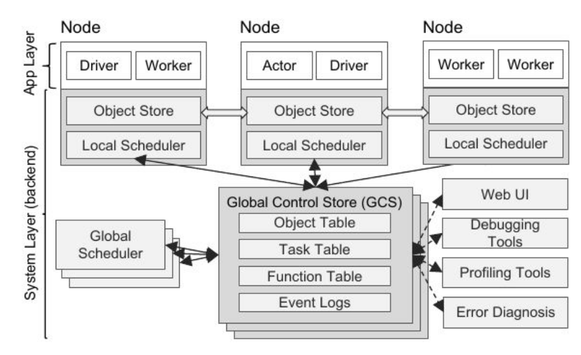
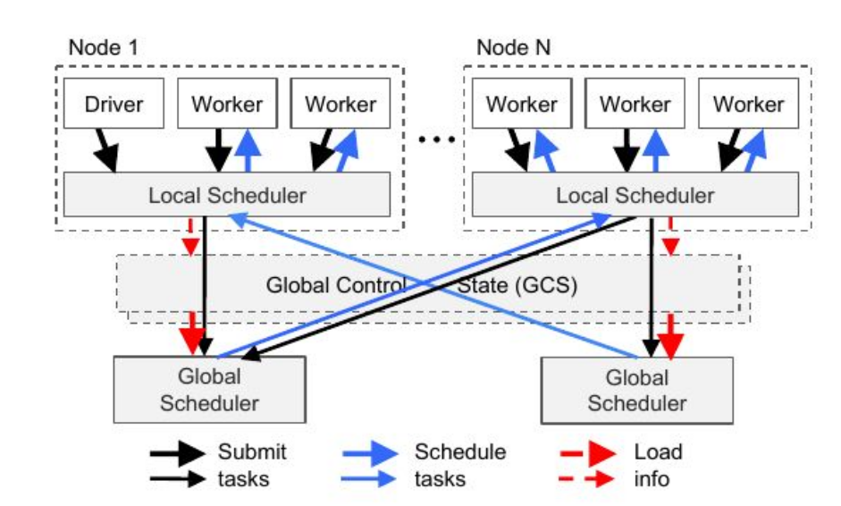

# DA5402W - ML Ops

Professors:
* Dr. Alka Bhushan &lt;ic39149@imail.iitm.ac.in&gt;: will cover first 3 modules of syllabus
* Dr. Priyanka Naik
* Dr. Aishwarya Chakraborty

Teaching Assistants (TAs):
* Jashaswaimalya -- software & tools-related issues
* Shuvrajeet -- assignment & quiz-related issues

Focus on open source tools that can be deployed anywhere, not cloud-based tools. Some are:

* Apache Kafka: messaging queue
* Apache Spark: in-memory distributed computing --> MOST IMPORTANT
* Apache Atlas: data compliance (eg. we have to report where sensitive data is stored to govt), manage metadata

**PySpark Lab Link**: https://lab.samsai.io/student-ui/ (need to sign in with google via IIT smail (student email))

Theory lecture notes are here, code lecture notes seperately.

Datasets for Modules 1-3 :
* [Intel Image Classification dataset](https://www.kaggle.com/datasets/puneet6060/intel-image-classification/data)
* [New York Taxi records dataset](https://www.nyc.gov/site/tlc/about/tlc-trip-record-data.page)

**Resources**:
* https://github.com/OBenner/data-engineering-interview-questions/ -- questions on Data Engineering tools like Apache Spark, Airflow, Kafka, Beam, etc.

NOTE: Apache Ray was motivated by need for Reinforcement Learning (RL) applications - massive computation, low latency.

## WIP Lecture 2 - Apache Spark, Data Engineering

### Course Overview

* ML Ops is intersection of Machine Learning, Dev Ops, Data Engineering.
* ML Ops end-to-end pipeline: Data -> Training -> Deployment -> Monitoring
* Tasks:
    * Experiment Tracking: model & dataset versions, hyperparameters, eval metrics, train configs, logs.
    * Model Deployment: APIs, web services, edge devices, cloud platforms
    * Model Monitoring: prediction metrics, response latency, resource utilization, failure rates, data quality, drift detection
    * Model Retraining: scheduled, trigger-based, continous
  
MLOps Workflow:

* Tools:
  * *Apache Airflow*: automate & schedule piping tasks
  * *Apache Kafka*: real-time streaming data
  * *Apache Spark*: process & analyze large-scale data, distributed ML
  * *MLFlow*: manage experiment tracking, model lifecycle & development
  * *AutoML*: automate model selection, training & tuning
  * *Git & DVC*: version control for data, code & model pipelines
  * *Prometheus & Kibana*: data visualization, monitoring of logs & metrics

### Apache Spark

It's a distributed computing platform, with a wide range of workloads it can handle like batch algos, iterative, streaming, etc.

Apache Spark connectors ecosystem with a wide variety of tools like Kafka, MySQL, etc. :

Spark Components:
* Spark Core dataframes & Spark SQL Engine: Java/Python/etc., RDBMS table, CSV, Parquet, JSON, etc.
* MLLib: machine learning algorithms, linear algebra, gradient descent optimization, feature extraction, transformation, pipeline, model tuning
* Spark Structured Real-time Streaming
* Graph X: graph algos - page rank, connected components, triangle counting etc.

Spark Distributed Execution:

Spark Driver:
* creates Spark Session object
* Accesses cluster manager and executes in session
* transforms Spark operations into DAG computations, schedules them and distributes as tasks across Spark executors
* After resource alloc, directly communicate with executors

Spark Session:
* single unified entry to all Spark operations
* Can create JVM runtime parameters, define DataFrame and Datasets, read from data sources, access catalog metadata, issue Spark SQL queries

Cluster Manager:
* manage & alloc resources for cluster of nodes
* Local / standalone / Yarn / Kubernetes

Spark Executors:
* execute tasks
* communicate with drivers
* run on worker nodes

Distributed Data & Partitions: 
* Each executor gets number of partitions = Min(2, Number of Executor Cores + 1)

* Driver creates a DAG for each job via `count()`, `show()`, `collect()` (brings all data into memory, use with caution), etc.
* Stages are created for each Shuffle operation (usually more expensive than action operations) via `groupByKey()`, `reduceByKey()`
* Task (set of steps) is assigned to a partition. All tasks in a stage run in parallel.

Spark Operations:
* Transformations (lazy): Narrow or Wide (wide causes shuffling of data across executors): `orderBy()`, `groupBy()`, `filter()`, `select()`, `join()`
* Actions: cause data to be materialized (return to driver, save to file): `show()`, `take()`, `count()`, `collect()`, `save()`

Spark Structured APIS: Spark DataFrame, and Spark SQL

Data Collection Strategies:
* Batch (files, database, cloud)
* Streaming (kafka)
* Batch + Streaming (hybrid)

### WIP Data Engineering

* Data infra (on-prem / cloud / hybrid-cloud / multi-cloud), databases and pipelines to extract, transform & load data
* Data Characterstics: Volume (how many records?), Velocity (how many users?), Variety (how many data formats?)

Data Engineering Architecture:
* Applications
* Relational Database
* Batch / Streaming pipeline
* Data Lake (store huge raw structured or unstructured data)
* ETL (Extract, Transform, Load)
  * Extract from: logs, databases, APIs, etc.
  * Transform: clean & process data: Remove duplicates, standardize formats, aggregate, validate
  * Load: store processed data
* Data Warehouse: convert data from data lake into clean, structured, aggregated and optimized data for fast analytical queries
* BI dashboards / ML

TODO

## Lecture 4 (week 2) - Apache Airflow for Data Engineering pipelines

* programmatic authoring, scheduling & monitoring of workflows as DAGs
* contains a web server, meta store, queuing system, executors
* can run single instance or on a cluster with many executor nodes
* Uses DAGs where each node is a task

When to Use:
* When workflow has clear start & end and runs on a schedule
* Prefers python coding to build workflow
  * Provides version control, team collaboration, testing & extensibility
* When pipeline is complex and recurring
* Process historical data, rerun failed tasks
* Designed for batched workflows

Airflow Architecture:
* Web Server (UI)
* Scheduler: monitors DAGs and triggers tasks based on time or events
* Executor: distributes tasks to workers. eg. `SequentialExecutor`, `CeleryExecutor`, `KubernetesExecutor`
* Workers: execute tasks
* Metadata database: store DAGs, task states and other metadata

DAGs' key attributes:
* Schedule: when workflows should run
* Tasks: discrete units of tasks that are run on workers
* Task Dependencies: order and conditions under which tasks execute
* Callbacks: actions to take when entire workflow completes
* Additional Parameters

Usecases:
* ETL (Extract / Data Ingestion, Transform, Load)
* ML Workflows (train, eval, deploy)
* Data Warehousing (pipelines for data lakes, warehouses)
* Ad-hoc Job Scheduling> more flexible than cron
* Code reusability, Fault tolerant, Visibility & control over data pipelines

## TODO Lecture 5 - Apache Kafka

TODO

## WIP Lecture 7 - [Apache Beam](https://beam.apache.org)

* Unified api for Batch & Streaming Data Processing
* Execute locally for development, testing, debugging using small datasets
* Same pipeline run on multiple engines/runners - Apache Flink, Apache Spark, Google Cloud DataFlow, Samza

*Pipeline as a Directed Acyclic Graph (DAG)*
* complete data workflow: read data, apply transforms (`PTransform`), write outputs. Data flows between them as `PCollection`.
* handle both bounded (batch) and unbounded (streaming) data with same pipeline

`PCollection`: core data structure in Beam
* unordered, potentially distributed collection of data elements from dataset/stream processed in parallel by Beam transforms.
* bounded (batch) or unbounded (streaming) data
* Time-aware: every elem has timestamp, belongs to a window, and is tracked using watermarks to handle event-time processing & late-arriving data
* Portable: Coder (serialization format) and Windowing Strategy (grouping, triggering, aggregation)

`PTransform` (data processing operation)
* It's a processing step in a pipeline: input & output are one or more `PCollection`
* Parallel execution (each element) via multiple workers using user-defined code
* Built-in transforms (`ParDo`, `GroupByKey`, `Combine`, `Count`), custom transforms
* Types: Source (`Read`, `Create`), Processing (`ParDo`, `GroupByKey`, `Combine`), Output (`Write`), User-Defined Composite

Aggregation:
* group data with same key & window and apply operations like `Count`, `Sum`, `Max`, `Average`
* Aggregation Transforms:
  * `GroupByKey`: output no smaller than input
  * `CombinePerKey`: group & apply combine function (sum, count) to produce smaller result set
* (for streaming data) relies on Windowing, Watermarks & Triggers to determine when results are complete and should be emitted.
* Parallel Scalability across millions of keys; when keys are few, they can be split into sub-keys and later recombined.

Advanced:
* Windowing: unbounded data streams are chunked into finite windows of types: Fixed, Sliding, Session, Global
* Watermarks: estimate how complete incoming event-time data is
* Triggers: control when window results are emitted. Supports early, on-time and late result generation.

Beam Workflow example from https://beam.apache.org/documentation/ml/about-ml/ (TODO: go through rest of that docs page):

### [Spark ML](https://spark.apache.org)

TODO: go through https://spark.apache.org/docs/latest/ml-statistics.html , https://spark.apache.org/docs/latest/ml-datasource.html , https://spark.apache.org/docs/latest/ml-pipeline.html

* Common ML agos: classification, regression, clustering, collaborative filtering
* Featurization: feature extraction, reduction, dimensionality reduction, selection
* Pipelines: construct, evaluate & tune ML pipeline
* save & load model, algorithm, pipeline
* linear algebra, statistics, data learning

Basic statistics: Pearson & Spearman's correlation, hypothesis testing (`ChiSquareTest`), summarizer (available metrics are column-wise max, min, mean, sum, variance, std, number of non-zeros, total count)

Data Sources: Parquet, CSV, JSON, JDBC, image, libsvm etc.

Spark ML Pipelines (high level apis on top of DataFrames):
* DataFrame (from SparkSQL): supports text, feature vectors, true labels, predictions
* Transformer: DataFrame -> DataFrame
* Estimator: fit on a DataFrame to get a Transformer

Pipeline Components:
* Transformers (DataFrame -> DataFrame by append one or more columns): uses feature transform methods or trained models. eg. text -> feature vectors, trained model -> predicted labels
* Estimators: learns from input data and produces a trained model
* `Transformer.transform()` and `estimator.fit()` are stateless, and each transformer, estimator has unique id

Spark Pipeline (sequence of Stages) can be linear on non-linear DAG (like sequential or functional in keras):
* Run-time checking of DataFrame schema
* Unique pipeline stage objects (as each has unique id so cannot be reused, but can make different stage of same type)
* Uniform parameter api (for `fit`, `transform`): eg. `lr.setMaxIter(10)` sets for one instance, while `ParamMap(lr1.maxIter -> 10, lr2.maxIter -> 20)` sets for different instances
* ML Persistence: save & load models & pipelines using Scala, Java, Python; model saved in Spark 3.x can usually be loaded in later minor patch releases

Model Selection & Tuning:
* Tuning for single estimator (elem in pipeline) or full pipeline
* Cross Validator (similar to `GridSearchCV`): 
  * for each hyper-parameter combination:
    * do k-fold (using average metric) & retrain on full data
  * Parallel hyper-param eval: `cv.setParallelism(4)`

TODO

### Apache Ray

Apache Ray Architecture:

Application Layer -- Driver, Workers (stateless, run remote tasks scheduled by driver), Actors (stateful, execute methods serially of a class)

System Layer:
- Global Control Store: stores metadata (task, object, function), lineage information; Fault tolerant, scalable & debugging support
- In-Memory Distributed Object Store: shared-memory object on each node, immutable objects, Apache Arrow format, zero-copy data sharing; High throughput, low latency, efficient data transfer

Distributed Scheduling is bottom-up:
* local scheduler runs if resources available, else forward to global scheduler (it allocates node based on resource availability, queue length, data locality)
* high scalability, low scheduling latency, data-local execution, supports millions of tasks / second

Ray libraries:
* Ray Data - stream b/w CPU & GPU, run on single machine or distributed cloud, any cloud (AWS, Azure, GCP)
  * Dataset - distributed, lazy transforms (operations only execute when consumed or materialized)
  * Block - basic building block of dataset for independent parallel processing, saved in Ray Object Store in Arrow / Pandas format
* Ray Train
* Ray Tune (hyper-parameters)
* RLib (reinforcement learning)
* Ray Serve

Two-phase planning: Logical Plan (eg. Read -> Map -> Filter -> Select) needs to be converted to Physical Plan, i.e., logical operators to Ray physical tasks/actors

Plans are optimized before execution. *Operator Fusion* fuses adjacent transformation. One logical operator may turn into multiple physical tasks.

### Git, Github, Gitlab -- TODO

### Docker, Dockerfile, Docker Engine, Docker Compose, Docker Hub -- TODO

cgroup, resource_group

## Tutorial on PyTorch compile internals (dynamo, autograd etc. details) ; also vllm on kubernetes to host llm -- July 31, 2026 -- TODO

## Resources

LLM and vLLM:

- https://magazine.sebastianraschka.com/p/building-a-gpt-style-llm-classifier
- https://ranjankumar.in/large-language-models-llms-inference-and-serving/
- https://docs.vllm.ai/en/latest/design/arch_overview/#process-count-summary
- https://jarvislabs.ai/blog/vllm-optimization-techniques
- https://pm.dartus.fr/posts/2025/how-llm-generate-text/

VLLM on minikube (kubernetes cluster) practical: https://www.cncf.io/blog/2026/07/16/running-a-self-hosted-llm-in-kubernetes-with-vllm/

PyTorch:

- https://pytorch.org/get-started/pytorch-2-x/ -- `torch.compile()`
- https://docs.pytorch.org/docs/stable/torch.compiler_dynamo_overview.html -- Torch Dynamo

More on Pytorch:

1. https://docs.pytorch.org/docs/2.12/user_guide/torch_compiler/torch.compiler.html
2. https://docs.google.com/document/d/1y5CRfMLdwEoF1nTk9q8qEu1mgMUuUtvhklPKJ2emLU8/edit?tab=t.0#heading=h.ivdr7fm
rbeab
1. https://colab.research.google.com/drive/1Zh-Uo3TcTH8yYJF-LLo5rjlHVMtqvMdf?usp=sharing#scrollTo=ObOktQOeko5h
2. https://docs.pytorch.org/docs/stable/torch.compiler_dynamo_deepdive.html
3. https://docs.pytorch.org/assets/pytorch2-2.pdf
4. https://www.youtube.com/watch?v=rn-kJQ-7JmQ
5. https://www.youtube.com/watch?v=ppWKVg-VxmQ
6. https://www.youtube.com/watch?v=GmhnYe9QQoM
7. https://www.youtube.com/watch?v=5FNHwPIyHr8
8.  https://docs.google.com/document/d/1GgvOe7C8_NVOMLOCwDaYV1mXXyHMXY7ExoewHqooxrs/edit?tab=t.0#heading=h.fh8z
zonyw8ng
1.  https://medium.com/data-science/how-pytorch-2-0-accelerates-deep-learning-with-operator-fusion-and-cpu-gpu-code-
generation-35132a85bd26

Docker:

- https://blog.octo.com/docker-registry-first-steps/Containe

Kubernetes:

- https://github.com/pnl-iiitd/acm_fsn/tree/main
- https://medium.com/aspnetrun/deploying-microservices-on-kubernetes-35296d369fdb

vLLM, Kubernetes, Prometheus:
- https://docs.vllm.ai/en/latest/serving/metrics.html
- https://github.com/prometheus-operator/kube-prometheus
- https://keda.sh/docs/scalers/prometheus/
- https://github.com/NVIDIA/dcgm-exporter
- https://sre.google/sre-book/monitoring-distributed-systems/
- https://www.cncf.io/blog/2026/07/16/running-a-self-hosted-llm-in-kubernetes-with-vllm/

GitHub Actions:
* Docs: docs.github.com/actions
* Reusable workflows: docs.github.com/actions/using-workflows/reusing-workflows
* Self-hosted runners: docs.github.com/actions/hosting-your-own-runners
* Security hardening: docs.github.com/actions/security-guides/security-hardening-for-github-actions
* Public example repo: github.com/torch-spyre/torch-spyre (see .github/workflows/ and
* .github/actions/ )

Jenkins:
* Docs: jenkins.io/doc
* Pipeline syntax: jenkins.io/doc/book/pipeline/syntax
* Shared libraries: jenkins.io/doc/book/pipeline/shared-libraries
