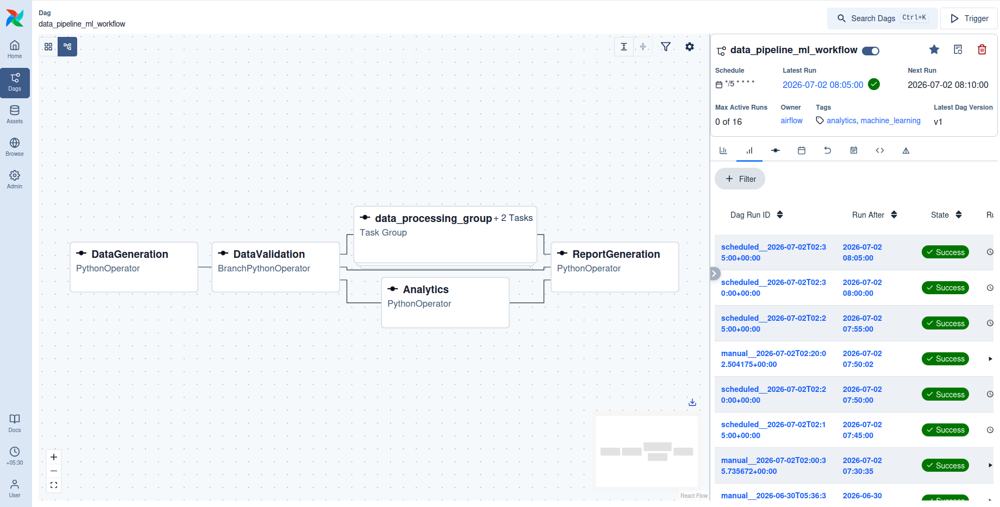

[Airflow Quick Start](https://airflow.apache.org/docs/apache-airflow/stable/start.html) :

```bash
$ pip install "apache-airflow[celery]==3.2.2" --constraint "https://raw.githubusercontent.com/apache/airflow/constraints-3.2.2/constraints-3.10.txt"
$ mkdir -p ~/airflow
$ airflow version
3.2.2
$ airflow standalone         # init database, scheduler, start airflow server at port 8080
```

Open Airflow web UI at http://localhost:8080 . It asks for username and password. 
A default username and password (generated when `airflow standalone` first runs) is at ~/airflow/simple_auth_manager_passwords.json.generated 

```bash
$ cat ~/airflow/simple_auth_manager_passwords.json.generated 
{"admin": "pBBdAhdcWeb2dzEh"}
```

Able to login using this username "admin" and above password.

Misc Airflow commands:
* Development config is at ~/airflow/airflow.cfg , production config generate sepeartely: https://airflow.apache.org/docs/apache-airflow/stable/howto/set-config.html .
* `airflow config get-value core dags_folder` gives DAGs folder where airflow DAG scripts have to be put - it's in *~/airflow/dags* .

PROBLEM: How to actually run airflow DAG so I can view & take screenshots (1. DAG graph, 2. Branching behaviour, 3. Retry execution) ?? I ran `python mlops_assignment1_airflow_dag.py` - but after that DAG doesn't even show up in airflow UI.

NOTE: the one screenshot in screenshots/ folder of DAG graph is from a Samsai platform, but that also doesn't give access to the rest of what I need so disregard that screenshot (I need new of DAG graph also).

UPDATE: copied `mlops_assignment1_airflow.py` to `~/airflow/dags/` - running `airflow dags list` shows the DAG.

(below is showing "No paused DAGs found" because I ran it twice -- first time the paused DAG did show.)

```bash
$ airflow dags unpause data_pipeline_ml_workflow
2026-07-02T02:18:39.217118Z [warning  ] FileType is deprecated. Simply open files after parsing arguments. [py.warnings] category=PendingDeprecationWarning filename=/home/sohang/Projects/iit-madras-web-mtech-ai/.venv/lib/python3.14/site-packages/airflow/cli/cli_config.py lineno=605
2026-07-02T02:18:39.218054Z [warning  ] FileType is deprecated. Simply open files after parsing arguments. [py.warnings] category=PendingDeprecationWarning filename=/home/sohang/Projects/iit-madras-web-mtech-ai/.venv/lib/python3.14/site-packages/airflow/cli/cli_config.py lineno=816
2026-07-02T02:18:39.306787Z [info     ] setup plugin alembic.autogenerate.schemas [alembic.runtime.plugins] loc=plugins.py:37
2026-07-02T02:18:39.306954Z [info     ] setup plugin alembic.autogenerate.tables [alembic.runtime.plugins] loc=plugins.py:37
2026-07-02T02:18:39.307066Z [info     ] setup plugin alembic.autogenerate.types [alembic.runtime.plugins] loc=plugins.py:37
2026-07-02T02:18:39.307163Z [info     ] setup plugin alembic.autogenerate.constraints [alembic.runtime.plugins] loc=plugins.py:37
2026-07-02T02:18:39.307254Z [info     ] setup plugin alembic.autogenerate.defaults [alembic.runtime.plugins] loc=plugins.py:37
2026-07-02T02:18:39.307349Z [info     ] setup plugin alembic.autogenerate.comments [alembic.runtime.plugins] loc=plugins.py:37
No paused DAGs were found
```

```bash
$ airflow dags trigger data_pipeline_ml_workflow
2026-07-02T02:20:01.722234Z [warning  ] FileType is deprecated. Simply open files after parsing arguments. [py.warnings] category=PendingDeprecationWarning filename=/home/sohang/Projects/iit-madras-web-mtech-ai/.venv/lib/python3.14/site-packages/airflow/cli/cli_config.py lineno=605
2026-07-02T02:20:01.723528Z [warning  ] FileType is deprecated. Simply open files after parsing arguments. [py.warnings] category=PendingDeprecationWarning filename=/home/sohang/Projects/iit-madras-web-mtech-ai/.venv/lib/python3.14/site-packages/airflow/cli/cli_config.py lineno=816
2026-07-02T02:20:01.835219Z [info     ] setup plugin alembic.autogenerate.schemas [alembic.runtime.plugins] loc=plugins.py:37
2026-07-02T02:20:01.835410Z [info     ] setup plugin alembic.autogenerate.tables [alembic.runtime.plugins] loc=plugins.py:37
2026-07-02T02:20:01.835552Z [info     ] setup plugin alembic.autogenerate.types [alembic.runtime.plugins] loc=plugins.py:37
2026-07-02T02:20:01.835699Z [info     ] setup plugin alembic.autogenerate.constraints [alembic.runtime.plugins] loc=plugins.py:37
2026-07-02T02:20:01.835907Z [info     ] setup plugin alembic.autogenerate.defaults [alembic.runtime.plugins] loc=plugins.py:37
2026-07-02T02:20:01.836109Z [info     ] setup plugin alembic.autogenerate.comments [alembic.runtime.plugins] loc=plugins.py:37
2026-07-02T02:20:02.825850Z [info     ] creating dag run               [airflow.serialization.definitions.dag] loc=dag.py:526 logical_date=None partition_key=None run_after=datetime.datetime(2026, 7, 2, 2, 20, 2, 504175, tzinfo=Timezone('UTC')) run_id=manual__2026-07-02T02:20:02.504175+00:00
     |           |           | data_inte |           |          | last_sche |           |          |          |        |
     |           | dag_run_i | rval_star | data_inte |          | duling_de | logical_d |          | start_da |        | triggering
conf | dag_id    | d         | t         | rval_end  | end_date | cision    | ate       | run_type | te       | state  | _user_name
=====+===========+===========+===========+===========+==========+===========+===========+==========+==========+========+===========
{}   | data_pipe | manual__2 | None      | None      | None     | None      | None      | manual   | None     | queued | sohang
     | line_ml_w | 026-07-02 |           |           |          |           |           |          |          |        |
     | orkflow   | T02:20:02 |           |           |          |           |           |          |          |        |
     |           | .504175+0 |           |           |          |           |           |          |          |        |
     |           | 0:00      |           |           |          |           |           |          |          |        |
```

Now it finally showed in Active DAGs in Airflow UI !

Switch to graph view to see DAG graph by clicking this graph view button in top left of the window (consulted this UI guide: https://airflow.apache.org/docs/apache-airflow/stable/ui.html#graph-view):




Retrying behaviour (done by editing DAG script such that `DataGeneration` fails first time, then works on retry) - after editing script I pressed "Run/Trigger" button in UI - first `DataGeneration` failed and became status `up_for_retry`, then after a minute it triggered and whole DAG completed successfully: (this is screenshot of "Audit Log" tab in DAG run):


(before running retry behaviour, ensure to `rm /tmp/generate_data_failed_once` so that `DataGeneration` fails first time, then works on retry)

Finally took branching screenshot by going to Graph View, clicking on `DataValidation` task, logs already show in the opened "Logs" tab:


Issue of Analytics getting skipped, fixed by editing `validate_data` to return both `["data_processing_group.DataPreprocessing", "Analytics"]` (instead of previous `"data_processing_group.DataPreprocessing"`)

----------

```bash
$ python mlops_assignment1_airflow.py
2026-07-02T02:00:33.941056Z [warning  ] The `airflow.operators.python.BranchPythonOperator` attribute is deprecated. Please use `'airflow.providers.standard.operators.python.BranchPythonOperator'`. [py.warnings] category=DeprecatedImportWarning filename=/home/sohang/Projects/iit-madras-web-mtech-ai/trimester3/DA5402W_MLOPS/assignments/Assignment1/airflow/mlops_assignment1_airflow.py lineno=4
2026-07-02T02:00:33.971113Z [warning  ] The `airflow.operators.python.PythonOperator` attribute is deprecated. Please use `'airflow.providers.standard.operators.python.PythonOperator'`. [py.warnings] category=DeprecatedImportWarning filename=/home/sohang/Projects/iit-madras-web-mtech-ai/trimester3/DA5402W_MLOPS/assignments/Assignment1/airflow/mlops_assignment1_airflow.py lineno=4
2026-07-02T02:00:33.971385Z [warning  ] The `airflow.utils.task_group.TaskGroup` attribute is deprecated. Please use `'airflow.sdk.TaskGroup'`. [py.warnings] category=DeprecatedImportWarning filename=/home/sohang/Projects/iit-madras-web-mtech-ai/trimester3/DA5402W_MLOPS/assignments/Assignment1/airflow/mlops_assignment1_airflow.py lineno=5
2026-07-02T02:00:34.566539Z [info     ] setup plugin alembic.autogenerate.schemas [alembic.runtime.plugins] loc=plugins.py:37
2026-07-02T02:00:34.566726Z [info     ] setup plugin alembic.autogenerate.tables [alembic.runtime.plugins] loc=plugins.py:37
2026-07-02T02:00:34.566863Z [info     ] setup plugin alembic.autogenerate.types [alembic.runtime.plugins] loc=plugins.py:37
2026-07-02T02:00:34.567009Z [info     ] setup plugin alembic.autogenerate.constraints [alembic.runtime.plugins] loc=plugins.py:37
2026-07-02T02:00:34.567139Z [info     ] setup plugin alembic.autogenerate.defaults [alembic.runtime.plugins] loc=plugins.py:37
2026-07-02T02:00:34.567267Z [info     ] setup plugin alembic.autogenerate.comments [alembic.runtime.plugins] loc=plugins.py:37
2026-07-02T02:00:35.740738Z [info     ] creating dag run               [airflow.serialization.definitions.dag] loc=dag.py:526 logical_date=DateTime(2026, 7, 2, 2, 0, 35, 543909, tzinfo=Timezone('UTC')) partition_key=None run_after=DateTime(2026, 7, 2, 2, 0, 35, 735672, tzinfo=Timezone('UTC')) run_id=manual__2026-07-02T02:00:35.735672+00:00
2026-07-02T02:00:35.770354Z [info     ] Created dag run.               [airflow.models.dagrun] dagrun=<DagRun data_pipeline_ml_workflow @ 2026-07-02 02:00:35.543909+00:00: manual__2026-07-02T02:00:35.735672+00:00, state:running, queued_at: None. run_type: manual> loc=dagrun.py:2223
2026-07-02T02:00:35.805659Z [info     ] [DAG TEST] starting task_id=DataGeneration map_index=-1 [airflow.sdk.definitions.dag] loc=dag.py:1435
2026-07-02T02:00:35.806021Z [info     ] [DAG TEST] running task <TaskInstance: data_pipeline_ml_workflow.DataGeneration manual__2026-07-02T02:00:35.735672+00:00 [TaskInstanceState.SCHEDULED] ti_id=019f208e-78b9-7a06-80c9-c02cf2ee4406> [airflow.sdk.definitions.dag] loc=dag.py:1438
2026-07-02T02:00:39.506022Z [info     ] Task started                   [airflow.api_fastapi.execution_api.routes.task_instances] correlation_id=019f208e-7cd0-77fa-b7b0-caf09a85b6be hostname=sohang-VivoBook-ASUS-Laptop-X510UFO loc=task_instances.py:216 previous_state=queued ti_id=019f208e-78b9-7a06-80c9-c02cf2ee4406
2026-07-02T02:00:39.508373Z [info     ] Task instance state updated    [airflow.api_fastapi.execution_api.routes.task_instances] correlation_id=019f208e-7cd0-77fa-b7b0-caf09a85b6be loc=task_instances.py:242 rows_affected=1 ti_id=019f208e-78b9-7a06-80c9-c02cf2ee4406
2026-07-02T02:00:39.549591Z [info     ] Updating RenderedTaskInstanceFields [airflow.api_fastapi.execution_api.routes.task_instances] correlation_id=019f208e-8776-7275-befe-48b5183c6cd3 field_count=3 loc=task_instances.py:828 ti_id=019f208e-78b9-7a06-80c9-c02cf2ee4406
Task instance is in running state
 Previous state of the Task instance: TaskInstanceState.QUEUED
Current task name:DataGeneration
Dag name:data_pipeline_ml_workflow
2026-07-02T02:00:39.581852Z [info     ] ::endgroup::                   [task] loc=task_runner.py:1727
Generating synthetic data for the pipeline...
2026-07-02T02:00:39.583441Z [info     ] Done. Returned value was: Data generated successfully. [airflow.task.operators.airflow.providers.standard.operators.python.PythonOperator] loc=python.py:233
2026-07-02T02:00:39.583545Z [info     ] ::group::Post Execute          [task] loc=task_runner.py:1288
2026-07-02T02:00:39.583696Z [info     ] Pushing xcom                   [task] loc=task_runner.py:1791 ti=RuntimeTaskInstance(id=UUID('019f208e-78b9-7a06-80c9-c02cf2ee4406'), task_id='DataGeneration', dag_id='data_pipeline_ml_workflow', run_id='manual__2026-07-02T02:00:35.735672+00:00', try_number=1, dag_version_id=UUID('019f1707-10ba-7a1a-ab7f-13d6dbb0cc80'), map_index=-1, hostname='sohang-VivoBook-ASUS-Laptop-X510UFO', context_carrier=None, task=<Task(PythonOperator): DataGeneration>, max_tries=3, start_date=datetime.datetime(2026, 7, 2, 2, 0, 36, 812895, tzinfo=datetime.timezone.utc), end_date=None, state=<TaskInstanceState.RUNNING: 'running'>, is_mapped=False, rendered_map_index=None, sentry_integration='')
[] []
2026-07-02T02:00:39.624959Z [info     ] Task instance state updated    [airflow.api_fastapi.execution_api.routes.task_instances] correlation_id=019f208e-87b1-7602-990d-1c1c63ee5649 loc=task_instances.py:432 new_state=success rows_affected=1 ti_id=019f208e-78b9-7a06-80c9-c02cf2ee4406
Task instance in success state
 Previous state of the Task instance: TaskInstanceState.RUNNING
Task operator:<Task(PythonOperator): DataGeneration>
2026-07-02T02:00:39.629223Z [info     ] ::endgroup::                   [task] loc=task_runner.py:1896
2026-07-02T02:00:39.647522Z [info     ] [DAG TEST] end task task_id=DataGeneration map_index=-1 [airflow.sdk.definitions.dag] loc=dag.py:1497
2026-07-02T02:00:39.660654Z [info     ] [DAG TEST] starting task_id=DataValidation map_index=-1 [airflow.sdk.definitions.dag] loc=dag.py:1435
2026-07-02T02:00:39.661019Z [info     ] [DAG TEST] running task <TaskInstance: data_pipeline_ml_workflow.DataValidation manual__2026-07-02T02:00:35.735672+00:00 [TaskInstanceState.SCHEDULED] ti_id=019f208e-78ba-7465-bc9a-444fc2d41ed0> [airflow.sdk.definitions.dag] loc=dag.py:1438
2026-07-02T02:00:42.367417Z [info     ] Task started                   [airflow.api_fastapi.execution_api.routes.task_instances] correlation_id=019f208e-886b-7241-8148-03ba22817c62 hostname=sohang-VivoBook-ASUS-Laptop-X510UFO loc=task_instances.py:216 previous_state=queued ti_id=019f208e-78ba-7465-bc9a-444fc2d41ed0
2026-07-02T02:00:42.368918Z [info     ] Task instance state updated    [airflow.api_fastapi.execution_api.routes.task_instances] correlation_id=019f208e-886b-7241-8148-03ba22817c62 loc=task_instances.py:242 rows_affected=1 ti_id=019f208e-78ba-7465-bc9a-444fc2d41ed0
2026-07-02T02:00:42.390661Z [info     ] Updating RenderedTaskInstanceFields [airflow.api_fastapi.execution_api.routes.task_instances] correlation_id=019f208e-928f-7868-b0e9-cce0338b9cff field_count=3 loc=task_instances.py:828 ti_id=019f208e-78ba-7465-bc9a-444fc2d41ed0
Task instance is in running state
 Previous state of the Task instance: TaskInstanceState.QUEUED
Current task name:DataValidation
Dag name:data_pipeline_ml_workflow
2026-07-02T02:00:42.402483Z [info     ] ::endgroup::                   [task] loc=task_runner.py:1727
Validating data quality and schema...
2026-07-02T02:00:42.402824Z [info     ] Done. Returned value was: data_processing_group.DataPreprocessing [airflow.task.operators.airflow.providers.standard.operators.python.BranchPythonOperator] loc=python.py:233
2026-07-02T02:00:42.402927Z [info     ] Branch into data_processing_group.DataPreprocessing [airflow.task.operators.airflow.providers.standard.operators.python.BranchPythonOperator] loc=branch.py:40
2026-07-02T02:00:42.403038Z [info     ] Following branch {'data_processing_group.DataPreprocessing'} [airflow.task.operators.airflow.providers.standard.operators.python.BranchPythonOperator] loc=skipmixin.py:124
2026-07-02T02:00:42.403175Z [info     ] Skipping tasks [('Analytics', -1)] [airflow.task.operators.airflow.providers.standard.operators.python.BranchPythonOperator] loc=skipmixin.py:163
2026-07-02T02:00:42.417452Z [info     ] ::group::Post Execute          [task] loc=task_runner.py:1313
2026-07-02T02:00:42.417675Z [info     ] Skipping downstream tasks.     [task] loc=task_runner.py:1314
2026-07-02T02:00:42.424798Z [info     ] Skipping downstream tasks      [airflow.api_fastapi.execution_api.routes.task_instances] correlation_id=019f208e-92b2-7c2b-bc02-7e2449e6d949 loc=task_instances.py:645 task_count=1 ti_id=019f208e-78ba-7465-bc9a-444fc2d41ed0
2026-07-02T02:00:42.427869Z [info     ] Downstream tasks skipped       [airflow.api_fastapi.execution_api.routes.task_instances] correlation_id=019f208e-92b2-7c2b-bc02-7e2449e6d949 loc=task_instances.py:689 tasks_skipped=1 ti_id=019f208e-78ba-7465-bc9a-444fc2d41ed0
[] []
2026-07-02T02:00:42.446758Z [info     ] Task instance state updated    [airflow.api_fastapi.execution_api.routes.task_instances] correlation_id=019f208e-92bf-7f5a-bf8b-eb3a398008ba loc=task_instances.py:432 new_state=success rows_affected=1 ti_id=019f208e-78ba-7465-bc9a-444fc2d41ed0
Task instance in success state
 Previous state of the Task instance: TaskInstanceState.RUNNING
Task operator:<Task(BranchPythonOperator): DataValidation>
2026-07-02T02:00:42.451519Z [info     ] ::endgroup::                   [task] loc=task_runner.py:1896
2026-07-02T02:00:42.457829Z [info     ] [DAG TEST] end task task_id=DataValidation map_index=-1 [airflow.sdk.definitions.dag] loc=dag.py:1497
2026-07-02T02:00:42.471408Z [info     ] [DAG TEST] starting task_id=data_processing_group.DataPreprocessing map_index=-1 [airflow.sdk.definitions.dag] loc=dag.py:1435
2026-07-02T02:00:42.471595Z [info     ] [DAG TEST] running task <TaskInstance: data_pipeline_ml_workflow.data_processing_group.DataPreprocessing manual__2026-07-02T02:00:35.735672+00:00 [TaskInstanceState.SCHEDULED] ti_id=019f208e-78bb-74b5-8dda-6465c29ea034> [airflow.sdk.definitions.dag] loc=dag.py:1438
2026-07-02T02:00:44.443438Z [info     ] Task started                   [airflow.api_fastapi.execution_api.routes.task_instances] correlation_id=019f208e-9351-72b4-9ca5-b4ba6bdcff37 hostname=sohang-VivoBook-ASUS-Laptop-X510UFO loc=task_instances.py:216 previous_state=queued ti_id=019f208e-78bb-74b5-8dda-6465c29ea034
2026-07-02T02:00:44.445123Z [info     ] Task instance state updated    [airflow.api_fastapi.execution_api.routes.task_instances] correlation_id=019f208e-9351-72b4-9ca5-b4ba6bdcff37 loc=task_instances.py:242 rows_affected=1 ti_id=019f208e-78bb-74b5-8dda-6465c29ea034
2026-07-02T02:00:44.466063Z [info     ] Updating RenderedTaskInstanceFields [airflow.api_fastapi.execution_api.routes.task_instances] correlation_id=019f208e-9aab-7391-a68d-92b48cbc1144 field_count=3 loc=task_instances.py:828 ti_id=019f208e-78bb-74b5-8dda-6465c29ea034
Task instance is in running state
 Previous state of the Task instance: TaskInstanceState.QUEUED
Current task name:data_processing_group.DataPreprocessing
Dag name:data_pipeline_ml_workflow
2026-07-02T02:00:44.476919Z [info     ] ::endgroup::                   [task] loc=task_runner.py:1727
Cleaning missing values and normalizing data...
2026-07-02T02:00:44.477232Z [info     ] Done. Returned value was: None [airflow.task.operators.airflow.providers.standard.operators.python.PythonOperator] loc=python.py:233
2026-07-02T02:00:44.477336Z [info     ] ::group::Post Execute          [task] loc=task_runner.py:1288
[] []
2026-07-02T02:00:44.492451Z [info     ] Task instance state updated    [airflow.api_fastapi.execution_api.routes.task_instances] correlation_id=019f208e-9abd-7b2b-966d-5b5e4f17f331 loc=task_instances.py:432 new_state=success rows_affected=1 ti_id=019f208e-78bb-74b5-8dda-6465c29ea034
Task instance in success state
 Previous state of the Task instance: TaskInstanceState.RUNNING
Task operator:<Task(PythonOperator): data_processing_group.DataPreprocessing>
2026-07-02T02:00:44.496935Z [info     ] ::endgroup::                   [task] loc=task_runner.py:1896
2026-07-02T02:00:44.537455Z [info     ] [DAG TEST] end task task_id=data_processing_group.DataPreprocessing map_index=-1 [airflow.sdk.definitions.dag] loc=dag.py:1497
2026-07-02T02:00:44.549638Z [info     ] [DAG TEST] starting task_id=data_processing_group.FeatureEngineering map_index=-1 [airflow.sdk.definitions.dag] loc=dag.py:1435
2026-07-02T02:00:44.549939Z [info     ] [DAG TEST] running task <TaskInstance: data_pipeline_ml_workflow.data_processing_group.FeatureEngineering manual__2026-07-02T02:00:35.735672+00:00 [TaskInstanceState.SCHEDULED] ti_id=019f208e-78bc-7f5c-99aa-7ec7a304f046> [airflow.sdk.definitions.dag] loc=dag.py:1438
2026-07-02T02:00:47.339888Z [info     ] Task started                   [airflow.api_fastapi.execution_api.routes.task_instances] correlation_id=019f208e-9b9f-7e7b-8153-2bd357086166 hostname=sohang-VivoBook-ASUS-Laptop-X510UFO loc=task_instances.py:216 previous_state=queued ti_id=019f208e-78bc-7f5c-99aa-7ec7a304f046
2026-07-02T02:00:47.341226Z [info     ] Task instance state updated    [airflow.api_fastapi.execution_api.routes.task_instances] correlation_id=019f208e-9b9f-7e7b-8153-2bd357086166 loc=task_instances.py:242 rows_affected=1 ti_id=019f208e-78bc-7f5c-99aa-7ec7a304f046
2026-07-02T02:00:47.359689Z [info     ] Updating RenderedTaskInstanceFields [airflow.api_fastapi.execution_api.routes.task_instances] correlation_id=019f208e-a5fa-71f9-98fb-03919ba556d0 field_count=3 loc=task_instances.py:828 ti_id=019f208e-78bc-7f5c-99aa-7ec7a304f046
Task instance is in running state
 Previous state of the Task instance: TaskInstanceState.QUEUED
Current task name:data_processing_group.FeatureEngineering
Dag name:data_pipeline_ml_workflow
2026-07-02T02:00:47.367534Z [info     ] ::endgroup::                   [task] loc=task_runner.py:1727
Creating engineering features for analytics...
2026-07-02T02:00:47.367802Z [info     ] Done. Returned value was: None [airflow.task.operators.airflow.providers.standard.operators.python.PythonOperator] loc=python.py:233
2026-07-02T02:00:47.367906Z [info     ] ::group::Post Execute          [task] loc=task_runner.py:1288
[] []
2026-07-02T02:00:47.382141Z [info     ] Task instance state updated    [airflow.api_fastapi.execution_api.routes.task_instances] correlation_id=019f208e-a608-7dc9-9784-f01758fafe38 loc=task_instances.py:432 new_state=success rows_affected=1 ti_id=019f208e-78bc-7f5c-99aa-7ec7a304f046
Task instance in success state
 Previous state of the Task instance: TaskInstanceState.RUNNING
Task operator:<Task(PythonOperator): data_processing_group.FeatureEngineering>
2026-07-02T02:00:47.386760Z [info     ] ::endgroup::                   [task] loc=task_runner.py:1896
2026-07-02T02:00:47.391855Z [info     ] [DAG TEST] end task task_id=data_processing_group.FeatureEngineering map_index=-1 [airflow.sdk.definitions.dag] loc=dag.py:1497
2026-07-02T02:00:47.400346Z [info     ] [DAG TEST] starting task_id=ReportGeneration map_index=-1 [airflow.sdk.definitions.dag] loc=dag.py:1435
2026-07-02T02:00:47.400568Z [info     ] [DAG TEST] running task <TaskInstance: data_pipeline_ml_workflow.ReportGeneration manual__2026-07-02T02:00:35.735672+00:00 [TaskInstanceState.SCHEDULED] ti_id=019f208e-78be-7bbb-b05d-05c37ad5afd8> [airflow.sdk.definitions.dag] loc=dag.py:1438
2026-07-02T02:00:50.039892Z [info     ] Task started                   [airflow.api_fastapi.execution_api.routes.task_instances] correlation_id=019f208e-a6cc-739b-8edc-412482c99e0d hostname=sohang-VivoBook-ASUS-Laptop-X510UFO loc=task_instances.py:216 previous_state=queued ti_id=019f208e-78be-7bbb-b05d-05c37ad5afd8
2026-07-02T02:00:50.040801Z [info     ] Task instance state updated    [airflow.api_fastapi.execution_api.routes.task_instances] correlation_id=019f208e-a6cc-739b-8edc-412482c99e0d loc=task_instances.py:242 rows_affected=1 ti_id=019f208e-78be-7bbb-b05d-05c37ad5afd8
2026-07-02T02:00:50.056501Z [info     ] Updating RenderedTaskInstanceFields [airflow.api_fastapi.execution_api.routes.task_instances] correlation_id=019f208e-b083-77d2-b305-991bb9e5bb77 field_count=3 loc=task_instances.py:828 ti_id=019f208e-78be-7bbb-b05d-05c37ad5afd8
Task instance is in running state
 Previous state of the Task instance: TaskInstanceState.QUEUED
Current task name:ReportGeneration
Dag name:data_pipeline_ml_workflow
2026-07-02T02:00:50.064913Z [info     ] ::endgroup::                   [task] loc=task_runner.py:1727
Compiling results and generating the final pipeline report.
2026-07-02T02:00:50.065455Z [info     ] Done. Returned value was: None [airflow.task.operators.airflow.providers.standard.operators.python.PythonOperator] loc=python.py:233
2026-07-02T02:00:50.065629Z [info     ] ::group::Post Execute          [task] loc=task_runner.py:1288
[] []
2026-07-02T02:00:50.082745Z [info     ] Task instance state updated    [airflow.api_fastapi.execution_api.routes.task_instances] correlation_id=019f208e-b092-71ba-b32b-1920cbac69be loc=task_instances.py:432 new_state=success rows_affected=1 ti_id=019f208e-78be-7bbb-b05d-05c37ad5afd8
Task instance in success state
 Previous state of the Task instance: TaskInstanceState.RUNNING
Task operator:<Task(PythonOperator): ReportGeneration>
2026-07-02T02:00:50.088296Z [info     ] ::endgroup::                   [task] loc=task_runner.py:1896
2026-07-02T02:00:50.097192Z [info     ] [DAG TEST] end task task_id=ReportGeneration map_index=-1 [airflow.sdk.definitions.dag] loc=dag.py:1497
2026-07-02T02:00:50.100845Z [info     ] Marking run <DagRun data_pipeline_ml_workflow @ 2026-07-02 02:00:35.543909+00:00: manual__2026-07-02T02:00:35.735672+00:00, state:running, queued_at: None. run_type: manual> successful [airflow.models.dagrun.DagRun] loc=dagrun.py:1165
Dag run in success state
Dag run start:2026-07-02 02:00:35.543909+00:00 end:2026-07-02 02:00:50.100997+00:00
2026-07-02T02:00:50.101967Z [info     ] DagRun Finished: dag_id=data_pipeline_ml_workflow, logical_date=2026-07-02 02:00:35.543909+00:00, run_id=manual__2026-07-02T02:00:35.735672+00:00, run_start_date=2026-07-02 02:00:35.543909+00:00, run_end_date=2026-07-02 02:00:50.100997+00:00, run_duration=14.557088, state=success, run_type=manual, data_interval_start=2026-07-02 02:00:35.543909+00:00, data_interval_end=2026-07-02 02:00:35.543909+00:00, [airflow.models.dagrun.DagRun] loc=dagrun.py:1231
```
