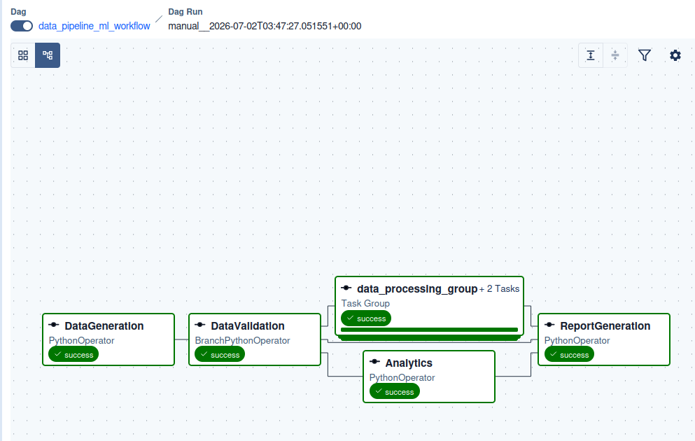
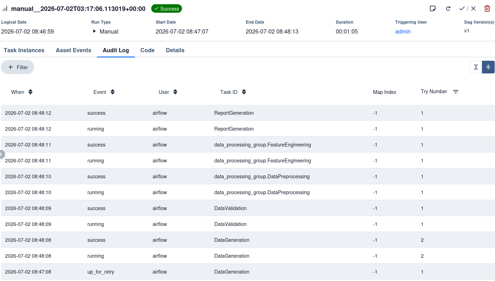
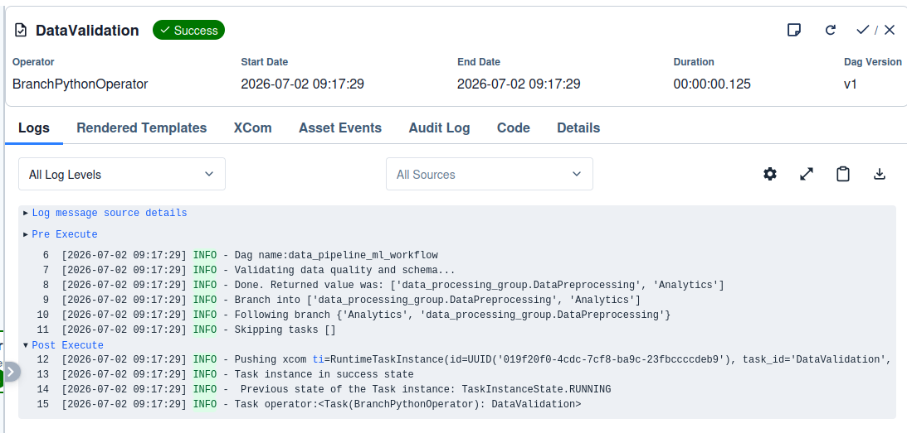
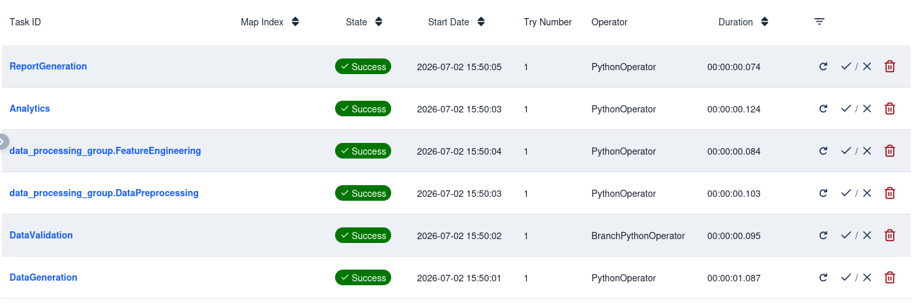

# ML Ops Assignment 1 Report

Submitted by: Sohang Chopra (Roll No. DA25M622)


## Part A - Kafka

### Install

Download Kafka from https://dlcdn.apache.org/kafka/4.3.0/kafka_2.13-4.3.0.tgz, extract & `cd` into Kafka root folder.

Environment:

```bash
$ java --version
openjdk 17.0.19 2026-04-21
$ python --version
Python 3.14.5
$ bin/kafka-topics.sh --version    # Kafka version
4.3.0
```

Setup Kafka server:

```bash
$ KAFKA_CLUSTER_ID="$(bin/kafka-storage.sh random-uuid)"       # generate random cluster UUID
$ bin/kafka-storage.sh format --standalone -t $KAFKA_CLUSTER_ID -c config/server.properties     # format log directories
$ bin/kafka-server-start.sh config/server.properties      # start kafka server
$ pip install kafka-python-ng==2.2.3        
```

### Configuration Details

My roll number is DA25M622, so creating & using topic *sensor_DA25M622* :

```bash
$ bin/kafka-topics.sh --create --topic sensor_DA25M622 --bootstrap-server localhost:9092   # create topic
$ bin/kafka-topics.sh --bootstrap-server localhost:9092 --alter --topic sensor_DA25M622 --partitions 3   # set partition count 3 (replication factor is already 1)
```

### Results

Terminal outputs (python script run using `pip install kafka-python-ng==2.2.3` mentioned above):

```bash
$ python producer.py --topic sensor_DA25M622
Published 500/2000 records...
Published 1000/2000 records...
Published 1500/2000 records...
Published 2000/2000 records...
Done. Published 2000 records to 'sensor_DA25M622' in 41.48s => throughput = 48.21 records/sec
{'topic': 'sensor_DA25M622', 'records_published': 2000, 'elapsed_seconds': 41.48089265823364, 'producer_throughput_rps': 48.214970118368825, 'timestamp': '2026-06-19T17:50:36.031844+00:00'}

$ python consumer.py
Number of records consumed: 2000
Records received per partition: {2: 1020, 0: 980}
Consumer throughput: 297.04 records/sec (elapsed 6.73s)
kafka-metrics-count: 71.0
Total number of metric entries returned by consumer.metrics(): 7

=== Group 'demo-group-of-size-2' with 2 consumer(s) ===
Consumer 0: 480 records, partitions={0: 480}, throughput=50.57 rec/sec
Consumer 1: 520 records, partitions={2: 520}, throughput=54.91 rec/sec
Total consumed by group 'demo-group-of-size-2': 1000

=== Group 'demo-group-of-size-4' with 4 consumer(s) ===
Consumer 0: 0 records, partitions={}, throughput=0.00 rec/sec
Consumer 1: 0 records, partitions={}, throughput=0.00 rec/sec
Consumer 2: 520 records, partitions={2: 520}, throughput=54.91 rec/sec
Consumer 3: 480 records, partitions={0: 480}, throughput=50.73 rec/sec
Total consumed by group 'demo-group-of-size-4': 1000

Group demo-group-A consumed 1500 records independently.
Partition counts: {2: 520, 0: 980}
Throughput: 231.63 records/sec

Group demo-group-B consumed 1500 records independently.
Partition counts: {0: 480, 2: 1020}
Throughput: 231.61 records/sec
```

Metrics are (from above terminal output):
* Total records published = 2000
* Total records consumed = 2000 (initially, but later drops to 1000 or 1500, because consumer has a timeout of 1 second - in case of multiple consumers it has sometimes been crossed).
* Producer throughput = 48.21 records/sec
* Consumer throughput and No. of records recieved from each partition differed for different consumers (see above terminal output).

On varying the number of simultaneous consumers:
* 1 consumer  -- Consumer throughput (recieved from all partitions): 297.04 records/sec
* 2 consumers -- Consumer throughput (each consumer recieving from different partitions): 50.57 rec/sec, 54.91 rec/sec
* 4 consumers -- 2 consumers are idle, rest 2 consumers have similar throughput as in case of 2 simultaneous consumers: 54.91 rec/sec, 50.73 rec/sec

Also we finally ran 2 different consumer groups - it's evident from their output that they consumed stream of events independently.

### Discussion about Kafka

1. Partitions divide a topic into independent, ordered logs across brokers to allow Kafka to scale horizontally and handle massive data throughput.
2. Kafka achieves consumer parallelism by assigning each partition within a topic to exactly one consumer in a consumer group, allowing multiple consumers to read data simultaneously.
3. If the number of consumers exceeds the number of partitions (as happened in the case with 4 consumers here), the extra consumers will sit idle with no partitions assigned to them, providing no additional processing power.

-------------

## Part B - Spark

TODO

-------------

## Part C - Airflow

### DAG Design

| Item | Value |
| ---- | ----- |
| DAG ID | `data_pipeline_ml_workflow` |
| Schedule | Every 5 minutes |
| Retries | 3 |
| Retry delay | 1 minute |
| Executor | LocalExecutor |
| Airflow UI | http://localhost:8080 |

Task List (tasks are simulated as here purpose is to demonstrate Airflow usage):

| Task | Operator | Purpose |
| ----- | --------- | -------- |
| DataGeneration | PythonOperator | Sample data generation |
| DataValidation | BranchPythonOperator | Validation check of generated records and choose execution branch |
| DataPreprocessing | PythonOperator | Preprocess data samples |
| FeatureEngineering | PythonOperator | Create engineering features |
| Analytics | PythonOperator | Run analytics and aggregation on data |
| ReportGeneration | PythonOperator | Generate the final workflow report |

### Dependency Analysis

Dependency Analysis can be seen from attached DAG Graph screenshot:



### Screenshots

Steps to install Airflow and run solution DAG script:

* In python 3.14 virtual environment, installed Airflow 3.2.2 with `pip install "apache-airflow[celery]==3.2.2" --constraint "https://raw.githubusercontent.com/apache/airflow/constraints-3.2.2/constraints-3.10.txt"`
* `airflow standalone` started Airflow web UI at http://localhost:8080 . Logged in with username "admin" and password copied from *~/airflow/simple_auth_manager_passwords.json.generated* .
* Move DAG script (attached) to *~/airflow/dags/airflow_dag.py* . Search for "data_pipeline_ml_workflow" in DAGs in Airflow web UI, as this is the `data_id` specified in airflow_dag.py script.

#### DAG Graph


#### Parallel Execution Opportunities

The DAG uses TaskGroup to organize related tasks `DataProcessing` and `FeatureEngineering`. The validation branch separates the valid processing path from the failure path. In larger workflows, independent validation checks, independent feature engineering steps, and multiple analytics tasks could run in parallel after `DataValidation`.

#### Branching Behavior

`DataValidation` is implemented as a `BranchPythonOperator`. If the generated dataset is valid, it routes execution to `processing.DataPreprocessing` and `Analytics`. If validation fails, it routes execution directly to `ReportGeneration` to report failure.

#### Retry Policy

All tasks inherit:

| Setting | Value |
| ------- | ----- |
| Retries | 3 |
| Retry delay | 1 minute |

Retry execution evidence was captured using a temporary file. Initially `DataGeneration` failed, but wrote to this temporary file so that it succeeds when it gets retried after a minute by Airflow.

See below screenshot of logs of retry behaviour in run:

First node `DataGeneration` failed so it was retried after 1 minute (and its following tasks also ran then). Its status went from `up_for_retry` -> `running` -> `success` as we can see from the logs of the retry:



#### Branching Behaviour 

In Graph View, this is screenshot of logs of `DataValidation` node, after which branching happens:



#### Task Duration Summary

The task-wise durations within DAG run are captured in this screenshot:



### Discussion about Apache Airflow

1. Workflow orchestration automates, coordinates, and monitors the execution of complex data pipelines to ensure tasks run in the correct order based on dependencies.
2. Automated retries handle transient errors like network drops or temporary API downtime without requiring manual intervention to restart the pipeline.
3. Parallel execution reduces total pipeline runtime by running independent tasks simultaneously instead of waiting for them to finish one by one.
4. Branching allows pipelines to dynamically choose different execution paths at runtime based on the outcome of previous tasks or specific conditional data logic.
