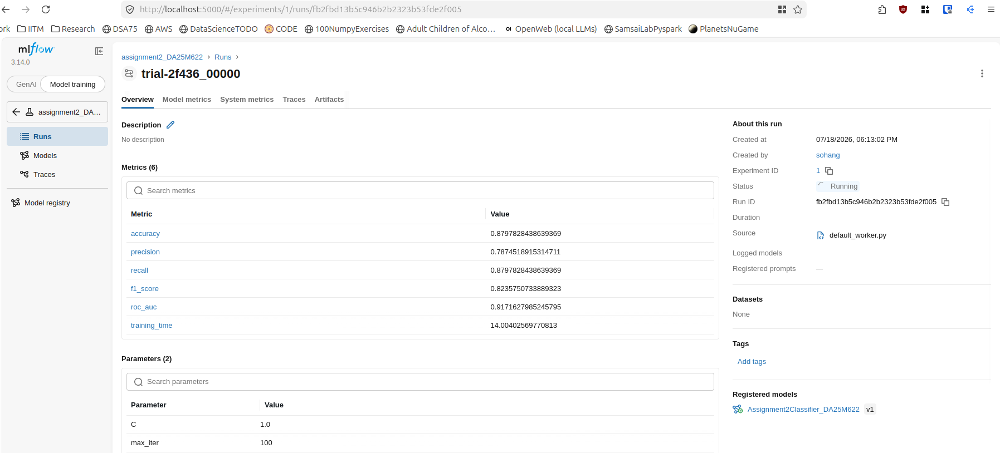
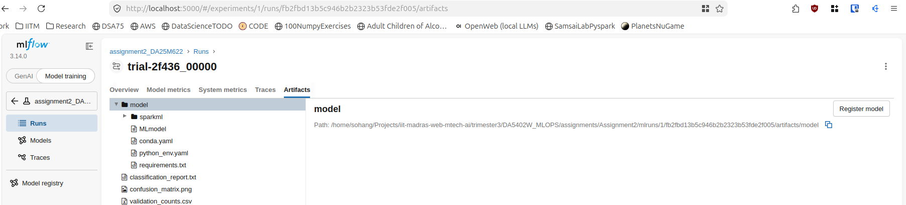
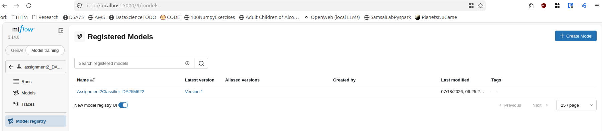

---
Author:
CreationDate:
ChangeDate:
CurrentDate:
---

# ML Ops Assignment 2

## Spark Preprocessing Pipeline

This was the preprocessing pipeline used (of Spark ML):

```python
pipeline_stages = [
    # handle missing numerical data
    Imputer(inputCols=numericalCols, outputCols=imputedNumericalCols),
    # encode categorical data and handle missing categorical data
    StringIndexer(inputCols=categoricalCols, outputCols=indexedCategoricalCols, handleInvalid="keep"),
    # Assemble and scale the numerical features (required for model)
    VectorAssembler(inputCols=imputedNumericalCols, outputCol='num_features_assembled'),
    StandardScaler(inputCol='num_features_assembled', outputCol='num_features_scaled', withStd=True, withMean=False),
    # Combine all final (numerical, categorical) into 'features'
    VectorAssembler(inputCols=['num_features_scaled'] + indexedCategoricalCols, outputCol='features')
]

preprocessing_pipeline = Pipeline(stages=pipeline_stages)
```

Here each pipeline step creates new columns that get appended to dataframe (when pipeline is run):
* simple imputer handles missing values in numerical columns by replacing them with column mean.
* `StringIndexer` encodes categorical columns by encoding category strings into numerical form. It also handles missing values in categorical columns due to `handleInvalid="keep"`.
* Logistic Regression model requires standardized features, so `VectorAssembler` assembles numerical features into a single column (of type vector), which is then scaled by `StandardScaler`.
* Finally all columns are combined into a *features* column using another `VectorAssembler` so that training script's model can use it to train.

## Hyper Parameter Search Space

The following hyper parameters search space was defined (for Logistic Regression model). Here `C = 1/regParam` is inverse of regularization strength.

<!-- This is a lie - somehow I accidentally ran with search space having only 1 param combo! Now not going to run again I'm tired -->

Total number of hyper parameter combinations searched: $4 * 3 = 12$

```python
search_space = {
    "C": tune.choice([1,0,0.1]),
    "max_iter": tune.choice([10,20,50,100]),
}
```

## Best Hyper Parameters

Best Hyper Parameters found (copied from Mlflow UI Params) are: *C = 1.0, max_iter = 100*.

## Final Model Performance

This is copied from Mlflow UI Metrics:

Metric | Value
------ | -------------
accuracy | 0.8797828438639369
precision | 0.7874518915314711
recall | 0.8797828438639369
f1_score | 0.8235750733889323
roc_auc | 0.9171627985245795
training_time | 14.00402569770813

## Predictions CSV

```python
import mlflow
from pyspark.sql import SparkSession

spark = SparkSession.builder.appName("GetRegisteredModel").getOrCreate()
model = mlflow.spark.load_model('models:/Assignment2Classifier_DA25M622/1')
test_df = spark.read.parquet("test_processed_DA25M622.parquet")
predictions = model.transform(test_df)
(
    predictions
    .select('id','age','job','marital','education','default','balance','housing','loan','contact','day','month','duration','campaign','pdays','previous','poutcome','prediction')
    .coalesce(1)        # this forces only a single part CSV to be saved in folder predictions.csv/
    .write.csv('new_predictions.csv', header=True)
)
```

This saved a folder *predictions.csv* having a single part CSV file *part-00000-d3fad608-2803-4634-aa1e-aab856253f71-c000.csv* . 
The CSV is submitted alongside this report.

I loaded mlflow registered model (i.e. best model found in hyperparameter search) using URI format `models:/{MODEL_NAME}/{VERSION}` and Spark is used to do model inference on the preprocessed test data parquet.

## Mlflow UI Screenshots

`mlflow ui` was run in a dedicated terminal to start UI at http://localhost:5000 .

Mlflow Run Best Metrics and Params (hyperparameters):



Mlflow Artifacts - here on clicking Model/ , *Register Model* button shows which was used to register model:



Mlflow Model Registry shows the registered model:

