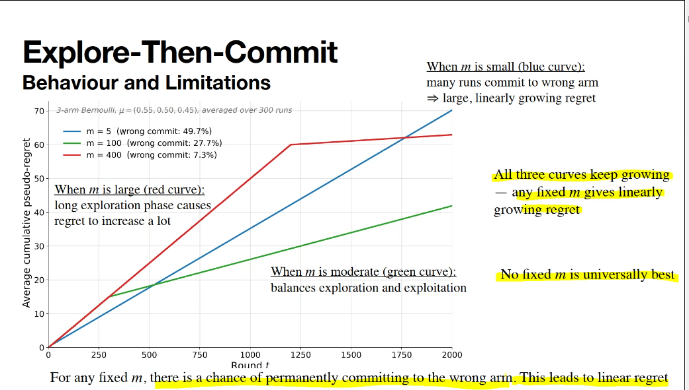
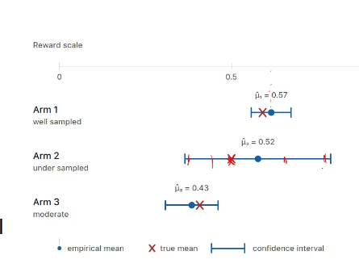
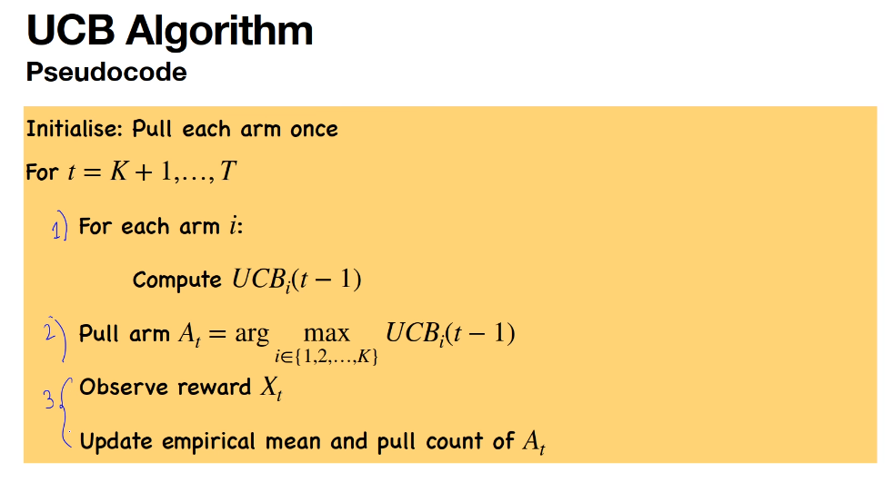

# Online Learning

Prof Surya &lt;suryanarayana@dsai.iitm.ac.in&gt; -- has website https://sanakari.github.io

Offline (Batch) learning vs Online (real-time) learning

More data => Better estimation => Better actions

Bad intermediate actions must be penalized (ie model must perform best given all available data) - else *it reduces to offline (batch) learning*.
- Either find best action as quick as possible,
- OR find a way to perform well throghout

*Examples*:
- A/B testing (clinical trial)
- Dynamical Pricing
- Recommender systems for news
- (Reinforcement Learning) chess AI

## TODO Lecture 1

## TODO Lecture 2

## TODO Lecture 3 (Regret Minimization)

## WIP Lecture 4 (Upper bound confidence bound (algorithm name))

We want to minimize regret, but in both previous strategies (including Explore-then-Commit), we get linearly increasing regret.

So we use a better algorithm with sub-linearly increasing regret - it uses data to guide us better when to use which arm without committing to a pre-chosen arm.
It's **Upper Confdence bound method**.

Previous algo was *Explore-Then-Commit (ETC)*, there the mistake was to decide in advance what is going to be the best arm and then exploiting that arm only subsequently.

So tension is to **explore** or **exploit**? So if estimated mean is reliable, then we can be confident of minimizing regret by exploiting. Otherwise explore.

For each arm i we maintain in epochs:
* mean mu (estimate of mean reward)
* width of confidence interval, where T = 1,2,3,4.. (no. of rounds so far), $\sqrt{c \ln(T) / T}$ (c is a hyper-parameter that controls how much to explore)

**Large confidence interval indicates unreliable estimate, so more likelihood to explore**

(Earlier in previous method confidence interval was $\sqrt{\ln(2 / \delta) / 2 n})

Example (here 3 arms are there - it illustrates that we need to pay attention to both mean and confidence interval to choose which arm to use):

Answer is, choose arm which maximizes Upper Confidence Bound $UCB_i = \mu_i + \sqrt{c \ln(T) / T}$ -- in practice T increases causing confidence interval width to reduce, so initially we choose uncertain arm (here arm 2), but later if it remains unreliable confidence interval shrinks and we switch to arm 1 (more reliable). 

*Unlike Sequential Elimination, UCB does not wait till confidence intervals of arms seperate.*

UCB Algorithm: TODO

**Ideal** $c = 2$ (theoritical - there's a derivation for this, covered later) (ideal balance between conservative and too high exploration) -> c can be arbitarily large positive number, but even with c = 20 it's too large practically due to bad performance.

TODO

NOTE: UCB is best for minimizing regret, NOT necessarily for finding absolute best arm.

*Hoeffding's inequality*: True mean of every arm sits inside Confidence Interval at every step.

If arm i is suboptimal AND it is picked at time t (AND good event holds -- TODO not sure what is good event?):
* UCB >= true mean
* UCB(t) = true mean + bonus(t) [diff for each arm i]
* bonus_i(t) >= delta_i / 2

UCB Algorithm steps / pseudocode are:

Therefore, to get an upper bound of T (how many times we need to run the whole process):

$$T \le 4 c \frac{\ln(T)}{\delta_i^2}$$ -- TODO

TODO

## Lecture 5 - Modelling as a Bandit Problem (ie how to use bandits for real-world problems)

