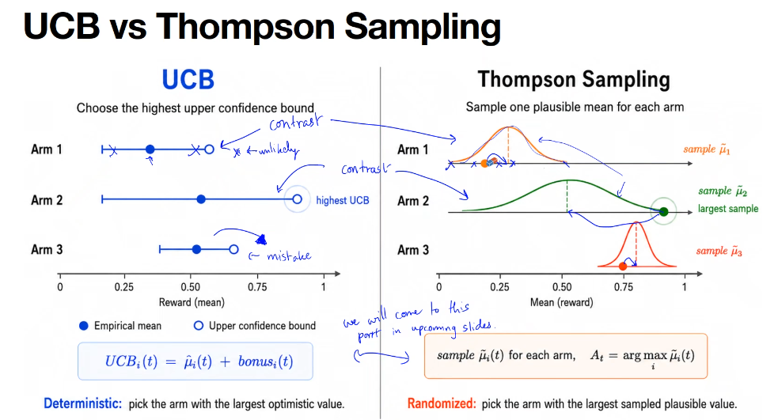
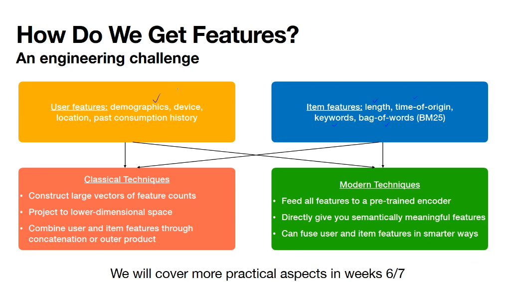
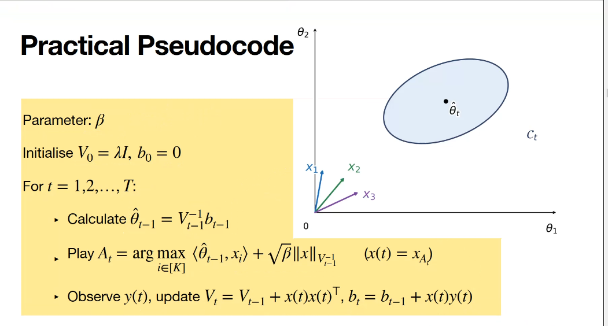
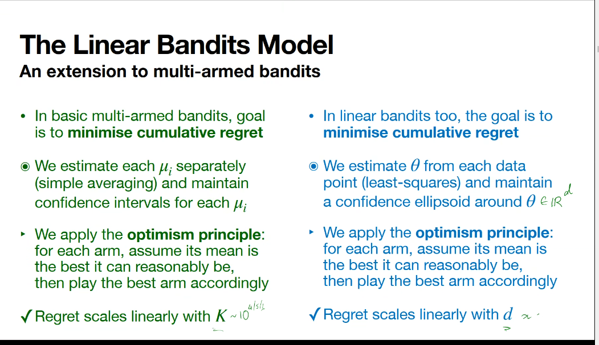
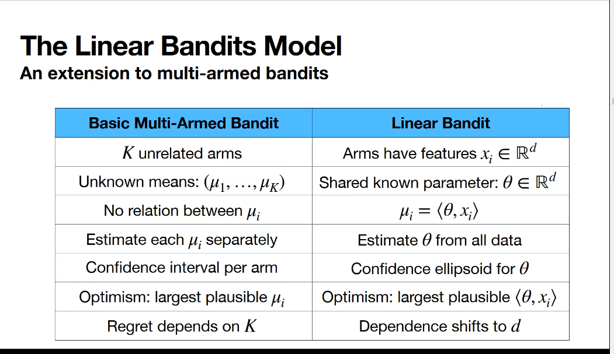
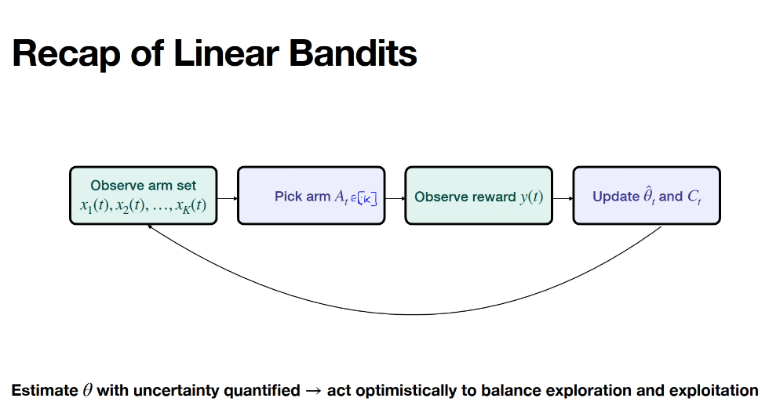
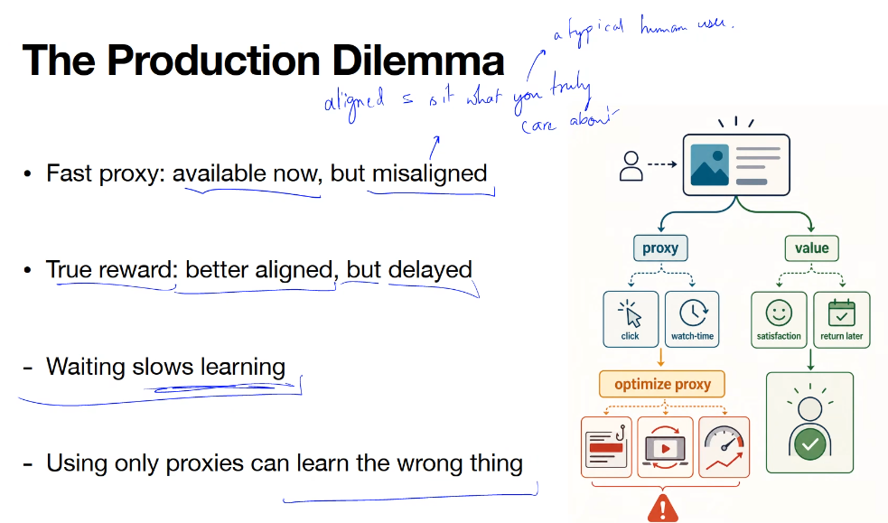
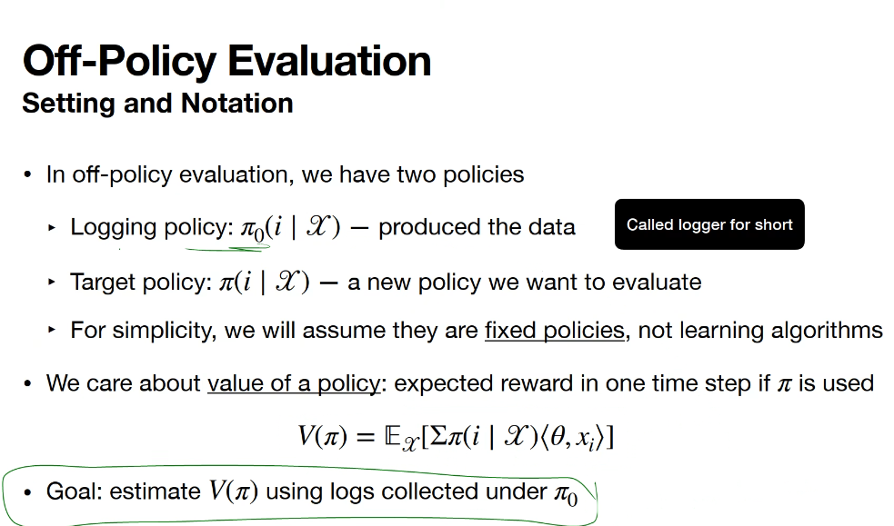

# Online Learning

Prof Surya &lt;suryanarayana@dsai.iitm.ac.in&gt; -- has website https://sanakari.github.io

Offline (Batch) learning vs Online (real-time) learning

More data => Better estimation => Better actions

Bad intermediate actions must be penalized (ie model must perform best given all available data) - else *it reduces to offline (batch) learning*.
- Either find best action as quick as possible,
- OR find a way to perform well throghout

*Examples*:
- A/B testing (clinical trial)
- Dynamical Pricing
- Recommender systems for news
- (Reinforcement Learning) chess AI

**IMPORTANT TODO**: Refer to practice questions in the chapter exercises of book *Bandit Algorithms*.

BAI (Best Arm Identification) - *Pure Exploration* (instead of exploration + exploitation as in standard bandit algorithms to minimize regret) - use algorithms like Successive Elimination:
* Play all arms uniformly.
* At set intervals, look at the confidence bounds.
* Statistically reject/kill the arms that are provably worse than the top performer.
* Repeat only with the surviving "top tier" arms until only one remains

## TODO Lecture 1

## TODO Lecture 2

## TODO Lecture 3 (Regret Minimization)

## WIP Lecture 4 (Upper bound confidence bound (algorithm name))

We want to minimize regret, but in both previous strategies (including Explore-then-Commit), we get linearly increasing regret.

So we use a better algorithm with sub-linearly increasing regret - it uses data to guide us better when to use which arm without committing to a pre-chosen arm.
It's **Upper Confdence bound method**.

Previous algo was *Explore-Then-Commit (ETC)*, there the mistake was to decide in advance what is going to be the best arm and then exploiting that arm only subsequently.

So tension is to **explore** or **exploit**? So if estimated mean is reliable, then we can be confident of minimizing regret by exploiting. Otherwise explore.

For each arm i we maintain in epochs:
* mean mu (estimate of mean reward)
* width of confidence interval = $\sqrt{c \ln(T) / T_i(t)}$, **IMPORTANT** the numerator $T$ is current total round number, while denominator $T_i(t)$ is number of times arm i has been pulled. c is a hyper-parameter that controls how much to explore.

**Large confidence interval indicates unreliable estimate, so more likelihood to explore**

(Earlier in previous method confidence interval was $\sqrt{\ln(2 / \delta) / 2 n})

Example (here 3 arms are there - it illustrates that we need to pay attention to both mean and confidence interval to choose which arm to use):

Answer is, choose arm which maximizes Upper Confidence Bound $UCB_i = \mu_i + \sqrt{c \ln(T) / T}$ -- in practice T increases causing confidence interval width to reduce, so initially we choose uncertain arm (here arm 2), but later if it remains unreliable confidence interval shrinks and we switch to arm 1 (more reliable). 

*Unlike Sequential Elimination, UCB does not wait till confidence intervals of arms seperate.*

UCB Algorithm: TODO

**Ideal** $c = 2$ (theoritical - there's a derivation for this, covered later) (ideal balance between conservative and too high exploration) -> c can be arbitarily large positive number, but even with c = 20 it's too large practically due to bad performance.

TODO

NOTE: UCB is best for minimizing regret, NOT necessarily for finding absolute best arm.

*Hoeffding's inequality*: True mean of every arm sits inside Confidence Interval at every step.

If arm i is suboptimal AND it is picked at time t (AND good event holds -- TODO not sure what is good event?):
* UCB >= true mean
* UCB(t) = true mean + bonus(t) [diff for each arm i]
* bonus_i(t) >= delta_i / 2

UCB Algorithm steps / pseudocode are:

Therefore, to get an upper bound of T (how many times we need to run the whole process): $T \le 4 c \frac{\ln(T)}{\delta_i^2}$

(from take-home-work 2, part 1 notebook) for UCB, $T_i(T) \le 8 \log T / \Delta_i^2 + 1$, where $\Delta_i = \mu^\star - \mu_i$ is the gap.

TODO

## Lecture 5 - Modelling as a Bandit Problem (ie how to use bandits for real-world problems)

TODO

## Lecture 6 - Thompson Sampling for Bandits (Randomized Algorithm - we generate some random numbers in algorithm)

Upper Confidence Bound (UCB) vs Thompson Sampling:

True arm mean $\mu_i$ of arm i is fixed but unknown, so we're uncertain about what it is - it's described with a **belief distribution**.
As we get more and more data, uncertainity reduces but some will still always be there as data is finite.

We update the belief distribution probability via Bayes Theorem: Posterior = Likelihood * Prior

TODO

## WIP Lecture 7 - Introduction to Contextual Bandits

Course so far: *Multi-Armed Bandits* > *Best-Arm Identification* > *Regret Minimization* > *Upper Confidence Bound* > *Thompson Sampling*

In practice any bandit algorithm in real world is contextual.

Problem this solves - in vanilla bandit algorithms, there's no accounting for *personalization* (eg. general news recommendations vs personalized news recommendation).

In vanilla bandit, an arm is just an index $i$. Now in contextual bandits, an arm is a feature vector $x_a$ .

How to create features for contextual learning:

*Recommended reading Yahoo research paper on this topic*

TODO 

## WIP Lecture 8 - Introduction to Linear Bandits

A good algorithm (like UCB or Thompson) will get sub-linear regret growth (wrt number of epochs, aka time). BUT even then regret is still linear with respect to number of arms (because all arms must be tried at least a few times each).

Assumption:

* Each arm has a *fixed and known* context vector $v_i \in \mathcal{N}(\mu_i, 1)$
* Mean of context vector $\mu_i = < \theta, x_i>$ -- $\theta$ is *fixed but unknown* .

We can try to estimate $\theta$ vector using $x, y$ where $y$ at each point is the reward at that point, which we assume depends on $x$.

For estimating $\theta$ we can use linear regression using $(x_1, y_1), (x_2, y_2) ... (x_T, y_T)$ -- specifically **Ridge Regression** (i.e. L2 norm in loss).

So objective is to solve $\min_\theta (y(t) - \langle \theta, x(t) \rangle)^2$

TODO

## WIP Lecture 9 -- Linear Upper Confidence Bound

Unlike standard Upper Confidence Bound method (where each arm is assumed to be independent), here each arm is assumed to be depedent on others, so that pulling one arm also updates information about all other arms.

Each arm is represented not as a single number but as a vector of characterstics of arm & environment. Because environment is shared, this updates info for all arms.

In linear bandit, confidence interval DOES NOT DEPEND on T_i(t) (how many times arm has been pulled so far).

Pseudocode:

TODO

## Lecture 10 - More on Linear Bandits

in standard multi-arm bandits, each arm is an indepdendent option we can choose, we assume no relation between arm reward means.
in linear bandits each arm has a structured vector and we assume connected, so we can use one arm's reward info to learn about all arms.
Goal is in both to minimize cumulative regret.

in vanilla bandits we maintain arm averages and confidence bounds.
in linear bandits we estimate theta (least squares) and confidence ellipsoid. (expected rewards is assumed to be linear combination of arm feature vectors and a vector theta)

vanilla bandits: regret scales with K (number of arms)
linear bandits: regret scales with d (dimensionality of feature space = no. of dimensions in arm vectors)

TODO

Standard vs Linear Bandits:

linear bandit arm vector i ==> mean $\mu_i = < theta, x_i >$ -- arm mean is **dot product** of context vector of arm $x_i$ and shared environment vector $\theta$ (NOTE: the unknown ground truth $\theta$ is fixed for all t. But we don't know it, so we improve our estimated theta at each t)

With probability at least $\delta$, $\|\theta - \hat{\theta}_i\|_{V_t}\| \le \beta$

**Context vector $x_i$ need not be raw vectors.** Raw input (article text, image etc.) can instead be passed through a feature map (function) $\sai$ which captures all the complexity & non-linearity. This may be a matrix or may also be some other function.
* *Feature map is fixed before running bandit algorithm*.
* Richer feature map => larger $d$, more expressive learning, but slower learning (larger regret)

### How do we get context vectors?

an example: we have d categories of news, so each category context vector is simply one-hot encoded: <1,0,0..>, <0,1,0,..>, ..
This is simple interpretable but also very low-dimensional and misses subtler differences between categories (eg. politics is closer to finance than entertainment) - we can do better 

TODO

## Lecture 11 - Production Realities of Bandits

Recap of Linear Bandits:

4 Challenges - here we'll see how to overcome:
1. computational cost, esp. with large no. of arms - standard bandits scale linearly with no. of arms so totally can't handle, linear bandits don't - so can they practically be fast enough?
2. designing correct reward function for what we want
3. rewards may not be always available, or only available after a delay
4. we assume stationary environment but that's not necessarily true (eg. user preference can change). So adapt to time-varying environments

(NOT IN SYLLABUS -- what if rewards dont follow any model? Adverserial Bandits are used. In practice not much used.)

(NOT IN SYLLABUS -- (part of non-stationary bandits problem) underlying probability distributions of arms change. Restless Bandits can be used.)

(NOT IN SYLLABUS -- Bandits with Knapsacks (conditions))

(LIKELY IN SYLLABUS -- State Bandits)

Multi-Agent Bandits

Solution to 1st: **Nearest Neighbours Search (Retrieval on Full Catalog)** (2 phases) (it solves *Exploration is limited by retrieval*):
* Have pre-computed item embeddings (or calculate query/embeddings online)
* compute *approximate* nearest neighbours to 'target' in embedding space (say 100 - exact ranking does NOT matter)
* now in this reduced set apply bandit algorithms

Solution to 2nd: Reward Design: **Using Reward Model** (proxy rewards are available easily, but true reward is only available after delay)
* interpolate short-term proxy reward with long-term true reward (eg. use linear interpolation, or use a neural network to get predicted reward at time t)

## Lecture 12 - Off-Policy Evaluation in Bandits -- SLIDES NOT AVAILABLE YET BUT VIDEO IS THERE ON COURSE PORTAL

So far we have evaluated using regret (in theory, simulation). But in real world we don't know best arm so regret cannnot be calculated, instead we measure cumulative rewards.

One standard evaluation way is A/B Testing (comparision between current and new policy -- run both a fixed number of times, then choose best).

But A/B Testing is *expensive* -- many many users are shown a version that's untested (we aren't fully sure how it performs). Risks users leaving if sub-standard!

**Off-Policy Evaluation**: Assuming we have detailed logs of current production policy, can we estimate from that alone what the new policy would have done and evaluate accordingly without actually running the new policy in production?

ASSUMPTION: policies are NOT changing with time.

*Policy* is a rule for picking action - which arm to pull. Deterministic or Randomized

Algorithm vs Policy

Value of Policy (logging (old) vs target policy (new under evaluation)):

Challenge is how can we know reward of the choice new policy would have picked?

One way *Replay Method* (in case of a uniform 1/K logging policy) is to choose only the approx $N/K$ rounds where same arm would be chosen by new policy as logging policy (discarding rest), and calculate mean of these only. Cons of this:
* we only use $1 / K$ of the data so wasteful
* requires uniform logging only - not applicable to production policies

### Inverse-Propensity Scoring Method

