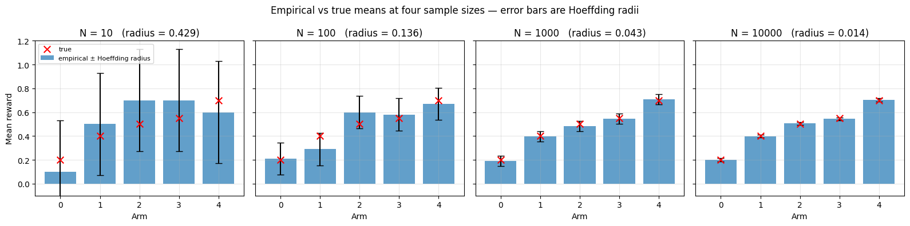
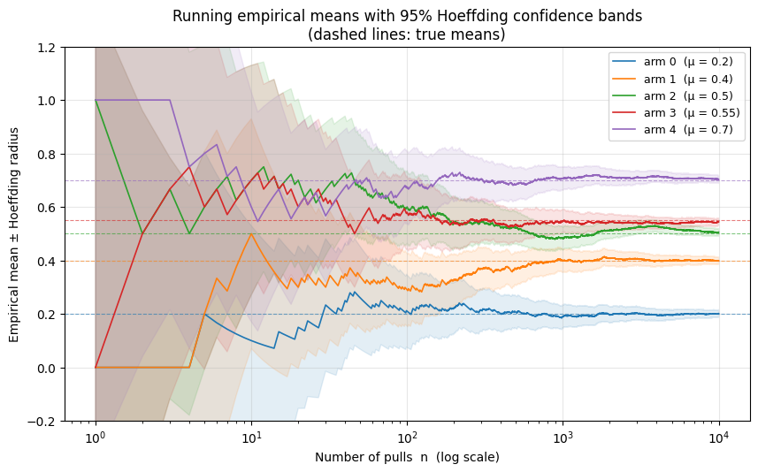

# NOTES from Warmup notebook of Assignment 1

## Example 1: Estimating arm means with Hoeffding's inequality (from Lecture 2)

NOTE: Bernoulli Bandit here (Bernoulli rewards - 0 or 1 for each arm pulled).

If we pull an arm with unknown mean $\mu \in [0,1]$ for $n$ i.i.d. rounds and form the empirical mean $\hat\mu_n$, **Hoeffding's inequality** (for Bernoulli rewards) says

$$\Pr\!\left(|\hat\mu_n - \mu| \geq \varepsilon\right) \;\leq\; 2 \exp(-2n\varepsilon^2).$$

Fixing a confidence level $\delta \in (0,1)$ and solving $2\exp(-2n\varepsilon^2) \leq \delta$ for $\varepsilon$ gives the **Hoeffding radius**

$$\varepsilon_n(\delta) \;=\; \sqrt{\frac{\log(2/\delta)}{2n}},$$

so with probability at least $1-\delta$, the true mean $\mu$ lies in $[\hat\mu_n - \varepsilon_n(\delta),\; \hat\mu_n + \varepsilon_n(\delta)]$.

The radius shrinks by $1/\sqrt n$ (as we keep increasing the no. of rounds $n$) on a 5-arm Bernoulli bandit.

*Example*: Pulling 5 arms 1000 times shows result plots:

**Snapshot Bar Plots with Hoeffding Error Bars**:

**Hoeffding Sandwhich Plot:** Here each dashed line shows true arm mean, each solid line is trajectory of estimated mean of the arm, and the shaded area of each arm represents its confidence interval at different rounds.

