# Reinforcement Learning

TODO: go over this RL blog post: https://lilianweng.github.io/posts/2018-02-19-rl-overview/

## Markdov Decision Process (MDP)

Present action only depends on previous action and state.

Agent-Environment interaction

State-Transition dynamics of Environment - stochastic or deterministic

State Transision Diagram

Reward (feedback from environment about action taken by agent) is a function of present state, present action and next state. It's a scalar.

Policy function: states -> actions. Stochastic or deterministic.

RL Objective: Learn optimal Policy to maximize expected cumulative reward.

**Learning Optimal Policy (Control)**:
- Episodic (finite pre-determined terminating state) and Continuous (indefinite termination, may never stop - eg. supply chain management, optimized over time) tasks
- *Return* $G_t$ is total cumulative reward agent recieves starting from a particular time step.
- *Discounted Return* $G_t = R_{t+1} + \gamma R_{t+2} + \gamma^2 R_{t+3} + ...$ where $\gamma$ is discount factor (0 to 1) which discounts future rewards. If $\gamma=0$, agent is myopic and only cares about immediate reward. If $\gamma=1$ (can take in Episodic tasks), agent is far-sighted and cares about future rewards as well.

$$G_t = R_{t+1} + \gamma G_{t+1}$$

State Value Function of a state $s$ under policy $\pi$ is expected return starting from that state and following that policy:
$$V^\pi(s) = \mathbb{E}[G_t | S_t = s]$$

Above equation includes probabilistic nature of environment and reward function.

Action Value Function (also called action value or Q-value) of a state-action pair $(s, a)$ under policy $\pi$ is expected return starting from that state, taking that action and following that policy:
$$Q^\pi(s, a) = \mathbb{E}[G_t | S_t = s, A_t = a]$$

State-value functions, denoted as V(s), evaluate the "goodness" of being in a specific state, while action-value functions, denoted as Q(s,a), evaluate the "goodness" of taking a specific action while in that state.

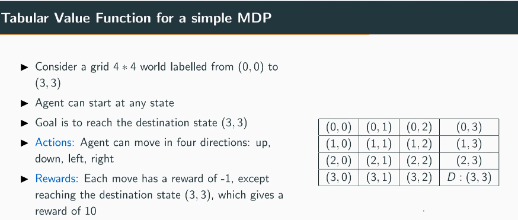

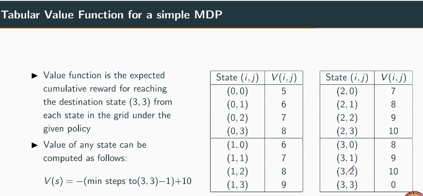

NOTE: In practice we don't know Value function, so we have to estimate it.

**Bellman Equation**:

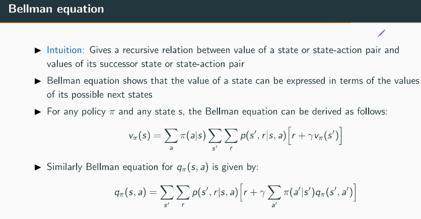

Backup Diagram shows how values of a state are updated based on Bellman Equation (nodes are state-action pairs, edges are state transitions, and rewards are associated with edges):

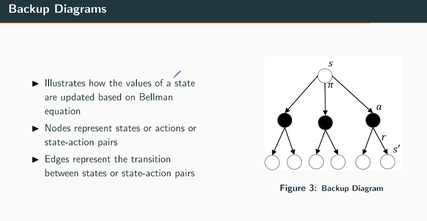

Policy $\pi$ is better than policy $\pi'$ if expected return is greater for all states: $V^\pi(s) \geq V^{\pi'}(s)$ for all states $s$.
For any MDP, there exists an optimal policy $\pi^*$ better than any other policy.

State value of optimal policy is denoted as $V^*(s) = \max_\pi V^\pi(s) \forall s \in S$ and action value of optimal policy is denoted as $Q^*(s, a) = \max_\pi Q^\pi(s, a) \forall s \in S, a \in A$.

Optimal state value = max (for all actions) of optimal action values.

Bellman Optimality Equation for state value function (bellman equation applied to optimal value functions):

If we're able to solve Bellman Optimality Equation, we can get optimal value function and then derive optimal policy from it.

* For a fixed policy, it's a system of linear equations => solvable.
* For optimal value function (i.e. we don't know policy, have to find out!), it's a system of non-linear equations => not solvable in general as expensive and requires state-transition model. We can use iterative methods to approximate the solution.

In practice verifying Markovian properties are followed isn't easy.

RL methods:

* Monte Carlo
* Temporal Difference (TD) Learning
* TODO
* Deep RL

TODO

## Lecture on July 8

(Revision of Monte Carlo Estimation)

Monte Carlo learning is simply this whole iterative process of learning.
In Monte Carlo methods expected values are used as emperical means.

Greedy learning:

Update Q values and improving it in each iteration:
- initially Q value for each action is first return we see from environment
- policy is improved to be $\epsilon$-greedy wrt Q values

On-Policy Learning (we eventually reduce $\epsilon$ to near 0 so policy converges), Off-Policy Learning (straight greedy, no need for epsilon)

Importance Sampling (rarely used nowadays due to better techniques):
* Weigh the returns of behaviour policy b to make them representative of returns of target policy $\pi$
$$\rho_{t:\tau-1} = \Pi_{i=t}^\tau \frac{\pi(A_t|S_t)}{b(A_t|S_t)}$$

Example: Blackjack game - each player's goal is to get cards whose numerical values is as great as possible without exceeding 21
**Exercise**: (TA also will cover later) solve blackjack using RL in python! see rules below:

----------------- END OF MONTE CARLO --------------------------------

### Temporal Difference (TD) Learning Methods

Most central & novel idea to RL !
Can use for both episodic and continous tasks

We don't wait until end of episode to update -- after just 1-2 steps of MDP (partial MDP or bootstrapping) we update

In Incremental Monte Carlo, error is $G_t - V(S_t)$
In TD error, $G_t$ is replaced by TD target based on observed reward and next state at $t+1$ : $R_{t+1} + \gamma S_{t+1}$

So update step becomes:
$$V(S_t) += \alpha (R_{t+1} + \gamma V(S_{t+1}) - V(S_t))$$

Practically Temporal Difference is observed to converge to optimal policy faster than Monte Carlo.

Example: Robot chasing (safe path or shortcut ?):

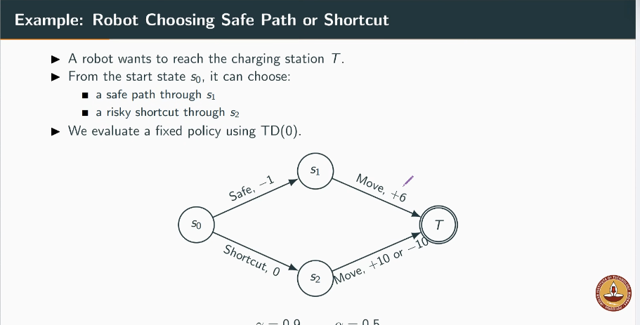

TODO

## Lecture on July 13

TODO

$\lambda$-return ($\lambda$ in 0 to 1 is tradeoff between immediate and future rewards) :
* it is a way of averaging multiple $n$-step returns
* In Temporal Difference $TD(\lambda)$, $\lambda$-return becomes TD target
* Idea: Average all $n$-step returns with exponentially decaying weights controlled by $\lambda$ (so geometric series)

$$ G_t^\lambda = (1 - \lambda) \sum_{n=1}^\inf \lambda^{n-1} G_{t:t+n} $$

* If we put $\lambda = 1$ then it becomes a Monte Carlo (MC) update only
* If we put $\lambda = 0$ then it becomes 1-state TD update or $TD(0)$
* At terminal state, all subsequent n-step returns are equal to conventional return $G_t$

Forward View of $TD(\lambda)$ looks at future rewards / states. Issues with forward view:
* Like in Monte Carlo, we can only calculate $\lambda$-return for episodic because they terminate

TODO

**Credit Assignment Problem (in all of RL)**: Present actions impact present as well as future rewards & states. Which action taken in past is responsible for reward in future? Agent needs to figure out which previous actions contributed to reward and how much.

Most RL algos assume present action impacts all future though more weight to immediate rewards (discounting) 

MC methods wait until end of episode, and then try to assign credit to actions based on accumulated return (from then to all future till termination).

TD methods - much faster credit assignment. update value estimates at each time step based on the TD error

**Eligibility Traces**: efficient solution to credit assignment and efficient alternative to $\lambda$-return
* Approach:
  * Keep track of state s or state-action pair (s,a) - their "eligibility" to receive value updates based on future rewards
  * Facilitate temporal credit assignment by exponentially decaying eligibility over time
  * Much simpler approach compared to maintaining multiple returns
* Referred to as Backward View $TD(\lambda)$ because influence of TD error is propagated backward to all TD states (unlike forward where at each point we are trying to account for future rewards directly
* A learned signal is sent backward to previous states

Math & details of Eligibility Traces to be discussed next class.

## Lecture on July 14

Revision of last class: n-step TD Control, $\lambda$-return (a particular way of averaging multiple n-step), forward view $TD(\lambda)$, problem of Credit Assignment in RL, eligibility trace (backward view - has similarity to back propagation)

TODO

### Value Function Approximation

all RL algos till now assumed tabular value functions - ie for each state or state-action pair there's a value

drawbacks:
* not scalable to large and/or continuous space
* memory intensive
* lack of generalization: cannot extrapolate from seen to unseen states / state-action pairs
* due to lack of generalization, slow learning, more samples, more time to converge

TODO

we solve these drawbacks via parametric approx to value functions

*Shared Parameters*: Suppose nearby states have shared characteristics. Instead of learning seperate states, we describe every state using feature vectors:

$$ x(s) = [1 , x_1(s) , x_2(s) , ... , x_d(s)] $$

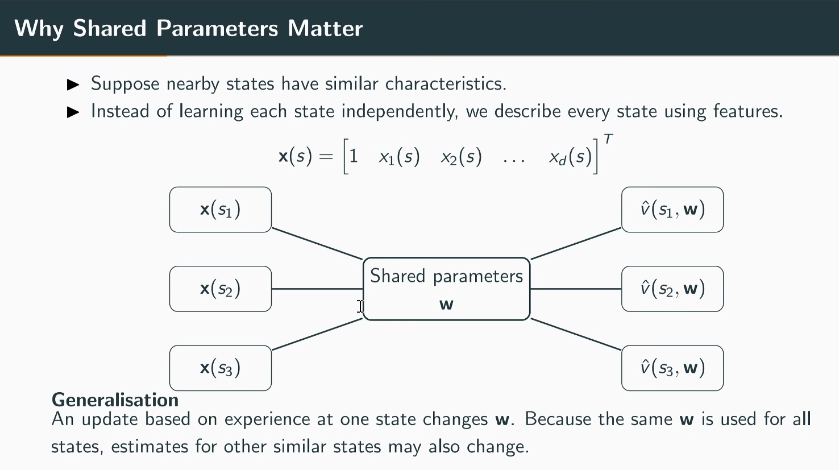

Types of Value Function Approximators:

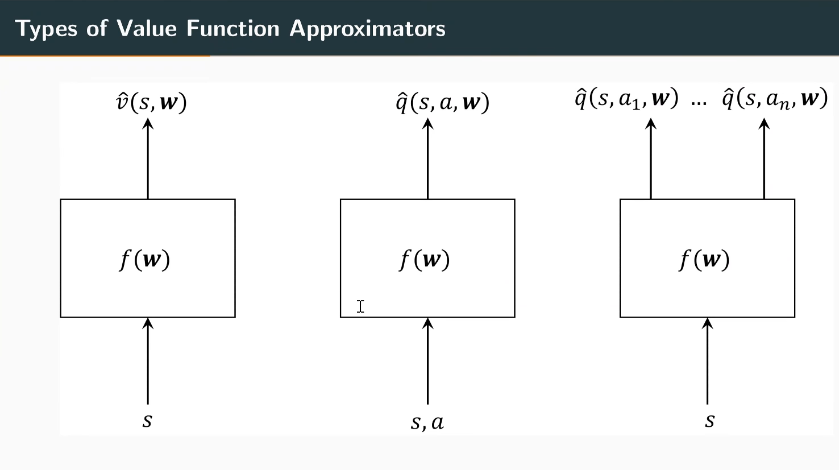

TODO

Practical Learning Targets (compared to regression, there the target is fixed, here it's not) - adjust $w$ so that estimated value moves closer to target $v(S_t, w)$:

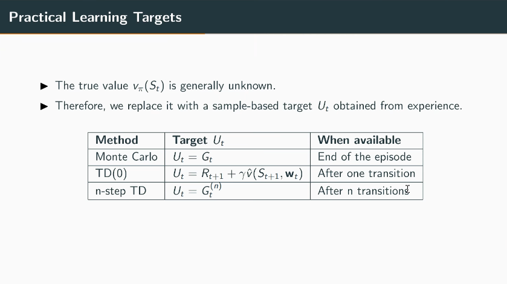

TODO

**Algorithm**: Gradient Monte-Carlo for Estimating $V_\pi$ ; Inputs: policy, differentiable value approximator $\hat{v}(s,w)$, learning rate $\alpha$

TODO

**Linear Function Approximator**: $\hat{v}(s,w) = w^T x$

TODO

## Lecture on July 21 -- Policy-Gradient Methods (policy without estimating values for each action)

Revision of previous lecture (Value Function Approximation):
* function approximation replaces separate table entries with shared parameters/weights. Learning uses sample-based targets from MC, TD or n-step methods.
  * Gradient Monte Carlo
  * TD-based
  * Linear Approximator
  * Non-Linear Approximator
* **Semi-Gradient** (we can do with standard gradient as well, but this reduces computation): fix the TD target, differentiate only the current TODO
* Instability and divergence are especially likely when these 3 are combined (Deadly Triad): Function Approximation, Bootstrapping, Off-Policy Learning

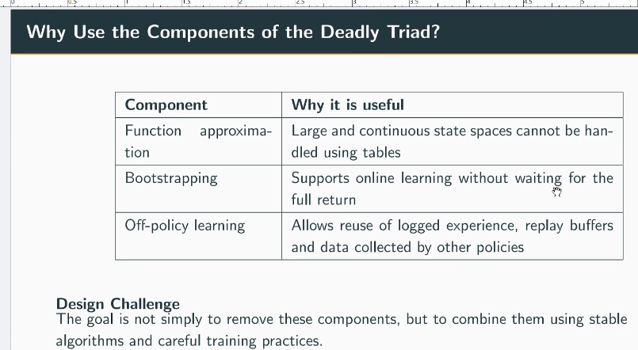

NEW IN THIS LECTURE BELOW:

* Value-based approach: learn how good each action is in each state: q(s,a) & select action with highest estimated value in the state s
* But issues with this:
  * in a continuous-action space, finding action with max value can require solving an optimization problem
  * small changes in action values can cause abruptly different actions
  * greedy action-value policy not suitable where a stochastic policy is required
* Can agent learn policy directly, without first learning values of every possible actions?

**Policy-Gradient learning methods** directly adjust policy parameters to increase expected long-term return.
Use when continous action value space OR very large no. of actions OR desired behaviour should remain stochastic.
Some use-cases: Robotic Control, Industrial Control, **LLM Tuning**

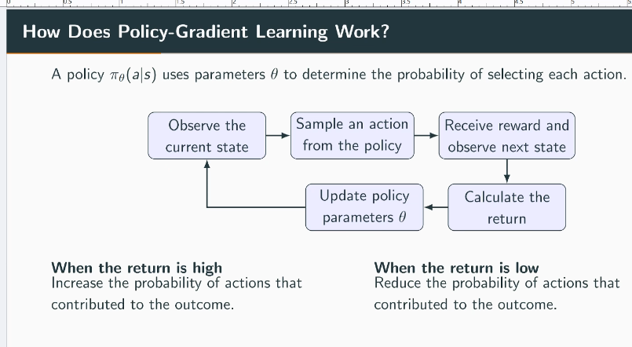

Policy is represented by a differentiable function with parameters $\theta$: $\pi_\theta(s,a)$
TODO

Policy Parameterization for Discrete actions:

* For a small or moderately sized action space, policy network produces a numerical preference for each action: $h_\theta(s,a) \in R$
* high preference better
* do softmax over all to get probabilities - due to softmax policy can be softmax but can also approach deterministic if needed

Policy Parameterization for Continous actions:

* policy produces probability distribution (eg. Gaussian: $\mu_\theta(s)$ is current preferred policy, $\sigma_\theta(s)$ is amount of exploration) over actions (since individual action values not possible)
* TODO

A couple of example problems: TODO

Math of policy-gradient : next lecture

## Lecture on July 27 - Parallel Actor-Critic Architecture

Revision of last time (Actor-Critic Architecture, One-Step TD Architecture Algorithm)

Actor-Critic Architecture:

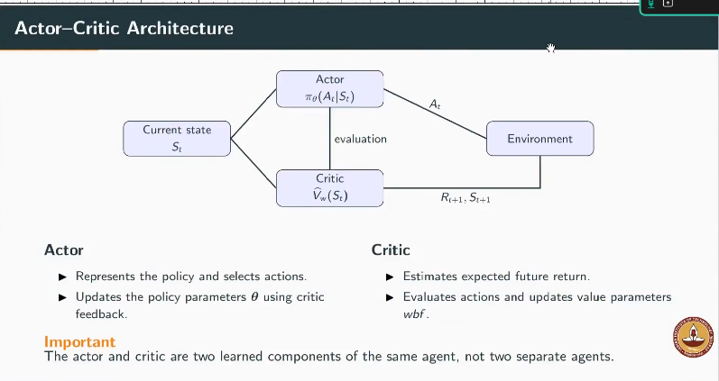

Actor uses only $\theta$ and state $S_t$ to select action. Critic uses only $w$ and state $S_t$ to evaluate new state.

One-step TD actor critic algorithm (actor, critic params vectors $\theta$, $w$ get updated after each transition, unlike REINFORCE which updates after full return $G_t$ is obtained).

Policy probab distribution (from which action is sampled) is Gaussian for continous action space, else apply softmax probabilities for discrete action space.

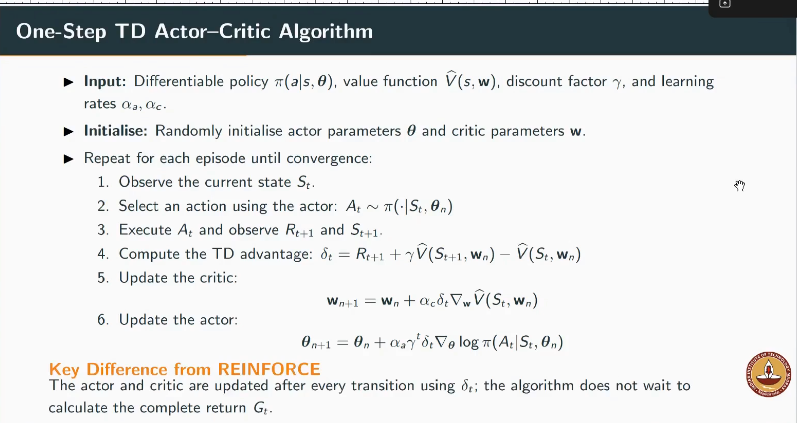

NEW LECTURE MATERIAL:

Why move beyond single actor-critic worker? Because single environment:
* generates only one trajectory at a time
* conservative transitions can be highly correlated
* explores only one region of environment at a time, so high chance of overfitting (little exploration) to the region and converging to a local minimum

Parallel Environments:
* Generate several independent trajectories
* More diverse training experience
* Improve data-collection speed

Parallel Actor-Critic Types: A2C, A3C

Continous Learning Process in A2C, A3C :

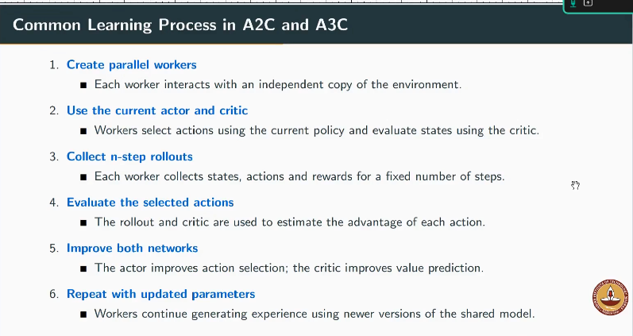

A2C: Synchronous Advantage Actor-Critic -- synchronous means every worker finishes before shared actor & critic get updated
* update direction vector is average of all
* TODO: math

## Lecture on July 29 - Proximal Policy Architecture (revision of last class); Deep RL architectures (today lecture)

Revision:
* Proximal Policy Architecture (aka PPO - i think they are same?) makes a snapshot of policy, copies snapshots to parallel environments, multiple trajectories, transitions shuffled & ordered to create multiple epochs -- TODO: understand better what this means
* Mini-Batch Update: pi_0 / pi (current policy / frozen policy) importance ratio is used

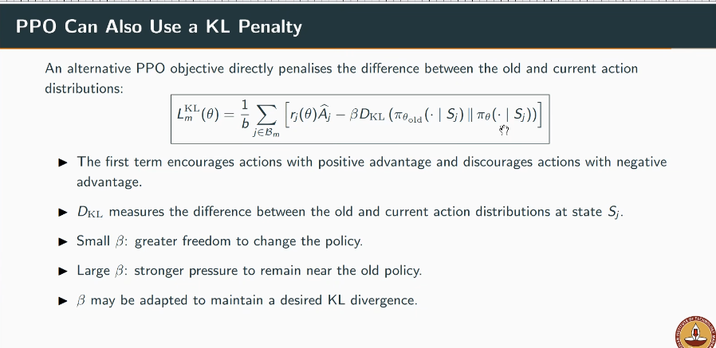

PPO Learning Loop (omitted in it is 5th step: Refresh Data: after approx MK actor-critic updates, discard rollout and begin next PPO iteration):

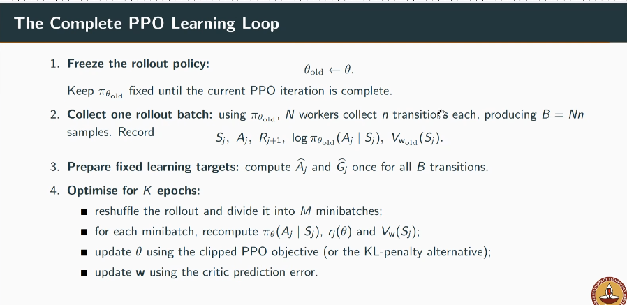

PPO Key Takeaways:

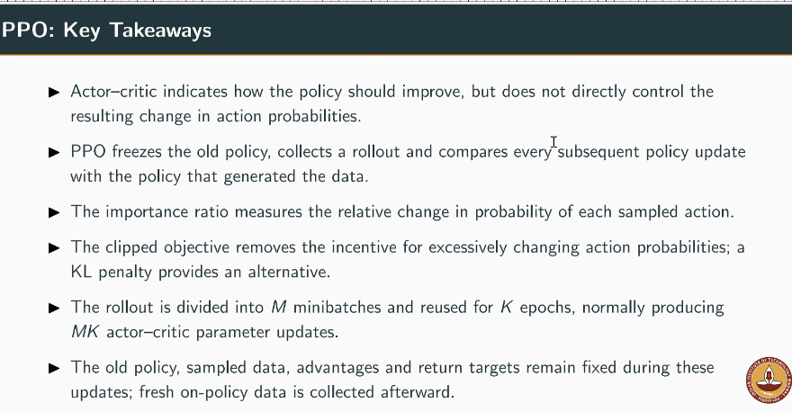

TODAY'S TOPIC:

Deep RL Architectures:

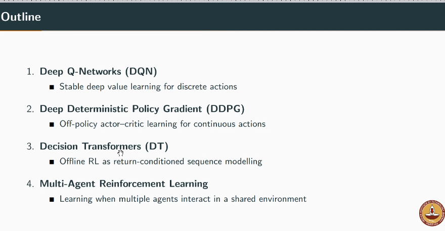

### Deep Q-Network (DQN): replaces Q-table, keeps Q-learning

DQN handles high dimensional state representations, but requires manageable discrete action space.

Directly implementing neural Q Function has issues:

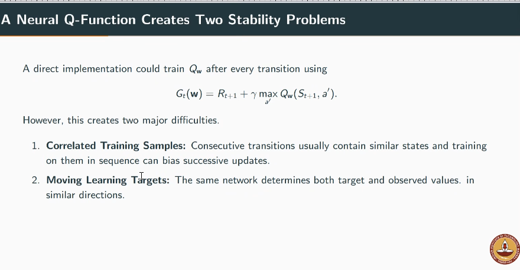

DQN Experience Replay Buffer:

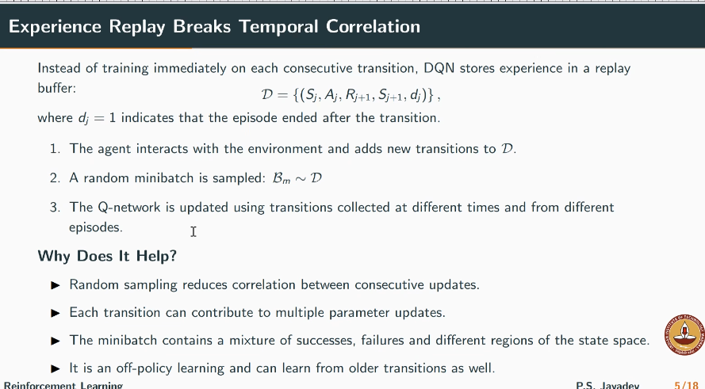

DQN Target Network:

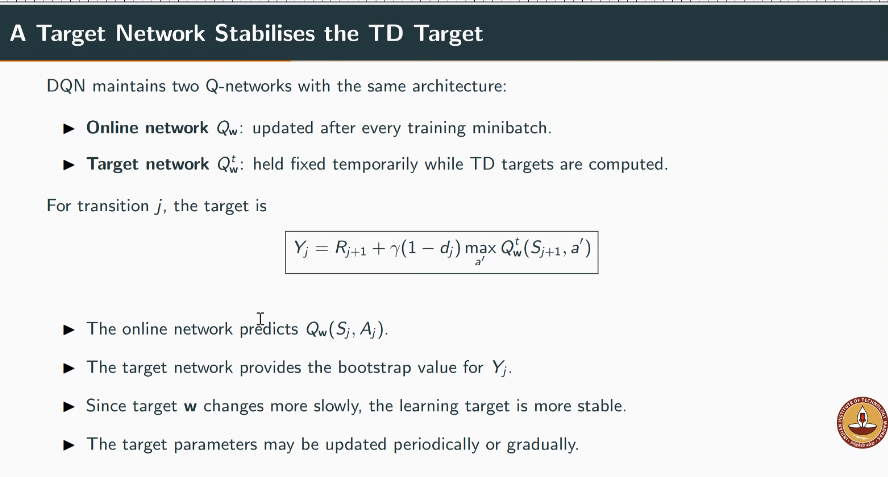

TODO: DQN mini-batch update

Overall DQN Workflow:

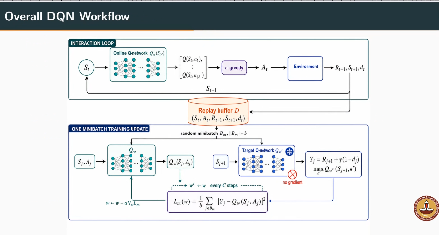

### Deterministic Policy Gradient (DDPG) - combines Actor-Critic with DQN

Extends DQN to continous action space:

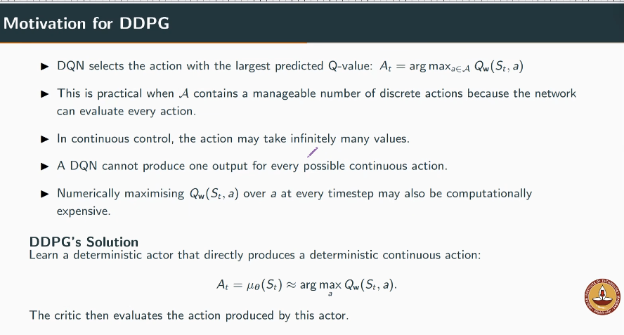

DDPG Actor-Critic Update:

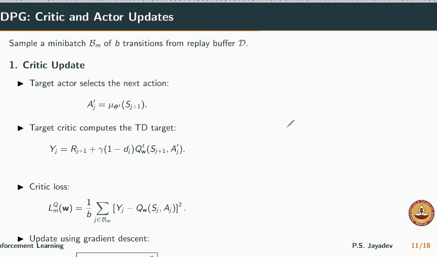

## Lecture on August 3 -- Decision Transformer (DT)

Motivation for Decision Transformer:
* DQN and DDPG learn using Bellman targets and repeatedly interact with the environment.
* In many historical applications, online exploration could be costly, unsafe or impractical.
* Historical operating data may already contain historical trajectories with different levels of performance. Can we learn directly from these trajectories?

Represent decision-making as a sequence problem: Desired Return + history of states and action --> Next action
So it becomes Time Series Prediction.

NOTE: even in policy gradient off-policy eval, interaction with environment is required. Here in DT interaction with env not required to learn.

In transformer - self-supervised learning

Trajectory is arranged as a sequence of 3 types of tokens (*undiscounted return*, state, action): {G_1, S_1, A_1}, {G_2, S_2, A_2}, ... , {G_T, S_T, A_T}

Idea is to predict actions out of these.

**Preparing Training Data for Decision Transformer**: 

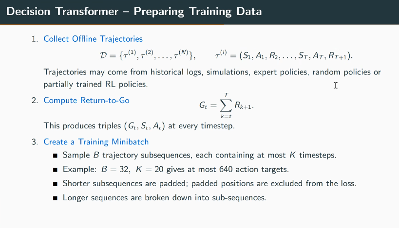

**Decision Transformer - Mini-Batch Learning**:

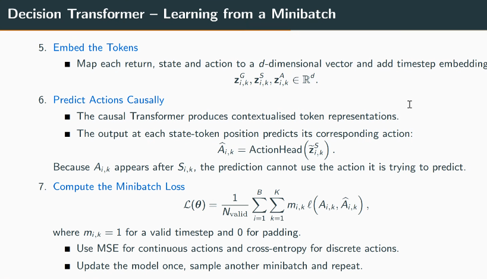

Converting G, S, A inputs to vectors of same size $d$ for input to transformer:

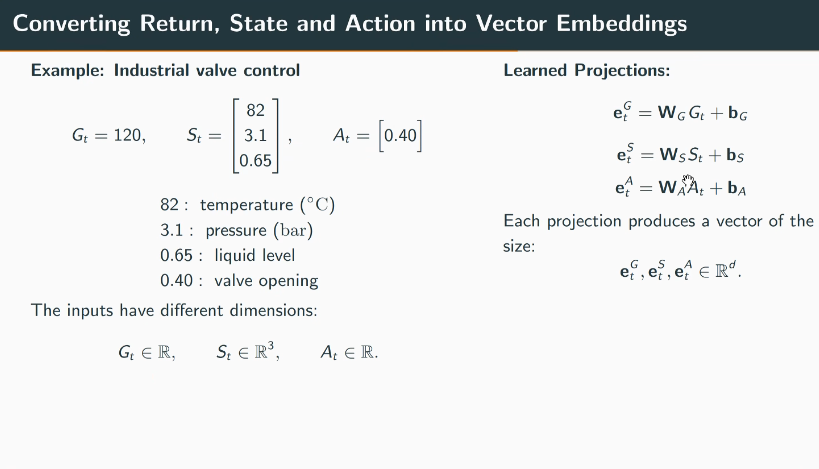

**Decision Transformer - Inference**:

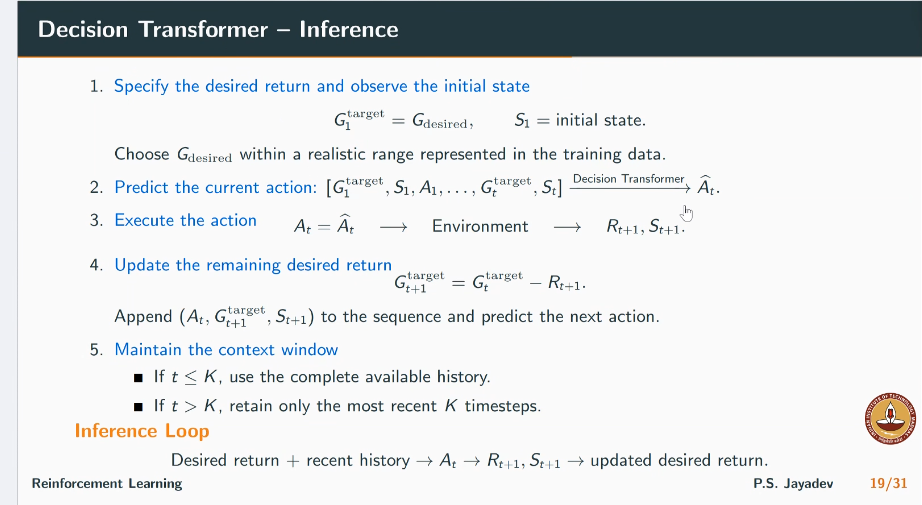

## Lecture on August 5 -- Multi-Agent Reinforcement Learning (MARL)

Multi-Agent Reinforcement Learning (MARL): competitive, cooperative [we want cooperative usually to maximize team performance -- every agent gets same final team reward, inter-agent communication is very important in cooperative] ; TODO

Cooperative:

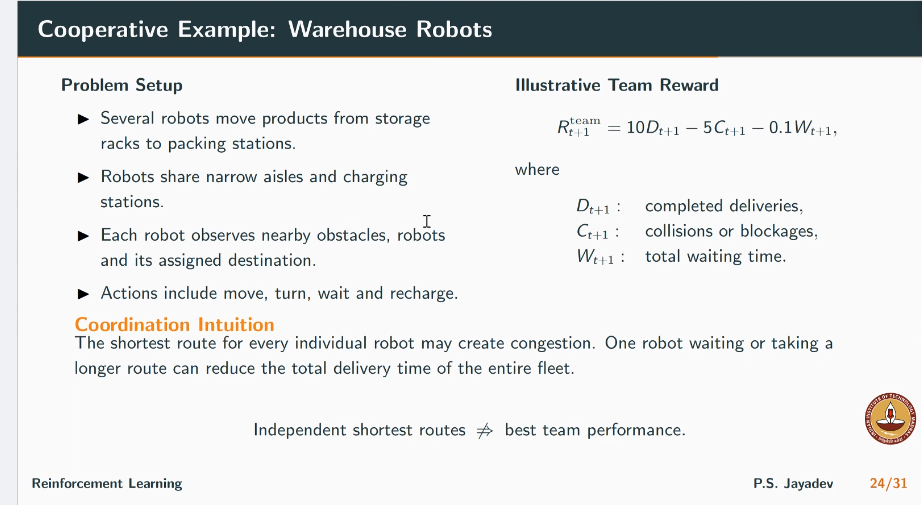

Competitive (optimizes individual agent performance) - maybe but not necessarily zero-sum game:

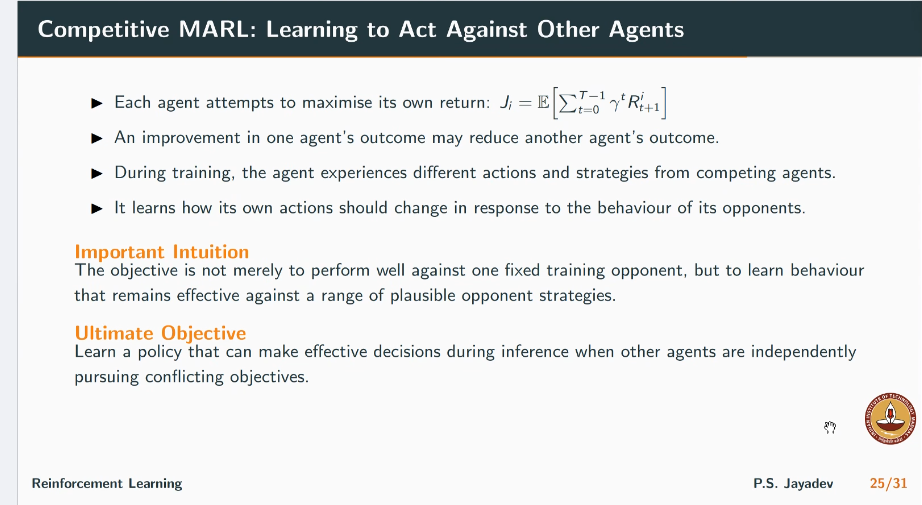

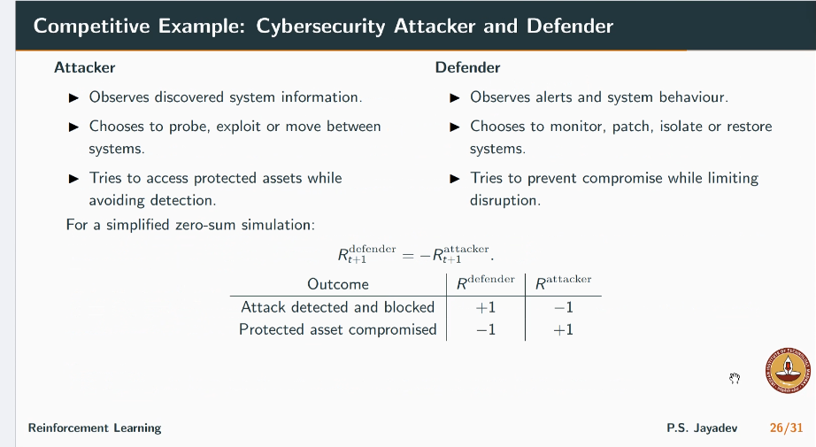

**Mixed MARL** (agents competitive in some situations, cooperate in other situations)

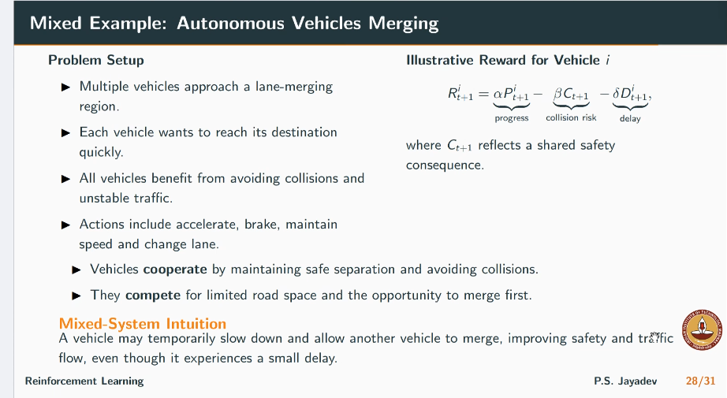

TODO

List of Deep RL methods studied so far:

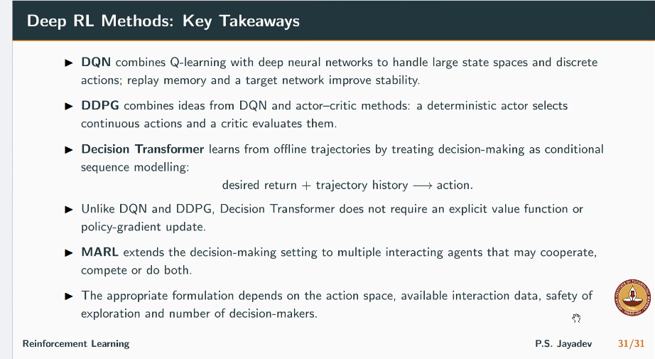

### Reward Shaping and Reinforcement Learning for LLM

Common objective so far of all discussed RL methods has been to maximize expected returns (i.e. discounted sum of rewards).

Reward Design: designing mathematical agent reward to match what we actually want agent to do

Good Reward Design is sometimes insufficient because of sparse rewards (no / very delayed rewards for many / most actions)
So we need to provide some artificial intermediate rewards / guidance
This is done by **Reward Shaping** - it adds a guidance signal to original task reward.

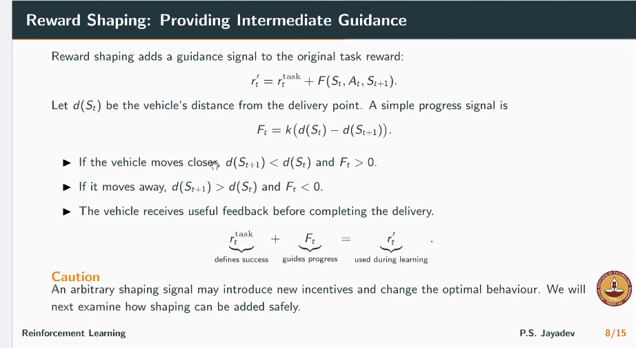

In addition to reward, we have constraints to ensure unsafe actions never take place.
* Hard constraint: if RL agent says it wants to do an action that would result in unsafe - don't do the action

IMPORTANT: for safety you put in constraints NOT in rewards

DANGER: naive reward shaping changed reward risks actually changing the objective of the task!

## Tutorials

*tutorials/RL_Gymnasium_MC_SARSA_Tutorial (2).ipynb*: Tutorial on July 15: Reinforcement Learning notebook with RL library `gymnasium`. 
The notebook implements:
* Completely Random episode
* (On-Policy, Epsilon-Greedy) First-Visit Monte Carlo Learning on Blackjack environment
* (On-Policy, Temporal Difference) SARSA on Cliff-Walking environment
* TODO: implement last cell which is left as a practice assignment: *Tablular Q-Learning (Off-Policy) on Cliff-Walking environment*

*tutorials/Value_Function_Approximation_Tutorial (1).ipynb* :
* Gradient Monte Carlo
* Semi-gradient TD(0)
* Semi-gradient SARSA (linear function approximation on MountainCar)

*tutorials/RL_REINFORCE_A2C_A3C_Tutorial_WebMtech.ipynb* : Actor-Critic (A2C), REINFORCE (a type of **Monte Carlo policy-gradient learning**: the update waits until the episode is complete and does not learn a separate value function.)
  * TODO: A3C is left as a practice exercise in notebook

*tutorials/DQN_and_Decision_Transformer.ipynb* : DQN, Decision Transformer

