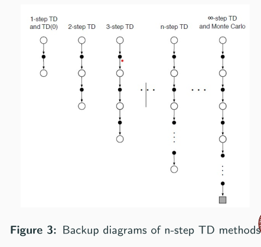
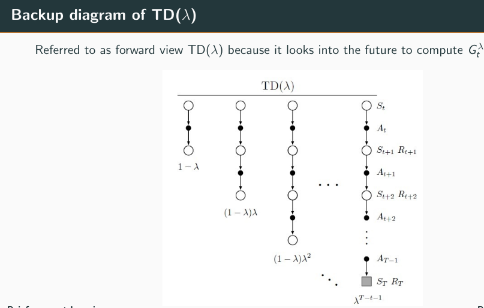

**TODO**: i skipped the examples in lectures - go through them!

NOTE: Intro (course outline) is lecture 0.

GENERAL: In TD learning methods (lecture 3), (Q learning, SARSA etc.) initial tabular state (V) or action (Q) value estimates can be arbitary but in practice are usually set to 0. This can be changed to intentionally bias RL agent (eg. set initial values much higher than rewards to encourage exploration in Optimistic environment, or lower to discourage exploration in Pessimistic environment). But make sure to always set values for terminal states as 0 only!

**Definitions** (from lecture 1):

$$
G_t = R_{t+1} + \gamma G_{t+1} = R_{t+1} + \gamma R_{t+2} + \gamma^2 R_{t+3} + ... , \quad (\text{Discounted Return}) \\
V^\pi(s) = E[G_t | S_t = s] , \quad (\text{State Value Function}) \\
Q^\pi(s, a) = E[G_t | S_t = s, A_t = a] , \quad (\text{Action Value Function aka Q-value})
$$

**Bellman Optimality Equations** (from lecture 1): Solving the Bellman optimality equation gives the optimal value function and therefore, an optimal policy.

$$
v_*(s) = \max_{a \in A} \sum_{s', r} p(s', r|s, a) (r + \gamma v_\pi(s')), \quad (\text{Optimal State Value}) \\
q_*(s, a) = \sum_{s', r} p(s', r|s, a) (r + \gamma \max_{a^`} q_*(s', a')), \quad (\text{Optimal Action Value}) \\
\pi_*(a|s) = \argmax_a q_*(s,a) , \quad (\text{Optimal Policy})
$$

**Incremental Monte Carlo Update** (from lecture 2) - $0 \le \alpha \le 1$ learning rate is or taken as $1 / n$ (n is total number of times state s or pair (s,a) has been visited till now) ; value updated iteratively by a fraction of error (because multiplied by $\alpha$) leading to reduced error:

$$
V_{n+1}(s) = V_n(s) + \alpha (G - V_n(s)) , \quad (G - V_n(s) \text{is error between observed return (target) and value estimate.}) \\
Q_{n+1}(s,a) = Q_n(s,a) + \alpha (G - Q_n(s,a))
$$

NOTE: Incremental Monte Carlo Update with $\alpha_n = 1/n$ has effect of averaging all returns, but without having to remember all history.

**Off-Policy MC - Importance Sampling** (from lecture 2):

$$
\rho_{t:T-1} = \Pi_{i=t}^{T-1} \frac{\pi(A_t | S_t)}{b(A_t | S_t)}, \quad (\text{Importance Sampling Ratio}) \\
v_\pi(s) = E[\rho_{t:T-1} G_t | S_t = s]
$$

**1-step TD Learning** (from lecture 3) - unlike incremental MC (after full episode and using return $G_t$), here after one step of episode and using TD target based on observed reward and next state $R_{t+1} + \gamma V(S_{t+1})$:

$$ 
V(S_t) \leftarrow V(S_t) + \alpha [R_{t+1} + \gamma V(S_{t+1}) - V(S_t)] \\
\text{TD(0) Error} = R_{t+1} + \gamma V(S_{t+1}) - V(S_t)
$$

**On-Policy TD SARSA Update** (from lecture 3) -- same as above formula, just Q instead of V:

$$ Q(S_t, A_t) \leftarrow Q(S_t, A_t) + \alpha [R_{t+1} + \gamma Q(S_{t+1}, A_{t+1}) - Q(S_t, A_t)] $$

**On-Policy TD - Expected SARSA - Update** (from lecture 3) -- variation of SARSA where instead of next action, expected value (average) of Q values of all possible actions in next state is used [similar to off-policy Q learning]:

$$ Q(S_t, A_t) \leftarrow Q(S_t, A_t) + \alpha [R_{t+1} + \gamma \sum_a \pi(a | S_{t+1}) Q(S_{t+1}, a) - Q(S_t, A_t)] $$

**Off-Policy TD Q-Learning** (from lecture 3) - behaviour policy $b$ is $\epsilon$-greedy, target policy $\pi$ is greedy / deterministic (that's why we did $\max_a$ to choose maximum action value return from future states). At the start, we know no Q value (Q table is empty, aka all values 0) - over time we come to know of Q values of state-action pairs and so that's when the max part comes into play:

$$ Q(S_t, A_t) \leftarrow Q(S_t, A_t) + \alpha [R_{t+1} + \gamma \max_a Q(S_{t+1}, A_{t+1}) - Q(S_t, A_t)] $$

**n-step TD Policy Evaluation** (from lecture 3) -- note that in TD target, very last term added is NOT reward but instead state value estimate:
* no updates during first $n-1$ evaluations of episode
* if $t+n > T$ (episode terminates before n steps from t), then remaining rewards are treated as 0.

$$
G_{t:t+n} = R_{t+1} + \gamma R_{t+2} + \cdots + \gamma^{n-1} R_{t+1} + \gamma^n V(S_{t+n}), \quad \text{n-step TD Target} \\
V(S_t) \leftarrow V(S_t) + \alpha [G_{t:t+n} - V(S_t)], \quad \text{n-step Update of state value estimate}
$$

**$\lambda$-return** (TD target for $TD(\lambda)$) (from lecture 3) - average all n-step returns with exponentially decaying weights : 

$$ G_t^\lambda = (1 - \lambda) \sum_{n=1}^\infty \lambda^{n-1} G_{t:t+n} $$

**Eligibility Traces aka Backward-View $TD(\lambda)$** (from lecture 3) - $\lambda$ Trace-Decay Parameter is rate at which credit decays over time, $\gamma$ is discount factor for return:

$$
E_0(s,a) = 0 \forall s, a \quad (\text{Initialize Eligibiity}) \\
E_t(s,a) = \gamma \lambda E_{t-1}(s,a) + \mathbf{1}(S_t = s, A_t = a) \quad (\text{update eligibility for all s,a; indicator func means, +1 only for current state-action}) \\
\delta_t = R_{t+1} + \gamma Q(S_{t+1}, A_{t+1}) - Q(S_t, A_t) \quad (\text{TD Error using current state, action}) \\
Q(s,a) \leftarrow Q(s,a) + \alpha \delta_t E_t(s,a) \quad (\text{Q value update for all s,a using learning rate, TD error and Eligibility})
$$

## 1. Markov Decision Process

Outline:
1. Intro to Markov Decision Processes (MDPs)
2. Formulation of an MDP
3. Optimal Policies for MDPs
4. Value Function and Bellman Equation

CORE Markov Property: Next state of the environment only depends on present state and present action but not on the past.
Present state of environment doesn't need to be fully observable (POMDP).

MDP is a formal mathematical formulation of describing agent-environment interactions in RL.

Task is Episodic or Continuous (no termination).

Trajectory is a sequence of states, actions and rewards.

Return: total cumulative reward agent receives starting from a timestamp. 
For Continuous tasks return would be infinite, hence we use Discounted Return only.

Value Functions (comparing policies):
- State Value Function: eval how good a state is for agent based on expected future rewards following policy. Value of terminal state is 0.
- Action Value Function (aka Action Value or Q-value): Estimates how good it is for the agent to take an action in a state in terms of expected future rewards, following a policy

Representing Value Functions:
- Tabular form (for discrete and finite state and action spaces): states or (state,action) pairs with corresponding values
- Parametric form (high dimensional continuous state and action spaces): function approximators (linear, polynomial, neural net based etc.)

Bellman Equations: value of a state or (state,action) pair in terms of possible next states. so recursive
- equations for optimal state & action value functions, and a formula that relates the 2

Bellman Optimality Equations: Value(State under optimal policy) = ExpectedReturn for best action from that state
- for fixed policy forms system of linear equations => solvable
- but finding best policy is hard: maximizing makes it non linear
- solving is tedious, expensive, requires state transition model => so practically iterative solutions used

Policy $\pi$ is better than or equal to $\pi'$ if forall states, value (expected future return) >= other
Optimal Value Policy is better than all others. Optimal state and action value functions are related in formula

Deterministic Optimal Policy must exist in MDP

RL methods to learn Near-Optimal Policies:
1. Monte Carlo Methods
2. Temporal Difference Learning
3. Policy Gradient Methods
4. Actor-Critic Methods
5. Deep RL

## 2. Monte Carlo (MC) Methods

Outline:
1. Intro to MC Methods in RL
2. MC Policy Evaluation
3. MC Control
4. On-Policy and Off-Policy Learning
5. Incremental Monte-Carlo Updates

MC only for episodic tasks; model-free (i.e. no state transition knowledge) - don't need full model of environment because we observe results of policies on whole episodes

Basic Principle: Value is approx Emperical Mean Return (used in place of Expected Return)

Parts:
* MC Policy: Estimate state and action values based on given policy
* MC Control: Update policy towards optimality based on estimated value

### MC Policy

Approach:
* Run policy over all episode, then calc discounted return $G_t$ for each action from that time $t$ to end.
* Calc average return based on all episodes in which $s$ appears

### MC Estimation of state values

Dealing with possibility of same state appearing multiple times in single episode: 1. First Visit MC state estimation 2. Every Visit MC state estimation

**First Visit MC state estimation**:
- Init $V_\pi(s) = 0$, $N(s) = 0$ (no. of first-time state s appeared in an episode), $G(s) = 0$ (total return of state)
- For time t till termination:
  - Sample whole episode (states, actions, returns) till termination
  - Only using state s (if it appeared) first visit in this episode:
    - N(s) += 1
    - Calc $G_t = R_t + \gamma R_{t+1} + ...$ ; G(s) += G(t) [total return]
- Estimated $\hat{v_pi(s)} = G(s) / N(s)$ ; by law of large numbers as $N$ approaches infinity this approaches true value

**Every Visit MC state estimation**: same as First Visit except N(s), G(s) are incremented on every visit to state s not just first in episode

### MC Estimation of action values

With a model, state values are sufficient to determine optimal policy.
But without a model, action values need to be estimated too.

Same as MC estimation of state values, except state visits are replaced by state-action visits

Dealing with problem of (if deterministic policy, same action appears for same state every episode) :
* Exploring starts with random state-action pairs
* Exploring with stochastic policy

Incremental MC update formulae --> written at top of page

MC Control: Policy Evaluation (to get action value) and Policy Improvement (greedy policy wrt action value of policy) are done alternately after every episode of experience to reasonably converge in limited episodes.

### On-Policy and Off-Policy Learning
* On-Policy (eval & improve policy currently being used to make decisions - more stable & better chance of coverage)
* Off-Policy (eval & improve Target Policy, different from Behaviour Policy used to make decisions - less stable, may result in divergence)

**On-Policy MC**:
* *Soft Policy* (eg. $\epsilon$-greedy) is followed to balance exploration & exploitation. Stochastic, all possible actions in a state can be chosen with a non-zero probability.
* Algorithms: 
  * On-Policy First Visit MC Control (similar to prev; steps note TODO; initial all action values 0, uniform policy)
    * Deciding between 2 actions (in a single state) in $\epsilon$-greedy: If one action is greedy, assign it probability $1 - \epsilon$ and other action probability $\epsilon$.
      * Deciding between multiple actions (in a single state)? I think $1 - \epsilon$ for greedy action and $\epsilon / (K-1)$ for all other actions -- not sure TODO
  
**Off-Policy MC**: both target $\pi$ and behavioural $b$ policies are fixed and generally deterministic.
* Assumption: every action taken under $\pi$ is at least occasionally taken under $b$ .
* Objective: Estimate action value $q_\pi$ based on episodes drawn by following policy $b$ .
* Issues are solved by *Importance Sampling*:
  * Distribution of episode under $b$ is different from under $\pi$ .
  * Sampled returns are not under $b$ representative of policy $\pi$ .

**Importance Sampling for Off-Policy MC**: estimate expected values under one distribution given samples from another. Equation on top of page.

## 3. WIP - Temporal Difference Learning Methods -- TD is central and novel idea of RL !

Outline:

1. Intro to TD Learning
2. 1-step TD Learning
3. On-Policy TD Control: SARSA
4. Off-Policy TD Control: Q-Learning
5. Example: SARSA Vs Q-Learning
6. On-Policy TD Control: Expected SARSA
7. n-Step TD Methods and TD(λ)

For both episodic and continuing tasks.

**Basic Approach**: Update state or action value after one or more steps of MDP (partial episode or bootstrapping)

TD vs MC :
* TD will generally converge faster
* TD methods have low variance and some bias, MC methods have high variance and zero bias.
* TD can work with continuing tasks and incomplete episodes - MC cannot.

### One-step TD Learning (aka TD(0))

Update equation noted on top of page.

TD(0) Algorithm for Policy Evaluation (update after every state transition in an episode, not waiting for end of episode like in Monte Carlo):
* initial $\alpha \in (0,1)$; all state values $V(S_t)$ initialized to 0
* Loop for each timestamp t:
  * from current state $S_t$ , policy predicts actions $A_t$ leading to new state $S_{t+1}$ and reward $R_{t+1}$
  * update: $V(S_t) \leftarrow V(S_t) + \alpha (R_{t+1} + \gamma V(S_{t+1}) - V(S_t))$

**For a fixed policy, following TD(0), estimated value will converge to true $V(s)$, only if $\alpha$ is constant and small OR decreasing gradually.**

Properties:
* it only looks at current reward and a single step into future
* it DOES NOT do any backtracking, or alter value estimates of past states in episode based on current reward

### On-Policy TD Control: SARSA

Like MC Control, TD uses action values, and we use $\epsilon$-greedy policy here.

Update rule (same as TD(0) update, just Q action values instead of V state values) -- given on top of page.

Algorithm: Same as TD(0), just with Q action values used (inputs state and action) instead of V state values (input is state only).

SARSA algo converges to optimal policy as long as each state-action pair is visited sufficient number of times.

**Expected SARSA**: A variant of SARSA - written on top of page.

### Off-Policy TD Control: Q Learning

Behaviour policy: $\epsilon$-greedy with small $\epsilon$ (which takes actions), Target policy: greedy (which samples actions)

Q-Learning update equation written on top of this page.

Algorithm:
* initialize all Q(s,a) to 0
* foreach timestamp t:
  * based on current state s_t, choose action a_t according to behaviour policy using Q(s_t,a) values. Here epsilon-greedy.
  * Observe next state and reward: $S_{t+1}$, $R_{t+1}$
  * Update Q value of Q(s_t, a_t): $Q(s_t, a_t) \leftarrow Q(s_t,a_t) + \alpha [R_{t+1} + \gamma \max_a Q(S_{t+1}, a) - Q(s_t,a_t)]$
    * NOTE that in update calculation, actual next action taken is NOT used, and instead we use Q value of best next action.

Q learning converges to optimal policy as long as sufficient state-action pairs are visited.

### n-step TD Control -- generalization of MC methods and 1-step TD methods

Bootstrapping is done and values are updated after n-steps.

Advantages over MC and 1-step TD:
* n-step TD gives better estimate of TD target than 1-step TD
* lower bias than TD(0) and lower variance than MC
* faster learning than MC and more stable than TD(0)
* $n$ can be tuned based on problem

Factors affecting choice of n :
* Task Type: Moderate values of n for continuing tasks to balance bias and variance
* Rewards: Larger values of n in case of delayed rewards and vice versa
* Type of Environment: Smaller value of n for highly stochastic environments to control variance
* Memory and Computation: Larger values of n require more memory and high computation power
* Learning rate: Learning rate α and n should adjusted inversely for stability and convergence
* Practice: Tuning of n through experimentation and dynamic adjustment are recommended in practice to arrive at a suitable value

**n-step TD Control: SARSA Algorithm** -- convergence properties are similar to other TD algorithms:
* Input: $\epsilon$-greedy policy with small $\epsilon > 0$ and $\alpha \in (0, 1]$
* Initialize: all Q(s,a) arbitarily (usually 0)
* foreach timestep t:
    * sample trajectory from $S_t$ to $S_{t+n}$ or $S_T$ (terminal) using actions $A_t$, $A_{t+1}$, ... using policy $\pi$ based on current Q estimates
    * If terminated before $n$ steps $t+n > T$ then TD target is:
      * $G_{t:t+n} = \sum_{i=t+1}^T \gamma^{i - t - 1} R_i$
    * Else TD target is (full n steps completed -- note additionally adding Q value after n steps):
      * $G_{t:t+n} = \sum_{i=t+1}^T \gamma^{i - t - 1} R_i + Q(S_{t+n}, A_{t+n})$
    * Update Q Value: $Q(S_t, A_t) \leftarrow Q(S_t, A_t) + \alpha [G_{t:t+n} - Q(S_t, A_t)]$

### $TD(\lambda)$

Composite Return: we can make a composite TD Target as weighted average (aka weighted sum with sum of weights = 1) of multiple n-step TD Targets (i.e. each with different n)

$\lambda$-return is a type of Composite Return - exponentially decaying weights for each increasing n (1 to infinity) -- it becomes TD Target for $TD(\lambda)$

$\lambda$-return formula is on top of page -- at terminal state, all subsequent n-step returns are equal to normal return $G_t$ . At $\lambda = 1$ it becomes MC update, at $\lambda = 0$ it becomes TD(0) update.

This is called **Forward-View $TD(\lambda)$**:

Issues with Forward-View TD(lambda):
* like MC it can only be done for completed episodes
* computing n-step returns for every value of n and every state & state-action pair is complex and inefficient.

**Credit Assignment Problem**: which previous action contributed to a reward and to what extent? Analogous to determinining loss-contributing factors during backpropogation in neural networks.

Eligibility Traces (aka backward-view $TD(\lambda)$) are an efficient credit assigning alternative to forward-view $TD(\lambda)$ .
Maintains "eligibility" of each state or state-action pair to recieve value updates ; influence of TD error is propogated backward to all previously visited states ; unlike forward-view, it DOES NOT require keeping track of multiple n-step returns so it's much simpler.

Formula for eligibility trace on top of page.

## 4. Value Function Approximation

Outline:

1. Why Value Function Approximation?
2. Features, Parameters and Generalisation
3. Learning from Monte Carlo Targets
4. Linear Function Approximation
5. Learning from TD Targets: Semi-Gradient TD
6. Control with Value Function Approximation
7. Non-Linear Function Approximation

<!-- TODO -->

## 5. Policy Gradient

<!-- TODO -->

## 6. Actor Critic Methods

Outline:

1. From REINFORCE to Actor–Critic
2. Actor and Critic Components
3. TD Error and Advantage Estimation
4. One-Step Actor–Critic Algorithm
5. Parallel Actor–Critic: A2C and A3C

<!-- TODO: SKIPPED REINFORCE (apparently it's an algorithm discussed in earlier lectures?) -->

