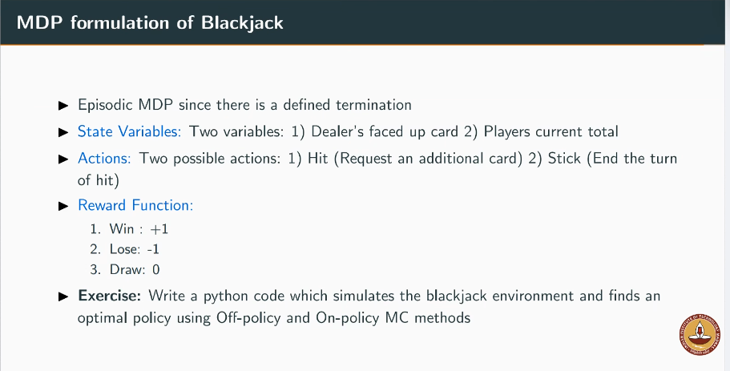

## Exercise 1

(from Lecture 2 on Monte Carlo) Blackjack game

Goal of the game: Obtain cards whose numerical value is as great as possible without
exceeding a value of 21

Rules of the game:
2-players (dealer vs player), all face cards count as 10 and an ace can be either 1 or 11
* Game begins with both having two cards with one of the dealers card facing up and the
other is down
* If the player has 21, it is called natural and he wins unless the dealer also has a natural, in
which case, it is a draw
* If the player does not have natural, he can request additional cards, one by one (hits) until
he either stops (sticks) or exceeds 21 (goes bust and loses the game)
* If he sticks, then now it’s the dealer’s turn to either hit or stick. The one close to goal is the
winner.

**Exercise**: solve blackjack using RL in python! see rules below:

