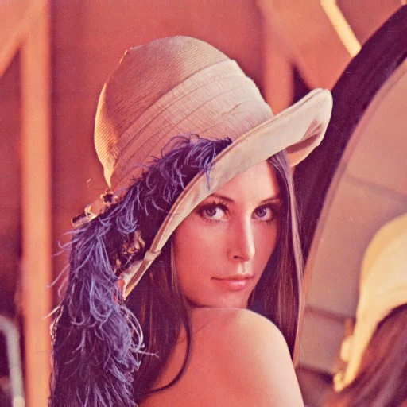
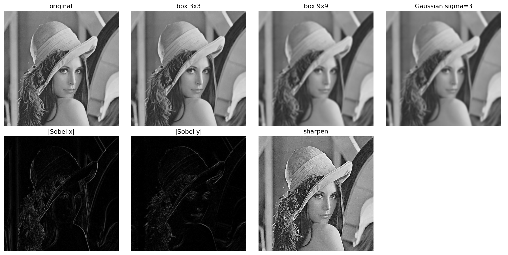
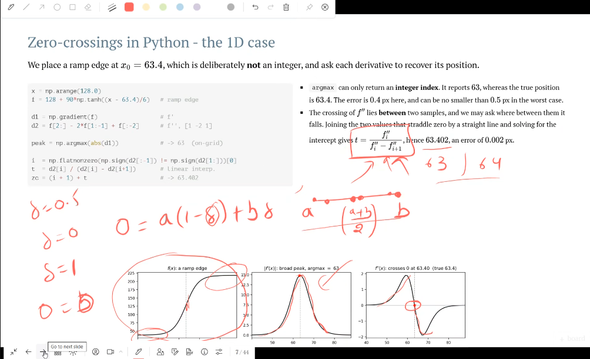
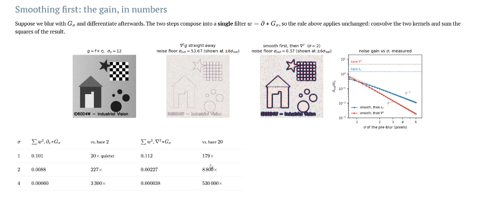
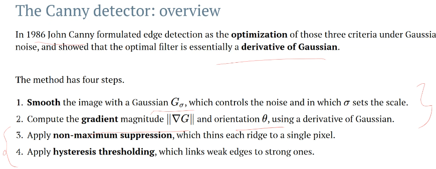

# ID6004W Industrial Vision

Faculty: Prof Vinkle Srivastav &lt;vinkle@dsai.iitm.ac.in&gt;

Course Syllabus is 50-60% classical Computer Vision, and rest is modern Vision using Deep Learning.

**All Demos shared by Professor**: https://id6004w-demos.pages.dev/

## Lecture 0: Intro

Computer Vision:
* Classical : 
    1. Low-Level Filtering - edges
    2. Geometry - single & two view, SfM
    3. Mid-Level - Optical Flow, Segmentation
* Using Deep Learning
    1. Object detection & segmentation
    2. 3D Mesh Reconstruction
    3. 3D World Reconstruction - NeRF
    4. 3D Human Pose Reconstruction

Interpret light as meaning: objects, locations, actions

Meaning levels:
* Geometric: shape, depth, pose, motion
* Semantic: objects, materials, actions

3 Rs : 
* Recognition (semantic)
* Reconstruction (2d projection -> back to 3d; ill-posed as it requires assumptions about 3d)
* Reorganization (eg. semantic segmentation)

4 fields are related to Computer Vision:
* Biological Vision: > 50% of human brain is devoted to vision processing only!
* Computer Graphics (maps 3d to 2d; in Computer Vision opposite, we map 2d projection to 3d meaning)
* Image Processing: maps image -> image (eg. de-noising, sharpening); Vision seeks to understand meaning behind the image
* Machine Learning: applied, constrained by geometry and physics of Visions

Challenges due to which Computer Vision is an *ill-posed inverse problem*:
* Ames Room Illusion: 4 people (standing at different distances from camera) appear to be different sizes, because human vision is rectangular.
* Perspective Illusion: one view may not be enough to examine the scene
* View Point Variation: same object can look completely different from different views
* Deformation: single object corresponds to large number of shapes, due to bending, folding and articulation.
* Occlusion: we must reason also about hidden parts of a scene at an instant
* Illumination: eg. in a black & white pic, same object can look black or white depending on lighting
* Motion: world & camera are both in motion
* Perception compared with measurement: eg. we correct object sizes for shadows. 
  * Illusory contours: we can perceive surfaces, edges even when image doesn't have one explicitly due to prior assumptions!
* Local ambiguities: small image patch cannot be interpreted taken out of context
* Variation within a class: eg. a "chair" can have many many types of images

All vision methods are a way of imposing constraints: of image formation, geometry, smoothness, statistics learned from data.

Perspectograph : seeing an object behind a sheet of glass

## Lecture 1

On sample image:

Various filters are applied (using `cv2` in *lectures/lec1/lec01_filtering.py*) resulting in:

Outline: 2d filter, blur, edge finder, etc.

Gaussian blur filter is *isotropic* (applies equally in all directions / orientations) and *separable* (i.e. 2D filter that can be expressed as product of 2 1D filters).

Creating Gaussian kernel:
- At $3 \sigma$ from centre, 99% of the image patch is covered. So if we choose $\sigma = 1$, we need $7 \times 7$ kernel.
- Now sum won't be equal to 1, so re-normalize.

Sobel filter

TODO

## Lecture 2 (prev First Derivative filters, now Second Derivatives)

Laplacian is Second Derivative, it is continous and isotropic, i.e. it has no preferred direction. We discretize it using Taylor series approximation.

Laplacian also detects edges, but unlike earlier simpler edge finder matrix, it takes care of the fact that edges are a **ramp** up, not an abrupt jump. So we need to decide which value in the ramp up to designate as the edge -  in Laplacian this is the point where sign of Laplacian is changing - this is called **Zero-Crossing**.

TODO: practice exercise: derive $t$ formula in below image:

Laplacian in image, is, for central pixel, average of all 4 neighbours (up, down, left, right) - current value --> basically is central pixel more or less than the average of its neighbours?

**NOTE**: even if intensities are changing in a constant flow, Laplacian will still be 0! A "dark" pixel wrt its 4 neighbours will have positive Laplacian, "bright" will have negative Laplacian.

Differentiation (whether in Laplacian or another filter) increases noise in the image, by a calculable amount. We can use: assuming X, Y have independent noise (Cov(X,Y) = 0), then $Var(X - Y) = Var(X) + Var(Y) = 2 \sigma_n^2$ . So total noise of Laplacian convolution is::

$$Var[w *  n] = \sigma_n^2 \sum_k w_k^2$$

So solution is, to avoid increasing noise, we blur then differentiate:

Smoothening before Differentiate: *LoG* (Laplacian of Gaussian)

TODO

## Lecture 3: Edge and Line Detection: Gradient, Canny and Hough Transform

Edge is a pixel at which intensity changes sharply. Later these pixels are grouped to form full edge line.

Edge gradient: detect both magnitude and orientation - i.e. 2D vector (x,y) of $\nabla G$

Derivative of Gaussian, vs Difference of Gaussian

Thresholding gradient magnitude fails at 3 criteria of a good edge detector

Canny Edge Detector:

Hysteresis Thresholding gives a weak edge threshold T1 and a strong threshold T2, instead of a single edge threshold.

Now after detecting edge pixels, we need to group into edge lines. $y = m x + c$ does NOT work (for vertical line slope is infinite!), so instead we fit $p = x \cos
 \theta + y \sin \theta$

**Hough Transform** (voting in $(p, \theta)$ space): If a point $(x,y)$ is fixed and $\theta$ is varied, it traces a sinusoid for the fixed
 $p$ in $(p, \theta)$ space. Then we vote -- how many pixels contribute to a single $(p, \theta)$ and the peaks are chosen as our grouped edge lines.
